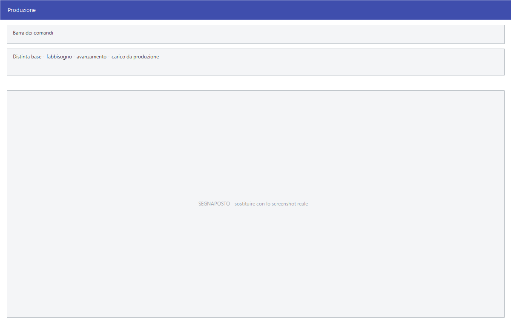

# Produzione

Chi trasforma la merce invece di rivenderla ha bisogno di dire **di cosa è
fatto** ogni prodotto, di sapere **cosa manca** per produrlo, e di caricare a
magazzino quello che esce dalla lavorazione scaricando quello che è entrato.

!!! info "In sintesi"

    - **Percorso:** Menu ▸ Magazzino ▸ Produzione ▸ *(una delle voci)*
    - **Scorciatoia:** ++f2++ salva o avvia, ++esc++ esce
    - **Permessi richiesti:** nessun profilo predefinito; le singole voci di menu si abilitano per ogni utente da [Archivi ▸ Utenti](../anagrafiche/utenti.md)

---

## A cosa serve

| Voce di menu | A cosa serve |
|---|---|
| **Distinta di Produzione** | La distinta base: dice di quali componenti è fatto un prodotto finito. |
| **Stampa Elenco Distinte di Produzione** | L'elenco delle distinte registrate. |
| **Fabbisogno di Produzione** | Data una quantità da produrre, calcola quanti componenti servono. |
| **Inizio Nuova Produzione** | Apre una produzione. |
| **Modifica Avanzamento Produzione** | Aggiorna lo stato di una produzione in corso. |
| **Aggiornamento Costi** | Ricalcola il costo dei prodotti finiti dai costi dei componenti. |
| **Inserimento Carico da produzione** | Carica a magazzino il prodotto finito, scaricando i componenti. |
| **Modifica Carichi da Produzione** | Corregge un carico da produzione. |

## Prerequisiti

Prima di usare queste maschere occorre:

- avere in archivio sia i **componenti** sia i **prodotti finiti** come
  [articoli](../anagrafiche/anagrafica-articoli.md);
- avere le [causali di magazzino](causali-magazzino.md) che scaricano i
  componenti e caricano il finito;
- avere registrato le **distinte di produzione**: senza quelle il fabbisogno e
  il carico non hanno da cosa partire.

## La maschera

<!-- DA VERIFICARE: la struttura delle maschere di produzione e i loro campi: non ho potuto estrarne le etichette dalle risorse. -->

## Campi

<!-- DA VERIFICARE: i campi delle maschere di produzione. -->

Non applicabile.

## Pulsanti e comandi

| Comando | Scorciatoia | Effetto |
|---|---|---|
| **F2 - Salva** o **F2 - OK** | ++f2++ | Registra, oppure avvia l'elaborazione. |
| **Esci** | ++esc++ | Chiude senza fare nulla. |
| Elenco di scelta | ++f10++ o ++space++ | Sul campo con il codice, apre l'elenco da cui scegliere. |

<!-- DA VERIFICARE: i comandi effettivi delle maschere di produzione. -->

## Come si fa

### Preparare la distinta di un prodotto

1. Apri **Menu ▸ Magazzino ▸ Produzione ▸ Distinta di Produzione**.
2. Indica il prodotto finito e i componenti con le quantità.
3. Salva.

### Sapere cosa comprare per produrre

1. Apri **Menu ▸ Magazzino ▸ Produzione ▸ Fabbisogno di Produzione**.
2. Indica il prodotto e la quantità da produrre.
3. Il calcolo dice quanti componenti servono; confrontalo con le esistenze.

### Caricare il prodotto finito

1. Apri **Menu ▸ Magazzino ▸ Produzione ▸ Inserimento Carico da produzione**.
2. Indica il prodotto e la quantità prodotta.
3. Salva: il finito entra a magazzino e i componenti escono, secondo la
   distinta.

### Aggiornare i costi dopo un rincaro

1. Registra i [carichi](carico-merci.md) con i prezzi nuovi.
2. Apri **Menu ▸ Magazzino ▸ Produzione ▸ Aggiornamento Costi**: il costo dei
   prodotti finiti si ricalcola dai componenti.

## Controlli e messaggi

<!-- DA VERIFICARE: i messaggi delle maschere di produzione. -->

Non applicabile.

## Note

!!! warning "Il carico da produzione muove il magazzino due volte"

    Un carico da produzione **carica** il prodotto finito e **scarica** i
    componenti secondo la distinta. Se la distinta è sbagliata, si sbagliano
    entrambi i movimenti.

<!-- DA VERIFICARE: se la distinta ammetta più livelli, cioè componenti che sono a loro volta prodotti finiti. -->

<!-- DA VERIFICARE: che rapporto c'è fra "Inizio Nuova Produzione" e "Inserimento Carico da produzione": se siano due passi della stessa cosa o due strade alternative. -->

<!-- DA VERIFICARE: con quale criterio "Aggiornamento Costi" calcola il costo del finito. -->

## Vedi anche

- [Carico merci](carico-merci.md)
- [Movimenti di magazzino](movimenti-magazzino.md)
- [Anagrafica articoli](../anagrafiche/anagrafica-articoli.md)
