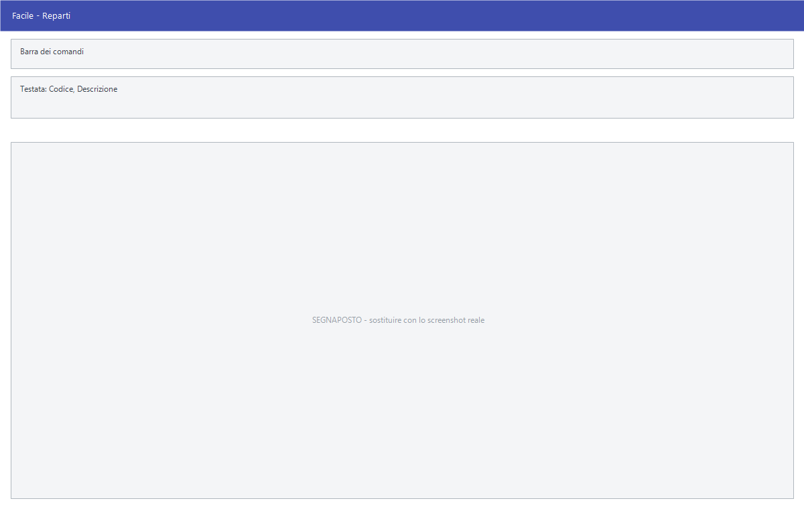

# Reparti

Da questa maschera si definiscono i reparti di vendita e si collegano ai
reparti del registratore di cassa, che è quello che stampa lo scontrino.

!!! info "In sintesi"

    **Percorso:** Menu ▸ Archivi ▸ Magazzino ▸ Reparti ▸ Inserimento *(oppure* Modifica*)*
    **Scorciatoia:** nessuna; la maschera si apre dal menu
    **Permessi richiesti:** nessun profilo predefinito; **Inserimento** e **Modifica** si abilitano separatamente per ogni utente da [Archivi ▸ Utenti](../anagrafiche/utenti.md)

---

## A cosa serve

Il reparto è la classificazione con cui l'articolo arriva alla cassa:
l'anagrafica articoli lo richiama nel campo **Reparto**, e da lì il programma
sa su quale reparto del registratore di cassa battere l'articolo.

Sulle installazioni in cui il reparto è obbligatorio, senza di esso l'articolo
non si salva.

Esempio: se il registratore di cassa ha il reparto 1 per gli alimentari al 4% e
il reparto 2 per il resto al 22%, si creano due reparti e si indica in
**Reparto Cassa** il numero corrispondente.

## Prerequisiti

*Nessuno.* Conviene però avere sotto mano la configurazione del registratore di
cassa, per sapere quali numeri di reparto usare.

## La maschera

È una maschera a finestra unica, senza schede: la **barra dei comandi** e due
righe di campi.

## Campi

| Campo | Obbl. | Descrizione | Valori ammessi |
|---|:---:|---|---|
| Codice | ● | Identificativo del reparto in Facile. In modifica non è modificabile. | Numero |
| Descrizione | ● | Nome del reparto, come compare in anagrafica articoli e nelle stampe. | Fino a 30 caratteri |
| Reparto Cassa | | Numero del reparto sul registratore di cassa a cui questo corrisponde. | Numero |
| Reparto Cassa 2 | | Secondo reparto del registratore, per le installazioni con due casse o due configurazioni. | Numero |
| Non Fiscale | | Segnala che il reparto non concorre al totale fiscale dello scontrino. | Casella |
| Cod. Trasf. | | Codice con cui il reparto viene riconosciuto nei trasferimenti verso altre sedi. | Fino a 5 caratteri |

{: .campi }

## Pulsanti e comandi

| Comando | Scorciatoia | Effetto |
|---|---|---|
| **F2 - Salva** | ++f2++ | Registra il reparto. In inserimento la maschera si svuota per il successivo. |
| **F3 - Prec.** | ++f3++ | Passa al reparto precedente. |
| **F4 - Succ.** | ++f4++ | Passa al reparto successivo. |
| **F5 - Cerca** | ++f5++ | Apre l'elenco dei reparti. |
| **F6 - Elimina** | ++f6++ | Cancella il reparto, previa conferma. |
| **Ricarica** | | Rilegge il reparto dall'archivio, abbandonando le modifiche non salvate. |

Valgono inoltre:

| Comando | Scorciatoia | Effetto |
|---|---|---|
| Consultazione | ++f11++ | Apre la finestra **Consultazione**. |
| Calcolatrice | ++f12++ | Apre la calcolatrice. |
| Campo successivo | ++enter++ | Sposta il cursore sul campo seguente. |
| Chiusura | ++esc++ | Chiude la maschera. |

## Come si fa

### Creare un reparto

1. Apri **Menu ▸ Archivi ▸ Magazzino ▸ Reparti ▸ Inserimento**.
2. Digita il **Codice** e la **Descrizione**.
3. Scrivi in **Reparto Cassa** il numero con cui il registratore di cassa
   conosce quel reparto.
4. Premi **F2 - Salva**.

### Assegnare il reparto a un articolo

1. Apri l'[anagrafica dell'articolo](../anagrafiche/anagrafica-articoli.md).
2. Nella scheda *Generale*, sul campo **Reparto**, premi ++f10++ e scegli il
   reparto.
3. Premi **F2 - Salva**.

## Controlli e messaggi

| Messaggio | Causa | Cosa fare |
|---|---|---|
| *(nessun messaggio, solo un segnale acustico)* | Manca il **Codice** o la **Descrizione**. | Guarda dove si è posizionato il cursore: è il campo da compilare. |
| *In archivio è già presente un record con lo stesso codice.* | Il codice digitato è già di un altro reparto. | Cambia codice. |
| *Confermi la Cancellazione....* | Conferma richiesta da **F6 - Elimina**. | Rispondi **Sì** per eliminare il reparto. |
| *Non è possibile eliminare il record pochè utilizzato in alcuni record del database.* | Il reparto è assegnato a degli articoli, a contratti o a un calcolo scorte. | Non è eliminabile: prima cambia reparto agli articoli che lo usano. |
| *Il record è stato modificato da un altro nodo della rete.* | Un altro utente ha salvato lo stesso reparto mentre lo modificavi. | Premi **Ricarica**, verifica cosa è cambiato e rifai le tue modifiche. |
| *Il record è stato cancellato da un altro nodo della rete.* | Un altro utente ha eliminato il reparto mentre lo modificavi. | La maschera si chiude: non c'è più nulla da salvare. |

## Note

!!! warning "Attenzione"

    Il **Codice** del reparto in Facile e il **Reparto Cassa** sono due numeri
    diversi: il primo lo scegli tu, il secondo è quello configurato sul
    registratore di cassa. Sbagliare il secondo manda gli articoli sul reparto
    fiscale sbagliato, con l'aliquota sbagliata sullo scontrino.

    ++esc++ chiude la maschera senza chiedere conferma e senza salvare: le
    modifiche fatte dopo l'ultimo **F2 - Salva** vanno perse.

<!-- DA VERIFICARE: quando si usa Reparto Cassa 2 invece di Reparto Cassa? Serve un esempio di installazione reale. -->

<!-- DA VERIFICARE: la casella Non Fiscale. Che effetto ha esattamente sullo scontrino? -->

## Vedi anche

- [Anagrafica articoli](../anagrafiche/anagrafica-articoli.md)
- [Categorie merceologiche](categorie-merceologiche.md)
