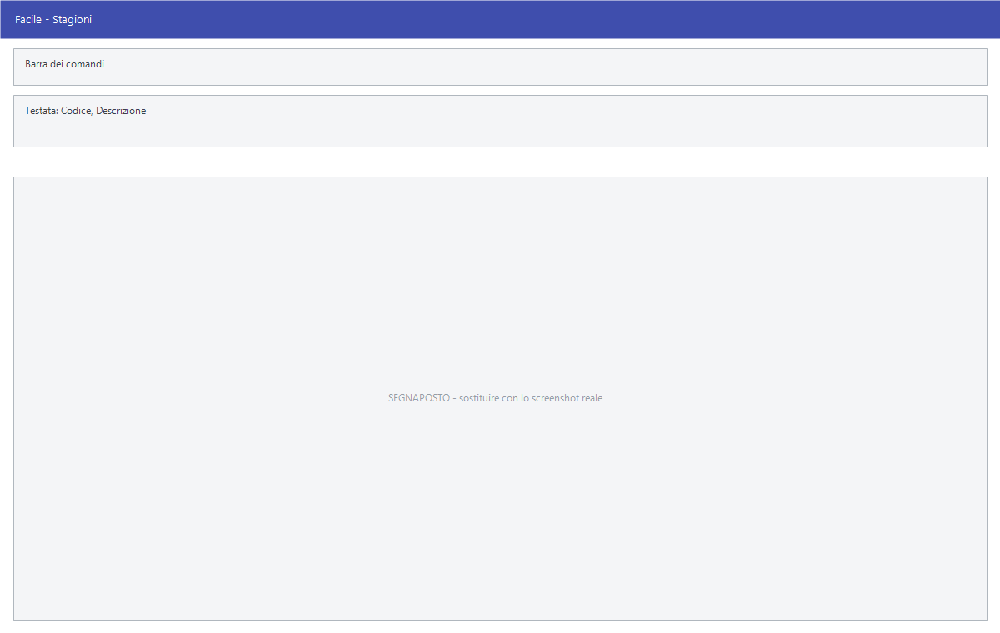

# Stagioni

Da questa maschera si definiscono le stagioni: la classificazione degli
articoli che si vendono in un periodo dell'anno e non in un altro.

!!! info "In sintesi"

    - **Percorso:** Menu ▸ Archivi ▸ Magazzino ▸ Stagioni ▸ Inserimento *(oppure* Modifica*)*
    - **Scorciatoia:** nessuna; la maschera si apre dal menu
    - **Permessi richiesti:** nessun profilo predefinito; **Inserimento** e **Modifica** si abilitano separatamente per ogni utente da [Archivi ▸ Utenti](../anagrafiche/utenti.md)

---

## A cosa serve

La stagione serve a separare le collezioni: l'anagrafica articoli la richiama
nel campo **Stagione**, e le stampe e le statistiche di magazzino si possono
leggere per stagione, per capire cosa resta invenduto di una collezione chiusa.

Esempio: *PRIMAVERA-ESTATE 2026* e *AUTUNNO-INVERNO 2026* come due stagioni
distinte, così l'inventario dice a colpo d'occhio quanto pesa il vecchio.

## Prerequisiti

*Nessuno.*

## La maschera

È una maschera a finestra unica, senza schede: la **barra dei comandi** e tre
campi.

## Campi

| Campo | Obbl. | Descrizione | Valori ammessi |
|---|:---:|---|---|
| Codice | ● | Identificativo della stagione. In modifica non è modificabile. | Numero |
| Descrizione | ● | Nome della stagione, come compare in anagrafica articoli e nelle stampe. | Fino a 30 caratteri |
| Cod. Trasferimento | | Codice con cui la stagione viene riconosciuta nei trasferimenti verso altre sedi. | Testo |

{: .campi }

## Pulsanti e comandi

| Comando | Scorciatoia | Effetto |
|---|---|---|
| **F2 - Salva** | ++f2++ | Registra la stagione. In inserimento la maschera si svuota per la successiva. |
| **F3 - Prec.** | ++f3++ | Passa alla stagione precedente. |
| **F4 - Succ.** | ++f4++ | Passa alla stagione successiva. |
| **F5 - Cerca** | ++f5++ | Apre l'elenco delle stagioni. |
| **F6 - Elimina** | ++f6++ | Cancella la stagione, previa conferma. |
| **Ricarica** | | Rilegge la stagione dall'archivio, abbandonando le modifiche non salvate. |

Valgono inoltre:

| Comando | Scorciatoia | Effetto |
|---|---|---|
| Consultazione | ++f11++ | Apre la finestra **Consultazione**. |
| Calcolatrice | ++f12++ | Apre la calcolatrice. |
| Campo successivo | ++enter++ | Sposta il cursore sul campo seguente. |
| Chiusura | ++esc++ | Chiude la maschera. |

## Come si fa

### Creare una stagione

1. Apri **Menu ▸ Archivi ▸ Magazzino ▸ Stagioni ▸ Inserimento**.
2. Digita il **Codice** e la **Descrizione**.
3. Premi **F2 - Salva**.

### Ritrovare e modificare una stagione

1. Apri **Menu ▸ Archivi ▸ Magazzino ▸ Stagioni ▸ Modifica**. La maschera non
   si apre vuota: mostra già la stagione con il **codice più alto**.
2. Premi **F5 - Cerca** e scegli la stagione dall'elenco, oppure scorri con
   **F3 - Prec.** e **F4 - Succ.**.
3. Correggi i campi e premi **F2 - Salva**. La scheda resta a video su quello
   appena registrato; in inserimento invece si svuota per il successivo.

Finché non salvi puoi tornare indietro con **Ricarica**, che rilegge la
stagione dall'archivio e abbandona le modifiche non salvate. Se l'archivio è
ancora vuoto la voce **Modifica** non apre nulla e non dà alcun messaggio.

### Assegnare la stagione a un articolo

1. Apri l'[anagrafica dell'articolo](../anagrafiche/anagrafica-articoli.md).
2. Nella scheda *Generale*, sul campo **Stagione**, premi ++f10++ e scegli la
   stagione.
3. Premi **F2 - Salva**.

## Controlli e messaggi

| Messaggio | Causa | Cosa fare |
|---|---|---|
| *(nessun messaggio, solo un segnale acustico)* | Manca il **Codice** o la **Descrizione**. | Guarda dove si è posizionato il cursore: è il campo da compilare. |
| *In archivio è già presente un record con lo stesso codice.* | Il codice digitato è già di un'altra stagione. | Cambia codice. |
| *Confermi la Cancellazione....* | Conferma richiesta da **F6 - Elimina**. | Rispondi **Sì** per eliminare la stagione. |
| *Non è possibile eliminare il record pochè utilizzato in alcuni record del database.* | La stagione è assegnata a degli articoli, a contratti o a un calcolo scorte. | Non è eliminabile: prima cambia stagione agli articoli che la usano. |
| *Il record è stato modificato da un altro nodo della rete.* | Un altro utente ha salvato la stessa stagione mentre la modificavi. | Premi **Ricarica**, verifica cosa è cambiato e rifai le tue modifiche. |
| *Il record è stato cancellato da un altro nodo della rete.* | Un altro utente ha eliminato la stagione mentre la modificavi. | La maschera si chiude: non c'è più nulla da salvare. |

## Note

!!! warning "Attenzione"

    Una stagione chiusa non si elimina finché ci sono articoli che la
    richiamano: resta in archivio come riferimento storico.

    ++esc++ chiude la maschera senza chiedere conferma e senza salvare: le
    modifiche fatte dopo l'ultimo **F2 - Salva** vanno perse.

## Vedi anche

- [Anagrafica articoli](../anagrafiche/anagrafica-articoli.md)
- [Tabelle di classificazione](tabelle-di-classificazione.md)
