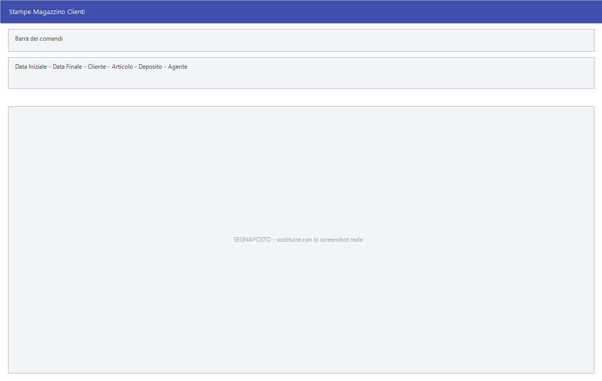

# Stampe magazzino clienti

Il sottomenu **Stampe Magazzino Clienti** guarda i movimenti dal lato di chi
compra: cosa ha preso ciascun cliente, quanto, quando e a che condizioni.
Quasi tutte aprono **la stessa maschera di selezione**, con un parametro
diverso.

!!! info "In sintesi"

    - **Percorso:** Menu ▸ Magazzino ▸ Stampe Magazzino Clienti ▸ *(una delle voci)*
    - **Scorciatoia:** ++f2++ avvia la stampa, ++esc++ esce
    - **Permessi richiesti:** nessun profilo predefinito; le singole voci di menu si abilitano per ogni utente da [Archivi ▸ Utenti](../anagrafiche/utenti.md)

---

## A cosa serve

| Voce di menu | Cosa mostra |
|---|---|
| **Scheda Movimenti Cliente** | Tutti i movimenti di un cliente, riga per riga. |
| **Scheda Movimenti Cliente - Sostituzioni** | Le sole sostituzioni. |
| **Stampa Movimenti Cliente - Omaggi e Sconti Merce** | Omaggi e sconti merce concessi. |
| **Sintesi Movimenti Cliente** | Il riepilogo per cliente, senza il dettaglio. |
| **Sintesi Movimenti Cliente per Articolo** | Quanto ogni cliente ha preso di ogni articolo. |
| **Sintesi Movimenti per Articolo con Dettaglio Promozioni** | Come sopra, distinguendo il venduto in promozione. |
| **Sintesi Mensile Movimenti** | Il riepilogo mese per mese. |
| **Analisi Vendite** | L'analisi del venduto. |
| **Raffronto Vendite con Prezzi Listino** | Confronta i prezzi praticati con quelli di listino: dice dove si è venduto sotto. |
| **Sintesi Movimenti per Giorno Settimana** | Come il venduto si distribuisce nella settimana. |
| **Riepilogo Totali Movimenti Clienti** | I totali per cliente. |
| **Confronto Vendite - Sostituzioni** | Il confronto fra vendite e sostituzioni. |
| **Stampa Giornale Vendita Prodotti Fiscali** | Il giornale delle vendite dei prodotti soggetti ad accisa. |

## Prerequisiti

Prima di usare queste stampe occorre avere movimentato il magazzino, con i
[documenti di vendita](../vendite/documento-di-vendita.md), gli
[scontrini](../vendite/scontrini.md) o i
[movimenti diretti](movimenti-magazzino.md).

## La maschera

È una finestra di selezione: il periodo, i filtri su cliente, articolo,
deposito e classificazioni, e i pulsanti **F2 - OK** ed **Esci**. Il titolo
della finestra dice quale stampa si è aperta.

<!-- DA VERIFICARE: i campi esatti della maschera di selezione: cambiano secondo la stampa e non ho potuto estrarli tutti. -->

## Campi

| Campo | Obbl. | Descrizione | Valori ammessi |
|---|:---:|---|---|
| **Data Iniziale**, **Data Finale** | ● | Il periodo da esaminare. | date |
| **Cliente** | | Restringe a un cliente. | codice |
| **Articolo** | | Restringe a un articolo. | codice |
| **Deposito** | | Restringe a un [deposito](depositi.md). | codice |
| **Agente** | | Restringe a un [agente](../anagrafiche/anagrafica-agenti.md). | codice |

{: .campi }

## Pulsanti e comandi

| Comando | Scorciatoia | Effetto |
|---|---|---|
| **F2 - OK** | ++f2++ | Prepara e mostra l'anteprima della stampa. |
| **Esci** | ++esc++ | Chiude senza stampare. |
| Elenco di scelta | ++f10++ o ++space++ | Sul campo con il codice, apre l'elenco da cui scegliere. |
| **Calcolatrice** | ++f12++ | Apre la calcolatrice. |
| **Consultazione** | ++f11++ | Apre la consultazione. |

## Come si fa

### Vedere cosa ha comprato un cliente

1. Apri **Menu ▸ Magazzino ▸ Stampe Magazzino Clienti ▸ Scheda Movimenti
   Cliente**.
2. Indica il **Cliente** e il periodo.
3. Premi **F2 - OK**.

### Trovare le vendite sotto listino

1. Apri **Stampe Magazzino Clienti ▸ Raffronto Vendite con Prezzi Listino**.
2. Indica il periodo e premi **F2 - OK**.
3. Le righe in cui il prezzo praticato è sotto quello di listino sono quelle da
   guardare.

### Capire quanto pesa la promozione

1. Apri **Sintesi Movimenti per Articolo con Dettaglio Promozioni**.
2. Indica il periodo della promozione.
3. Confronta le colonne del venduto in promozione con quelle fuori promozione.

## Controlli e messaggi

<!-- DA VERIFICARE: i messaggi di queste stampe. -->

| Messaggio | Causa | Cosa fare |
|---|---|---|
| *(nessun messaggio, solo un segnale acustico)* | Manca una delle date. | Compila il campo su cui si è posizionato il cursore. |

## Note

!!! note "Il titolo della finestra dice quale stampa è"

    Poiché la maschera di selezione è la stessa, l'unico modo per accorgersi di
    aver aperto la stampa sbagliata è leggere il titolo in alto.

<!-- DA VERIFICARE: cosa distingue "Analisi Vendite" dalle varie sintesi. -->

<!-- DA VERIFICARE: cosa sono le "sostituzioni" a cui due voci fanno riferimento. -->

## Vedi anche

- [Stampe magazzino fornitori](stampe-magazzino-fornitori.md)
- [Stampe dei movimenti di magazzino](stampe-movimenti-magazzino.md)
- [Riepiloghi e statistiche di vendita](../vendite/riepiloghi-e-statistiche.md)
