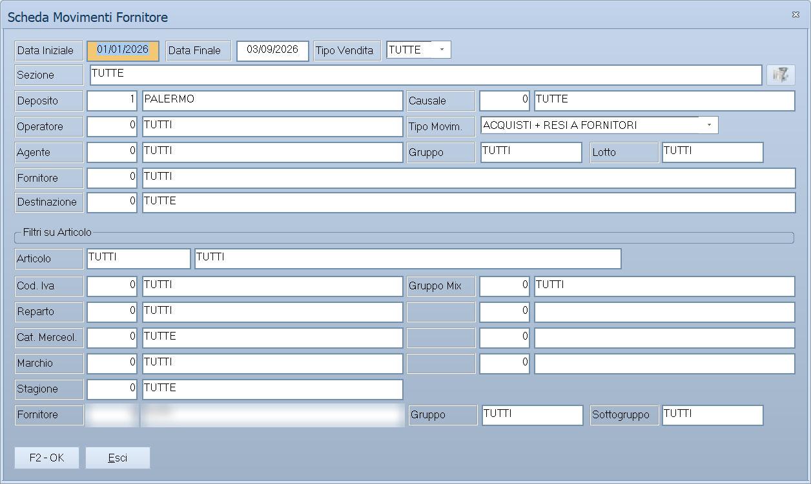

# Stampe magazzino fornitori

Il sottomenu **Stampe Magazzino Fornitori** è il corrispettivo di quello dei
clienti, guardato dal lato di chi fornisce: cosa è arrivato da ciascun
fornitore, quanto e quando.

!!! info "In sintesi"

    - **Percorso:** Menu ▸ Magazzino ▸ Stampe Magazzino Fornitori ▸ Scheda Movimenti Fornitore *(oppure* Sintesi Movimenti Fornitore *o* Riepilogo Totali Movimenti Fornitori*)*
    - **Scorciatoia:** ++f2++ avvia la stampa, ++esc++ esce
    - **Permessi richiesti:** nessun profilo predefinito; le singole voci di menu si abilitano per ogni utente da [Archivi ▸ Utenti](../anagrafiche/utenti.md)

---

## A cosa serve

| Voce di menu | Cosa mostra |
|---|---|
| **Scheda Movimenti Fornitore** | Tutti i movimenti di un fornitore, riga per riga. |
| **Sintesi Movimenti Fornitore** | Il riepilogo per fornitore, senza il dettaglio. |
| **Riepilogo Totali Movimenti Fornitori** | I soli totali per fornitore. |

Aprono la stessa maschera di selezione delle
[stampe magazzino clienti](stampe-magazzino-clienti.md), con il filtro sul
fornitore invece che sul cliente.

## Prerequisiti

Prima di usare queste stampe occorre avere registrato i
[carichi](carico-merci.md) del periodo.

## La maschera

È la finestra di selezione comune alle stampe di magazzino: il periodo, i
filtri e i pulsanti **F2 - OK** ed **Esci**. Il titolo dice quale stampa si è
aperta.

## Campi

| Campo | Obbl. | Descrizione | Valori ammessi |
|---|:---:|---|---|
| **Data Iniziale**, **Data Finale** | ● | Il periodo da esaminare. | date |
| **Fornitore** | | Restringe a un fornitore. | codice |
| **Articolo** | | Restringe a un articolo. | codice |
| **Deposito** | | Restringe a un [deposito](depositi.md). | codice |

{: .campi }

<!-- DA VERIFICARE: i campi esatti della maschera di selezione per le stampe fornitori. -->

## Pulsanti e comandi

| Comando | Scorciatoia | Effetto |
|---|---|---|
| **F2 - OK** | ++f2++ | Prepara e mostra l'anteprima della stampa. |
| **Esci** | ++esc++ | Chiude senza stampare. |
| Elenco di scelta | ++f10++ o ++space++ | Sul campo con il codice, apre l'elenco da cui scegliere. |

## Come si fa

### Vedere cosa è arrivato da un fornitore

1. Apri **Menu ▸ Magazzino ▸ Stampe Magazzino Fornitori ▸ Scheda Movimenti
   Fornitore**.
2. Indica il **Fornitore** e il periodo.
3. Premi **F2 - OK**.

### Confrontare i fornitori dell'anno

1. Apri **Riepilogo Totali Movimenti Fornitori**.
2. Indica il periodo e stampa: escono i totali per fornitore, da cui si vede
   chi pesa di più.

## Controlli e messaggi

<!-- DA VERIFICARE: i messaggi di queste stampe. -->

| Messaggio | Causa | Cosa fare |
|---|---|---|
| *(nessun messaggio, solo un segnale acustico)* | Manca una delle date. | Compila il campo su cui si è posizionato il cursore. |

## Note

!!! note "Da non confondere con l'analisi dei listini"

    Queste stampe dicono cosa è **effettivamente arrivato** da ciascun
    fornitore. Quanto ciascuno **chiede** sta invece nei
    [listini fornitori](../listini-fornitori/index.md), e il confronto fra i
    due si fa con l'[analisi fornitore](../listini-fornitori/analisi-fornitore.md).

<!-- DA VERIFICARE: se queste stampe considerino solo i carichi o anche i resi a fornitore. -->

## Vedi anche

- [Stampe magazzino clienti](stampe-magazzino-clienti.md)
- [Carico merci](carico-merci.md)
- [Analisi fornitore](../listini-fornitori/analisi-fornitore.md)
