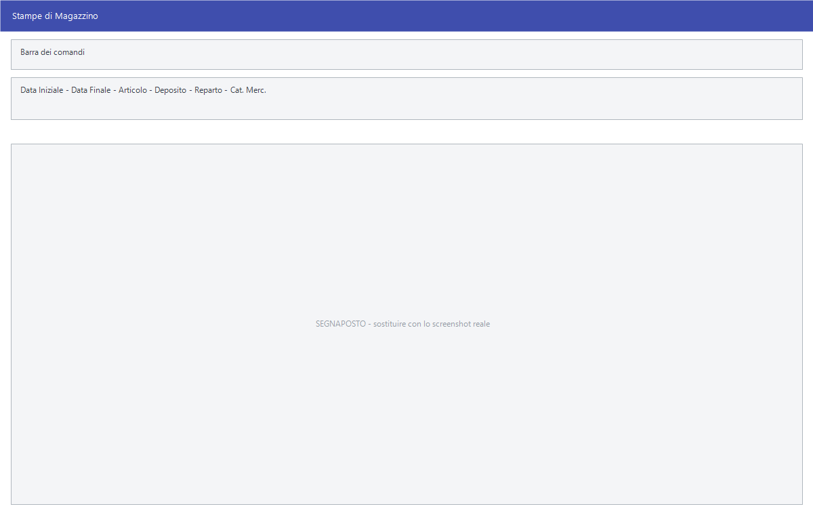

# Stampe dei movimenti di magazzino

Le voci in fondo al menu **Magazzino**: le stampe che leggono i movimenti senza
distinguere fra clienti e fornitori, più le interrogazioni e gli adempimenti di
settore.

!!! info "In sintesi"

    - **Percorso:** Menu ▸ Magazzino ▸ *(una delle voci elencate sotto)*
    - **Scorciatoia:** ++f2++ avvia la stampa, ++esc++ esce
    - **Permessi richiesti:** nessun profilo predefinito; le singole voci di menu si abilitano per ogni utente da [Archivi ▸ Utenti](../anagrafiche/utenti.md)

---

## A cosa serve

| Voce di menu | Cosa mostra |
|---|---|
| **Interrogazione Articolo** | La situazione di un articolo a video: esistenze, movimenti, prezzi. |
| **Giornale di Magazzino** | Il giornale dei movimenti in ordine cronologico. |
| **Stampa Vendite con Ricavo - Margine - Ricarico** | Il venduto con i tre indicatori di redditività. |
| **Stampa Percentuale Sell-Out** | La percentuale di sell-out. |
| **Stampa Percentuale Sell-Out Fornitore** | La stessa, per fornitore. La voce di menu è scritta *Stampa Precentuale Sell-Out Fornitore*, con un refuso. |
| **Sintesi Movimenti** | Il riepilogo dei movimenti del periodo. |
| **Sintesi Movimenti - Margini Ultimo Prezzo d' Acquisto** | La stessa sintesi, con i margini calcolati sull'ultimo costo. |
| **Sintesi Movimenti per Reparto** | I movimenti raggruppati per [reparto](reparti.md). |
| **Sintesi Movimenti per Categoria Merceologica** | Raggruppati per [categoria merceologica](categorie-merceologiche.md). |
| **Sintesi Movimenti per Giorno** | Raggruppati per giorno. |
| **Movimenti Magazzino per Articolo** | I movimenti di ciascun articolo. |
| **Movimenti Periodo** | I movimenti di un periodo. |
| **Venduto per Agenti/Cat. Merceologica** | Il venduto incrociato fra agente e categoria. |
| **Valore Magazzino** | Quanto vale la merce in giacenza. |
| **Stampa Registro Sostanze Zuccherine** | Il registro delle sostanze zuccherine. |
| **Modello HACCP Merci in Accettazione** | Il modulo HACCP per la merce in entrata. |
| **Esistenze da Lettore Formula 734** | Acquisisce le esistenze rilevate con il lettore Formula 734. |

## Prerequisiti

Prima di usare queste stampe occorre avere movimentato il magazzino con
[carichi](carico-merci.md),
[documenti di vendita](../vendite/documento-di-vendita.md) o
[movimenti diretti](movimenti-magazzino.md).

## La maschera

La maggior parte apre la stessa finestra di selezione delle
[stampe magazzino clienti](stampe-magazzino-clienti.md), con un parametro
diverso; **Interrogazione Articolo**, **Valore Magazzino**, **Movimenti
Periodo** e i due adempimenti hanno una maschera propria.

<!-- DA VERIFICARE: i campi delle maschere proprie di Interrogazione Articolo, Valore Magazzino, Movimenti Periodo, Registro Sostanze Zuccherine ed Esistenze da Lettore Formula 734. -->

## Campi

| Campo | Obbl. | Descrizione | Valori ammessi |
|---|:---:|---|---|
| **Data Iniziale**, **Data Finale** | ● | Il periodo da esaminare. | date |
| **Articolo** | | Restringe a un articolo. | codice |
| **Deposito** | | Restringe a un [deposito](depositi.md). | codice |
| **Reparto**, **Cat. Merc.** | | Restringono alla classificazione. | codici |

{: .campi }

## Pulsanti e comandi

| Comando | Scorciatoia | Effetto |
|---|---|---|
| **F2 - OK** | ++f2++ | Prepara e mostra l'anteprima della stampa. |
| **Esci** | ++esc++ | Chiude senza stampare. |
| Elenco di scelta | ++f10++ o ++space++ | Sul campo con il codice, apre l'elenco da cui scegliere. |
| **Calcolatrice** | ++f12++ | Apre la calcolatrice. |
| **Consultazione** | ++f11++ | Apre la consultazione. |

## Come si fa

### Sapere quanto vale il magazzino

1. Apri **Menu ▸ Magazzino ▸ Valore Magazzino**.
2. Indica la data a cui valutare e il deposito.
3. Premi **F2 - OK**.

### Controllare la storia di un articolo

1. Apri **Menu ▸ Magazzino ▸ Interrogazione Articolo**.
2. Indica l'articolo: la maschera mostra esistenze e movimenti a video.

### Vedere quali reparti rendono

1. Apri **Sintesi Movimenti per Reparto**, oppure **Sintesi Movimenti -
   Margini Ultimo Prezzo d' Acquisto** se vuoi i margini.
2. Indica il periodo e stampa.

## Controlli e messaggi

<!-- DA VERIFICARE: i messaggi di queste stampe. -->

| Messaggio | Causa | Cosa fare |
|---|---|---|
| *(nessun messaggio, solo un segnale acustico)* | Manca una delle date. | Compila il campo su cui si è posizionato il cursore. |

## Note

!!! note "Adempimenti di settore"

    **Registro Sostanze Zuccherine** e **Modello HACCP Merci in Accettazione**
    riguardano settori specifici — enologia e alimentare. **Esistenze da
    Lettore Formula 734** serve a chi usa quel terminale per l'inventario.

<!-- DA VERIFICARE: cosa misura la "percentuale di sell-out" e come è calcolata. -->

<!-- DA VERIFICARE: con quale criterio "Valore Magazzino" valorizza le giacenze: ultimo costo, medio o altro. -->

<!-- DA VERIFICARE: che differenza c'è fra "Movimenti Periodo" e "Sintesi Movimenti per Giorno". -->

## Vedi anche

- [Movimenti di magazzino](movimenti-magazzino.md)
- [Stampe magazzino clienti](stampe-magazzino-clienti.md)
- [Stampe articoli](../anagrafiche/stampe-articoli.md)
