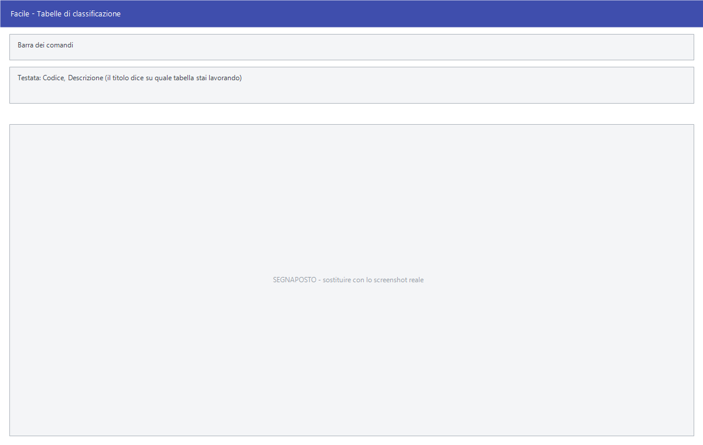

# Tabelle di classificazione

Nel menu **Archivi** ci sono oltre trenta voci che sembrano altrettante
maschere diverse — Famiglie, Settori, Autori, Autisti, Modelli e così via — ma
aprono **la stessa identica finestra**. Cambia solo il titolo e la tabella su
cui si scrive. Questa pagina le documenta tutte.

!!! info "In sintesi"

    - **Percorso:**
        - Menu ▸ Archivi ▸ Magazzino ▸ *(una delle voci elencate sotto)* ▸ Inserimento *(oppure* Modifica*)*
        - Menu ▸ Archivi ▸ Altre Tabelle ▸ *(una delle voci elencate sotto)* ▸ Inserimento *(oppure* Modifica*)*
        - Menu ▸ Archivi ▸ Fornitori ▸ Gruppi Fornitori ▸ Inserimento *(oppure* Modifica*)*
        - Menu ▸ Archivi ▸ Banchi Conservatori - Attrezzature in Comodato ▸ Marche *(oppure* Categorie *o* Modelli*)*
        - Menu ▸ Archivi ▸ Agenti ▸ Capi Area ▸ Inserimento Giro *(oppure* Modifica Giri*)*
        - Menu ▸ Archivi ▸ Listini Vendita ▸ Inserimento Tabella *(oppure* Modifica Tabella*)*
    - **Scorciatoia:** nessuna; la maschera si apre dal menu
    - **Permessi richiesti:** nessun profilo predefinito; **Inserimento** e **Modifica** si abilitano separatamente per ogni utente da [Archivi ▸ Utenti](../anagrafiche/utenti.md)

---

## A cosa serve

Sono tutte tabelle di classificazione: elenchi di codice e descrizione con cui
si raggruppano gli articoli. L'anagrafica articoli le richiama nei campi
**Cat. Merc.**, **Marchio**, **Gruppo Mix** e nelle tre tabelle libere, e le
stampe e le statistiche si possono leggere per ciascuna di esse.

Esempio: se dividi gli articoli in famiglie, crei qui le famiglie e poi le
assegni in anagrafica articoli; da quel momento le stampe di magazzino si
possono raggruppare per famiglia.

Molte di queste tabelle servono a un solo settore — *Tipi di Tomaia* e *Tipi di
Fondo* alle calzature, *Autori* e *Case Editrici* alle librerie, *Gruppi
Calibri* all'ortofrutta. Se non ti servono, si lasciano vuote: nessuna è
obbligatoria.

## Prerequisiti

*Nessuno.*

## La maschera

È una maschera a finestra unica, senza schede: la **barra dei comandi** e due
soli campi, **Codice** e **Descrizione**. Il titolo della finestra dice su
quale tabella stai lavorando.

### Sotto Archivi ▸ Magazzino

Queste sono le diciannove voci di menu, con il titolo che compare in alto:

| Voce di menu | Titolo della finestra | A cosa serve |
|---|---|---|
| **Famiglie** | Inserimento Famiglia | Raggruppamento generico degli articoli |
| **Colori Fornitore** | Inserimento Colori Fornitore | Il colore come lo chiama il fornitore |
| **Tipi di Tomaia** | Inserimento Tipi Tomaia | Calzature |
| **Tipi di Tessuto** | Inserimento Tipo di Tessuto | Abbigliamento |
| **Settori** | Inserimento Settore | Settore merceologico |
| **Tipi di Fondo** | Inserimento Tipi Fondo | Calzature |
| **Colori Interni** | Inserimento Colori Interni | Il colore come lo chiami tu |
| **Toni** | Inserimento Colori Interni | **È la stessa tabella di Colori Interni** |
| **Gruppi Calibri** | Inserimento Calibri | Ortofrutta |
| **Gruppi Articoli** | Inserimento Gruppi Articoli | Raggruppamento principale degli articoli |
| **Sottogruppi** | Inserimento Sottogruppi Articoli | Secondo livello sotto i gruppi |
| **Banconi** | Inserimento Bancone | I banchi di vendita, richiamati dal **Bancone** dell'articolo |
| **Categorie Fiscali** | Inserimento Categorie Fiscali | Classificazione fiscale degli articoli |
| **Autori** | Inserimento Autori | Librerie |
| **Case Editrici** | Inserimento Case Editrici | Librerie |
| **Periodi** | Inserimento Periodo | Periodi di riferimento |
| **Tipi Contenitori** | Inserimento Tipo Contenitore | Contenitori, con la capacità in litri |
| **Tipi Involucro** | Inserimento Tipo Involucro | Involucri e imballaggi. La voce di menu è scritta **Inseimento**, con un refuso |
| **Materiali** | Inserimento Materiale | Materiale di cui l'articolo è fatto |

!!! warning "Attenzione"

    **Toni** e **Colori Interni** sono due voci di menu diverse che scrivono
    sulla **stessa tabella**: quello che inserisci da una lo ritrovi
    nell'altra. Non sono due classificazioni distinte.

### Nel resto del menu Archivi

La stessa maschera si apre da altre dodici voci, sparse in cinque rami diversi:

| Percorso | Titolo della finestra | A cosa serve |
|---|---|---|
| **Fornitori ▸ Gruppi Fornitori** | Inserimento Gruppo Fornitore | Raggruppamento dei fornitori |
| **Listini Vendita ▸ Inserimento / Modifica / Stampa Tabella** | Inserimento Listini di Vendita | I nomi dei listini di vendita |
| **Agenti ▸ Inserimento Giro / Modifica Giri** | Inserimento Giri Agenti | I giri di visita degli agenti |
| **Banchi Conservatori ▸ Marche** | Inserimento Marche Banchi Conservatori | I costruttori delle attrezzature |
| **Banchi Conservatori ▸ Categorie** | Inserimento Categoria Banchi Conservatori | Le categorie delle attrezzature |
| **Banchi Conservatori ▸ Modelli** | Inserimento Modelli Banchi Conservatori | I modelli delle attrezzature |
| **Altre Tabelle ▸ Causali Cessazione Rapporto** | Inserimento Causali di Cessazione Rapporto | Perché un rapporto è finito |
| **Altre Tabelle ▸ Categorie Rubrica** | Inserimento Categorie Rubrica | La classificazione dei contatti di rubrica |
| **Altre Tabelle ▸ Origini Merci** | Inserimento Origine Merci | La provenienza della merce |
| **Altre Tabelle ▸ Tipi Attività** | Inserimento Tipo Attività | Il tipo di attività di clienti e fornitori |
| **Altre Tabelle ▸ Gruppi Aziende** | Inserimento Gruppi Aziende | Raggruppamento delle aziende |
| **Altre Tabelle ▸ Mezzi di Trasporto** | Inserimento Mezzi di Trasporto | I veicoli usati per le consegne |
| **Altre Tabelle ▸ Autisti** | Inserimento Autisti | Chi guida i mezzi |

!!! note "I listini di vendita hanno un campo in più"

    Sulla tabella dei listini di vendita il **Codice** arriva fino a 99999 e
    compare **%Ric. Spese**, che non c'è sulle altre. È lì che si danno i nomi
    ai listini richiamati dalle
    [maschere dei listini di vendita](../listini-vendita/index.md).

### Sotto Procedure Personali

La stessa maschera si apre da altre cinque voci del ramo **Procedure
Personali**:

| Percorso | A cosa serve |
|---|---|
| **Gruppi Clienti** | Raggruppamento dei clienti |
| **Tipi Attività** | Il tipo di attività di clienti e fornitori |
| **Nature Giuridiche** | La forma giuridica dell'azienda |
| **Tipi Contabilità** | Il regime contabile del soggetto |
| **Coordinatori (non Agganciati)** | I coordinatori non ancora assegnati |

!!! warning "Procedure Personali c'è solo nella versione Studio"

    Se la versione non è quella dello studio professionale, all'avvio il
    programma **toglie dal menu l'intero ramo Procedure Personali**, e con esso
    queste cinque voci. Vedi [Versioni specifiche](../versioni/index.md).

!!! note "«Tipi Attività» si raggiunge da due menu, e uno resta sempre"

    La voce **Procedure Personali ▸ Tipi Attività** e la voce
    **Archivi ▸ Altre Tabelle ▸ Tipi Attività** aprono la **stessa tabella**:
    quello che inserisci da una lo ritrovi nell'altra. La seconda c'è in tutte
    le versioni, quindi questa tabella resta raggiungibile anche dove il ramo
    Procedure Personali non compare.

## Campi

| Campo | Obbl. | Descrizione | Valori ammessi |
|---|:---:|---|---|
| Codice | ● | Identificativo della voce. In modifica non è modificabile. | Numero |
| Descrizione | ● | Nome della voce, come compare nell'anagrafica articoli e nelle stampe. | Fino a 30 caratteri |
| Capacità (lt) | | **Solo su Tipi Contenitori.** Capacità del contenitore in litri. | Numero con due decimali |
| %Ric. Spese | | **Solo sui Listini di Vendita.** Percentuale di ricarico per spese applicata al listino. | Numero con due decimali, non negativo |

{: .campi }

Su **Sottogruppi**, nella versione Killin, compaiono in più un campo
**%Sconto** e una casella **Barcode**.

Nella versione Taglie e Colori il **Codice** dei **Colori Interni** è limitato:
da 1 a 999, oppure da 1 a 9999 se così è impostato nei dati dell'azienda. Nelle
altre versioni non c'è limite.

## Pulsanti e comandi

| Comando | Scorciatoia | Effetto |
|---|---|---|
| **F2 - Salva** | ++f2++ | Registra la voce. In inserimento la maschera si svuota per la successiva. |
| **F3 - Prec.** | ++f3++ | Passa alla voce precedente. |
| **F4 - Succ.** | ++f4++ | Passa alla voce successiva. |
| **F5 - Cerca** | ++f5++ | Apre l'elenco delle voci della tabella. |
| **F6 - Elimina** | ++f6++ | Cancella la voce, previa conferma. |
| **Ricarica** | | Rilegge la voce dall'archivio, abbandonando le modifiche non salvate. |

Valgono inoltre:

| Comando | Scorciatoia | Effetto |
|---|---|---|
| Guida | ++f1++ | Apre la pagina di guida della tabella su cui stai lavorando. |
| Consultazione | ++f11++ | Apre la finestra **Consultazione**. |
| Calcolatrice | ++f12++ | Apre la calcolatrice. |
| Campo successivo | ++enter++ | Sposta il cursore sul campo seguente. |
| Chiusura | ++esc++ | Chiude la maschera. |

## Come si fa

### Aggiungere una voce a una tabella

1. Apri **Menu ▸ Archivi ▸ Magazzino** e scegli la tabella, per esempio
   **Famiglie ▸ Inserimento**.
2. Controlla il titolo della finestra: è l'unico modo per sapere su quale
   tabella stai scrivendo.
3. Digita il **Codice** e la **Descrizione**.
4. Premi **F2 - Salva**. La maschera si svuota per la voce successiva.

### Registrare un tipo di contenitore

1. Apri **Menu ▸ Archivi ▸ Magazzino ▸ Tipi Contenitori ▸ Inserimento**.
2. Digita **Codice** e **Descrizione**.
3. Compila **Capacità (lt)**: è l'unico campo in più di questa tabella.
4. Premi **F2 - Salva**.

### Correggere una descrizione

1. Apri la tabella in **Modifica**.
2. Premi **F5 - Cerca** e scegli la voce.
3. Correggi la **Descrizione** e premi **F2 - Salva**. Gli articoli che la
   usano restano collegati: cambia solo come la voce si chiama.

## Controlli e messaggi

| Messaggio | Causa | Cosa fare |
|---|---|---|
| *(nessun messaggio, solo un segnale acustico)* | Manca il **Codice** o la **Descrizione**. | Guarda dove si è posizionato il cursore: è il campo da compilare. |
| *In archivio è già presente un record con lo stesso codice.* | Il codice digitato è già usato in questa tabella. | Cambia codice. Codici uguali in tabelle diverse non danno fastidio. |
| *Confermi la Cancellazione....* | Conferma richiesta da **F6 - Elimina**. | Rispondi **Sì** per eliminare la voce. |
| *Non è possibile eliminare il record pochè utilizzato in alcuni record del database.* | La voce è assegnata a degli articoli, a un calcolo scorte o a un gruppo fornitori. | Non è eliminabile: prima cambia classificazione agli articoli che la usano. |
| *Il record è stato modificato da un altro nodo della rete.* | Un altro utente ha salvato la stessa voce mentre la modificavi. | Premi **Ricarica**, verifica cosa è cambiato e rifai le tue modifiche. |
| *Il record è stato cancellato da un altro nodo della rete.* | Un altro utente ha eliminato la voce mentre la modificavi. | La maschera si chiude: non c'è più nulla da salvare. |

## Note

!!! warning "Attenzione"

    Siccome la finestra è sempre la stessa, **è facile scrivere nella tabella
    sbagliata**: il titolo in alto è l'unica cosa che le distingue. Controllalo
    prima di premere **F2 - Salva**.

    ++esc++ chiude la maschera senza chiedere conferma e senza salvare: le
    modifiche fatte dopo l'ultimo **F2 - Salva** vanno perse.

<!-- DA VERIFICARE: le voci di menu Toni e Colori Interni scrivono sulla stessa tabella. È voluto (due nomi per lo stesso elenco) o è un errore nel menu da correggere? -->

<!-- DA VERIFICARE: la tabella Periodi. Il nome non dice a quale uso siano destinati questi periodi. -->

<!-- DA VERIFICARE: la tabella Categorie Fiscali. Come si differenzia dalle Aliquote IVA nell'uso quotidiano? -->

<!-- DA VERIFICARE: il campo "%Ric. Spese" dei listini di vendita. Dove viene applicato: sul prezzo di vendita, sulle spese del documento, o altro? -->

## Vedi anche

- [Anagrafica articoli](../anagrafiche/anagrafica-articoli.md)
- [Categorie merceologiche](categorie-merceologiche.md)
- [Gruppi taglie](gruppi-taglie.md)
