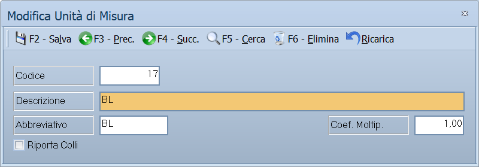

# Unità di misura

Da questa maschera si definiscono le unità con cui gli articoli si comprano, si
vendono e si contano: pezzi, chilogrammi, litri, confezioni.

!!! info "In sintesi"

    - **Percorso:** Menu ▸ Archivi ▸ Magazzino ▸ Unità di Misura ▸ Inserimento *(oppure* Modifica*)*
    - **Scorciatoia:** nessuna; la maschera si apre dal menu
    - **Permessi richiesti:** nessun profilo predefinito; **Inserimento** e **Modifica** si abilitano separatamente per ogni utente da [Archivi ▸ Utenti](../anagrafiche/utenti.md)

---

## A cosa serve

L'unità di misura compare su ogni riga di documento e su ogni movimento di
magazzino: è quella che dice se «3» vuol dire tre pezzi o tre chili.
L'anagrafica articoli la richiama nel campo **Un. Misura**.

Esempio: se vendi salumi a peso, crei l'unità *KG* con abbreviativo *Kg.*; se
li vendi anche a confezione, ne crei una seconda e la usi sugli articoli
confezionati.

## Prerequisiti

*Nessuno.* È una delle prime tabelle da compilare: l'anagrafica articoli la
richiama, e su molte installazioni è fra i campi resi obbligatori.

## La maschera

È una maschera a finestra unica, senza schede: la **barra dei comandi** e
quattro campi.

## Campi

| Campo | Obbl. | Descrizione | Valori ammessi |
|---|:---:|---|---|
| Codice | ● | Identificativo dell'unità. In modifica non è modificabile. | Numero |
| Descrizione | ● | Nome esteso dell'unità, per esempio *CHILOGRAMMI*. | Fino a 30 caratteri |
| Abbreviativo | | Sigla breve stampata sui documenti, per esempio *Kg.* | Fino a 4 caratteri |
| Coef. Moltip. | | Per quanto va moltiplicata la quantità scritta sul documento. Lasciandolo a **1** la quantità vale così com'è. | Numero |
| Riporta Colli | | Scrivendo la quantità su una riga di documento, mette **i colli uguali alla quantità**. | Casella |

## Pulsanti e comandi

| Comando | Scorciatoia | Effetto |
|---|---|---|
| **F2 - Salva** | ++f2++ | Registra l'unità. In inserimento la maschera si svuota per la successiva. |
| **F3 - Prec.** | ++f3++ | Passa all'unità precedente. |
| **F4 - Succ.** | ++f4++ | Passa all'unità successiva. |
| **F5 - Cerca** | ++f5++ | Apre l'elenco delle unità di misura. |
| **F6 - Elimina** | ++f6++ | Cancella l'unità, previa conferma. |
| **Ricarica** | | Rilegge l'unità dall'archivio, abbandonando le modifiche non salvate. |

Valgono inoltre:

| Comando | Scorciatoia | Effetto |
|---|---|---|
| Consultazione | ++f11++ | Apre la finestra **Consultazione**. |
| Calcolatrice | ++f12++ | Apre la calcolatrice. |
| Campo successivo | ++enter++ | Sposta il cursore sul campo seguente. |
| Chiusura | ++esc++ | Chiude la maschera. |

## Come si fa

### Creare un'unità di misura

1. Apri **Menu ▸ Archivi ▸ Magazzino ▸ Unità di Misura ▸ Inserimento**.
2. Digita il **Codice** e la **Descrizione**.
3. Scrivi l'**Abbreviativo**: è quello che comparirà sui documenti.
4. Premi **F2 - Salva**.

### Assegnare l'unità a un articolo

1. Apri l'[anagrafica dell'articolo](../anagrafiche/anagrafica-articoli.md).
2. Nella scheda *Generale*, sul campo **Un. Misura**, premi ++f10++ e scegli
   l'unità.
3. Premi **F2 - Salva**.

## Controlli e messaggi

| Messaggio | Causa | Cosa fare |
|---|---|---|
| *(nessun messaggio, solo un segnale acustico)* | Manca il **Codice** o la **Descrizione**. | Guarda dove si è posizionato il cursore: è il campo da compilare. |
| *In archivio è già presente un record con lo stesso codice.* | Il codice digitato è già di un'altra unità. | Cambia codice. |
| *Confermi la Cancellazione....* | Conferma richiesta da **F6 - Elimina**. | Rispondi **Sì** per eliminare l'unità. |
| *Non è possibile eliminare il record poiché utilizzato in alcuni record del database.* | L'unità è assegnata a degli articoli o compare su righe di documento. | Non è eliminabile: lasciala in archivio. |
| *Il record è stato modificato da un altro nodo della rete.* | Un altro utente ha salvato la stessa unità mentre la modificavi. | Premi **Ricarica**, verifica cosa è cambiato e rifai le tue modifiche. |
| *Il record è stato cancellato da un altro nodo della rete.* | Un altro utente ha eliminato l'unità mentre la modificavi. | La maschera si chiude: non c'è più nulla da salvare. |

## Note

!!! warning "Attenzione"

    Cambiare l'**Abbreviativo** di un'unità già usata cambia come si legge
    sulle stampe successive, ma non tocca le quantità già registrate.

    ++esc++ chiude la maschera senza chiedere conferma e senza salvare: le
    modifiche fatte dopo l'ultimo **F2 - Salva** vanno perse.

!!! info "Che cosa moltiplica il Coef. Moltip."

    Moltiplica la **quantità che scrivi** per ottenere quella che il
    programma usa davvero, sia per il magazzino sia per il valore della
    riga.

    Serve quando si vende **a collo ma si conta a peso o a pezzo**. Un
    esempio: l'articolo ha prezzo 2,00 al chilo e si vende a cartoni da 12
    chili. Si registra l'unità `CT` con **Coef. Moltip. = 12**; scrivendo
    sulla riga **quantità 3**, il programma calcola:

    - valore della riga: 2,00 × 12 × 3 = **72,00**;
    - movimento di magazzino: **36 chili**.

    Con il coefficiente a **1** — il valore normale — non cambia niente: 3
    resta 3.

    ⚠️ Cambiare il coefficiente di un'unità già in uso **non ricalcola i
    documenti fatti**, ma cambia tutti quelli che verranno: se serve
    un'altra conversione, conviene creare un'unità nuova.

!!! note "Dove ha effetto Riporta Colli"

    Sulle **righe dei documenti di vendita** — fatture, DDT, bolle, ordini,
    preventivi: appena scrivi la quantità, il numero dei colli della riga
    diventa uguale a quella quantità. Da lì i colli si sommano nel totale
    del documento, che è quello che finisce sul documento di trasporto.

    Vale per le unità in cui **un'unità è un collo**: cartone, pallet,
    cassa.

    C'è però una precedenza da conoscere: se sulla **ditta** è attivo il
    **calcolo automatico dei colli**, i colli vengono calcolati dividendo
    la quantità per i pezzi per confezione dell'articolo, e **questa
    casella non viene nemmeno guardata**. Riporta Colli funziona solo
    quando quel calcolo automatico è spento.

## Vedi anche

- [Anagrafica articoli](../anagrafiche/anagrafica-articoli.md)
- [Tabelle di classificazione](tabelle-di-classificazione.md)
