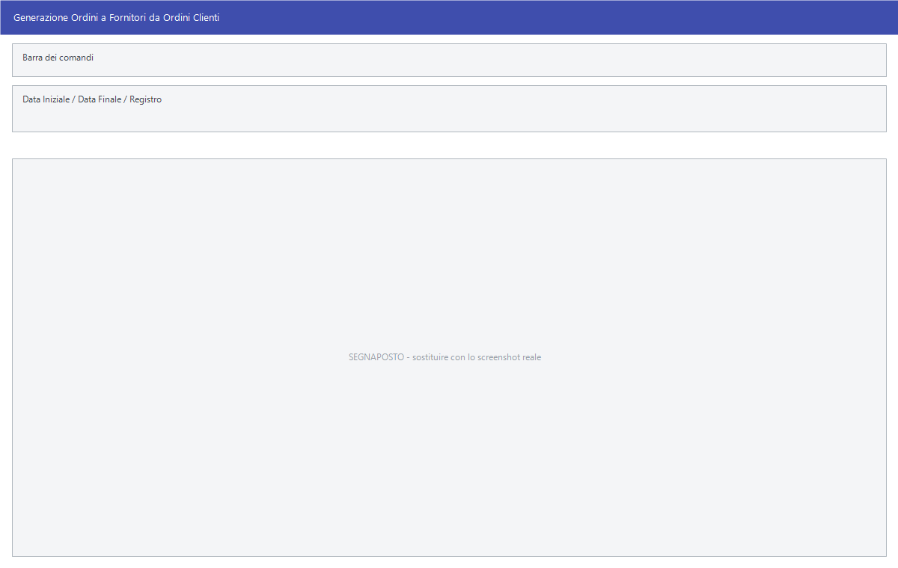

# Generazione degli ordini

Un ordine si può scrivere a mano, oppure lasciare che sia Facile a comporlo
guardando cosa è stato ordinato dai clienti o cosa è stato venduto. Sono le
maschere di questa pagina: si parte da un elenco, si sceglie, si genera.

!!! info "In sintesi"

    - **Percorso:**
        - Menu ▸ Ordini ▸ Generazione Ordini a Fornitori da Ordini Clienti
        - Menu ▸ Ordini ▸ Ordini da Clienti ▸ Rissortimento Punti Vendita da Vendite
        - Menu ▸ Ordini ▸ Ordini da Clienti ▸ Genera DDT per Ordini Centro Servizi
    - **Scorciatoia:** ++f2++ genera, ++f3++ modifica la riga, ++f4++ genera singoli, ++f5++ cerca, ++esc++ esce
    - **Permessi richiesti:** nessun profilo predefinito; le singole voci di menu si abilitano per ogni utente da [Archivi ▸ Utenti](../anagrafiche/utenti.md)

---

## A cosa serve

| Voce di menu | A cosa serve |
|---|---|
| **Generazione Ordini a Fornitori da Ordini Clienti** | Legge gli ordini dei clienti di un periodo e genera gli ordini ai fornitori corrispondenti. Si sceglie riga per riga cosa comprendere. |
| **Rissortimento Punti Vendita da Vendite** | Calcola cosa riassortire nei punti vendita partendo dal venduto. La voce di menu contiene un refuso: si legge *Rissortimento* invece di *Riassortimento*; la finestra si chiama correttamente **Riassortimento da Vendite**. |
| **Genera DDT per Ordini Centro Servizi** | Trasforma in documenti di trasporto gli ordini destinati al centro servizi. |

## Prerequisiti

Prima di generare occorre:

- avere gli ordini dei clienti in archivio, o le vendite del periodo da cui
  partire;
- avere sugli [articoli](../anagrafiche/anagrafica-articoli.md) il **fornitore
  abituale**: è quello che decide a chi va la riga quando si generano gli
  ordini raggruppati;
- per il riassortimento, avere scorte e assortimento impostati (vedi
  [Scorte, assortimento e ubicazioni](../anagrafiche/scorte-e-assortimento.md));
- per i DDT a centro servizi, avere impostata nei
  [parametri della ditta](../anagrafiche/ditte.md) la **causale di
  trasferimento fra depositi**, che deve essere di scarico e collegata ai
  clienti.

## La maschera

**Generazione Ordini a Fornitori da Ordini Clienti** e **Riassortimento da
Vendite** hanno la stessa forma: in alto i filtri e una barra di avanzamento,
sotto la griglia su cui si sceglie, e la barra dei comandi in testa. **Genera
DDT per Ordini Centro Servizi** è invece una finestrella con due soli campi.

## Campi

### Generazione Ordini a Fornitori da Ordini Clienti

| Campo | Obbl. | Descrizione | Valori ammessi |
|---|:---:|---|---|
| **Data Iniziale**, **Data Finale** | ● | Il periodo degli ordini clienti da leggere. | date |
| **Registro** | | Restringe a un registro di numerazione. | voce dell'elenco |

{: .campi }

Le colonne della griglia sono **Sel**, **Num. Ordine**, **Data Ordine**,
**Cliente**, **Ord.Gen.**, **N.DOC.** e **Anno**. Aprendo una riga con **F3 -
Modifica** si scende al dettaglio, con le colonne **Codice**,
**Descrizione**, **Commessa**, **Q.tà Ordinata**, **Q.tà Evasa**,
**Disponibilità**, **Da Ordinare**, **Cod. For.**, **Fornitore**, **Cod.
Cms.**, **Cod. Cco**, **Cod. Dep.** e **Ordinata**: lì si corregge, articolo
per articolo, quanto ordinare e a chi.

### Riassortimento da Vendite

| Campo | Obbl. | Descrizione | Valori ammessi |
|---|:---:|---|---|
| **Da Iniziale** | ● | Inizio del periodo di vendita da esaminare. L'etichetta a video dice *Da Iniziale*: si intende *Data Iniziale*. | data |
| **Data Finale** | ● | Fine del periodo. | data |

{: .campi }

Le colonne sono **Codice**, **Descrizione**, **Quantità da Ordinare**,
**Disponibilita**, **Esistenza**, **Scorta Min**, **Esistenza Centrale**,
**Q.tà Ordinata**, **Q.ta Venduta**, **Scorta Max** e **Assort.**. Si scrive
nella **Quantità da Ordinare**; il resto serve a decidere.

Il titolo della finestra, dopo la ricerca, riporta il deposito su cui si sta
lavorando — *Riassortimento da Vendite - Dep. (1) SEDE*.

### Genera DDT per Ordini Centro Servizi

| Campo | Obbl. | Descrizione | Valori ammessi |
|---|:---:|---|---|
| **Data** | ● | La data degli ordini da trasformare, e quella dei documenti generati. | data |
| **Cliente** | | Restringe a un cliente. A fianco compare la ragione sociale. | codice |

{: .campi }

## Pulsanti e comandi

### Generazione Ordini a Fornitori da Ordini Clienti

| Comando | Scorciatoia | Effetto |
|---|---|---|
| **F2 - Genera Ordini Raggruppati** | ++f2++ | Genera **un ordine per fornitore**, mettendo insieme le righe di tutti gli ordini scelti. |
| **F3 - Modifica** | ++f3++ | Apre il dettaglio della riga per correggere quantità e fornitore. |
| **F4 - Genera Ordini Singoli** | ++f4++ | Genera **un ordine per ciascun ordine cliente**, senza raggruppare. |

### Riassortimento da Vendite

| Comando | Scorciatoia | Effetto |
|---|---|---|
| **F2 - Genera Ordine** | ++f2++ | Genera l'ordine per gli articoli venduti da riassortire. |
| **F5 - Cerca Vendite** | ++f5++ | Chiede i filtri — deposito compreso — e riempie la griglia con le vendite del periodo. |

### Genera DDT per Ordini Centro Servizi

| Comando | Scorciatoia | Effetto |
|---|---|---|
| **F2 - OK** | ++f2++ | Genera i documenti di trasporto. |
| **Esci** | ++esc++ | Chiude senza fare nulla. |

## Come si fa

### Ordinare ai fornitori quello che i clienti hanno chiesto

1. Apri **Menu ▸ Ordini ▸ Generazione Ordini a Fornitori da Ordini Clienti**.
2. Indica **Data Iniziale** e **Data Finale**, e il **Registro** se serve.
3. Nella griglia spunta gli ordini da comprendere. La colonna **Ord.Gen.**
   segnala quelli per cui l'ordine a fornitore è già stato fatto.
4. Su un ordine da correggere premi **F3 - Modifica** e sistema, riga per
   riga, la quantità in **Da Ordinare** e il fornitore.
5. Premi **F2 - Genera Ordini Raggruppati** per avere un ordine per fornitore,
   oppure **F4 - Genera Ordini Singoli** per tenerli distinti.
6. Conferma, e rispondi alla domanda sugli articoli non disponibili.
7. Alla fine Facile dice quanti ordini ha generato.

### Riassortire un punto vendita

1. Apri **Menu ▸ Ordini ▸ Ordini da Clienti ▸ Rissortimento Punti Vendita da
   Vendite**.
2. Indica il periodo in **Da Iniziale** e **Data Finale**.
3. Premi **F5 - Cerca Vendite** e scegli il deposito nella finestra dei filtri.
4. Controlla la griglia: **Q.ta Venduta**, **Esistenza** e **Scorta Min** danno
   la misura; correggi la **Quantità da Ordinare** dove serve.
5. Premi **F2 - Genera Ordine** e conferma.

### Fare i DDT degli ordini al centro servizi

1. Apri **Menu ▸ Ordini ▸ Ordini da Clienti ▸ Genera DDT per Ordini Centro
   Servizi**.
2. Indica la **Data** e, se vuoi, il **Cliente**.
3. Premi **F2 - OK**.

## Controlli e messaggi

| Messaggio | Causa | Cosa fare |
|---|---|---|
| *Non è stata selezionata nessuna riga!* | Nessun ordine è spuntato. | Spunta almeno una riga. |
| *Attenzione! Per l' ordine selezionato è già stato generato un ordine a fornitore.* | La riga scelta ha già dato luogo a un ordine. | Guarda la colonna **Ord.Gen.**: se procedi ne generi un secondo. |
| *Confermi la generazione degli ordini a Fornitore ?* | Conferma prima di generare. | **Sì** per procedere. |
| *Vuoi ordinare solo articoli non disponibili?* | Facile chiede se limitarsi a quello che manca. | **Sì** ordina solo il mancante, **No** ordina tutto, **Annulla** ferma. |
| *E' stato generato un Ordine a fornitore!* / *Sono stati generati N Ordini a fornitore!* | La generazione è andata a buon fine. | Controlla gli ordini dalla [gestione documenti](../vendite/gestione-documenti.md). |
| *Non è stato generato nessun Ordine a fornitore!* | Nessuna riga aveva quantità da ordinare. | Rivedi le scelte e i filtri. |
| *Non è stato impostato nulla da ordinare!* | Nel riassortimento tutte le quantità sono a zero. | Compila la **Quantità da Ordinare** su almeno una riga. |
| *Confermi la generazione dell' Ordine?* | Conferma del riassortimento. | **Sì** per procedere. La risposta preimpostata è **No**. |
| *Attenzione! Non saranno generati movimenti sul deposito principale ! Vuoi Continuare ?* | La causale di trasferimento non ha deposito o movimento impostati. | **No**, e sistema la [causale](../magazzino/causali-magazzino.md) nei parametri della ditta. |

Se la causale di trasferimento manca o non è adatta, i DDT a centro servizi non
partono affatto e compare uno dei messaggi elencati nell'
[appendice dei messaggi di errore](../../appendici/messaggi-errore.md).

## Note

!!! warning "Raggruppati o singoli: si decide una volta sola"

    **F2** e **F4** producono ordini diversi dagli stessi dati. Una volta
    generati, gli ordini stanno in archivio come qualunque altro: per cambiare
    idea bisogna cancellarli a mano dalla
    [gestione documenti](../vendite/gestione-documenti.md).

!!! note "La colonna Ord.Gen. non impedisce nulla"

    Segnala che l'ordine a fornitore è già stato generato, e Facile lo dice
    anche con un messaggio, ma non blocca: se confermi, il secondo ordine viene
    creato lo stesso.

!!! warning "Gli articoli senza fornitore spariscono dalla generazione"

    Per decidere a chi ordinare, Facile guarda in quest'ordine:

    1. il **fornitore abituale** dell'articolo;
    2. se manca, il **fornitore alternativo**;
    3. se mancano entrambi, **l'articolo viene tolto** dalla generazione, senza
       messaggio.

    È il motivo più comune per cui negli ordini generati manca qualcosa: il
    programma non lo segnala. Prima di generare, controlla che gli
    [articoli](../anagrafiche/anagrafica-articoli.md) del periodo abbiano il
    fornitore compilato — la
    [Stampa Articoli per Fornitore](../anagrafiche/stampe-articoli.md) serve
    proprio a questo. In alternativa, il fornitore si può indicare a mano riga
    per riga con **F3 - Modifica**.

!!! note "Le colonne del riassortimento che vengono dalla centrale"

    **Esistenza Centrale** è l'esistenza dell'articolo nel deposito CE.DI.,
    quello impostato nei [parametri della ditta](../anagrafiche/ditte.md): dice
    se la merce che manca al punto vendita è già in casa alla centrale, o se va
    comprata fuori.

    **Assort.** dice se l'articolo è **in assortimento** per quel punto vendita.
    Vale `0` quando è escluso, e in quel caso la **Quantità da Ordinare** viene
    forzata a zero: un articolo fuori assortimento non si riassortisce, anche se
    è stato venduto.

## Vedi anche

- [Riordino articoli con analisi prezzi](riordino-articoli.md)
- [Stampe degli ordini](stampe-ordini.md)
- [Gestione documenti](../vendite/gestione-documenti.md)
- [Scorte, assortimento e ubicazioni](../anagrafiche/scorte-e-assortimento.md)
