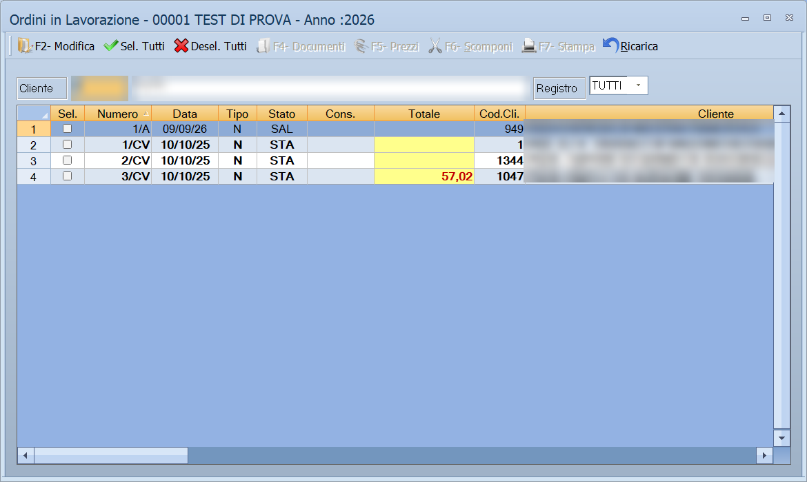

# Ordini in lavorazione e in ricezione

Un ordine registrato non è ancora finito: quello del cliente va evaso, quello
al fornitore va ricevuto. Due griglie seguono i due percorsi.

!!! info "In sintesi"

    - **Percorso:**
        - Menu ▸ Ordini ▸ Ordini da Clienti ▸ Ordini in Lavorazione
        - Menu ▸ Ordini ▸ Ordini a Fornitori ▸ Ordini in Ricezione
        - Menu ▸ Ordini ▸ Ordini a Fornitori ▸ Cancellazione Ordini Ricevuti
    - **Scorciatoia:** ++f2++ apre la riga, ++esc++ esce
    - **Permessi richiesti:** nessun profilo predefinito; le singole voci di menu si abilitano per ogni utente da [Archivi ▸ Utenti](../anagrafiche/utenti.md)

---

## A cosa serve

| Voce di menu | A cosa serve |
|---|---|
| **Ordini in Lavorazione** | L'elenco degli ordini dei clienti ancora da evadere, con tutto quello che serve per portarli a documento: attribuzione di lotti o partite, emissione dei documenti, controllo dei prezzi, scomposizione. |
| **Ordini in Ricezione** | L'elenco degli ordini fatti ai fornitori in attesa di arrivo. La finestra si chiama *Ordini da Ricevere*. |
| **Cancellazione Ordini Ricevuti** | Toglie dall'archivio gli ordini a fornitore completamente evasi. |

## Prerequisiti

Prima di usare queste griglie occorre avere gli ordini in archivio, inseriti
dalla [maschera dei documenti](../vendite/documento-di-vendita.md) o arrivati
dallo [scambio con l'esterno](scambio-ordini.md).

Per emettere i documenti dagli ordini in lavorazione, gli ordini devono essere
**confermati**: su un ordine non confermato i comandi si rifiutano di lavorare.

## La maschera

Entrambe hanno la stessa forma: in alto i filtri, poi una barra di avanzamento
e sotto la griglia. Il titolo di **Ordini in Lavorazione** riporta la ditta e
l'anno di lavoro — *Ordini in Lavorazione - 00001 NOME DITTA - Anno :2026*.

## Campi

### Ordini in Lavorazione

| Campo | Obbl. | Descrizione | Valori ammessi |
|---|:---:|---|---|
| **Cliente** | | Restringe agli ordini di un cliente. A fianco compare la ragione sociale. | codice |
| **Registro** | | Restringe a un registro di numerazione. | `TUTTI` o una voce dell'elenco |

{: .campi }

Le colonne della griglia sono **Sel.**, **Codice**, **Numero**, **Data**,
**Tipo**, **Stato**, **Cons.**, **Totale**, **Cod.Cli.**, **Cliente**,
**Destinazione**, **Agente**, **Trasportatore** e **anno**. La prima colonna è
la casella con cui si scelgono le righe su cui agire.

### Ordini in Ricezione

| Campo | Obbl. | Descrizione | Valori ammessi |
|---|:---:|---|---|
| **Fornitore** | | Restringe agli ordini fatti a un fornitore. A fianco compare la ragione sociale. | codice |

{: .campi }

Le colonne sono **Codice**, **Anno**, **Numero**, **Data**, **Tipo**,
**Arrivo**, **Totale**, **Cod. For.** e **Fornitore**.

## Pulsanti e comandi

### Ordini in Lavorazione

| Comando | Scorciatoia | Effetto |
|---|---|---|
| **F2- Modifica** | ++f2++ | Apre l'ordine della riga corrente. |
| **Sel. Tutti** | | Spunta tutte le righe. |
| **Desel. Tutti** | | Toglie la spunta da tutte. |
| **F3- Lotti** *(o* **F3- Partite** *)* | ++f3++ | Attribuisce automaticamente lotti o partite agli ordini scelti. L'etichetta dipende da come è configurata la gestione. |
| **F4- Documenti** | ++f4++ | Emette i documenti di vendita dagli ordini scelti. |
| **F5- Prezzi** | ++f5++ | Apre il controllo dei prezzi dell'ordine. |
| **F6- Scomponi** | ++f6++ | Scompone l'ordine. |
| **F7- Stampa** | ++f7++ | Stampa quello che si vede. |
| **Ricarica** | | Rilegge gli ordini dall'archivio. |

### Ordini in Ricezione

| Comando | Scorciatoia | Effetto |
|---|---|---|
| **F2 - Apri** | ++f2++ | Apre l'ordine della riga corrente. |
| **F3 - Ricarica** | ++f3++ | Rilegge gli ordini dall'archivio. |
| **F4 - Stampa** | ++f4++ | Stampa l'elenco. |

<!-- DA VERIFICARE: che cosa fa esattamente "F6- Scomponi" e in quali casi si usa. -->

## Come si fa

### Evadere gli ordini della giornata

1. Apri **Menu ▸ Ordini ▸ Ordini da Clienti ▸ Ordini in Lavorazione**.
2. Restringi per **Cliente** o per **Registro** se serve.
3. Spunta gli ordini da evadere, o premi **Sel. Tutti**.
4. Se la merce è a lotti o a partite, premi prima **F3** per attribuirli.
5. Premi **F4- Documenti**: Facile genera i documenti di vendita.

### Vedere cosa deve ancora arrivare da un fornitore

1. Apri **Menu ▸ Ordini ▸ Ordini a Fornitori ▸ Ordini in Ricezione**.
2. Indica il **Fornitore**.
3. La colonna **Arrivo** dice quando la merce è attesa.

### Ripulire gli ordini a fornitore già arrivati

1. **Fai una copia di sicurezza degli archivi.**
2. Apri **Menu ▸ Ordini ▸ Ordini a Fornitori ▸ Cancellazione Ordini
   Ricevuti**.
3. Rispondi **Sì** alle due domande di conferma.

## Controlli e messaggi

| Messaggio | Causa | Cosa fare |
|---|---|---|
| *Devi selezionare un solo ordine!* | Il comando lavora su una riga sola e ne hai spuntate più d'una. | Lascia la spunta su una sola riga. |
| *Devi selezionare almeno un ordine!* | Nessuna riga è spuntata. | Spunta le righe su cui vuoi agire. |
| *Ordine non Trovato in Archivio!* | La riga della griglia non corrisponde più a un ordine. | Premi **Ricarica** e riprova. |
| *L'ordine non é stato ancora confermato!* | Si stanno emettendo documenti da un ordine non confermato. | Apri l'ordine e confermalo. |
| *Non possono essere elaborati ordini non confermati!* | Fra le righe scelte c'è un ordine non confermato. | Togli la spunta a quelle righe o conferma gli ordini. |
| *Non possono essere elaborati ordini confermati o parzialmente evasi!* | Il comando vale solo su ordini ancora intatti. | Scegli altre righe. |
| *Operazione non consentita su Ordine parzialmente evaso!* | L'ordine è già stato evaso in parte. | Lavora sul documento già emesso. |
| *Operazione non consentita per lo stato dell' Ordine!* | Lo stato dell'ordine non ammette il comando. | Guarda la colonna **Stato**. |
| *Non é possibile emettere documenti per questo tipo di ordine!* | L'ordine è di un genere che non genera documenti. | Nessuna azione: è così per costruzione. |
| *Quantità inferiori a zero escluse dal corpo del documento!* | L'ordine ha righe con quantità negativa. | Sono state saltate: controlla il documento generato. |
| *Documento non modificabile !* | Il documento generato è già chiuso. | Non si corregge da qui. |
| *Impossibile elaborare i documenti!* / *Impossibile elaborare il documento!* | L'elaborazione non è andata a buon fine. | Riprova; se insiste, segnala all'assistenza. |
| *Errore su cancellazione movimenti dell' ordine! Segnalare il problema all' assistenza e annullare l' ordine!* | I movimenti di magazzino dell'ordine non si sono potuti togliere. | Annulla l'ordine e chiama l'assistenza: gli archivi restano disallineati. |
| *Vuoi calcolare l' Iva sulla Fattura Pro Forma ?* | Si sta generando una pro forma. | **Sì** per l'IVA in fattura, **No** per lasciarla fuori. |
| *Vuoi Cancellare gli Ordini Ricevuti ?* poi *Confermi la Cancellazione degli Ordini ?* | Hai avviato la cancellazione degli ordini ricevuti. | Rispondi **Sì** a entrambe solo se sei sicuro. La risposta preimpostata è **No**. |

## Note

!!! warning "La cancellazione è definitiva"

    **Cancellazione Ordini Ricevuti** toglie dall'archivio tutti gli ordini a
    fornitore in stato *evaso*, senza mostrare prima quali sono e senza
    possibilità di tornare indietro. Stampa l'elenco da **Ordini in Ricezione**
    e fai una copia degli archivi prima di lanciarla.

!!! note "Due domande, e la seconda non è una formalità"

    Sia questa cancellazione sia quella degli ordini evasi chiedono conferma
    due volte, con il pulsante **No** già scelto: è voluto, per non cancellare
    per sbaglio premendo Invio.

## Vedi anche

- [Gestione documenti](../vendite/gestione-documenti.md)
- [Inserimento e Modifica documenti](../vendite/documento-di-vendita.md)
- [Ordini clienti](../vendite/ordini-clienti.md)
- [Scambio degli ordini con l'esterno](scambio-ordini.md)
