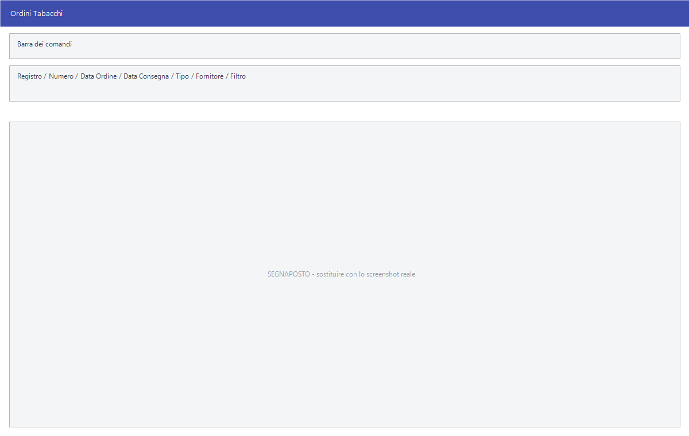

# Ordini tabacchi

L'ordine dei tabacchi non si compila come gli altri: le quantità sono in
chilogrammi, si ordina su un listino fisso e la quantità da chiedere si ricava
dal venduto e dalle scorte. Facile ha per questo una maschera a sé, che compila
la griglia da sola e poi si fa correggere a mano.

!!! info "In sintesi"

    - **Percorso:**
        - Menu ▸ Ordini ▸ Ordini da Clienti ▸ Inserimento Ordini Tabacchi Patentini
        - Menu ▸ Ordini ▸ Ordini a Fornitori ▸ Inserimento Ordini Tabacchi
        - Menu ▸ Ordini ▸ Ordini a Fornitori ▸ Inserimento Ordini Tabacchi da Inalazione
    - **Scorciatoia:** ++f2++ salva, ++f3++ – ++f7++ i comandi della barra, ++esc++ esce
    - **Permessi richiesti:** nessun profilo predefinito; le singole voci di menu si abilitano per ogni utente da [Archivi ▸ Utenti](../anagrafiche/utenti.md)

---

## A cosa serve

La finestra si chiama **Ordini Tabacchi**; aperta da *Inserimento Ordini
Tabacchi da Inalazione* prende invece il titolo **Ordine Tabacchi da
Inalazione**.

| Voce di menu | Cosa cambia |
|---|---|
| **Inserimento Ordini Tabacchi Patentini** | L'ordine è verso il cliente: il campo del soggetto si chiama **Cliente** e il pulsante F6 diventa **F6 - Stampa**. |
| **Inserimento Ordini Tabacchi** | L'ordine è verso il fornitore, con l'invio del fax U88. |
| **Inserimento Ordini Tabacchi da Inalazione** | Come sopra, ma per i prodotti da inalazione. |

## Prerequisiti

Prima di compilare un ordine tabacchi occorre:

- avere gli [articoli](../anagrafiche/anagrafica-articoli.md) dei tabacchi in
  archivio, con **scorta minima** e **scorta massima** compilate: sono i due
  valori su cui lavorano l'adeguamento alle scorte e i filtri della griglia
  (vedi [Scorte, assortimento e ubicazioni](../anagrafiche/scorte-e-assortimento.md));
- avere il [fornitore](../anagrafiche/anagrafica-fornitori.md) — o il
  [cliente](../anagrafiche/anagrafica-clienti.md) per l'ordine patentini;
- per l'invio al logista, il modello `logista.xls` nella cartella `template`
  del programma.

## La maschera

In alto gli estremi dell'ordine — registro, numero, le due date, il tipo e il
soggetto — poi il **Filtro** che decide quali righe restano a vista, e sotto la
griglia degli articoli, divisa in più fogli. In fondo la riga dei totali, in
evidenza, e la barra dei pulsanti.

## Campi

| Campo | Obbl. | Descrizione | Valori ammessi |
|---|:---:|---|---|
| **Registro** | | Il registro su cui numerare l'ordine. | voce dell'elenco |
| **Numero** | ● | Numero dell'ordine. | numero |
| **Data Ordine** | ● | La data dell'ordine. | data |
| **Data Consegna** | | Quando la merce è attesa. | data |
| **Tipo** | | Il genere di ordine. | `O`, `S`, `SPECIALE`, `M`, `URGENTE` |
| **Fornitore** | ● | Il soggetto dell'ordine. Nell'ordine patentini l'etichetta è **Cliente**. | codice |
| **Filtro** | | Quali righe della griglia restare a vedere. Non cambia l'ordine, solo la vista. | `TUTTE LE RIGHE`, `SOLO RIGHE CON QUANTITA'`, `SOLO RIGHE SOTTOSCORTA`, `SOLO RIGHE SOPRASCORTA` |

{: .campi }

Le colonne della griglia sono **Codice**, **Descrizione**, **Q.tà (Kg)**,
**Q.tà Pat. (Kg)**, **Prezzo (Kg)**, **Totale**, **Min Riord. (Kg.)**,
**Cod.Num**, **Scorta Min (Kg.)**, **Scorta Max (Kg.)**, **Cod. Iva**,
**Esistenza (Kg.)**, **D INS** e **T INS**. Si scrive nelle due colonne delle
quantità; le altre sono di lettura.

<!-- DA VERIFICARE: cosa significano le voci "O", "S" e "M" dell'elenco Tipo: a video compaiono come lettere sole, accanto a SPECIALE e URGENTE che sono per esteso. -->

!!! note "«Min Riord.» e «Scorta Min» non sono la stessa cosa"

    **Min Riord. (Kg.)** è il **lotto minimo di riordino** dell'articolo — la
    quantità sotto la quale il fornitore non serve l'ordine — convertita in
    chilogrammi. **Scorta Min (Kg.)** è la **scorta minima** impostata
    sull'articolo per quel deposito, sempre in chili: è la soglia sotto la quale
    non si vuole scendere a magazzino.

    Il filtro `SOLO RIGHE SOTTOSCORTA` lavora sulla seconda; è dalla prima che
    dipende invece quanto si è obbligati a ordinare per volta.

    Le colonne **D INS** e **T INS** riportano data e ora in cui la riga è stata
    inserita nell'ordine.

## Pulsanti e comandi

| Comando | Scorciatoia | Effetto |
|---|---|---|
| **F2 - Salva** | ++f2++ | Salva l'ordine. |
| **F3 - Acquisiz.** | ++f3++ | Ricava le quantità dal venduto di un periodo. Se ci sono già quantità inserite chiede *Vuoi azzerare le quantità inserite prima dell' acquisizione ?* |
| **F4 - Scorta** | ++f4++ | Adegua le quantità alle scorte: risponde **Sì** per la scorta minima, **No** per la massima. |
| **F5 - Patent.** | ++f5++ | Riempie la colonna **Q.tà Pat. (Kg)** dagli ordini patentini di un periodo, che chiede nella finestra *Periodo Ordini Patentini*. |
| **F6 - Fax U88** | ++f6++ | Produce il fax U88 per il fornitore. Nell'ordine patentini il pulsante è **F6 - Stampa**. |
| **F7 - Logista** | ++f7++ | Genera il foglio Excel per il logista dal modello `logista.xls`. |
| **Esci** | ++esc++ | Chiude senza salvare. |

## Come si fa

### Preparare l'ordine mensile al fornitore

1. Apri **Menu ▸ Ordini ▸ Ordini a Fornitori ▸ Inserimento Ordini Tabacchi**.
2. Compila **Data Ordine**, **Data Consegna** e il **Fornitore**.
3. Premi **F3 - Acquisiz.** e indica il periodo di vendita da cui partire: la
   colonna **Q.tà (Kg)** si riempie con quello che è stato venduto.
4. Premi **F4 - Scorta** e rispondi **Sì** per portare tutte le righe almeno
   alla scorta minima.
5. Metti **Filtro** su `SOLO RIGHE CON QUANTITA'` e ricontrolla riga per riga
   quello che stai per ordinare.
6. Premi **F2 - Salva**, poi **F6 - Fax U88** per il fornitore e **F7 -
   Logista** per il foglio da consegnare al logista.

### Aggiungere le quantità dei patentini

1. Apri l'ordine e premi **F5 - Patent.**.
2. Indica il periodo nella finestra *Periodo Ordini Patentini*.
3. La colonna **Q.tà Pat. (Kg)** si riempie con quanto ordinato dai patentini,
   che si somma alle quantità proprie.

### Vedere solo quello che è sotto scorta

Metti **Filtro** su `SOLO RIGHE SOTTOSCORTA`: restano a vista le righe in cui
quantità ordinata più esistenza non arrivano alla scorta minima.

## Controlli e messaggi

| Messaggio | Causa | Cosa fare |
|---|---|---|
| *Vuoi azzerare le quantità inserite prima dell' acquisizione ?* | Premendo **F3 - Acquisiz.** o **F5 - Patent.** ci sono già quantità in griglia. | **Sì** per ripartire da zero, **No** per sommare all'esistente. |
| *Se vuoi adeguare alla Scorta Minima scegli SI. Se Vuoi adeguare alla Scorta Massima scegli NO.* | Hai premuto **F4 - Scorta**. | Scegli il livello a cui adeguare, oppure **Annulla**. |
| *Impossibile allocare la memoria!* | Il foglio per il logista non si è potuto creare. | Chiudi qualche programma e riprova. |
| *Impossibile allocare il foglio di lavoro!* | Il modello `logista.xls` non ha il foglio atteso. | Controlla il modello nella cartella `template`. |
| *Codice articolo non valido all riga N ! Generazione file interrotta.* | Una riga dell'ordine ha un codice che il tracciato del logista non accetta. | Correggi il codice dell'articolo. Il messaggio contiene un refuso: *all riga* invece di *alla riga*. |

## Note

!!! note "Le quantità sono in chilogrammi"

    Tutte le colonne delle quantità e delle scorte sono espresse in
    chilogrammi, non in pezzi né in stecche: leggile con questo metro quando le
    confronti con l'anagrafica articoli.

!!! warning "Il filtro non toglie righe dall'ordine"

    **Filtro** cambia solo quello che si vede. Le righe nascoste restano
    nell'ordine con la quantità che hanno: metti `TUTTE LE RIGHE` prima di
    salvare se vuoi essere sicuro di cosa stai mandando.

<!-- DA VERIFICARE: che aspetto ha il fax U88 e come viene inviato — se in stampa, per posta o su file. -->

!!! note "Dove finisce il foglio per il logista"

    **F7 - Logista** legge il modello `template\logista.xls` della cartella del
    programma e scrive il risultato in `out`, con un nome che riporta numero e
    data dell'ordine — per esempio `ordine_147_del_08-09-2026.xls`, con il
    registro aggiunto al numero quando c'è. Il foglio contiene, per ogni riga
    ordinata, il codice e la quantità complessiva (quantità propria più
    quantità patentini).

## Vedi anche

- [Inserimento e Modifica documenti](../vendite/documento-di-vendita.md)
- [Gestione documenti](../vendite/gestione-documenti.md)
- [Anagrafica articoli](../anagrafiche/anagrafica-articoli.md)
- [Scorte, assortimento e ubicazioni](../anagrafiche/scorte-e-assortimento.md)
