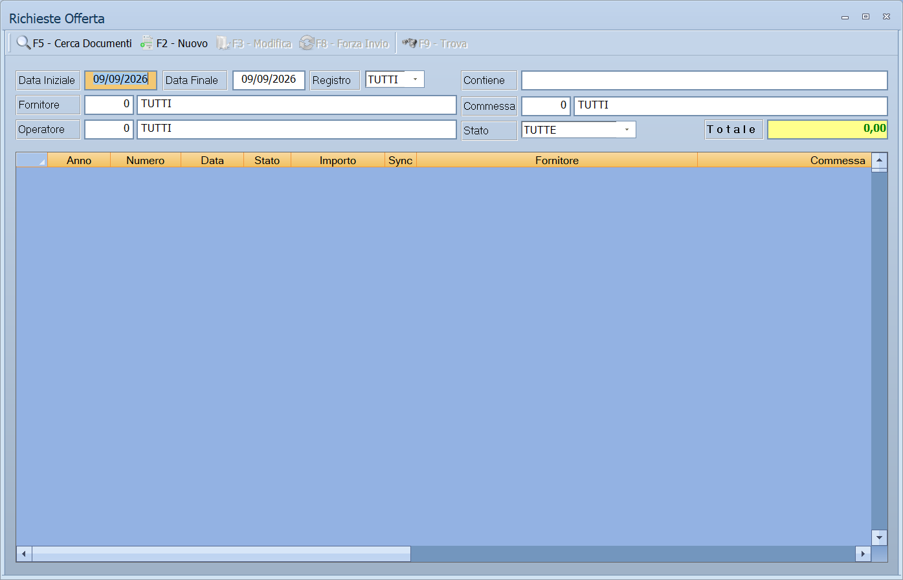

# Richieste offerta

Prima di ordinare si può chiedere. La **richiesta offerta** è il documento con
cui si domanda al fornitore a che condizioni fornirebbe una certa merce: non
impegna, non muove il magazzino, ma resta in archivio e — quando l'offerta va
bene — si trasforma in ordine senza doverla riscrivere.

!!! info "In sintesi"

    - **Percorso:**
        - Menu ▸ Ordini ▸ Richieste Offerta ▸ Gestione
        - Menu ▸ Ordini ▸ Richieste Offerta ▸ Inserimento Richiesta Offerta
        - Menu ▸ Ordini ▸ Richieste Offerta ▸ Modifica Richieste Offerta
        - Menu ▸ Ordini ▸ Richieste Offerta ▸ Stampa Riepilogo Richieste Offerta
        - Menu ▸ Ordini ▸ Richieste Offerta ▸ Duplica
        - Menu ▸ Ordini ▸ Richieste Offerta ▸ Genera Ordine a Fornitore
    - **Scorciatoia:** ++f2++ salva, ++esc++ esce
    - **Permessi richiesti:** nessun profilo predefinito; le singole voci di menu si abilitano per ogni utente da [Archivi ▸ Utenti](../anagrafiche/utenti.md)

---

## A cosa serve

| Voce di menu | A cosa serve | Dove è descritta |
|---|---|---|
| **Gestione** | L'elenco delle richieste offerta, con i filtri e i comandi per aprirle. | [Gestione documenti](../vendite/gestione-documenti.md) |
| **Inserimento Richiesta Offerta** | Compila una nuova richiesta. | [Inserimento e Modifica documenti](../vendite/documento-di-vendita.md) |
| **Modifica Richieste Offerta** | Riapre l'ultima richiesta per correggerla. | [Inserimento e Modifica documenti](../vendite/documento-di-vendita.md) |
| **Stampa Riepilogo Richieste Offerta** | L'elenco delle richieste di un periodo. | [Riepiloghi e statistiche](../vendite/riepiloghi-e-statistiche.md) |
| **Duplica** | Rifà una richiesta partendo da una già fatta. | [Esportazione, duplicazione e ricezione](../vendite/esporta-duplica-documenti.md) |
| **Genera Ordine a Fornitore** | Trasforma la richiesta in un ordine al fornitore. | vedi sotto |

La richiesta offerta è un documento come gli altri: si compila con la stessa
maschera dei [documenti](../vendite/documento-di-vendita.md), si consulta dalla
stessa [griglia](../vendite/gestione-documenti.md), si duplica allo stesso
modo. Cambia il tipo, e con esso il registro di numerazione e il fatto che il
documento non impegna né la merce né la contabilità.

## Prerequisiti

Prima di compilare una richiesta offerta occorre avere in archivio il
[fornitore](../anagrafiche/anagrafica-fornitori.md) e gli
[articoli](../anagrafiche/anagrafica-articoli.md) da chiedere.

## La maschera

Le richieste offerta non hanno maschere proprie: usano quelle dei documenti di
vendita, che aprono con il tipo *richiesta offerta* già impostato.

## Campi

Sono i campi del [documento](../vendite/documento-di-vendita.md): testata con
fornitore, date e registro, corpo con le righe degli articoli, piede con i
totali.

**Genera Ordine a Fornitore** apre invece la finestra della duplicazione, con
il documento di partenza e il registro di destinazione:

| Campo | Obbl. | Descrizione | Valori ammessi |
|---|:---:|---|---|
| **Numero Riferimento** | ● | La richiesta offerta da trasformare. | numero |
| **Registro** | ● | Il registro su cui nasce l'ordine a fornitore. | voce dell'elenco |

## Pulsanti e comandi

| Comando | Scorciatoia | Effetto |
|---|---|---|
| **F2 - OK** | ++f2++ | Genera l'ordine dalla richiesta. |
| **Esci** | ++esc++ | Chiude senza fare nulla. |

Per i comandi delle maschere dei documenti vedi
[Inserimento e Modifica documenti](../vendite/documento-di-vendita.md).

## Come si fa

### Chiedere un'offerta a un fornitore

1. Apri **Menu ▸ Ordini ▸ Richieste Offerta ▸ Inserimento Richiesta Offerta**.
2. Compila la testata con il fornitore e le date.
3. Metti nel corpo gli articoli e le quantità da chiedere.
4. Premi **F2 - Salva** e stampa la richiesta da mandare.

### Trasformare l'offerta accettata in un ordine

1. Apri **Menu ▸ Ordini ▸ Richieste Offerta ▸ Genera Ordine a Fornitore**.
2. In **Numero Riferimento** indica la richiesta.
3. Scegli il **Registro** degli ordini a fornitore.
4. Premi **F2 - OK**: nasce un ordine con le stesse righe, che si corregge
   dalla [gestione documenti](../vendite/gestione-documenti.md).

### Vedere le richieste ancora in sospeso

Apri **Menu ▸ Ordini ▸ Richieste Offerta ▸ Gestione** e usa i filtri della
griglia.

## Controlli e messaggi

La richiesta di offerta si compila nella stessa maschera del
[documento di vendita](../vendite/documento-di-vendita.md) e ne condivide i
messaggi. Quelli che si incontrano generando l'ordine:

| Messaggio | Causa | Cosa fare |
|---|---|---|
| *Il documento richiesto non esiste in archivio!* | Il numero della richiesta non corrisponde a niente. | Controlla anno, numero e registro. |
| *Il documento indicato è già presente in archivio!* | Il numero da dare all'ordine è già di un altro documento. | Scegli un numero libero. |
| *Ordine a Fornitore generato regolarmente!* | L'ordine è stato creato. | Nessuna azione. |
| *Confermi la rimozione del documento di riferimento ?* | Era attiva **Rimuovi Documento di Riferimento**. | **Sì** cancella la richiesta di offerta. La risposta preimpostata è **No**. |

| Messaggio | Causa | Cosa fare |
|---|---|---|
| *(nessun messaggio, solo un segnale acustico)* | Manca un campo obbligatorio. | Compila il campo su cui si è posizionato il cursore. |

## Note

!!! note "La richiesta resta, l'ordine è nuovo"

    **Genera Ordine a Fornitore** non consuma la richiesta: ne fa una copia di
    tipo diverso. La richiesta originale resta in archivio, e se la generi due
    volte ottieni due ordini.

!!! warning "La richiesta non viene marcata quando ne nasce l'ordine"

    **Genera Ordine a Fornitore** crea l'ordine e finisce lì: la richiesta di
    offerta resta **esattamente com'era**. Non cambia stato, non prende una data
    e non porta nessun riferimento all'ordine che ne è uscito.

    Vuol dire che **rigenerando la stessa richiesta si ottiene un secondo
    ordine**, e il programma non avverte: l'unico controllo è sul numero
    dell'ordine, che non può essere già usato.

    Tenere il conto di quali richieste sono già diventate ordini è quindi
    lavoro di chi le gestisce. Due strade pratiche:

    - spuntare **Rimuovi Documento di Riferimento**, che **cancella la
      richiesta** appena l'ordine è nato — netto, ma si perde la storia;
    - oppure lasciarla e annullarla a mano dalla sua maschera, così resta in
      archivio ma si distingue.

!!! note "Le richieste di offerta non entrano nelle stampe degli ordini"

    **Stampa Ordini per Articolo** esiste in due versioni — una per gli ordini
    dei clienti e una per gli ordini ai fornitori — e ciascuna guarda **solo
    il proprio tipo di documento**. Le richieste di offerta sono un tipo a
    sé e non compaiono in nessuna delle due.

    Per sapere che cosa si è chiesto e non è ancora diventato ordine, la
    strada è la [gestione documenti](../vendite/gestione-documenti.md) filtrata
    sulle richieste.

## Vedi anche

- [Inserimento e Modifica documenti](../vendite/documento-di-vendita.md)
- [Gestione documenti](../vendite/gestione-documenti.md)
- [Esportazione, duplicazione e ricezione dei documenti](../vendite/esporta-duplica-documenti.md)
- [Generazione degli ordini](generazione-ordini.md)
