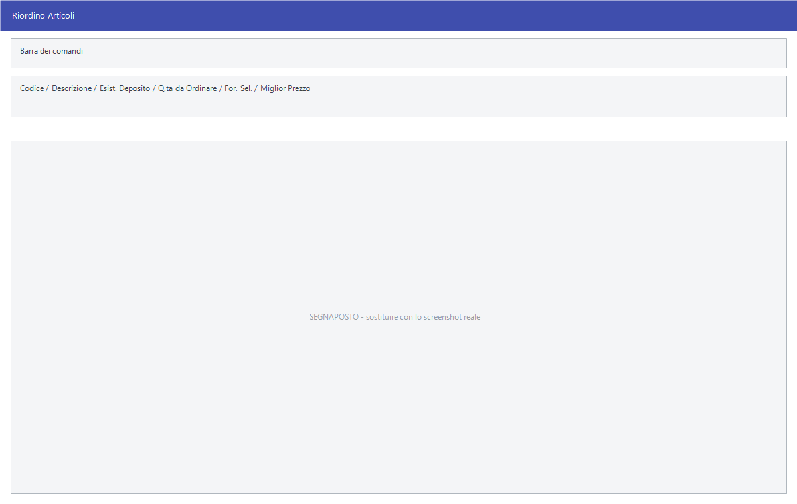

# Riordino articoli con analisi prezzi

Quando lo stesso articolo si può comprare da più fornitori, la domanda non è
solo *quanto ordinare* ma *a chi*. Questa maschera mette i fornitori uno
accanto all'altro, colonna per colonna, evidenzia il prezzo migliore e poi
genera un ordine per ciascuno.

!!! info "In sintesi"

    - **Percorso:** Menu ▸ Ordini ▸ Ordini a Fornitori ▸ Generazione Ordini con Analisi Prezzi
    - **Scorciatoia:** ++f2++ cerca, ++f4++ – ++f9++ i comandi della barra, ++esc++ esce
    - **Permessi richiesti:** nessun profilo predefinito; la voce di menu si abilita per ogni utente da [Archivi ▸ Utenti](../anagrafiche/utenti.md)

---

## A cosa serve

È la maschera del **riordino ragionato**: si scelgono i fornitori da mettere a
confronto, si scelgono gli articoli, e la griglia mostra per ogni articolo il
prezzo di ciascun fornitore, l'ultimo prezzo pagato e il migliore fra quelli in
tabella. Si decide riga per riga a chi ordinare, e alla fine Facile scrive un
ordine per fornitore.

Dalla stessa maschera si può anche generare un listino di vendita partendo dal
miglior prezzo d'acquisto trovato, esportare e reimportare la tabella in Excel,
o riempirla con i dati letti da un terminalino.

## Prerequisiti

Prima di usare questa maschera occorre:

- avere i [listini fornitori](../listini-fornitori/gestione-listini-fornitori.md)
  compilati: sono loro a dare i prezzi che la griglia confronta;
- avere i [depositi](../magazzino/depositi.md) in archivio — se ne esiste più
  d'uno Facile chiede su quale lavorare prima di aprire la maschera;
- per la colonna **Ordinata CE.DI.**, avere il deposito CE.DI. impostato nei
  [parametri della ditta](../anagrafiche/ditte.md) e il fornitore su quel
  deposito.

## La maschera

Se i depositi sono più d'uno, prima si apre l'elenco da cui sceglierne uno; poi
si apre **Riordino Articoli**: la barra dei comandi in alto e una griglia
larga, in cui alle colonne fisse se ne aggiunge una per ogni fornitore messo a
confronto.

Le colonne fisse sono **Codice**, **Descrizione**, **Esist. Deposito**,
**Esist. Totale**, **Q.ta da Ordinare**, **Conf. da Ordinare**, **Ordinata
CE.DI.**, **Scorta Min.**, **Min. Riordino**, **For. Sel.**, **Ult. Prezzo
Acq.** e **Miglior Prezzo**. In **For. Sel.** si indica a chi va la riga.

## Campi

La maschera non ha campi da compilare in testata: si lavora dentro la griglia.
Le celle che si scrivono sono **Q.ta da Ordinare**, **Conf. da Ordinare** e
**For. Sel.**; il resto è di lettura.

Un doppio clic su una riga apre la finestra **Riordino Articolo**, dove la
stessa riga si compila con calma:

| Campo | Obbl. | Descrizione | Valori ammessi |
|---|:---:|---|---|
| **Articolo** | ● | L'articolo della riga. | codice |
| **Fornitore** | ● | Il fornitore a cui ordinarlo. | codice |
| **Ult. Pr. Acquisto** | | L'ultimo prezzo pagato, a titolo di riferimento. | importo |
| **Pezzi x Confezione** | | Quanti pezzi contiene una confezione. | numero |
| **Prezzo** | | Il prezzo d'acquisto da applicare. | importo |
| **Q.tà da Ordinare** | | Quanto ordinare, in pezzi. | quantità |
| **Confez. da Ordinare** | | Quanto ordinare, in confezioni. Le due quantità si tengono allineate. | quantità |

{: .campi }

## Pulsanti e comandi

| Comando | Scorciatoia | Effetto |
|---|---|---|
| **F2 - Cerca** | ++f2++ | Estrae dal database gli articoli che soddisfano i criteri impostati e li porta in griglia. |
| **Articolo** | | Aggiunge un singolo articolo alla griglia. |
| **F4 - Sel. Fornitori** | ++f4++ | Sceglie i fornitori da mettere a confronto: ognuno diventa una colonna. |
| **F5 - Esporta** | ++f5++ | Esporta i dati su un file Excel. |
| **F6 - Pulisci tabella** | ++f6++ | Svuota la griglia. Chiede conferma. |
| **F7 - Genera Ordini** | ++f7++ | Genera automaticamente gli ordini, uno per fornitore. |
| **F8 - Gen. Listino** | ++f8++ | Apre *Genera Listino da Miglior Prezzo*, che costruisce un listino di vendita dal miglior prezzo d'acquisto. |
| **F9 - Importa Ordine** | ++f9++ | Importa le quantità da un foglio Excel. |
| **Dati** | | Apre un menu con i terminalini di raccolta supportati — **EIA Thunder**, **BCP8000 - ET8000**, **DENSO - N661** — e importa i codici letti. |
| **Trova** | | Cerca dentro la griglia. |
| **Rimuovi Forn.** | | Toglie dal confronto un fornitore, con la sua colonna. Chiede conferma. |
| **Esci** | ++esc++ | Chiude la maschera. |

### Genera Listino da Miglior Prezzo

| Campo | Obbl. | Descrizione | Valori ammessi |
|---|:---:|---|---|
| **Listino** | ● | Il [listino di vendita](../listini-vendita/gestione-listini.md) da scrivere. | codice |
| **Ricarico** | | La percentuale da applicare al prezzo d'acquisto. | percentuale |
| **Arrotondamento** | | Come arrotondare il prezzo ottenuto. | `NESSUNO`, `MILLESIMI`, `CENTESIMI`, `DECIMI`, `EURO` |
| **Decorrenza** | | Da quando vale il nuovo prezzo. | data |

{: .campi }

## Come si fa

### Confrontare i fornitori e ordinare al migliore

1. Apri **Menu ▸ Ordini ▸ Ordini a Fornitori ▸ Generazione Ordini con Analisi
   Prezzi**; se i depositi sono più d'uno, scegli quello su cui lavorare.
2. Premi **F4 - Sel. Fornitori** e scegli i fornitori da confrontare: senza
   questo passo la ricerca si rifiuta di partire.
3. Premi **F2 - Cerca** e scegli gli articoli.
4. Guarda la griglia: la colonna del fornitore più conveniente è **già
   evidenziata**, **Miglior Prezzo** ne riporta il valore e **For. Sel.** arriva
   **già compilato** con quel fornitore. **Ult. Prezzo Acq.** dice cosa hai
   pagato l'ultima volta.
5. Riga per riga compila **Q.ta da Ordinare** (o **Conf. da Ordinare**), e
   cambia il fornitore in **For. Sel.** solo dove non vuoi seguire il prezzo
   migliore.
6. Premi **F7 - Genera Ordini**: prima compare l'**Anteprima Ordini per
   Fornitore** con codice, fornitore, quantità e valore di ciascun ordine;
   confermando, gli ordini vengono scritti.

### Aggiornare i prezzi d'acquisto e il fornitore abituale

Dopo aver fatto il confronto, Facile può riportare quanto trovato in
anagrafica: alla domanda *Vuoi aggiornare gli ultimi prezzi di acquisto ed il
fornitore abituale?* rispondi **Sì** per allineare gli
[articoli](../anagrafiche/anagrafica-articoli.md).

### Fare il listino di vendita dal miglior acquisto

1. Con la griglia compilata, premi **F8 - Gen. Listino**.
2. Indica il **Listino** da scrivere, il **Ricarico**, l'**Arrotondamento** e
   la **Decorrenza**.
3. Premi **F2 - OK**: i prezzi di vendita nascono dal miglior prezzo
   d'acquisto trovato.

### Riempire la tabella con un terminalino

1. Premi **Dati**.
2. Alla domanda *Se i valori da acquisire indicano il numero di confezioni
   scegliere "SI" / Se indicano la quantita' scegliere "NO"* rispondi secondo
   come è stato letto.

## Controlli e messaggi

| Messaggio | Causa | Cosa fare |
|---|---|---|
| *E' necessario selezionare almeno un fornitore!* | Hai premuto **F2 - Cerca** senza aver scelto i fornitori. | Premi prima **F4 - Sel. Fornitori**. |
| *Ci sono righe con presente la quantita' ma senza fornitore!* | Una riga ha la quantità ma **For. Sel.** vuoto. | Facile si posiziona sulla riga: indica il fornitore. |
| *Non ci sono ordini da generare!* | Nessuna riga ha una quantità da ordinare. | Compila le quantità. |
| *Sono stati correttamente generati N ordini!* | La generazione è andata a buon fine. | Controlla gli ordini dalla [gestione documenti](../vendite/gestione-documenti.md). |
| *Confermi la pulizia della tabella ?* | Hai premuto **F6 - Pulisci tabella**. | **Sì** svuota la griglia e perde quanto hai impostato. |
| *Confermi la rimozione del fornitore …?* | Hai premuto **Rimuovi Forn.**. | **Sì** toglie la colonna dal confronto. |
| *Vuoi aggiornare gli ultimi prezzi di acquisto ed il fornitore abituale?* | Facile propone di riportare i dati in anagrafica. | **Sì** aggiorna gli articoli, **No** lascia tutto com'è. |
| *Deposito CE.DI. non impostato o non valido!* / *Fornitore Deposito CE.DI. non impostato o non valido!* | Manca la configurazione del deposito centrale. | Sistemala nei [parametri della ditta](../anagrafiche/ditte.md) e sul [deposito](../magazzino/depositi.md). |
| *Impossibile trovare la colonna CODICE!* | Il foglio Excel da importare non ha la colonna attesa. | Correggi le intestazioni del foglio. |
| *Deve essere presente almeno una tra le colonne CARTONI o QUANTITA!* | Il foglio non dice quanto ordinare. | Aggiungi una delle due colonne. |
| *Impossibile aprire il template!* / *Impossibile salvare il file!* | L'esportazione in Excel non è riuscita. | Controlla che il file non sia già aperto e che la cartella sia scrivibile. |
| *Vuoi inviare l'ordine sul canale EDI ?* | Facile propone l'invio elettronico dell'ordine. | **Sì** solo se il canale EDI è configurato. |
| *Partita IVA non impostata su configurazione Ditta!* / *Partita IVA non impostata sul fornitore!* | Manca un dato obbligatorio per l'invio EDI. | Compila la partita IVA sulla [ditta](../anagrafiche/ditte.md) o sul [fornitore](../anagrafiche/anagrafica-fornitori.md). |
| *Nell' ordine sono presenti articoli appartenenti a piu' marchi! Impossibile proseguire con l'esportazione!* | L'invio EDI vuole un solo marchio per ordine. | Genera ordini separati per marchio. |

## Note

!!! note "Prima i fornitori, poi gli articoli"

    L'ordine dei passi non è indifferente: le colonne dei prezzi nascono dalla
    scelta dei fornitori, quindi **F4** viene sempre prima di **F2**. Facile lo
    ricorda con un messaggio, ma è più comodo prenderci l'abitudine.

!!! warning "«Pulisci tabella» non si annulla"

    **F6 - Pulisci tabella** svuota tutto quello che hai impostato — quantità,
    fornitori scelti, prezzi corretti a mano — e non c'è modo di recuperarlo.

!!! note "Come viene scelto il «Miglior Prezzo»"

    È il **prezzo più basso fra quelli diversi da zero**: un fornitore che per
    quell'articolo non ha un prezzo in listino viene semplicemente saltato, non
    conta come «prezzo zero».

    A parità di prezzo vince il fornitore **più a sinistra**, cioè il primo
    nell'ordine in cui li hai scelti con **F4 - Sel. Fornitori**. Se due
    fornitori praticano lo stesso prezzo e preferisci l'altro, cambialo a mano
    in **For. Sel.**

    Trovato il migliore, Facile evidenzia la sua colonna, scrive il valore in
    **Miglior Prezzo** e **compila da sé For. Sel.**: la scelta è già fatta, e
    va corretta solo dove non la si vuole seguire.

!!! warning "Se «F7 - Genera Ordini» sembra non fare nulla"

    Quando nessuna riga ha una quantità da ordinare il programma avvisa con
    *Non ci sono ordini da generare!*. C'è però un caso in cui **non compare
    alcun messaggio** e la maschera resta com'è: succede quando la generazione
    non trova fornitori da servire. Se premendo **F7** non accade niente,
    controlla che le righe con quantità abbiano il **For. Sel.** compilato.

## Vedi anche

- [Generazione degli ordini](generazione-ordini.md)
- [Gestione listini fornitori](../listini-fornitori/gestione-listini-fornitori.md)
- [Analisi fornitore](../listini-fornitori/analisi-fornitore.md)
- [Scorte, assortimento e ubicazioni](../anagrafiche/scorte-e-assortimento.md)
