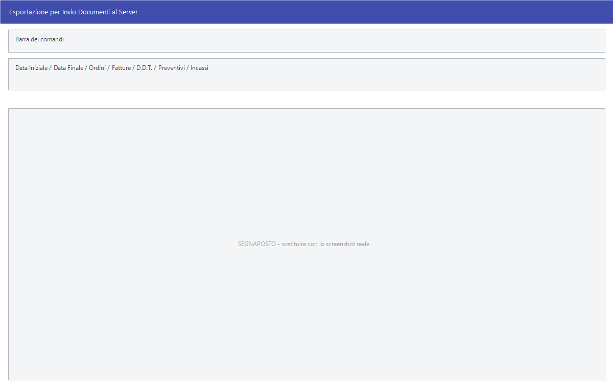

# Scambio degli ordini con l'esterno

Gli ordini non nascono sempre in sede: l'agente li raccoglie in giro, il punto
vendita li manda alla centrale, un cliente li spedisce in un file. Queste voci
sono le porte da cui entrano ed escono.

!!! info "In sintesi"

    - **Percorso:**
        - Menu ▸ Ordini ▸ Ordini da Clienti ▸ Invio Ordini al Server
        - Menu ▸ Ordini ▸ Ordini da Clienti ▸ Ricezione Ordini da Facile Mobile
        - Menu ▸ Ordini ▸ Ordini da Clienti ▸ Ricezione Ordini dal Server FTP
        - Menu ▸ Ordini ▸ Ordini da Clienti ▸ Carica Ordini da Files
    - **Scorciatoia:** ++f2++ avvia, ++esc++ esce
    - **Permessi richiesti:** nessun profilo predefinito; le singole voci di menu si abilitano per ogni utente da [Archivi ▸ Utenti](../anagrafiche/utenti.md)

---

## A cosa serve

| Voce di menu | A cosa serve |
|---|---|
| **Invio Ordini al Server** | Prepara ed esporta i documenti da mandare al server centrale. La finestra si chiama *Esportazione per Invio Documenti al Server* e non manda solo gli ordini: si sceglie cosa comprendere. |
| **Ricezione Ordini da Facile Mobile** | Porta in archivio gli ordini raccolti dagli agenti con Facile Mobile. |
| **Ricezione Ordini dal Server FTP** | Scarica dal server FTP, agente per agente, i documenti lasciati lì e li carica. |
| **Carica Ordini da Files** | Carica un ordine da un file già in mano, scegliendolo da disco. |

## Prerequisiti

Prima di scambiare ordini occorre:

- per l'**invio al server** e per la **ricezione FTP**, avere il server FTP
  configurato nei [parametri della ditta](../anagrafiche/ditte.md) — indirizzo,
  utente e password — e gli [agenti](../anagrafiche/anagrafica-agenti.md) in
  archivio, perché ciascuno ha la propria cartella remota;
- per **Facile Mobile**, avere in `cfg` il file di configurazione
  `imp_mobile_NNNNN.ini` della ditta, e avere impostati i conti di **cassa** e
  di **banca** nei parametri contabili: senza quelli l'importazione si ferma
  subito;
- per **Carica Ordini da Files**, avere il file, il cui nome deve cominciare
  per `ORD` o per `OFO` ed essere in formato `.rsa` o `.zip`.

## La maschera

**Invio Ordini al Server** è una finestra di selezione con il periodo, le
caselle dei tipi di documento e i pulsanti **F2 - OK** ed **Esci**. Le
ricezioni non hanno una maschera propria: chiedono conferma, poi mostrano
l'avanzamento.

## Campi

### Invio Ordini al Server

| Campo | Obbl. | Descrizione | Valori ammessi |
|---|:---:|---|---|
| **Data Iniziale**, **Data Finale** | ● | Il periodo dei documenti da mandare. | date |
| **Ordini**, **Fatture**, **D.D.T.**, **Preventivi**, **Incassi** | | Quali tipi di documento comprendere nell'invio. | attivo/non attivo |
| **Messaggi** | | Comprende anche i messaggi. | attivo/non attivo |

{: .campi }

## Pulsanti e comandi

| Comando | Scorciatoia | Effetto |
|---|---|---|
| **F2 - OK** | ++f2++ | Avvia l'esportazione. |
| **Esci** | ++esc++ | Chiude senza fare nulla. |

## Come si fa

### Mandare al server quello che è stato fatto oggi

1. Apri **Menu ▸ Ordini ▸ Ordini da Clienti ▸ Invio Ordini al Server**.
2. Indica **Data Iniziale** e **Data Finale**.
3. Spunta i tipi di documento da comprendere.
4. Premi **F2 - OK**.

### Raccogliere gli ordini degli agenti dal server FTP

1. Apri **Ricezione Ordini dal Server FTP**.
2. Alla domanda *Vuoi Collegarti al server FTP ?* rispondi **Sì**: Facile passa
   in rassegna gli agenti uno per uno, scarica quello che trova nella cartella
   di ciascuno e lo carica.
3. Rispondendo **No**, Facile chiede invece il file da caricare da disco.

### Caricare un ordine da un file

1. Apri **Carica Ordini da Files**.
2. Alla domanda *Hai un Floppy?* rispondi **No** se il file è sul disco: la
   finestra di scelta si apre allora nella cartella `in` del programma.
3. Scegli il file: il nome deve cominciare per `ORD` o `OFO`.

### Portare dentro gli ordini di Facile Mobile

1. Apri **Ricezione Ordini da Facile Mobile**.
2. L'importazione parte da sola e mostra l'avanzamento.
3. Controlla gli ordini caricati dalla
   [gestione documenti](../vendite/gestione-documenti.md).

## Controlli e messaggi

| Messaggio | Causa | Cosa fare |
|---|---|---|
| *Vuoi Collegarti al server FTP ?* | Inizio della ricezione FTP. | **Sì** scarica dal server, **No** chiede un file da disco. |
| *Hai un Floppy?* | Inizio del caricamento da file. | **No** apre la cartella `in` del programma, **Sì** cerca sull'unità `A:`. |
| *File non Valido!* | Il nome del file non comincia per `ORD` né per `OFO`. | Scegli il file giusto o rinominalo. |
| *Path Name Troppo Lungo!* | Il percorso del file supera il limite. | Sposta il file in una cartella dal nome più breve. |
| *Livello Importazioni non Valido!* | Il livello di importazione configurato non è ammesso. | Chiama l'assistenza: è un parametro di configurazione. |
| *File di configurazione non trovato!* seguito dal percorso | Manca il file `cfg\imp_mobile_NNNNN.ini` della ditta. | Chiedi all'assistenza di installarlo. |
| *Conto Cassa non Impostato* / *Conto Banche non Impostato* | Mancano i conti nei parametri contabili. | Impostali prima di importare da Facile Mobile. |
| *Conto Cassa Inesistente* | Il conto di cassa impostato non esiste nel [piano dei conti](../contabilita/conti.md). | Correggi il parametro o crea il sottoconto. |

## Note

!!! note "L'invio non riguarda solo gli ordini"

    Anche se la voce di menu si chiama **Invio Ordini al Server**, la finestra
    che si apre manda quello che spunti: fatture, DDT, preventivi e incassi
    compresi. Guarda le caselle prima di premere **F2 - OK**.

!!! warning "La ricezione FTP cancella dal server"

    Dopo aver scaricato il file di un agente, Facile lo toglie dal server: se
    l'importazione non va a buon fine, quel file non si riscarica. Controlla
    subito che gli ordini siano arrivati.

<!-- DA VERIFICARE: cosa contiene esattamente il file di configurazione imp_mobile e chi lo prepara. -->

<!-- DA VERIFICARE: quale tracciato hanno i file .rsa degli ordini e se è documentato altrove. -->

## Vedi anche

- [Esportazione, duplicazione e ricezione dei documenti](../vendite/esporta-duplica-documenti.md)
- [Gestione documenti](../vendite/gestione-documenti.md)
- [Anagrafica agenti](../anagrafiche/anagrafica-agenti.md)
- [Ditte](../anagrafiche/ditte.md)
