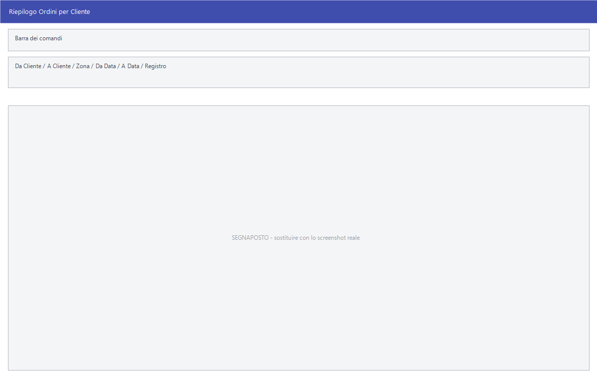

# Stampe degli ordini

Gli ordini si rileggono da tre punti di vista: **chi** ha ordinato, **a chi**
si è ordinato e **cosa** è stato ordinato. Il terzo è quello che serve di più:
è la stampa da cui si decide cosa chiedere al fornitore.

!!! info "In sintesi"

    - **Percorso:**
        - Menu ▸ Ordini ▸ Ordini da Clienti ▸ Stampa Riepilogo
        - Menu ▸ Ordini ▸ Ordini da Clienti ▸ Stampa Ordini per Cliente
        - Menu ▸ Ordini ▸ Ordini da Clienti ▸ Stampa Ordini per Articolo
        - Menu ▸ Ordini ▸ Ordini da Clienti ▸ Stampa Ordini per Fornitore
        - Menu ▸ Ordini ▸ Ordini a Fornitori ▸ Stampa Riepilogo
        - Menu ▸ Ordini ▸ Ordini a Fornitori ▸ Stampa Riepilogo con Dettaglio Articoli e Commesse
        - Menu ▸ Ordini ▸ Ordini a Fornitori ▸ Stampa Ordini per Fornitore
        - Menu ▸ Ordini ▸ Ordini a Fornitori ▸ Stampa Ordini per Articolo
        - Menu ▸ Ordini ▸ Stampa Situazione Articoli
    - **Scorciatoia:** ++f2++ avvia la stampa, ++esc++ esce
    - **Permessi richiesti:** nessun profilo predefinito; le singole voci di menu si abilitano per ogni utente da [Archivi ▸ Utenti](../anagrafiche/utenti.md)

---

## A cosa serve

| Voce di menu | Cosa stampa |
|---|---|
| **Stampa Riepilogo** | L'elenco degli ordini di un periodo, uno per riga. Usa la maschera dei [riepiloghi documenti](../vendite/riepiloghi-e-statistiche.md). |
| **Stampa Riepilogo con Dettaglio Articoli e Commesse** | Lo stesso riepilogo, ma esploso riga per riga con articoli e [commesse](../contabilita/commesse.md). |
| **Stampa Ordini per Cliente** | Gli ordini raggruppati per cliente: cosa deve ancora ricevere ciascuno. La finestra si chiama *Riepilogo Ordini per Cliente*. |
| **Stampa Ordini per Fornitore** | Gli ordini raggruppati per fornitore. La finestra prende il titolo *Stampa Ordini per Fornitore*. |
| **Stampa Ordini per Articolo** | Gli ordini raggruppati per articolo: quanto è impegnato di ogni cosa. La finestra si chiama *Riepilogo Ordini per Articolo*. |
| **Stampa Situazione Articoli** | Per ciascun articolo, esistenza, impegnato e ordinato messi a confronto. Usa la maschera delle [stampe articoli](../anagrafiche/stampe-articoli.md), con il titolo *Stampa Situazione Articoli*. |

!!! note "Due voci con lo stesso nome"

    **Stampa Ordini per Fornitore** compare sia sotto *Ordini da Clienti* sia
    sotto *Ordini a Fornitori*, e non stampa la stessa cosa: dal ramo dei
    clienti raggruppa **gli ordini dei clienti** per il fornitore degli
    articoli, dal ramo dei fornitori raggruppa **gli ordini fatti ai
    fornitori**.

## Prerequisiti

Prima di usare queste stampe occorre avere gli ordini in archivio; per la
situazione articoli, anche i [depositi](../magazzino/depositi.md) e le
esistenze aggiornate.

## La maschera

Sono finestre di selezione: gli intervalli di codice e di data, qualche filtro,
la casella che decide se includere gli ordini già chiusi, e i pulsanti **F2 -
OK** ed **Esci**.

## Campi

### Stampa Ordini per Cliente e per Fornitore

| Campo | Obbl. | Descrizione | Valori ammessi |
|---|:---:|---|---|
| **Da Cliente**, **A Cliente** | | L'intervallo di soggetti. Negli ordini a fornitori le etichette diventano **Da Fornitore** e **A Fornitore**. | codici |
| **Zona** | | Restringe a una [zona](../anagrafiche/zone.md). Vuoto significa `TUTTE`. | codice |
| **Da Data**, **A Data** | | Il periodo degli ordini. | date |
| **Registro** | | Restringe a un registro di numerazione. | `TUTTI` o una voce dell'elenco |
| **Includi Ordini Totalmente Evasi** | | Se attivo stampa anche gli ordini già chiusi. Negli ordini a fornitori l'etichetta è **Includi Ordini Totalmente Ricevuti**. | attivo/non attivo |

{: .campi }

### Stampa Ordini per Articolo

| Campo | Obbl. | Descrizione | Valori ammessi |
|---|:---:|---|---|
| **Deposito** | | Restringe a un [deposito](../magazzino/depositi.md). Vuoto significa `TUTTI`. | codice |
| **Da Articolo**, **Ad Articolo** | | L'intervallo di articoli. | codici |
| **Da Data**, **A Data** | | Il periodo degli ordini. | date |
| **Zona** | | Restringe a una [zona](../anagrafiche/zone.md). | codice |
| **Registro** | | Restringe a un registro. | `TUTTI` o una voce dell'elenco |
| **Includi Ordini Totalmente Evasi** | | Se attivo stampa anche gli ordini già chiusi. Negli ordini a fornitori l'etichetta è **Includi Ordini Totalmente Ricevuti**. | attivo/non attivo |
| **Ordinamento** | | Come ordinare la stampa. | `CODICE`, `DESCRIZIONE` |
| **Tipo Stampa** | | Quanto dettaglio mostrare. | `ESTESA`, `SINTETICA` |

{: .campi }

## Pulsanti e comandi

| Comando | Scorciatoia | Effetto |
|---|---|---|
| **F2 - OK** | ++f2++ | Prepara e mostra l'anteprima della stampa. |
| **Esci** | ++esc++ | Chiude senza stampare. |
| Elenco di scelta | ++f10++ o ++space++ | Sul campo con il codice, apre l'elenco da cui scegliere. |
| **Calcolatrice** | ++f12++ | Apre la calcolatrice. |

## Come si fa

### Decidere cosa ordinare al fornitore

1. Apri **Menu ▸ Ordini ▸ Ordini da Clienti ▸ Stampa Ordini per Articolo**.
2. Lascia **Includi Ordini Totalmente Evasi** spento: interessa solo quello che
   è ancora da consegnare.
3. Indica il periodo e, se serve, il **Deposito**.
4. Metti **Tipo Stampa** su `SINTETICA` per avere una riga per articolo.
5. Premi **F2 - OK**: la stampa dice quanto è impegnato di ogni articolo.

Per fare il passo successivo in automatico, vedi
[Generazione degli ordini](generazione-ordini.md).

### Dire a un cliente cosa deve ancora ricevere

1. Apri **Stampa Ordini per Cliente**.
2. Metti lo stesso codice in **Da Cliente** e **A Cliente**.
3. Premi **F2 - OK**.

### Vedere esistenza, impegnato e ordinato insieme

1. Apri **Menu ▸ Ordini ▸ Stampa Situazione Articoli**.
2. Compila i filtri come nelle altre
   [stampe articoli](../anagrafiche/stampe-articoli.md); qui l'**Ordinamento**
   offre anche `CODICE FORNITORE`.
3. Premi **F2 - OK**.

## Controlli e messaggi

<!-- DA VERIFICARE: i messaggi propri di queste stampe. -->

| Messaggio | Causa | Cosa fare |
|---|---|---|
| *(nessun messaggio, solo un segnale acustico)* | Un campo del filtro non è valido. | Guarda dove si è posizionato il cursore. |

## Note

!!! note "I due riepiloghi degli ordini a fornitori"

    **Stampa Riepilogo** e **Stampa Riepilogo con Dettaglio Articoli e
    Commesse** non sono la stessa stampa con un'opzione: sono due stampe
    diverse. La prima elenca gli ordini, uno per riga; la seconda scende al
    dettaglio delle righe, con l'articolo e la
    [commessa](../contabilita/commesse.md) di ciascuna. Entrambe escono in
    orizzontale.

    Tutte e due **lasciano fuori i documenti annullati**.

!!! note "Cosa vuol dire «evaso»"

    Un ordine è *totalmente evaso* quando ogni sua riga è stata consegnata per
    intero. Finché resta anche una quantità aperta, l'ordine compare nelle
    stampe anche con la casella spenta.

!!! note "Estesa o sintetica"

    Sono due stampe diverse, non due impaginazioni della stessa. `ESTESA` esce
    **in orizzontale** con il dettaglio; `SINTETICA` esce **in verticale**, più
    breve, e affianca all'ordinato l'**esistenza a magazzino**: è quella da
    guardare per decidere cosa comprare, perché mette a confronto quello che
    serve con quello che c'è già.

<!-- DA VERIFICARE: quali colonne distinguono nel concreto le due stampe (ordxart.rpt e ordxarts.rpt). -->

## Vedi anche

- [Riepiloghi e statistiche](../vendite/riepiloghi-e-statistiche.md)
- [Stampe articoli](../anagrafiche/stampe-articoli.md)
- [Ordini clienti](../vendite/ordini-clienti.md)
- [Generazione degli ordini](generazione-ordini.md)
