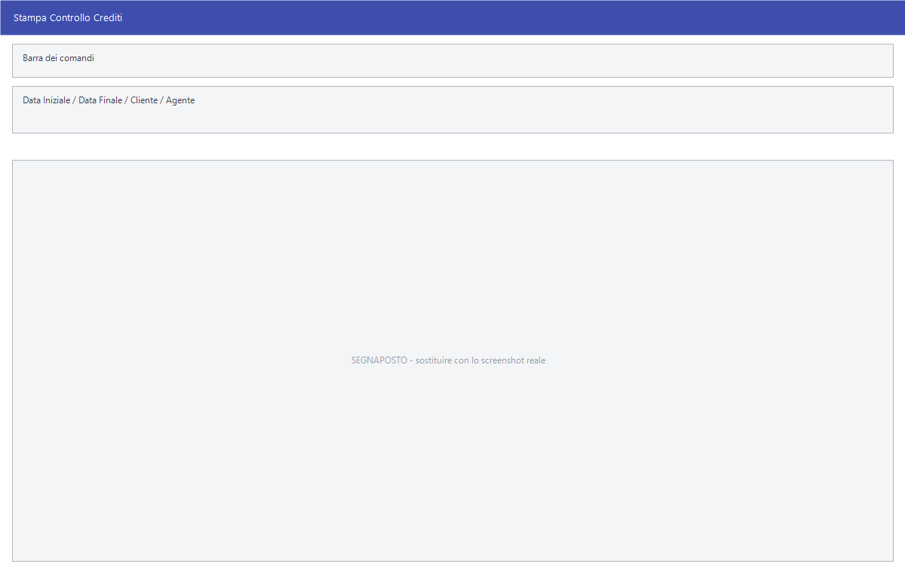

# Controllo crediti e debiti

Le scadenze dicono cosa si deve incassare; queste voci dicono **come si sta
messi**: chi paga tardi e quanto, chi è oltre il fido, quanto credito è fermo in
assegni non ancora incassati, quanto si è esposti verso i fornitori.

!!! info "In sintesi"

    - **Percorso:**
        - Menu ▸ Scadenze ▸ Scadenziario Clienti ▸ Stampa Controllo Crediti
        - Menu ▸ Scadenze ▸ Scadenziario Clienti ▸ Stampa Ritardi Medi di Incasso
        - Menu ▸ Scadenze ▸ Scadenziario Clienti ▸ Stampa Situazione Crediti per Agente
        - Menu ▸ Scadenze ▸ Scadenziario Clienti ▸ Credito Circolante
        - Menu ▸ Scadenze ▸ Scadenziario Clienti ▸ Calcolo e Invio Estratti Conto
        - Menu ▸ Scadenze ▸ Scadenziario Fornitori ▸ Stampe Esposizione Verso Fornitori
    - **Scorciatoia:** sulle finestre di selezione ++f2++ avvia ed ++esc++ esce; sulle due griglie ogni comando ha il suo tasto sulla barra
    - **Permessi richiesti:** nessun profilo predefinito; le singole voci di menu si abilitano per ogni utente da [Archivi ▸ Utenti](../anagrafiche/utenti.md)

---

## A cosa serve

| Voce di menu | Cosa fa |
|---|---|
| **Stampa Controllo Crediti** | Il prospetto delle partite aperte dei clienti, in due formati: con i **giorni di ritardo** o con la **differenza dal fido**. |
| **Stampa Ritardi Medi di Incasso** | Con quanti giorni di ritardo ciascun cliente paga mediamente. Apre la stessa maschera del controllo crediti, con la data e il formato nascosti. |
| **Stampa Situazione Crediti per Agente** | I crediti raggruppati per [agente](../anagrafiche/anagrafica-agenti.md), su un periodo. |
| **Credito Circolante** | L'elenco degli **assegni postdatati** ricevuti dai clienti e non ancora incassati. Non è una stampa: è la griglia da cui si registra l'incasso quando l'assegno matura. |
| **Calcolo e Invio Estratti Conto** | La griglia dei clienti con scaduto, da scadere e saldo, da cui si mandano i solleciti per posta elettronica o si stampano. |
| **Stampe Esposizione Verso Fornitori** | Quanto si deve ai fornitori, il rovescio del controllo crediti. |

## Prerequisiti

Prima di usare queste stampe occorre avere le scadenze in archivio e — per i
ritardi medi — avere registrato gli incassi con le
[distinte](distinte-incasso-pagamento.md), perché è dal confronto fra data di
scadenza e data di incasso che il ritardo si misura.

Il **credito circolante** non si compila a mano: ci finiscono da sole le
distinte di incasso dei clienti pagate con **assegno** e con la **data
dell'assegno** valorizzata. È quella data a dire che l'assegno è postdatato, ed
è per questo che la contabilizzazione resta sospesa.

Per l'invio degli estratti conto servono l'indirizzo di posta dei clienti, il
mittente impostato sull'[utente](../anagrafiche/utenti.md) o sulla
[ditta](../anagrafiche/ditte.md), e sulla ditta il **modello del sollecito**.

## Le maschere

Le sei voci aprono tre cose diverse: una finestra di filtri, la griglia del
credito circolante e la griglia degli estratti conto.

### La finestra di selezione

**Stampa Controllo Crediti** (finestra *Controllo Crediti*), **Stampa Ritardi
Medi di Incasso** (*Ritardi Medi sugli Incassi*) e **Stampe Esposizione Verso
Fornitori** (*Controllo Esposizione Vs. Fornitori*) aprono una finestra di
filtri con i pulsanti **F2 - OK** ed **Esci**.

**Stampa Situazione Crediti per Agente** apre invece la finestrella *Seleziona
Periodo*, con **Data Iniziale** e **Data Finale**.

### La griglia del credito circolante

La finestra *Credito Circolante* elenca un assegno per riga, ordinato per data
dell'assegno e, a parità di data, per numero di distinta. Le righe la cui **Data
Ass.** è già arrivata — cioè gli assegni che si possono portare in banca — sono
in **grassetto e in colore**; la colonna **Data Ass.** ha lo sfondo giallo,
perché è quella su cui si decide.

### La griglia degli estratti conto

La finestra si chiama *Estratti Conto Scadenze* e si apre a tutto schermo. In
alto ci sono **Giorni Preavviso** e la casella **Conferma Invio**; sotto, un
cliente per riga con il suo scaduto.

## Campi

### Controllo crediti, ritardi medi ed esposizione verso fornitori

| Campo | Obbl. | Descrizione | Valori ammessi |
|---|:---:|---|---|
| **Data Riferimento** | ● | La data a cui il prospetto si riferisce. Parte da oggi. Sui ritardi medi il campo è nascosto. | data |
| **Agente** | | Restringe a un [agente](../anagrafiche/anagrafica-agenti.md). Vuoto vale **TUTTI**. Non c'è sull'esposizione verso i fornitori. | codice |
| **Zona** | | Restringe a una [zona](../anagrafiche/zone.md). Vuoto vale **TUTTE**. | codice |
| **Cat. Economica** | | Restringe a una [categoria economica](../anagrafiche/categorie-economiche.md). Vuoto vale **TUTTE**. | codice |
| **Sezione** | | Restringe a una [sezione](../contabilita/sezioni.md). Se sull'utente ne è impostata una, il campo arriva già compilato e non si cambia. | da 0 a 10 |
| **Ordinamento** | | Come raggruppare il prospetto. | *CODICE CLIENTE*, *DESCRIZIONE CLIENTE* (*FORNITORE* sull'esposizione) |
| **Formato** | | Quale delle due stampe produrre. Solo sul controllo crediti. | *CON GIORNI RITARDO*, *CON DIFFERENZA FIDO* |

{: .campi }

### Credito circolante

| Colonna | Cosa contiene |
|---|---|
| **Numero** | Il numero della [distinta di incasso](distinte-incasso-pagamento.md) da cui l'assegno arriva. |
| **Data** | La data della distinta. |
| **N. Assegno** | Il numero dell'assegno, a dieci cifre. |
| **Data Ass.** | La data dell'assegno, cioè il giorno da cui si può incassare. |
| **Importo** | Il totale della distinta. |
| **Cod. Cli.**, **Descrizione Cliente** | Chi ha pagato. |

### Estratti conto

| Campo o colonna | Descrizione |
|---|---|
| **Giorni Preavviso** | I giorni di preavviso che finiscono nel sollecito. Parte da zero. |
| **Conferma Invio** | Spuntata, ogni messaggio si ferma per la conferma prima di partire; non spuntata, partono in silenzio uno dietro l'altro. |
| **Sel.** | La spunta dei clienti su cui agire. Dopo un invio riuscito si toglie da sola. |
| *(colonna dell'icona)* | Mostra come è andata: in lavorazione, inviata, non riuscita. |
| **Codice**, **Cliente**, **Cod. Fiscale**, **Email** | Chi è il cliente e dove gli si scrive. |
| **Scaduto** | Le partite non pagate con data **fino a oggi**. |
| **Da Scadere** | Le partite non pagate con data **successiva a oggi**. |
| **Saldo** | La somma dei due. |

## Pulsanti e comandi

Sulle finestre di selezione:

| Comando | Scorciatoia | Effetto |
|---|---|---|
| **F2 - OK** | ++f2++ | Avvia la stampa. |
| **Esci** | ++esc++ | Chiude senza fare nulla. |
| Elenco di scelta | ++f10++ o ++space++ | Sul campo con il codice, apre l'elenco da cui scegliere. |

Sul credito circolante:

| Comando | Scorciatoia | Effetto |
|---|---|---|
| **F2 - Apri** | ++f2++ | Apre la [distinta di incasso](distinte-incasso-pagamento.md) della riga. Fanno lo stesso il doppio clic, ++enter++, ++f10++ e la barra spaziatrice. |
| **F3 - Incassa** | ++f3++ | Registra l'incasso dell'assegno della riga. |
| **F4 - Stampa** | ++f4++ | Stampa l'elenco completo degli assegni in circolo. |
| **F9 - Trova** | ++f9++ | Cerca un valore nella griglia. |

Sugli estratti conto:

| Comando | Scorciatoia | Effetto |
|---|---|---|
| **F5 - Calcola Saldi** | ++f5++ | Rilegge le scadenze aperte e riempie la griglia. |
| **F3 - Sel. Tutti** / **F4 - Desel. Tutti** | ++f3++ / ++f4++ | Spuntano o liberano tutte le righe. |
| **F2 - Invia Email** | ++f2++ | Manda il sollecito in PDF ai clienti spuntati, uno per uno. |
| **F6 - Stampa** | ++f6++ | Stampa i solleciti dei clienti spuntati. |
| **F7 - Esporta Excel** | ++f7++ | Scrive la griglia in un foglio Excel. |
| **F8 - Esporta PDF** | ++f8++ | Scrive i solleciti dei clienti spuntati in file PDF. |
| **Cliente** | | Apre la scheda del cliente della riga. |
| **F9 - Trova** | ++f9++ | Cerca un valore nella griglia. |

## Come si fa

### Vedere chi è oltre il fido

1. Apri **Menu ▸ Scadenze ▸ Scadenziario Clienti ▸ Stampa Controllo Crediti**.
2. Lascia la **Data Riferimento** di oggi, o mettine un'altra.
3. Su **Formato** scegli **CON DIFFERENZA FIDO**.
4. Premi **F2 - OK**: la stampa mette a confronto l'esposizione di ogni cliente
   con il fido della sua [scheda](../anagrafiche/anagrafica-clienti.md).

### Capire quali clienti pagano tardi

1. Apri **Menu ▸ Scadenze ▸ Scadenziario Clienti ▸ Stampa Ritardi Medi di
   Incasso**.
2. Restringi per agente, zona o categoria se serve.
3. Premi **F2 - OK**: la stampa dice, cliente per cliente, di quanti giorni si
   sfora mediamente.

### Incassare un assegno postdatato

1. Apri **Menu ▸ Scadenze ▸ Scadenziario Clienti ▸ Credito Circolante**.
2. Le righe in grassetto sono gli assegni la cui data è arrivata: quelli
   incassabili. Se ti serve vedere da dove viene un assegno, premi **F2 - Apri**
   sulla riga.
3. Mettiti sulla riga giusta e premi **F3 - Incassa**.
4. Rispondi **Sì** a *«Confermi l'incasso dell'assegno ?»*.
5. Indica la **data di incasso** vera, quella in cui il denaro è arrivato, e
   premi **F2 - OK**. Deve essere successiva alla data della distinta.
6. La riga sparisce dalla griglia: la distinta è contabilizzata e la
   registrazione di [prima nota](../contabilita/registrazione-prima-nota.md) è
   scritta a quella data.

### Mandare gli estratti conto ai clienti

1. Apri **Calcolo e Invio Estratti Conto**.
2. Indica i **Giorni Preavviso** e premi **F5 - Calcola Saldi**.
3. Spunta i clienti da sollecitare, o premi **F3 - Sel. Tutti**.
4. Controlla la colonna **Email**: chi non ce l'ha viene saltato senza dirlo.
5. Premi **F2 - Invia Email**. Se i destinatari sono più di trenta il programma
   avverte prima di cominciare.
6. Segui la colonna dell'icona: dice riga per riga se il messaggio è partito.

### Sapere quanto si deve ai fornitori

1. Apri **Menu ▸ Scadenze ▸ Scadenziario Fornitori ▸ Stampe Esposizione Verso
   Fornitori**.
2. Indica la **Data Riferimento** e i filtri, poi **F2 - OK**.

## Controlli e messaggi

| Messaggio | Causa | Cosa fare |
|---|---|---|
| *Confermi l'incasso dell'assegno ?* | Hai premuto **F3 - Incassa** sul credito circolante. | **Sì** prosegue e chiede la data. La risposta preimpostata è **No**. |
| *La data d'incasso dell' assegno non può essere uguale o antecedente a quella della distinta di incasso!* | La data indicata è pari o precedente a quella della distinta. | Metti la data in cui l'assegno è stato davvero incassato: la domanda si ripete finché non è valida. |
| *La data è esterna all' esercizio corrente.* | La data di incasso non appartiene all'esercizio aperto. | Correggila, oppure entra nell'esercizio giusto. |
| *Non e' stato selezionato nessun cliente per l'invio!* | Nessuna riga spuntata, o nessuna di quelle spuntate ha un indirizzo di posta. | Spunta i clienti e controlla la colonna **Email**. |
| *Attenzione! Inviare un numero di email elevato in poco tempo puo' causare il blocco temporaneo del server di posta… Vuoi Continuare?* | I clienti spuntati sono più di trenta. | **Sì** manda comunque; se il provider è severo, conviene dividere l'invio. |
| *Non e' stato selezionato nessun cliente per la stampa!* / *…per l'esportazione!* / *…per l'esportazione in pdf!* | Stesso caso, sugli altri tre comandi. | Spunta almeno un cliente. |
| *Impossibile inizializzare il file excel!* | L'esportazione in Excel non è partita. | Riprova; se insiste, segnala all'assistenza. |
| *(nessun messaggio, solo un segnale acustico)* | Un campo del filtro non è valido. | Guarda dove si è posizionato il cursore. |

## Note

!!! note "Che cos'è il «credito circolante»"

    È il credito che hai in mano ma non ancora in banca. Quando un cliente paga
    con un **assegno postdatato**, la distinta di incasso viene registrata ma
    **non contabilizzata**: la scadenza risulta pagata e insieme trattenuta, e
    non nasce nessun movimento di prima nota finché l'assegno non si incassa.

    Quelle distinte in sospeso sono esattamente le righe di questa griglia, e
    **F3 - Incassa** è ciò che le chiude: chiede la data reale dell'incasso,
    scrive la prima nota a quella data con la causale di incasso della ditta, e
    toglie la riga dall'elenco.

    Succede solo per i **clienti** e solo per il mezzo **assegno** con la data
    compilata: ogni altro incasso si contabilizza subito e qui non compare.

!!! note "Perché quei crediti tornano anche nel Controllo Crediti"

    La **Stampa Controllo Crediti** prende le partite non pagate **più** quelle
    pagate ma trattenute, cioè proprio gli assegni del credito circolante. È
    voluto: finché l'assegno non è incassato quel denaro è ancora un credito, e
    va visto nell'esposizione del cliente.

!!! note "Il fido del cliente"

    Il **Controllo Crediti** ha senso pieno se sui clienti è impostato il fido:
    è confrontando l'esposizione con quel limite che si capisce chi è oltre.
    Scegli il formato **CON DIFFERENZA FIDO** e la stampa fa il confronto per
    te. Vedi [Anagrafica clienti](../anagrafiche/anagrafica-clienti.md).

!!! note "La Data Riferimento non restringe l'elenco"

    Cambiando la **Data Riferimento** non entrano né escono partite: la stampa
    prende comunque tutte quelle aperte dei filtri scelti. La data viene
    consegnata al prospetto, che ci si riferisce per presentare la situazione.

!!! note "I ritardi medi partono dall'euro"

    La **Stampa Ritardi Medi di Incasso** considera gli incassi registrati **dal
    1° gennaio 2002 in poi**, la data in cui l'euro è entrato in circolazione.
    Prima di quel giorno gli importi erano in lire e non sono confrontabili con
    quelli di oggi: le analisi di Facile non vanno più indietro di lì.

!!! note "Il modello del sollecito è quello della ditta"

    L'estratto conto che parte per email, che si stampa o che finisce in PDF è
    sempre lo stesso modulo: quello indicato come **modulo solleciti** sulla
    [ditta](../anagrafiche/ditte.md). Da lì arrivano anche il tasso di interesse
    di mora e, se l'utente ne ha uno, il logo in testa.

!!! note "Se la sezione è legata all'utente"

    Quando sull'[utente](../anagrafiche/utenti.md) è impostata una sezione,
    tutte queste stampe la applicano d'ufficio e il campo **Sezione** resta
    bloccato: ognuno vede la propria e basta.

## Vedi anche

- [Gestione scadenze](gestione-scadenze.md)
- [Distinte di incasso e pagamento](distinte-incasso-pagamento.md)
- [Stampe delle scadenze](stampe-scadenze.md)
- [Anagrafica clienti](../anagrafiche/anagrafica-clienti.md)
- [Registrazione di prima nota](../contabilita/registrazione-prima-nota.md)
