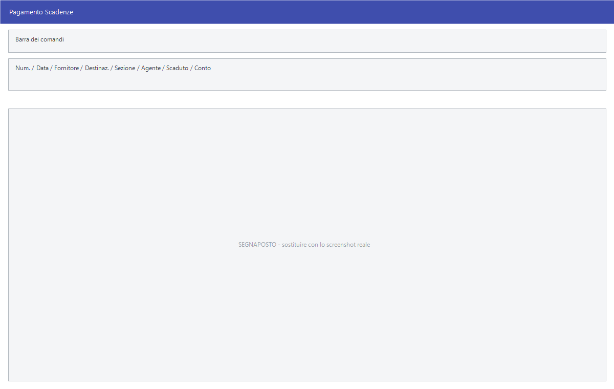

# Distinte di incasso e di pagamento

La distinta è il gesto con cui una o più scadenze vengono chiuse: si incassa
dal cliente o si paga il fornitore. La stessa maschera serve i due versi —
*Incasso Scadenze* dal lato clienti, *Pagamento Scadenze* dal lato fornitori.

!!! info "In sintesi"

    - **Percorso:**
        - Menu ▸ Scadenze ▸ Scadenziario Clienti ▸ Inserimento Distinta Incasso
        - Menu ▸ Scadenze ▸ Scadenziario Clienti ▸ Visualizza Distinta Incasso
        - Menu ▸ Scadenze ▸ Scadenziario Clienti ▸ Stampa Elenco Distinte Incasso
        - Menu ▸ Scadenze ▸ Scadenziario Clienti ▸ Acquisizione Incassi Agente
        - Menu ▸ Scadenze ▸ Scadenziario Clienti ▸ Ricezione Distinte Incasso dal Server FTP
        - Menu ▸ Scadenze ▸ Scadenziario Fornitori ▸ Inserimento Distinta Pagamento
        - Menu ▸ Scadenze ▸ Scadenziario Fornitori ▸ Visualizza Distinta Pagamento
        - Menu ▸ Scadenze ▸ Scadenziario Fornitori ▸ Stampa Elenco Distinte Pagamento
    - **Scorciatoia:** ++f2++ salva, ++esc++ esce
    - **Permessi richiesti:** nessun profilo predefinito; le singole voci di menu si abilitano per ogni utente da [Archivi ▸ Utenti](../anagrafiche/utenti.md)

---

## A cosa serve

| Voce di menu | A cosa serve |
|---|---|
| **Inserimento Distinta Incasso** / **Pagamento** | Registra l'incasso dal cliente o il pagamento al fornitore, chiudendo le scadenze. |
| **Visualizza Distinta Incasso** / **Pagamento** | Riapre una distinta già registrata per consultarla o correggerla. |
| **Stampa Elenco Distinte Incasso** / **Pagamento** | Stampa l'elenco delle distinte di un periodo. |
| **Acquisizione Incassi Agente** | Porta dentro gli incassi che l'agente ha registrato in giro. |
| **Ricezione Distinte Incasso dal Server FTP** | Scarica le distinte compilate fuori sede. |

## Prerequisiti

Prima di registrare una distinta occorre avere le scadenze aperte, che si
consultano dalla [gestione scadenze](gestione-scadenze.md).

## La maschera

In alto gli estremi della distinta e il soggetto, poi i filtri con cui si
richiamano le scadenze da chiudere, e sotto l'elenco su cui si sceglie.

## Campi

| Campo | Obbl. | Descrizione | Valori ammessi |
|---|:---:|---|---|
| **Num.** | | Numero della distinta. Lo assegna il programma. | numero |
| **Data** | ● | Data della distinta. | data |
| **Fornitore** | ● | Il soggetto della distinta. Nello scadenziario clienti l'etichetta è **Cliente**. | codice |
| **Destinaz.** | | La destinazione merce, quando serve a distinguere. | codice |
| **Data** *(la seconda)* | | La data a cui riferire le scadenze da richiamare. | data |
| **Sezione** | | Restringe a una [sezione](../contabilita/sezioni.md). A fianco l'etichetta ricorda **0 = Tutte**. | codice, `0` per tutte |
| **Agente** | | Restringe alle scadenze di un [agente](../anagrafiche/anagrafica-agenti.md). | codice |
| **Scaduto** | | Limita alle scadenze già scadute. | attivo/non attivo |
| **Conto** | | Il conto su cui registrare l'incasso o il pagamento — la cassa, la banca. | codice |
| **Sezione** *(la seconda)* | | La sezione della registrazione. | codice |

{: .campi }

## Pulsanti e comandi

| Comando | Scorciatoia | Effetto |
|---|---|---|
| **F2 - Salva** | ++f2++ | Registra la distinta e chiude le scadenze scelte. |
| **Esci** | ++esc++ | Chiude senza salvare. |
| Elenco di scelta | ++f10++ o ++space++ | Sul campo con il codice, apre l'elenco da cui scegliere. |
| **Calcolatrice** | ++f12++ | Apre la calcolatrice. |
| **Consultazione** | ++f11++ | Apre la consultazione. |

## Come si fa

### Incassare da un cliente

1. Apri **Menu ▸ Scadenze ▸ Scadenziario Clienti ▸ Inserimento Distinta
   Incasso**.
2. Indica la **Data** della distinta e il **Cliente**.
3. Attiva **Scaduto** se vuoi vedere solo quello che è già in ritardo.
4. Scegli dall'elenco le scadenze che il cliente sta pagando.
5. Indica il **Conto** su cui l'incasso entra — la cassa o la banca.
6. Premi **F2 - Salva**.

### Rivedere una distinta già fatta

1. Apri **Visualizza Distinta Incasso**.
2. Richiama la distinta dal numero.

### Registrare gli incassi raccolti dall'agente

1. Apri **Acquisizione Incassi Agente**.
2. Avvia l'acquisizione e controlla le scadenze chiuse dalla
   [gestione scadenze](gestione-scadenze.md).

## Controlli e messaggi

<!-- DA VERIFICARE: i messaggi di queste maschere. -->

| Messaggio | Causa | Cosa fare |
|---|---|---|
| *(nessun messaggio, solo un segnale acustico)* | Manca un campo obbligatorio. | Compila il campo su cui si è posizionato il cursore. |

## Note

!!! note "Due date sulla stessa maschera"

    La prima **Data** è quella della distinta, la seconda è la data a cui
    richiamare le scadenze: servono a cose diverse e vanno lette con
    attenzione, perché l'etichetta è la stessa.

<!-- DA VERIFICARE: se la distinta generi la registrazione contabile dell'incasso o solo la chiusura della scadenza. -->

<!-- DA VERIFICARE: cosa succede a una distinta annullata: se le scadenze tornino aperte. -->

<!-- DA VERIFICARE: da dove arrivano gli incassi dell'agente e in che formato. -->

## Vedi anche

- [Gestione scadenze](gestione-scadenze.md)
- [Effetti e RI.BA.](effetti-e-riba.md)
- [Stampe delle scadenze](stampe-scadenze.md)
