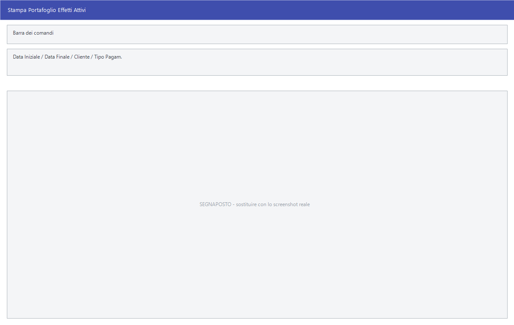

# Effetti e RI.BA.

Le scadenze che si incassano per il tramite della banca — ricevute bancarie,
tratte, ricevute di vendita — si governano da qui: si stampa il portafoglio, si
producono le RI.BA., si contabilizzano e si genera il file da mandare
all'istituto.

!!! info "In sintesi"

    - **Percorso:**
        - Menu ▸ Scadenze ▸ Scadenziario Clienti ▸ Stampa Portafoglio Effetti
        - Menu ▸ Scadenze ▸ Scadenziario Clienti ▸ Stampa RI.BA.
        - Menu ▸ Scadenze ▸ Scadenziario Clienti ▸ Contabilizza Effetti
        - Menu ▸ Scadenze ▸ Scadenziario Clienti ▸ Generazione File Flusso RI.BA.
        - Menu ▸ Scadenze ▸ Scadenziario Fornitori ▸ Stampa Effetti Passivi
        - Menu ▸ Scadenze ▸ Scadenziario Fornitori ▸ Stampa Assegni
    - **Scorciatoia:** ++f2++ avvia, ++esc++ esce
    - **Permessi richiesti:** nessun profilo predefinito; le singole voci di menu si abilitano per ogni utente da [Archivi ▸ Utenti](../anagrafiche/utenti.md)

---

## A cosa serve

| Voce di menu | A cosa serve |
|---|---|
| **Stampa Portafoglio Effetti** | Gli effetti attivi in portafoglio. La finestra si chiama *Stampa Poratfoglio Effetti Attivi*, con un refuso. |
| **Stampa RI.BA.** | Stampa le ricevute bancarie da presentare. |
| **Contabilizza Effetti** | Genera le registrazioni contabili degli effetti presentati. |
| **Generazione File Flusso RI.BA.** | Produce il file elettronico da mandare alla banca. |
| **Stampa Effetti Passivi** | Gli effetti dal lato fornitori. |
| **Stampa Assegni** | Stampa gli assegni per pagare i fornitori. |

## Prerequisiti

Prima di usare queste maschere occorre:

- avere le scadenze con un [tipo di pagamento](../contabilita/tipi-di-pagamento.md)
  che prevede l'effetto;
- avere sui clienti le coordinate bancarie e la
  [banca](../contabilita/banche.md) di appoggio;
- **aver controllato le scadenze** dalla
  [gestione scadenze](gestione-scadenze.md): quello che si presenta alla banca
  non si corregge facilmente.

## La maschera

Sono finestre di selezione con più intervalli di date — emissione, scadenza,
data documento — e i pulsanti **F2 - OK** ed **Esci**.

## Campi

### Stampa Portafoglio Effetti ed Effetti Passivi

| Campo | Obbl. | Descrizione | Valori ammessi |
|---|:---:|---|---|
| **Data Iniziale**, **Data Finale** | ● | Il periodo. | date |
| **Fornitore** | | Restringe a un soggetto. Nello scadenziario clienti l'etichetta è **Cliente**. | codice |
| **Tipo Pagam.** | | Quale genere di effetto includere. | `TUTTI`, `RI.BA.`, `RI.VE.`, `TRATTA`, `ASSEGNO` |

{: .campi }

### Stampa RI.BA.

| Campo | Obbl. | Descrizione | Valori ammessi |
|---|:---:|---|---|
| **Emissione Dal**, **Al** | | Periodo di emissione del documento. | date |
| **Scadenza Dal**, **Al** | | Periodo di scadenza. | date |
| **Data Doc. Dal**, **Al** | | Periodo della data documento. | date |
| **Scadenza Iniziale**, **Scadenza Finale** | | Intervallo dei numeri di scadenza. | numeri |
| **Banca Incasso** | | La [banca](../contabilita/banche.md) a cui si presentano. | codice |
| **Cliente** | | Restringe a un cliente. | codice |
| **Formato Stampa** | | L'impaginazione delle ricevute. | voce dell'elenco |

{: .campi }

### Contabilizza Effetti

| Campo | Obbl. | Descrizione | Valori ammessi |
|---|:---:|---|---|
| **Emissione Dal**, **Al** | | Periodo di emissione. | date |
| **Scadenza Dal**, **Al** | | Periodo di scadenza. | date |
| **Data Doc. Dal**, **Al** | | Periodo della data documento. | date |
| **Da Numero Scad.**, **A Numero Scad.** | | Intervallo dei numeri di scadenza. | numeri |
| **Tipo Effetti** | ● | Quale genere di effetto contabilizzare. | `RI.BA.`, `RI.VE.`, e gli altri dell'elenco |

{: .campi }

## Pulsanti e comandi

| Comando | Scorciatoia | Effetto |
|---|---|---|
| **F2 - OK** | ++f2++ | Avvia la stampa o l'elaborazione. |
| **Esci** | ++esc++ | Chiude senza fare nulla. |
| Elenco di scelta | ++f10++ o ++space++ | Sul campo con il codice, apre l'elenco da cui scegliere. |
| **Calcolatrice** | ++f12++ | Apre la calcolatrice. |

## Come si fa

### Presentare le RI.BA. alla banca

1. Controlla le scadenze del periodo dalla
   [gestione scadenze](gestione-scadenze.md).
2. Apri **Stampa Portafoglio Effetti** e verifica cosa c'è da presentare.
3. Apri **Stampa RI.BA.**, indica il periodo di **Scadenza** e la **Banca
   Incasso**, e stampa.
4. Apri **Generazione File Flusso RI.BA.** per il file elettronico da mandare
   all'istituto.
5. Chiudi il giro con **Contabilizza Effetti**, che genera le scritture.

### Pagare i fornitori con assegno

1. Registra la [distinta di pagamento](distinte-incasso-pagamento.md).
2. Apri **Menu ▸ Scadenze ▸ Scadenziario Fornitori ▸ Stampa Assegni**.

## Controlli e messaggi

<!-- DA VERIFICARE: i messaggi di queste maschere. -->

| Messaggio | Causa | Cosa fare |
|---|---|---|
| *(nessun messaggio, solo un segnale acustico)* | Manca un campo obbligatorio. | Compila il campo su cui si è posizionato il cursore. |

## Note

!!! warning "L'ordine conta"

    Stampa e file di flusso vanno prodotti **prima** della contabilizzazione:
    contabilizzare per primo cambia lo stato degli effetti e la selezione
    successiva potrebbe non trovarli più.

<!-- DA VERIFICARE: quali valori contiene l'elenco "Formato Stampa" delle RI.BA. e quali moduli prestampati supporta. -->

<!-- DA VERIFICARE: in quale cartella e con quale nome viene prodotto il file di flusso, e in che tracciato. -->

<!-- DA VERIFICARE: quali registrazioni genera "Contabilizza Effetti" e su quali conti. -->

<!-- DA VERIFICARE: i campi della maschera di generazione del file di flusso: non ho potuto estrarne le etichette. -->

## Vedi anche

- [Gestione scadenze](gestione-scadenze.md)
- [Distinte di incasso e di pagamento](distinte-incasso-pagamento.md)
- [Banche](../contabilita/banche.md)
- [Tipi di pagamento](../contabilita/tipi-di-pagamento.md)
