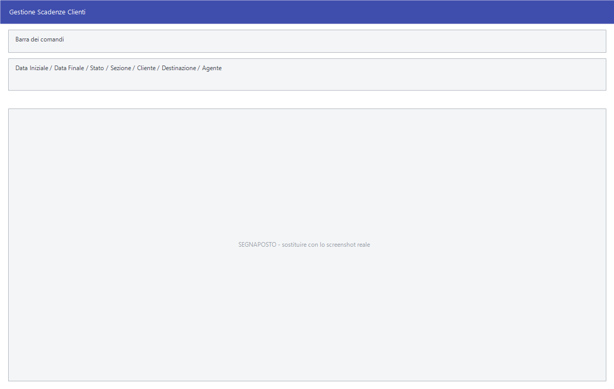

# Gestione scadenze

L'elenco di quello che si deve incassare e di quello che si deve pagare. La
stessa maschera serve i due scadenziari: cambia il titolo — *Gestione Scadenze
Clienti* o *Gestione Scadenze Fornitori* — e cambia l'archivio.

!!! info "In sintesi"

    - **Percorso:**
        - Menu ▸ Scadenze ▸ Scadenziario Clienti ▸ Gestione Scadenze
        - Menu ▸ Scadenze ▸ Scadenziario Fornitori ▸ Gestione Scadenze
    - **Scorciatoia:** ++f2++ modifica, ++f3++ nuova
    - **Permessi richiesti:** nessun profilo predefinito; le singole voci di menu si abilitano per ogni utente da [Archivi ▸ Utenti](../anagrafiche/utenti.md)

---

## A cosa serve

Le scadenze nascono da sole quando si emette un documento con un
[tipo di pagamento](../contabilita/tipi-di-pagamento.md) che prevede le rate,
o quando si registra una fattura in
[prima nota](../contabilita/registrazione-prima-nota.md). Qui si vedono tutte
insieme, si cerca quella che serve e la si corregge; e si può aggiungerne una a
mano, per quello che non nasce da un documento.

È il punto di partenza del lavoro sulle scadenze: da qui si capisce chi è in
ritardo, e da lì si passa ai [solleciti](stampe-scadenze.md), alle
[distinte](distinte-incasso-pagamento.md) e agli
[effetti](effetti-e-riba.md).

## Prerequisiti

Prima di usare questa maschera occorre:

- avere in archivio i [clienti](../anagrafiche/anagrafica-clienti.md) e i
  [fornitori](../anagrafiche/anagrafica-fornitori.md);
- avere i [tipi di pagamento](../contabilita/tipi-di-pagamento.md) impostati,
  perché sono loro a generare le rate;
- avere emesso i documenti o registrato la prima nota da cui le scadenze
  nascono.

## La maschera

In alto la barra dei comandi e i filtri, sotto la griglia delle scadenze
trovate e in fondo il **TOTALE**.

La griglia ha queste colonne:

| Colonna | Contenuto |
|---|---|
| **Codice** | Numero della scadenza. |
| **Data** | Data di scadenza. |
| **Numero Doc.**, **Data Doc.** | Gli estremi del documento da cui nasce. |
| **Sez.** | La [sezione](../contabilita/sezioni.md) contabile. |
| **Descrizione** | La descrizione della scadenza. |
| **Importo** | Quanto c'è da incassare o da pagare. |
| **Cliente** | Il nominativo. Nello scadenziario fornitori è il fornitore. |
| **Destinazione** | La destinazione merce, quando c'è. |
| **Agente** | L'[agente](../anagrafiche/anagrafica-agenti.md) del documento. |

## Campi

| Campo | Obbl. | Descrizione | Valori ammessi |
|---|:---:|---|---|
| **Data Iniziale**, **Data Finale** | | Il periodo delle scadenze da mostrare. | date |
| **Stato** | | Se mostrare tutto o solo l'aperto. | `TUTTE`, `NON PAGATE`, `PAGATE` |
| **Sezione** | | Restringe a una [sezione](../contabilita/sezioni.md) contabile. | codice |
| **Cliente** | | Restringe a un nominativo. | codice |
| **Destinazione** | | Restringe a una destinazione merce. | codice |
| **Agente** | | Restringe a un [agente](../anagrafiche/anagrafica-agenti.md). | codice |
| **TOTALE** | | La somma delle scadenze trovate. Solo lettura. | — |

{: .campi }

## Pulsanti e comandi

| Comando | Scorciatoia | Effetto |
|---|---|---|
| **F2 - Modifica** | ++f2++ | Apre in modifica la scadenza selezionata. |
| **F3 - Nuova** | ++f3++ | Crea una scadenza a mano. |
| **Trova** | | Cerca un testo nella griglia. |
| **Calcolatrice** | ++f12++ | Apre la calcolatrice. |
| **Consultazione** | ++f11++ | Apre la consultazione. |

## Come si fa

### Vedere chi è in ritardo

1. Apri **Menu ▸ Scadenze ▸ Scadenziario Clienti ▸ Gestione Scadenze**.
2. Metti **Data Finale** a ieri e **Stato** su `NON PAGATE`.
3. Il **TOTALE** in fondo è lo scaduto.

### Correggere una scadenza sbagliata

1. Trova la riga e premi **F2 - Modifica**.
2. Correggi data o importo e salva.

### Vedere lo scaduto di un agente

1. Apri lo scadenziario clienti e indica l'**Agente**.
2. Metti **Stato** su `NON PAGATE` e **Data Finale** a oggi.

## Controlli e messaggi

<!-- DA VERIFICARE: i messaggi di questa maschera. -->

| Messaggio | Causa | Cosa fare |
|---|---|---|
| *(nessun messaggio, solo un segnale acustico)* | Un campo del filtro non è valido. | Guarda dove si è posizionato il cursore. |

## Note

!!! warning "Le scadenze aggiunte a mano non hanno un documento dietro"

    **F3 - Nuova** crea una scadenza scollegata da qualsiasi documento: non la
    ritroverai nel
    [controllo scadenze ↔ schede contabili](manutenzione-scadenze.md), che
    confronta scadenze e registrazioni. Usala solo quando serve davvero.

<!-- DA VERIFICARE: quali campi si compilano aprendo una scadenza con F2 - Modifica. -->

<!-- DA VERIFICARE: come una scadenza viene marcata come pagata: se dalla distinta o a mano da questa maschera. -->

## Vedi anche

- [Distinte di incasso e di pagamento](distinte-incasso-pagamento.md)
- [Stampe delle scadenze](stampe-scadenze.md)
- [Effetti e RI.BA.](effetti-e-riba.md)
- [Tipi di pagamento](../contabilita/tipi-di-pagamento.md)
