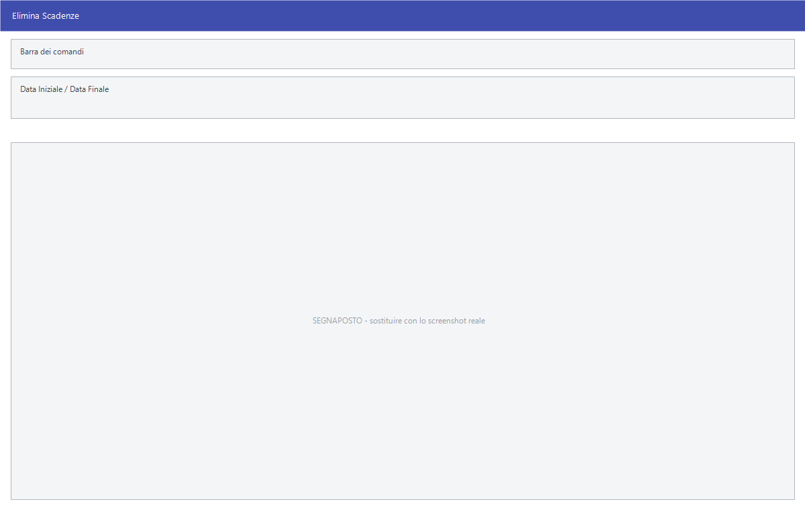

# Manutenzione dello scadenziario

Le voci che tengono in ordine lo scadenziario: il confronto con la contabilità,
la pulizia, i totali e il quadro d'insieme.

!!! info "In sintesi"

    - **Percorso:**
        - Menu ▸ Scadenze ▸ Scadenziario Clienti ▸ Controllo Scadenze <-> Schede Contabili
        - Menu ▸ Scadenze ▸ Scadenziario Fornitori ▸ Controllo Scadenze <-> Schede Contabili
        - Menu ▸ Scadenze ▸ Elimina Scadenze
        - Menu ▸ Scadenze ▸ Totali Scadenze
        - Menu ▸ Scadenze ▸ Cruscotto Finaziario
    - **Scorciatoia:** ++f2++ avvia, ++esc++ esce
    - **Permessi richiesti:** nessun profilo predefinito; le singole voci di menu si abilitano per ogni utente da [Archivi ▸ Utenti](../anagrafiche/utenti.md)

---

## A cosa serve

| Voce di menu | A cosa serve |
|---|---|
| **Controllo Scadenze <-> Schede Contabili** | Confronta lo scadenziario con le schede contabili e segnala le discordanze. Esiste in due copie, una per lo scadenziario clienti e una per quello fornitori. |
| **Elimina Scadenze** | Toglie dall'archivio le scadenze chiuse, per non trascinarsele dietro. |
| **Totali Scadenze** | I totali dello scadenziario. |
| **Cruscotto Finaziario** | Il quadro d'insieme di incassi e pagamenti attesi. La voce di menu contiene un refuso: si legge *Finaziario* invece di *Finanziario*. |

## Prerequisiti

Prima di usare queste maschere occorre:

- avere lo scadenziario popolato e la
  [prima nota](../contabilita/registrazione-prima-nota.md) registrata, perché
  il controllo confronta le due cose;
- per l'eliminazione, **una copia di sicurezza recente degli archivi**.

## La maschera

Sono finestre di selezione con il periodo e i filtri, e i pulsanti **F2 - OK**
ed **Esci**. Il **Cruscotto Finaziario** si apre invece come un quadro a video.

<!-- DA VERIFICARE: i campi di queste maschere e la struttura del cruscotto: non ho potuto estrarne le etichette dalle risorse. -->

## Campi

| Campo | Obbl. | Descrizione | Valori ammessi |
|---|:---:|---|---|
| **Data Iniziale**, **Data Finale** | ● | Il periodo da esaminare o da ripulire. | date |

{: .campi }

## Pulsanti e comandi

| Comando | Scorciatoia | Effetto |
|---|---|---|
| **F2 - OK** | ++f2++ | Avvia il controllo, l'eliminazione o il calcolo. |
| **Esci** | ++esc++ | Chiude senza fare nulla. |
| **Calcolatrice** | ++f12++ | Apre la calcolatrice. |

## Come si fa

### Verificare che scadenze e contabilità coincidano

1. Apri **Menu ▸ Scadenze ▸ Scadenziario Clienti ▸ Controllo Scadenze <->
   Schede Contabili**.
2. Indica il periodo e avvia.
3. Ogni discordanza segnalata è una scadenza senza registrazione o una
   registrazione senza scadenza: si sistema dalla
   [gestione scadenze](gestione-scadenze.md) o dalla
   [prima nota](../contabilita/gestione-prima-nota.md).

### Ripulire le scadenze chiuse

1. **Fai una copia di sicurezza degli archivi.**
2. Stampa prima lo scadenziario, per avere traccia di cosa stai per togliere.
3. Apri **Menu ▸ Scadenze ▸ Elimina Scadenze**.
4. Indica il periodo e avvia.

### Avere il quadro di incassi e pagamenti

Apri **Menu ▸ Scadenze ▸ Cruscotto Finaziario**.

## Controlli e messaggi

<!-- DA VERIFICARE: i messaggi di queste maschere. -->

| Messaggio | Causa | Cosa fare |
|---|---|---|
| *(nessun messaggio, solo un segnale acustico)* | Manca una delle date. | Compila il campo su cui si è posizionato il cursore. |

## Note

!!! warning "L'eliminazione è definitiva"

    Le scadenze cancellate spariscono con la loro storia, e i controlli
    successivi fra scadenziario e contabilità segnaleranno le registrazioni
    rimaste senza scadenza. Fallo solo su periodi chiusi e dopo una copia di
    sicurezza.

<!-- DA VERIFICARE: se "Elimina Scadenze" tolga solo le scadenze chiuse o tutte quelle del periodo. -->

<!-- DA VERIFICARE: cosa mostra il Cruscotto Finaziario e su quali dati è costruito. -->

<!-- DA VERIFICARE: come il controllo presenta le discordanze: stampa, griglia o messaggio. -->

## Vedi anche

- [Gestione scadenze](gestione-scadenze.md)
- [Registrazione di prima nota](../contabilita/registrazione-prima-nota.md)
- [Schede contabili](../contabilita/schede-contabili.md)
