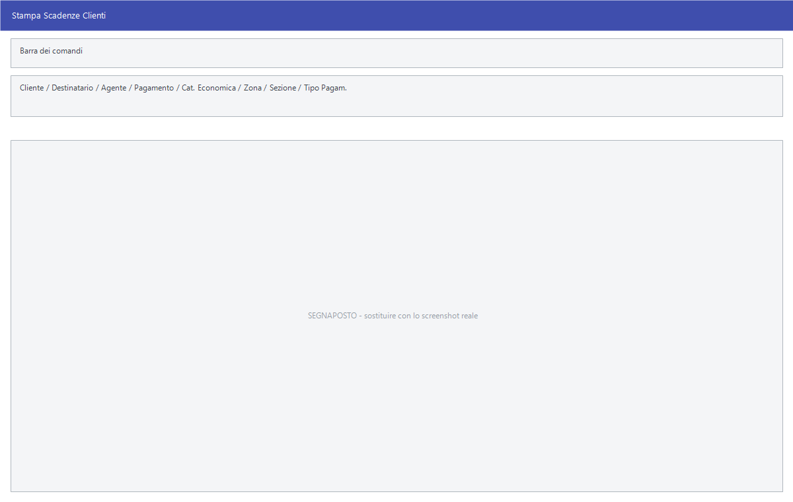

# Stampe delle scadenze

Le stampe che leggono lo scadenziario: l'elenco completo, la sintesi, i
solleciti da mandare a chi è in ritardo, gli interessi di mora e l'estratto
conto documento per documento.

!!! info "In sintesi"

    - **Percorso:**
        - Menu ▸ Scadenze ▸ Scadenziario Clienti ▸ Stampa
        - Menu ▸ Scadenze ▸ Scadenziario Clienti ▸ Stampa Sintesi
        - Menu ▸ Scadenze ▸ Scadenziario Clienti ▸ Stampa Solleciti
        - Menu ▸ Scadenze ▸ Scadenziario Clienti ▸ Stampa Interessi di Mora
        - Menu ▸ Scadenze ▸ Scadenziario Clienti ▸ Stampa Estratto Conto per Documento
        - Menu ▸ Scadenze ▸ Scadenziario Fornitori ▸ Stampa
        - Menu ▸ Scadenze ▸ Scadenziario Fornitori ▸ Stampa Sintesi
        - Menu ▸ Scadenze ▸ Scadenziario Fornitori ▸ Stampa Estratto Conto per Documento
    - **Scorciatoia:** ++f2++ avvia la stampa, ++esc++ esce
    - **Permessi richiesti:** nessun profilo predefinito; le singole voci di menu si abilitano per ogni utente da [Archivi ▸ Utenti](../anagrafiche/utenti.md)

---

## A cosa serve

| Voce di menu | Cosa stampa |
|---|---|
| **Stampa** | L'elenco delle scadenze, riga per riga. La finestra si chiama *Stampa Scadenze Clienti*. |
| **Stampa Sintesi** | Il riepilogo per soggetto, senza il dettaglio delle rate. |
| **Stampa Solleciti** | Le lettere di sollecito ai clienti in ritardo. Usa la stessa maschera di **Stampa**. |
| **Stampa Interessi di Mora** | Gli interessi maturati sul ritardo. |
| **Stampa Estratto Conto per Documento** | Lo scaduto e a scadere raggruppati per documento. |

## Prerequisiti

Prima di usare queste stampe occorre avere le scadenze in archivio, che si
consultano dalla [gestione scadenze](gestione-scadenze.md).

## La maschera

Sono finestre di selezione: i filtri sul soggetto e sulle condizioni, e i
pulsanti **F2 - OK** ed **Esci**.

## Campi

| Campo | Obbl. | Descrizione | Valori ammessi |
|---|:---:|---|---|
| **Fornitore** | | Restringe a un soggetto. Nello scadenziario clienti l'etichetta è **Cliente**. | codice |
| **Destinatario** | | Restringe a una destinazione merce. | codice |
| **Agente** | | Restringe a un [agente](../anagrafiche/anagrafica-agenti.md). | codice |
| **Pagamento** | | Restringe a un [tipo di pagamento](../contabilita/tipi-di-pagamento.md). | codice |
| **Cat. Economica** | | Restringe a una [categoria economica](../anagrafiche/categorie-economiche.md). | codice |
| **Zona** | | Restringe a una [zona](../anagrafiche/zone.md). | codice |
| **Sezione** | | Restringe a una [sezione](../contabilita/sezioni.md) contabile. | codice |
| **Tipo Pagam.** | | Quale modalità di pagamento includere. | `TUTTI`, `RIMESSA DIRETTA`, `RI.BA.`, e le altre dell'elenco |

{: .campi }

<!-- DA VERIFICARE: i campi propri di Stampa Sintesi, Stampa Interessi di Mora e Stampa Estratto Conto per Documento: non ho potuto estrarli tutti. -->

## Pulsanti e comandi

| Comando | Scorciatoia | Effetto |
|---|---|---|
| **F2 - OK** | ++f2++ | Prepara e mostra l'anteprima della stampa. |
| **Esci** | ++esc++ | Chiude senza stampare. |
| Elenco di scelta | ++f10++ o ++space++ | Sul campo con il codice, apre l'elenco da cui scegliere. |
| **Calcolatrice** | ++f12++ | Apre la calcolatrice. |
| **Consultazione** | ++f11++ | Apre la consultazione. |

## Come si fa

### Mandare i solleciti

1. Controlla lo scaduto dalla [gestione scadenze](gestione-scadenze.md),
   mettendo **Stato** su `NON PAGATE`.
2. Apri **Menu ▸ Scadenze ▸ Scadenziario Clienti ▸ Stampa Solleciti**.
3. Restringi se serve per **Agente** o per **Zona**.
4. Premi **F2 - OK**.

### Dare a un cliente il quadro della sua posizione

1. Apri **Stampa Estratto Conto per Documento**.
2. Indica il **Cliente** e stampa: la stampa raggruppa per documento, così il
   cliente ritrova le proprie fatture.

### Vedere quanto si deve ai fornitori

1. Apri **Menu ▸ Scadenze ▸ Scadenziario Fornitori ▸ Stampa Sintesi**.
2. Premi **F2 - OK**: esce il riepilogo per fornitore.

## Controlli e messaggi

<!-- DA VERIFICARE: i messaggi di queste stampe. -->

| Messaggio | Causa | Cosa fare |
|---|---|---|
| *(nessun messaggio, solo un segnale acustico)* | Un campo del filtro non è valido. | Guarda dove si è posizionato il cursore. |

## Note

!!! note "Solleciti e stampa scadenze condividono la maschera"

    **Stampa** e **Stampa Solleciti** aprono la stessa finestra di selezione:
    cambia quello che viene prodotto, non i filtri da compilare.

<!-- DA VERIFICARE: con quale tasso vengono calcolati gli interessi di mora e dove si imposta. -->

<!-- DA VERIFICARE: se il testo della lettera di sollecito sia modificabile e dove. -->

## Vedi anche

- [Gestione scadenze](gestione-scadenze.md)
- [Controllo crediti e debiti](controllo-crediti.md)
- [Effetti e RI.BA.](effetti-e-riba.md)
