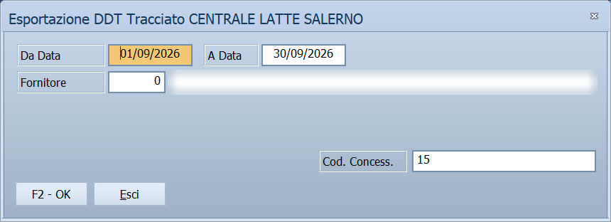

# Esportazione DDT - Centrale Latte Salerno

Il concessionario della Centrale del Latte di Salerno deve mandarle le consegne
fatte in trasfert: a chi, quali articoli, quanti, a che prezzo e cosa è tornato
indietro. Questa esportazione prende i DDT trasfert del periodo e li scrive nel
file che la Centrale sa leggere.

!!! info "In sintesi"

    - **Percorso:** Menu ▸ Trasferimenti ▸ Esportazione DDT ▸ Fornitori ▸ Esportazione DDT - CENTRALE LATTE SALERNO
    - **Scorciatoia:** ++f2++ avvia l'esportazione, ++esc++ esce, ++f1++ apre questa pagina
    - **Permessi richiesti:** nessun profilo predefinito; la voce di menu si abilita per ogni utente da [Archivi ▸ Utenti](../anagrafiche/utenti.md)

---

## A cosa serve

Ogni giorno, o con la cadenza concordata con la Centrale, si esporta il periodo
e si consegna il file. Nel file finiscono:

- i **punti vendita** serviti, con il codice che la Centrale ha dato a
  ciascuno;
- per ogni DDT la **testata**, con serie, numero, data e punto vendita;
- le **righe vendute** e, separate, le **righe rese**, con il codice
  dell'articolo della Centrale, la quantità, gli sconti, il prezzo e il lotto.

Entrano solo i DDT con **Tipo Vendita** `T`, e di ciascuno solo gli articoli
che la Centrale ti fornisce. Gli altri articoli dello stesso DDT restano fuori.

## Prerequisiti

Le impostazioni si fanno **una volta**, prima del primo invio. Poi vanno tenute
aggiornate quando arrivano un cliente o un articolo nuovi.

1. **Il fornitore.** Nell'[anagrafica fornitori](../anagrafiche/anagrafica-fornitori.md)
   la Centrale del Latte deve avere nel **Cod. Aggancio** il codice di
   concessionario che la Centrale ti ha assegnato: un numero di al massimo 3
   cifre, per esempio `15`. È il codice che l'esportazione mette nel nome del
   file e nella prima riga.
2. **Gli articoli.** Ogni articolo della Centrale deve avere, nell'[anagrafica
   articoli](../anagrafiche/anagrafica-articoli.md):
    - in **For. Abituale** la Centrale: è così che l'esportazione riconosce le
      righe da mandare;
    - in **Cod. Fornitore** il codice che la Centrale dà all'articolo, di al
      massimo 20 caratteri.
3. **I clienti.** Negli [Agganci](../anagrafiche/agganci-trasferimento-documenti.md),
   per il fornitore Centrale:
    - una riga per ogni cliente **senza destinazione**, con in **Cod. Cliente**
      il codice che la Centrale usa per fatturargli, numerico e di al massimo 7
      cifre. Serve sempre, anche quando il DDT ha una destinazione;
    - se consegni a destinazioni diverse dalla sede, una riga per ogni
      **destinazione**, con il codice del punto vendita, numerico e di al
      massimo 8 cifre.
4. **I DDT.** I documenti da mandare devono avere:
    - **Tipo Vendita** `T`;
    - un **Registro** assegnato, che nel file diventa la serie del documento:
      la Centrale si aspetta un numero, per esempio `03`, quindi conviene un
      registro dedicato ai DDT trasfert con un codice numerico;
    - un numero di al massimo 5 cifre;
    - lo stato **emesso** o **fatturato**: le bozze non partono.
5. **I resi.** Un reso esce nelle righe di reso se la causale del documento è
   di reso da cliente, oppure se la riga ha la quantità negativa.

## La maschera

È la stessa finestra di tutte le [esportazioni per
tracciato](esportazione-documenti.md), con il titolo *Esportazione DDT
Tracciato CENTRALE LATTE SALERNO* e i soli campi che servono a questo
tracciato.

## Campi

| Campo | Obbl. | Descrizione | Valori ammessi |
|---|:---:|---|---|
| **Da Data**, **A Data** | ● | Il periodo dei DDT da esportare. | date |
| **Fornitore** | ● | La Centrale del Latte, come l'hai codificata nell'anagrafica fornitori. Scelto il fornitore, **Cod. Concess.** si compila da solo. | codice |
| **Cod. Concess.** | ● | Il codice di concessionario assegnato dalla Centrale. Si prende dal **Cod. Aggancio** del fornitore; se lì è vuoto, si scrive a mano. | numero di al massimo 3 cifre |

La colonna **Obbl.** segna con ● i campi che il programma richiede
obbligatoriamente per salvare.

## Pulsanti e comandi

| Comando | Scorciatoia | Effetto |
|---|---|---|
| **F2 - OK** | ++f2++ | Controlla i DDT del periodo e produce il file. |
| **Esci** | ++esc++ | Chiude senza esportare. |
| Elenco dei fornitori | ++f10++, ++space++ o doppio clic | Sul campo **Fornitore**, apre l'elenco da cui scegliere. |
| Guida | ++f1++ | Apre questa pagina. |
| Calcolatrice | ++f12++ | Apre la calcolatrice. |

## Come si fa

### Esportare le consegne del periodo

1. Apri **Menu ▸ Trasferimenti ▸ Esportazione DDT ▸ Fornitori ▸ Esportazione
   DDT - CENTRALE LATTE SALERNO**.
2. Indica **Da Data** e **A Data**.
3. Indica il **Fornitore**: **Cod. Concess.** si compila da solo.
4. Premi **F2 - OK**.
5. Se compare un messaggio su un DDT, leggilo: quel documento **non** verrà
   esportato. Premi **OK** per proseguire con gli altri, **Annulla** per
   fermarti e correggere prima.
6. Alla fine il messaggio *File Generato* indica il file, per esempio
   `C:\...\out\015-CESSIONE-30092026`.
7. Manda il file alla Centrale come concordato con lei.

### Rimandare un DDT scartato

1. Correggi il dato che il messaggio ha indicato: l'aggancio del cliente, il
   codice dell'articolo o il registro del documento.
2. Esporta di nuovo **solo il giorno di quel DDT**, se puoi: rilanciando tutto
   il periodo partono di nuovo anche i documenti già mandati.

## Controlli e messaggi

I messaggi che cominciano con il numero del DDT lasciano fuori **l'intero
documento**: **OK** prosegue con gli altri, **Annulla** ferma l'esportazione e
non produce il file.

| Messaggio | Causa | Cosa fare |
|---|---|---|
| *(nessun messaggio, solo un segnale acustico)* | Manca una delle date o il **Fornitore**, oppure **A Data** è prima di **Da Data**. | Compila il campo su cui si è posizionato il cursore. |
| *Il codice concessionario deve essere numerico, di al massimo 3 cifre.* | **Cod. Concess.** è vuoto, contiene lettere o supera le 3 cifre. | Scrivi il codice di concessionario assegnato dalla Centrale; per non riscriverlo ogni volta, mettilo nel **Cod. Aggancio** del fornitore. |
| *D.D.T. … del …: manca il registro, che nel tracciato fa da serie.  Il documento non verrà esportato.* | Il DDT non ha un registro: la Centrale lo vuole come serie del documento. | Usa per i DDT trasfert un registro dedicato. |
| *D.D.T. … del …: il numero supera le 5 cifre previste dal tracciato.  Il documento non verrà esportato.* | Il tracciato ha 5 cifre per il numero del DDT. | Concorda con la Centrale come trattare la numerazione. |
| *D.D.T. … del …: il codice aggancio del punto vendita (cliente …, destinazione …) manca, non è numerico o supera le 8 cifre.  Il documento non verrà esportato.* | Negli **Agganci** manca la riga della Centrale per quel cliente e quella destinazione, oppure il **Cod. Cliente** non è un numero di al massimo 8 cifre. Con destinazione 0 si tratta del cliente senza destinazione. | Compila la riga in [Agganci](../anagrafiche/agganci-trasferimento-documenti.md) con il codice che la Centrale ha dato al punto vendita, ed esporta di nuovo. |
| *D.D.T. … del …: il codice aggancio per la fatturazione del cliente … manca, non è numerico o supera le 7 cifre.  Il documento non verrà esportato.* | Manca l'aggancio del cliente **senza destinazione**, oppure non è un numero di al massimo 7 cifre. Serve anche quando il DDT ha una destinazione. | Compila in [Agganci](../anagrafiche/agganci-trasferimento-documenti.md) la riga del cliente senza destinazione, ed esporta di nuovo. |
| *D.D.T. … del …: l'articolo … non ha il codice fornitore.  Il documento non verrà esportato.* | L'articolo non ha il **Cod. Fornitore**, cioè il codice con cui lo conosce la Centrale. | Compila il **Cod. Fornitore** nell'[anagrafica articoli](../anagrafiche/anagrafica-articoli.md), ed esporta di nuovo. |
| *D.D.T. … del …: il codice fornitore dell'articolo … supera i 20 caratteri del tracciato.  Il documento non verrà esportato.* | Il **Cod. Fornitore** dell'articolo è più lungo dei 20 caratteri del tracciato. | Correggi il codice nell'anagrafica articoli. |
| *D.D.T. … del …: l'articolo … ha un prezzo o uno sconto negativo, che il tracciato non prevede.  Il documento non verrà esportato.* | Sulla riga c'è un prezzo sotto zero o uno sconto negativo, cioè una maggiorazione. | Correggi la riga del DDT, oppure concorda con la Centrale come trattarla. |
| *D.D.T. … del …: l'articolo … ha il quinto, sesto o settimo sconto, che il tracciato non prevede.  La riga verrà esportata senza questi sconti.* | Il tracciato porta solo i primi quattro sconti. Questo è l'unico avviso che non scarta il documento. | **OK** esporta la riga senza quegli sconti. **Annulla** ferma l'esportazione, così puoi riportare lo sconto nei primi quattro. |
| *Nessun D.D.T. da esportare nel periodo indicato.* | Nel periodo non ci sono DDT trasfert con articoli della Centrale, oppure sono stati tutti scartati. | Controlla le date, il fornitore e i messaggi comparsi prima. |
| *Impossibile aprire il file di esportazione!* | Il file non si può creare nella cartella `out`: la cartella manca, non hai il permesso di scrivere, oppure il file è aperto in un altro programma. | Chiudi il file se è aperto e controlla la cartella `out`. |
| *File Generato :  …* | L'esportazione è finita; il messaggio indica il percorso del file. | Manda il file alla Centrale. |

## Note

!!! warning "Il DDT incompleto non parte"

    A differenza degli altri tracciati, qui un documento a cui manca un dato
    **non viene scritto con il campo vuoto**: viene lasciato fuori per intero,
    e il messaggio dice che cosa manca. Il file che esce è quindi sempre
    leggibile dalla Centrale, ma può non contenere tutto: prima di mandarlo,
    controlla di non aver saltato documenti.

!!! info "Il nome del file"

    Il file esce nella cartella **`out`** del programma, senza estensione, con
    il nome `XXX-CESSIONE-GGMMAAAA`: `XXX` è il codice concessionario su tre
    cifre, `GGMMAAAA` la data del giorno in cui esporti. Le esportazioni di
    giorni diversi restano tutte; due nello stesso giorno si sovrascrivono.

### Il tracciato record

Ogni riga del file è lunga **143 caratteri**, seguiti dal ritorno a capo. I
campi numerici sono allineati a destra con gli zeri davanti; quelli di testo
a sinistra, completati con spazi e tagliati alla loro lunghezza. Le righe
escono in questo ordine: una **AAA**, tutte le **P00**, poi per ogni DDT la
sua **K00** seguita dalle **K02** e dalle **R02**.

**AAA — testata della trasmissione** (una sola, in cima)

| Posizioni | Lung. | Campo | Contenuto |
|---|---:|---|---|
| 1-3 | 3 | Tipo | `AAA` |
| 4-5 | 2 | SOC | `01` |
| 6-9 | 4 | CONC | codice concessionario (15 → `0015`) |
| 10-12 | 3 | NUMT | `001` |
| 13-18 | 6 | DATAT | data della trasmissione, aammgg |
| 19-143 | 125 | | spazi |

**P00 — punto vendita** (una per ogni punto vendita presente nei DDT)

| Posizioni | Lung. | Campo | Contenuto |
|---|---:|---|---|
| 1-3 | 3 | Tipo | `P00` |
| 4-11 | 8 | CodCli | codice aggancio del punto vendita |
| 12-15 | 4 | PUNTOV | `0000` |
| 16-50 | 35 | Ragsoc | ragione sociale della destinazione, o del cliente se il DDT non ne ha |
| 51-87 | 37 | Indirizzo | indirizzo, come sopra |
| 88-92 | 5 | Cap | CAP |
| 93-117 | 25 | Citta | città |
| 118-119 | 2 | Prov | provincia |
| 120-130 | 11 | PIVA | partita IVA del cliente, senza il prefisso `IT` |
| 131-133 | 3 | Cod_pag | spazi |
| 134-140 | 7 | Cod_clifat | codice aggancio del cliente senza destinazione |
| 141-143 | 3 | | spazi |

**K00 — testata della bolla** (una per DDT)

| Posizioni | Lung. | Campo | Contenuto |
|---|---:|---|---|
| 1-3 | 3 | Tipo | `K00` |
| 4-5 | 2 | Serie | registro del DDT (`3` → `03`) |
| 6-10 | 5 | NUMBOL | numero del DDT |
| 11-18 | 8 | DATBOL | data del DDT, ggmmaaaa |
| 19-30 | 12 | CodCli | codice aggancio del punto vendita |
| 31-143 | 113 | | spazi |

**K02 — articolo venduto** e **R02 — articolo reso** (una per riga del DDT)

| Posizioni | Lung. | Campo | Contenuto |
|---|---:|---|---|
| 1-3 | 3 | Tipo | `K02` per le vendite, `R02` per i resi |
| 4-5 | 2 | Serie | come nella K00 |
| 6-10 | 5 | NUMBOL | come nella K00 |
| 11-30 | 20 | CODART | **Cod. Fornitore** dell'articolo |
| 31-40 | 10 | Qta | quantità per 1000, sempre positiva (2,5 → `0000002500`) |
| 41-45 | 5 | Sconto1 | primo sconto per 100 (10% → `01000`) |
| 46-50 | 5 | Sconto2 | secondo sconto per 100 |
| 51-55 | 5 | Sconto3 | terzo sconto per 100 |
| 56-60 | 5 | Sconto4 | quarto sconto per 100 |
| 61-70 | 10 | Prezzo | prezzo unitario **senza IVA e prima degli sconti**, per 100 (2,12 → `0000000212`) |
| 71-90 | 20 | lotto | lotto della riga |
| 91-143 | 53 | | spazi |

Il prezzo delle righe a IVA inclusa viene scorporato prima di scriverlo. Una
riga è un reso quando la causale del documento è di reso da cliente, oppure
quando la sua quantità è negativa; le due cose insieme si annullano, e la
riga torna una vendita.

## Vedi anche

- [Esportazione documenti per tracciato](esportazione-documenti.md)
- [Agganci trasferimento documenti](../anagrafiche/agganci-trasferimento-documenti.md)
- [Anagrafica fornitori](../anagrafiche/anagrafica-fornitori.md)
- [Anagrafica articoli](../anagrafiche/anagrafica-articoli.md)
- [Documento di vendita](../vendite/documento-di-vendita.md)
