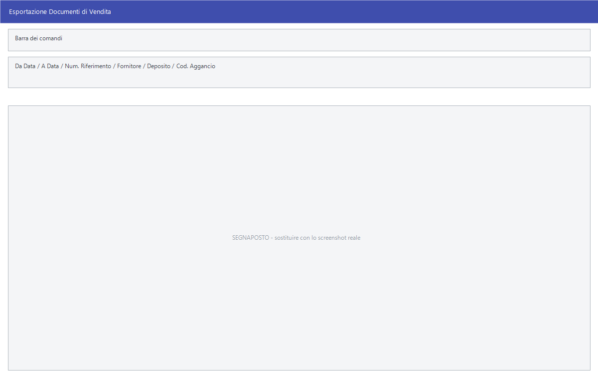

# Esportazione documenti per tracciato

Chi lavora con una centrale d'acquisto o con un grande fornitore deve mandargli
i dati nel **suo** formato: FILCONAD vuole un tracciato, GLOBE NESTLÉ un altro,
FRONERI un terzo. Facile ne conosce oltre sessanta, e li produce tutti **con la
stessa maschera**: cambia il titolo della finestra e cambiano i campi utili, il
resto è identico.

!!! info "In sintesi"

    - **Percorso:**
        - Menu ▸ Trasferimenti ▸ Esportazione DDT ▸ Fornitori ▸ *(un tracciato)*
        - Menu ▸ Trasferimenti ▸ Esportazione DDT ▸ Clienti ▸ *(un tracciato)*
        - Menu ▸ Trasferimenti ▸ Esportazione Fatture ▸ *(un tracciato)*
        - Menu ▸ Trasferimenti ▸ Esportazione Sellout ▸ *(un tracciato)*
        - Menu ▸ Trasferimenti ▸ Esportazione Movimentazione Banchi ▸ *(un tracciato)*
        - Menu ▸ Trasferimenti ▸ Esportazione Inventario Banchi ▸ *(un tracciato)*
        - Menu ▸ Trasferimenti ▸ Esportazione Anagrafica Clienti ▸ *(un tracciato)*
        - Menu ▸ Trasferimenti ▸ Esportazione Premi di Fine Anno ▸ Premi di fine anno / Una Tantum - Globe
        - Menu ▸ Trasferimenti ▸ Esportazione Dati DWH *(e le altre voci sciolte del menu)*
    - **Scorciatoia:** ++f2++ avvia l'esportazione, ++esc++ esce
    - **Permessi richiesti:** nessun profilo predefinito; le singole voci di menu si abilitano per ogni utente da [Archivi ▸ Utenti](../anagrafiche/utenti.md)

---

## A cosa serve

La finestra si chiama **Esportazione Documenti di Vendita**, ma il titolo cambia
con il tracciato scelto: *Esportazione DDT Tracciato VALSOIA*, *Esportazione
Sellout Tracciato GLOBE NESTLE'*, *Esportazione Fatture Tracciato Excel
ITALSTUDIO*, e così via. Quello che si compila sono sempre gli stessi campi.

### DDT verso i fornitori

- **Esportazione DDT - BONDUELLE**
- **Esportazione DDT - FACILE**
- **Esportazione DDT - FILCONAD**
- **Esportazione DDT - FINI**
- **Esportazione DDT - FRONERI**
- **Esportazione DDT - GIESSE**
- **Esportazione DDT - GLOBE NESTLE'**
- **Esportazione DDT - GRANAROLO**
- **Esportazione DDT - KRAFT**
- **Esportazione DDT - LACTALIS**
- **Esportazione DDT - MANTUA**
- **Esportazione DDT - MAURI**
- **Esportazione DDT - PARMACOTTO**
- **Esportazione DDT - SAMMONTANA**
- **Esportazione DDT - SICILY FOOD**
- **Esportazione DDT - VALSOIA**

### DDT verso i clienti

- **Esportazione DDT - FILCONAD**
- **Esportazione DDT - FILCONAD SIDIS**
- **Esportazione DDT - FILCONAD PREZZEMOLO E VITALE**

### Fatture

- **Esportazione Fatture Tracciato FILCONAD**
- **Esportazione Fatture Tracciato FILCOND SIDIS** *(il refuso «FILCOND» è nel menu)*
- **Esportazione Fatture Tracciato FILCONAD CAMBRIA**
- **Esportazione Fatture Tracciato FILCONAD PREZZEMOLO E VITALE**
- **Esportazione Fatture Tracciato FILCONAD CONAD NORD OVEST**
- **Esportazione Fatture Tracciato FILCONAD CONAD DEL TIRRENO**
- **Esportazione Fatture Tracciato FILCONAD COMMERC. INDIPENDENTI**
- **Esportazione Fatture Tracciato SMAFIN**
- **Esportazione Fatture Tracciato EDI**
- **Esportazione Fatture Tracciato EURITMO**
- **Esportazione Fatture Tracciato TEAMSYSTEM GAMMA**
- **Esportazione Fatture Tracciato ROBOT**
- **Esportazione Fatture Tracciato SISTEMI DATA**
- **Esportazione Fatture Tracciato EXCEL ITALSTUDIO**
- **Esportazione Fatture Tracciato FERRERO**

### Sellout

- **Esportazione Sellout - CANON CONTEXT**
- **Esportazione Sellout - CODIT**
- **Esportazione Sellout - DEMMA**
- **Esportazione Sellout - EVERBEST**
- **Esportazione Sellout - EXCEL**
- **Esportazione Sellout - FLORMAR - PROSERPINA**
- **Esportazione Sellout - FRONERI**
- **Esportazione Sellout - GDS EXPERT**
- **Esportazione Sellout - GLOBE NESTLE'**
- **EsportazioneSellout - MONTBLANC** *(nel menu manca lo spazio dopo «Esportazione»)*
- **Esportazione Sellout - PEPSI**
- **Esportazione Sellout - U.DI.AL**
- **Esportazione Sellout - UVE CAMPARI**

Le altre due voci di questo sottomenu — **Esportazione Sellout - PERONI WS5** e
**Esportazione Sellout - SAGI** — hanno una maschera propria e sono descritte in
[Esportazioni con maschera propria](esportazioni-specifiche.md).

### Banchi, inventario e anagrafiche

Sotto **Esportazione Movimentazione Banchi**:

- **Esportazione Movimentazione Banchi - FRONERI**
- **Esportazione Movimentazione Banchi - GLOBE NESTLE'**

Sotto **Esportazione Inventario Banchi**:

- **Esportazione Inventario Banchi - FRONERI**
- **Esportazione Inventario Banchi - GLOBE NESTLE'**

Sotto **Esportazione Anagrafica Clienti**:

- **Anagarfica Clienti - FRONERI** *(il refuso «Anagarfica» è nel menu)*
- **Anagrafica Clienti - GLOBE NESTLE'**
- **Sconti Contrattuali - GLOBE NESTLE'**

Sotto **Esportazione Premi di Fine Anno**:

- **Premi di fine anno / Una Tantum - Globe**

La quarta voce dell'anagrafica clienti — **Anagrafica Fidelity - SISA** — ha una
maschera propria.

### Le voci sciolte in fondo al menu

**Esportazione Dati DWH**, **Esportazione Dati Beverage Network**,
**Esportazione Dati Assonobel**, **Esportazione Dati CDA DWH**, **Esportazione
Dati Consorzio DI.AL.**, **Esportazione Dati ADB**, **Esportazione Inventario
Flormar - Proserpina** ed **Esportazione Dati Cerved PayLine Decision** usano
anch'esse questa maschera.

## Prerequisiti

Prima di esportare occorre:

- avere i [documenti](../vendite/documento-di-vendita.md) del periodo emessi e
  chiusi: si esporta quello che c'è in archivio;
- avere sui [clienti](../anagrafiche/anagrafica-clienti.md) e sugli
  [articoli](../anagrafiche/anagrafica-articoli.md) i **codici del
  destinatario** — il codice con cui la centrale conosce il punto vendita e il
  prodotto. Senza quelli il file esce, ma chi lo riceve non lo sa leggere;
- sapere **dove** va consegnato il file e con quale nome: è concordato con il
  destinatario, non lo decide Facile.

## La maschera

Una finestra di selezione con il periodo e i filtri, e i pulsanti **F2 - OK** ed
**Esci**. Non tutti i campi compaiono per tutti i tracciati: ciascuno mostra
quelli che gli servono.

## Campi

| Campo | Obbl. | Descrizione | Valori ammessi |
|---|:---:|---|---|
| **Da Data**, **A Data** | ● | Il periodo dei documenti da esportare. | date |
| **Num. Riferimento** | | Il numero di riferimento da riportare nel file. | numero |
| **Fornitore** | | Restringe a un [fornitore](../anagrafiche/anagrafica-fornitori.md): sui tracciati di DDT è quello a cui il file è destinato. | codice |
| **Deposito** | | Restringe a un [deposito](../magazzino/depositi.md). | codice |
| **Creati/Var. Dal**, **Al** | | Nelle esportazioni di anagrafica: il periodo in cui i clienti sono stati creati o modificati. | date |
| **Cessati Dal**, **Al** | | Nelle esportazioni di anagrafica: il periodo in cui i clienti sono stati cessati. | date |
| **Cod. Aggancio** | | L'aggancio con cui i dati vengono associati al destinatario. | `ELLEMME`, `SANT' ANGELO SRL` |
| **Cod. Concess.** | | Il codice del concessionario. | codice |

{: .campi }

<!-- DA VERIFICARE: quali campi compaiono per ciascun tracciato: la maschera ne nasconde una parte a seconda del formato scelto. -->

## Pulsanti e comandi

| Comando | Scorciatoia | Effetto |
|---|---|---|
| **F2 - OK** | ++f2++ | Produce il file del tracciato scelto. |
| **Esci** | ++esc++ | Chiude senza esportare. |
| Elenco valori | ++f10++ o ++space++ | Sui campi con il codice, apre l'elenco. |
| Calcolatrice | ++f12++ | Apre la calcolatrice. |

## Come si fa

### Mandare i DDT del mese a un fornitore

1. Controlla dalla [gestione documenti](../vendite/gestione-documenti.md) che i
   documenti del periodo siano tutti emessi.
2. Apri **Menu ▸ Trasferimenti ▸ Esportazione DDT ▸ Fornitori ▸** il tracciato
   del tuo fornitore.
3. Indica **Da Data** e **A Data**.
4. Se il tracciato lo prevede, indica il **Fornitore** e il **Deposito**.
5. Premi **F2 - OK**.
6. Consegna il file secondo l'accordo con il destinatario — cartella condivisa,
   posta elettronica, portale.

### Mandare il sellout alla centrale

1. Apri il tracciato sotto **Esportazione Sellout**.
2. Indica il periodo e premi **F2 - OK**.

Il sellout è il venduto verso il consumatore finale: le centrali lo chiedono per
calcolare premi e contributi, quindi conviene esportarlo con la stessa cadenza
concordata, senza saltare periodi né ripeterli.

### Mandare l'anagrafica dei clienti nuovi

1. Apri il tracciato sotto **Esportazione Anagrafica Clienti**.
2. In **Creati/Var. Dal** e **Al** indica il periodo.
3. Compila **Cessati Dal** e **Al** se il destinatario vuole anche le
   cessazioni.

## Controlli e messaggi

<!-- DA VERIFICARE: i messaggi di questa maschera: il file EsportazioneDocumenti.cpp supera le 24.000 righe e i messaggi sono specifici per tracciato. -->

| Messaggio | Causa | Cosa fare |
|---|---|---|
| *(nessun messaggio, solo un segnale acustico)* | Manca una delle date o un campo obbligatorio del tracciato. | Compila il campo su cui si è posizionato il cursore. |

## Note

!!! note "Una maschera sola, oltre sessanta tracciati"

    Tutte le voci elencate in questa pagina aprono la **stessa finestra**: quello
    che cambia è il formato del file prodotto, non il modo di chiederlo. Chi
    impara a usarne una le sa usare tutte.

!!! warning "Il file non viene consegnato da Facile"

    L'esportazione **produce un file**: portarlo al destinatario è un'operazione
    separata, che dipende dall'accordo con la centrale o con il fornitore. Se
    dall'altra parte non arriva nulla, il problema è quasi sempre nel passaggio
    successivo, non nell'esportazione.

!!! warning "Esportare due volte lo stesso periodo"

    Molti destinatari trattano ogni file come un blocco nuovo: reinviare lo
    stesso periodo può raddoppiare i dati dalla loro parte. Tieni traccia di
    cosa è già stato mandato.

<!-- DA VERIFICARE: in quale cartella e con quale nome viene scritto il file di ciascun tracciato. -->

<!-- DA VERIFICARE: dove si impostano i codici del destinatario su clienti e articoli per ciascun tracciato. -->

<!-- DA VERIFICARE: se esista un registro delle esportazioni già effettuate. -->

## Vedi anche

- [Esportazioni con maschera propria](esportazioni-specifiche.md)
- [Ricezione dati](ricezione-dati.md)
- [Gestione documenti](../vendite/gestione-documenti.md)
- [Anagrafica clienti](../anagrafiche/anagrafica-clienti.md)
