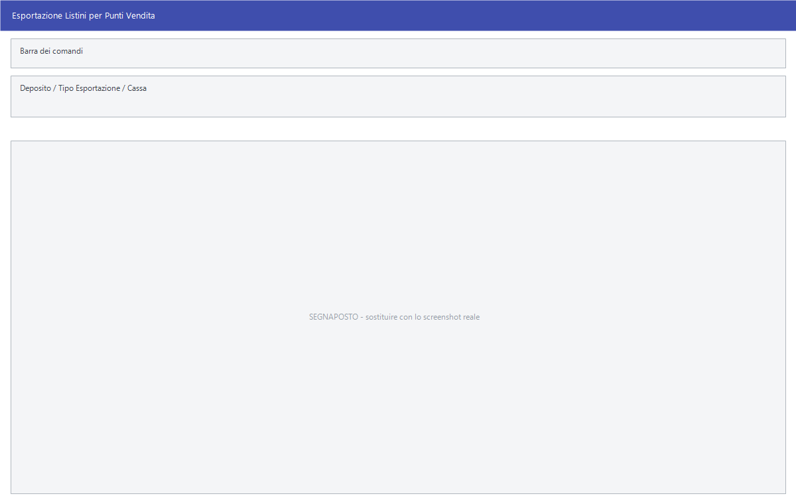

# Esportazioni con maschera propria

La maggior parte dei tracciati passa dalla
[maschera unica di esportazione](esportazione-documenti.md). Queste dieci voci
no: hanno una finestra loro, perché chiedono cose che le altre non chiedono.

!!! info "In sintesi"

    - **Percorso:**
        - Menu ▸ Trasferimenti ▸ Genera Listino per Punti Vendita
        - Menu ▸ Trasferimenti ▸ Esportazione Movimenti
        - Menu ▸ Trasferimenti ▸ Genera Dati per Facile Mobile
        - Menu ▸ Trasferimenti ▸ Genera Dati per Facile Agenti
        - Menu ▸ Trasferimenti ▸ Esportazione Anagrafica Articoli ▸ Magellano - Sony
        - Menu ▸ Trasferimenti ▸ Esportazione Anagrafica Articoli ▸ GDS Gruppo dello Stretto EXPERT
        - Menu ▸ Trasferimenti ▸ Esportazione Anagrafica Clienti ▸ Anagrafica Fidelity - SISA
        - Menu ▸ Trasferimenti ▸ Esportazione Sellout ▸ Esportazione Sellout - PERONI WS5
        - Menu ▸ Trasferimenti ▸ Esportazione Sellout ▸ Esportazione Sellout - SAGI
        - Menu ▸ Trasferimenti ▸ Esportazione Dati 730 Precompilati all'Agenzia delle Entrate
        - Menu ▸ Trasferimenti ▸ Invio Dati Forniture Fiscali
    - **Scorciatoia:** ++f2++ avvia, ++esc++ esce
    - **Permessi richiesti:** nessun profilo predefinito; le singole voci di menu si abilitano per ogni utente da [Archivi ▸ Utenti](../anagrafiche/utenti.md)

---

## A cosa serve

| Voce di menu | A cosa serve | Titolo della finestra |
|---|---|---|
| **Genera Listino per Punti Vendita** | Manda ai punti vendita il listino, completo o solo le variazioni. | *Esportazione Listini per Punti Vendita* |
| **Esportazione Movimenti** | Manda i movimenti, completi o solo le variazioni. La voce di menu ha uno spazio finale nel nome. | *Esportazione Movimenti* |
| **Genera Dati per Facile Mobile** | Prepara gli archivi per l'app che gli agenti usano in giro. | *(nessuna finestra: chiede conferma e lavora)* |
| **Genera Dati per Facile Agenti** | Prepara il file dati per il programma degli agenti: scadenze, depositi, sezioni, codici IVA, unità di misura, categorie, reparti e il resto delle tabelle. | *(nessuna finestra)* |
| **Magellano - Sony** | Esporta l'anagrafica articoli nel tracciato Magellano. | *Esportazione Anagrafica EXPERT - Gruppo dello stretto* |
| **GDS Gruppo dello Stretto EXPERT** | La stessa maschera, per il tracciato EXPERT. | *Esportazione Anagrafica EXPERT - Gruppo dello stretto* |
| **Anagrafica Fidelity - SISA** | Manda a SISA l'anagrafica delle tessere fedeltà. | *Esportazione Fidelity SISA* |
| **Esportazione Sellout - PERONI WS5** | Il venduto nel tracciato Peroni, con il dettaglio a video prima di esportare. | *Esportazione Vendite Peroni* |
| **Esportazione Sellout - SAGI** | Il venduto di una giornata nel tracciato SAGI. | *Data Vendite* |
| **Esportazione Dati 730 Precompilati all'Agenzia delle Entrate** | La trasmissione delle spese detraibili per il 730 precompilato. | *Invio Dati 730 Precompilati* |
| **Invio Dati Forniture Fiscali** | La comunicazione periodica dei movimenti di articoli fiscali. **Solo nella versione Fiscali.** | *Invio Movimenti Articoli Fiscali* |

## Prerequisiti

Prima di usare queste esportazioni occorre:

- per i **listini** e i **movimenti**, avere l'**identificatore della
  postazione** impostato in [Impostazioni Postazione](../utility/impostazioni-postazione.md):
  senza quello l'esportazione dei movimenti si ferma subito;
- per **Facile Mobile** e **Facile Agenti**, avere gli
  [agenti](../anagrafiche/anagrafica-agenti.md) in archivio;
- per il **730 precompilato**, avere i documenti con i dati del soggetto e le
  credenziali di trasmissione;
- per le **forniture fiscali**, avere sui
  [fornitori](../anagrafiche/anagrafica-fornitori.md) gli estremi
  dell'autorizzazione.

## La maschera

Sono finestre di selezione piccole, ciascuna con i propri campi e i pulsanti
**F2 - OK** ed **Esci**. **Esportazione Vendite Peroni** è invece una griglia:
mostra il venduto riga per riga prima di produrre il file.

## Campi

### Esportazione Listini per Punti Vendita

| Campo | Obbl. | Descrizione | Valori ammessi |
|---|:---:|---|---|
| **Deposito** | | Il [deposito](../magazzino/depositi.md) di cui esportare il listino. | codice |
| **Tipo Esportazione** | ● | Quanto esportare. | `VARIAZIONI ULTIMA ESPORTAZIONE`, `VARIAZIONI ULTIMO GIORNO`, `VARIAZIONI ULTIMA SETTIMANA`, `VARIAZIONI ULTIMO MESE`, `VARIAZIONI DA INIZIO ANNO`, `COMPLETA` |
| **Cassa** | | La cassa a cui destinare il listino. | codice |

{: .campi }

### Esportazione Movimenti

| Campo | Obbl. | Descrizione | Valori ammessi |
|---|:---:|---|---|
| **Tipo Esportazione** | ● | Quanto esportare. | gli stessi sei valori del listino |

{: .campi }

### Esportazione Anagrafica EXPERT - Gruppo dello stretto

| Campo | Obbl. | Descrizione | Valori ammessi |
|---|:---:|---|---|
| **Punto Vendita** | ● | Il punto vendita a cui l'anagrafica è destinata. | codice |
| **Deposito** | | Restringe a un deposito. | codice |
| **Marchio** | | Restringe a un [marchio](../magazzino/marchi.md). | codice |

{: .campi }

### Esportazione Fidelity SISA

| Campo | Obbl. | Descrizione | Valori ammessi |
|---|:---:|---|---|
| **Codice Cedi** | ● | Il codice del centro distributivo. | codice |
| **Codice P. V.** | ● | Il codice del punto vendita. | codice |
| **Campagna** | | La campagna promozionale a cui i dati si riferiscono. | codice |

{: .campi }

### Esportazione Vendite Peroni

| Campo | Obbl. | Descrizione | Valori ammessi |
|---|:---:|---|---|
| **Data Iniziale**, **Data Finale** | ● | Il periodo del venduto. | date |
| **Fornitore** | | Restringe a un fornitore. | codice |
| **Cat. Merceologica** | | Restringe a una [categoria merceologica](../magazzino/categorie-merceologiche.md). | codice |

{: .campi }

Le colonne della griglia sono **Data**, **Q.ta Venduta**, **Q.ta Omaggio**,
**Importo**, **Cliente**, **Destinazione**, **Codice**, **Descrizione**,
**Dep**, **VenHL**, **OmaHL**, **PezziConf**, **Capacità**, **Unità di
Misura**, **Cod Marchio**, **Desc. Marchio**, **Contenitore** e **Involucro**.

### Invio Dati 730 Precompilati

| Campo | Obbl. | Descrizione | Valori ammessi |
|---|:---:|---|---|
| **Data Iniziale**, **Data Finale** | ● | Il periodo dei documenti da comunicare. | date |
| **Tipo Invio 730** | ● | Che genere di comunicazione. | `INSERIMENTO`, `VARIAZIONE`, `RIMBORSO`, `CANCELLAZIONE`, `TUTTE` |
| **Operazione** | ● | Se fermarsi al file o mandarlo. | `GENERAZIONE`, `GENERAZIONE E INVIO` |

{: .campi }

### Invio Movimenti Articoli Fiscali

| Campo | Obbl. | Descrizione | Valori ammessi |
|---|:---:|---|---|
| **Trimestre** | ● | Il periodo da comunicare. | `TUTTO L'ANNO`, `PRIMO TRIMESTRE`, `SECONDO TRIMESTRE`, `TERZO TRIMESTRE`, `QUARTO TRIMESTRE` |
| **Anno** | ● | L'anno di riferimento. | anno |
| **Tipo Fornitore** | ● | La qualifica del soggetto. | `TIPOGRAFIA AUTORIZZATA`, `RIVENDITORE AUTORIZZATO` |
| **Autorizzazione** | ● | Gli estremi dell'autorizzazione. | testo |
| **Data Autorizzazione** | ● | La data dell'autorizzazione. | data |
| **Soggetto Invio** | | Chi effettua l'invio. | codice |

{: .campi }

## Pulsanti e comandi

| Comando | Scorciatoia | Effetto |
|---|---|---|
| **F2 - OK** | ++f2++ | Avvia l'esportazione. |
| **Esci** | ++esc++ | Chiude senza fare nulla. |
| Elenco valori | ++f10++ o ++space++ | Sui campi con il codice, apre l'elenco. |

## Come si fa

### Mandare ai punti vendita solo quello che è cambiato

1. Apri **Menu ▸ Trasferimenti ▸ Genera Listino per Punti Vendita**.
2. Metti **Tipo Esportazione** su `VARIAZIONI ULTIMA ESPORTAZIONE`: parte da
   dove si era rimasti l'ultima volta, senza saltare né ripetere.
3. Indica il **Deposito** e la **Cassa** se servono.
4. Premi **F2 - OK**.

Usa `COMPLETA` solo quando il punto vendita va riallineato da capo.

### Preparare i dati per gli agenti

1. Apri **Menu ▸ Trasferimenti ▸ Genera Dati per Facile Agenti**.
2. Alla domanda *Vuoi esportare tutti i depositi ?* rispondi **Sì** per tutti,
   **No** per sceglierne uno, **Annulla** per fermare.
3. Facile esporta una tabella per volta e lo dice nella finestra di attesa.

### Esportare il venduto Peroni

1. Apri **Esportazione Sellout - PERONI WS5**.
2. Indica il periodo e, se serve, fornitore e categoria merceologica.
3. Controlla la griglia: è quello che sta per essere esportato.
4. Premi **F2 - OK**.

### Trasmettere il 730 precompilato

1. Apri **Menu ▸ Trasferimenti ▸ Esportazione Dati 730 Precompilati
   all'Agenzia delle Entrate**.
2. Indica il periodo e il **Tipo Invio 730**.
3. Metti **Operazione** su `GENERAZIONE` per produrre solo il file e
   controllarlo, oppure su `GENERAZIONE E INVIO` per trasmetterlo.

## Controlli e messaggi

| Messaggio | Causa | Cosa fare |
|---|---|---|
| *Identificatore postazione non impostato !* | Manca l'identificativo della postazione. | Impostalo da [Impostazioni Postazione](../utility/impostazioni-postazione.md). |
| *Vuoi esportare tutti i depositi ?* | Inizio dell'esportazione per gli agenti. | **Sì** tutti, **No** per sceglierne uno, **Annulla** ferma. |
| *Impossibile creare il File!* | Facile non riesce a scrivere il file. | Controlla che la cartella esista e sia scrivibile. |
| *Impossibile aprire il file !* | Idem, in esportazione SAGI. | Come sopra. |
| *Non è stato trovato nessun record di vendita !* | Nella data indicata non c'è venduto. | Controlla la data. |

<!-- DA VERIFICARE: i messaggi propri della generazione dati per Facile Mobile e della trasmissione 730. -->

## Note

!!! note "«Variazioni ultima esportazione» tiene il segno"

    È l'opzione da usare di norma: Facile ricorda fin dove era arrivato e
    riparte da lì. Le altre lavorano su una finestra di tempo fissa e possono
    lasciare buchi o produrre doppioni.

!!! warning "Il 730 va controllato prima di trasmettere"

    Con **Operazione** su `GENERAZIONE E INVIO` il file parte subito verso
    l'Agenzia delle Entrate. La prima volta conviene fermarsi a `GENERAZIONE`,
    aprire il file e verificarlo.

<!-- DA VERIFICARE: in quale cartella finiscono i file generati da ciascuna di queste esportazioni. -->

<!-- DA VERIFICARE: come Facile ricorda il punto dell'ultima esportazione e come lo si azzera. -->

<!-- DA VERIFICARE: che cosa comprende esattamente "Genera Dati per Facile Mobile" e come i dati arrivano ai dispositivi. -->

## Vedi anche

- [Esportazione documenti per tracciato](esportazione-documenti.md)
- [Ricezione dati](ricezione-dati.md)
- [Impostazioni della postazione](../utility/impostazioni-postazione.md)
- [Anagrafica agenti](../anagrafiche/anagrafica-agenti.md)
