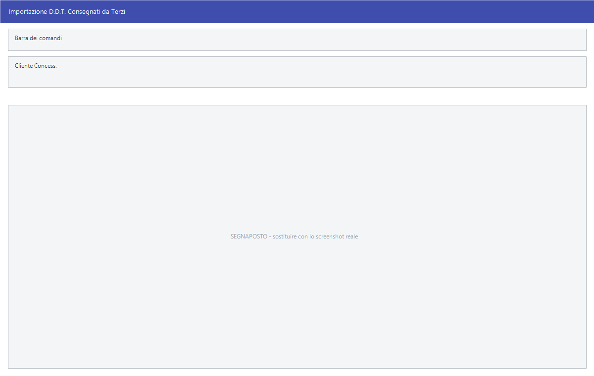

# Ricezione dati

Il rovescio dell'esportazione: qui i dati entrano. Chi lavora con una centrale
riceve periodicamente listini, anagrafiche e promozioni già pronti, e non li
ribatte a mano — li carica da qui.

!!! info "In sintesi"

    - **Percorso:** Menu ▸ Trasferimenti ▸ Ricezione Dati ▸ *(una delle voci)*
    - **Scorciatoia:** ++f2++ avvia, ++esc++ esce
    - **Permessi richiesti:** nessun profilo predefinito; le singole voci di menu si abilitano per ogni utente da [Archivi ▸ Utenti](../anagrafiche/utenti.md)

---

## A cosa serve

| Voce di menu | Cosa carica |
|---|---|
| **Aggiornamento Listino** | Il listino aggiornato mandato dalla centrale, in formato Facile. |
| **Ricezione DDT Consegnati da Terzi Formato FACILE** | I documenti di trasporto emessi da un concessionario per conto tuo. La finestra si chiama *Importazione D.D.T. Consegnati da Terzi*. |
| **Ricezione Movimenti di Vendita** | I movimenti di vendita provenienti da un'altra installazione. |
| **Aggiornamento Dati Agenti** | I dati che tornano dal programma degli agenti. |
| **Acquisizione Variazioni DIMEGLIO** | Le variazioni di anagrafica e listino nel tracciato DI MEGLIO. La finestra si chiama *Importazione Aggiornamenti Argon*. |
| **Acquisizione Variazioni ERGON** | Le stesse, nel tracciato ERGON: è la medesima maschera. |
| **Acquisizione Variazioni NEW FDM s.p.a.** | Le variazioni articoli nel tracciato Day Discount. |
| **Acquisizione Variazioni SIDA** | Articoli **e** promozioni SIDA, in due passaggi consecutivi. |
| **Importazione Listino da Foglio Excel 2003** | Un listino da un foglio Excel con la colonna `CODICE`. |
| **Importazione Commessa da WinWork** | Una commessa prodotta da WinWork. La finestra si chiama *Importazione Dati da WinWork*. |
| **Acquisizione Variazioni GDA Retail s.p.a.** | Le variazioni nel tracciato GDA Retail. |
| **Acquisizione Dati Diamante s.p.a.** | I dati Diamante. La finestra si chiama *Ricezione Dati da Diamante S.p.a.* |
| **Acquisizione Dati Farmadati** | L'anagrafica del farmaco. |
| **Importazione Anagrafica CRAI Calabria** | L'anagrafica articoli CRAI Calabria. |
| **Importazione Anagrafica Meridi s.r.l.** | L'anagrafica Meridi. |
| **Importazione Anagrafica CRAI Sicilia - Evision** | L'anagrafica CRAI Sicilia. |
| **Importazione Anagrafica Metel** | I listini nel tracciato Metel, standard del settore elettrico. |
| **Importazione Promozione CDS s.p.a.** | Le promozioni CDS. |
| **Importazione Promozione Aster** | Le promozioni Aster. |

## Prerequisiti

Prima di ricevere occorre:

- avere **il file**, nella cartella e con il nome che la procedura si aspetta:
  ogni tracciato ha il suo — `ANA*.TXT` per le anagrafiche SIDA, `off*.TXT` per
  le promozioni SIDA, e così via;
- avere il **livello di importazione** configurato: se non è valido, il
  caricamento dei listini si ferma subito;
- avere il **deposito principale** impostato nei
  [parametri della ditta](../anagrafiche/ditte.md) per l'importazione da Excel;
- **una copia di sicurezza degli archivi**: una ricezione sbagliata riscrive
  prezzi e anagrafiche su tutto il magazzino.

## La maschera

Quasi tutte le voci non hanno maschera: chiedono conferma, aprono la finestra
di scelta del file e lavorano mostrando l'avanzamento. Hanno una finestra
propria **Ricezione DDT Consegnati da Terzi** (un campo, *Cliente Concess.*),
**Acquisizione Variazioni DIMEGLIO / ERGON** (una griglia di confronto),
**Importazione Commessa da WinWork** e **Acquisizione Dati Diamante s.p.a.**

## Campi

### Importazione D.D.T. Consegnati da Terzi

| Campo | Obbl. | Descrizione | Valori ammessi |
|---|:---:|---|---|
| **Cliente Concess.** | ● | Il concessionario che ha emesso i documenti. | codice |

{: .campi }

### Importazione Aggiornamenti Argon

Non ha campi di testata: si lavora nella griglia, che mette a confronto quello
che c'è e quello che arriva. Le colonne sono **Sel.**, **Codice**,
**Descrizione**, **1° Listino**, **2 ° Listino**, **3° Listino**, **Diff. |
Lis. 1 - 2**, **Ult. Prezzo Acq.**, **1° Listino %Mar.**, **1° Listino %Ric.**,
**2° Listino %Mar.**, **2° Listino %Ric.** e **Decorrenza**.

Si spuntano le righe da accettare: quello che non è spuntato non entra.

<!-- DA VERIFICARE: i campi delle maschere di importazione WinWork e Diamante. -->

## Pulsanti e comandi

| Comando | Scorciatoia | Effetto |
|---|---|---|
| **F2 - OK** | ++f2++ | Avvia la ricezione. |
| **Esci** | ++esc++ | Chiude senza fare nulla. |
| Elenco valori | ++f10++ o ++space++ | Sui campi con il codice, apre l'elenco. |

## Come si fa

### Caricare il listino mandato dalla centrale

1. **Fai una copia di sicurezza degli archivi.**
2. Metti il file ricevuto nella cartella concordata.
3. Apri **Menu ▸ Trasferimenti ▸ Ricezione Dati ▸ Aggiornamento Listino**.
4. Alla domanda *Sono presenti Listini Aggiornati! Vuoi Caricarli?* rispondi
   **Sì**.
5. Controlla i prezzi nuovi dalla
   [gestione listini](../listini-vendita/gestione-listini.md) prima di mandarli
   a [casse e bilance](../casse-bilance/casse.md).

### Accettare solo una parte delle variazioni

1. Apri **Acquisizione Variazioni ERGON** — o **DIMEGLIO**, è la stessa
   maschera.
2. Nella griglia confronta i prezzi attuali con quelli proposti: le colonne dei
   margini e dei ricarichi dicono se il prezzo di vendita regge.
3. Spunta **solo** le righe che vuoi accettare.
4. Conferma.

### Importare un listino da Excel

1. Prepara il foglio con almeno la colonna `CODICE`.
2. Apri **Importazione Listino da Foglio Excel 2003** e rispondi **Sì** alla
   domanda.
3. Scegli il file.
4. Alla domanda *Vuoi procedere con l' importazione del listino ?* rispondi
   **Sì** dopo aver controllato quello che è stato letto.

### Caricare articoli e promozioni SIDA

**Acquisizione Variazioni SIDA** fa due cose di seguito: prima gli articoli dai
file `ANA*.TXT`, poi le promozioni dai file `off*.TXT`, chiedendo conferma per
ciascuna. Se una delle due non serve, rispondi **No** alla sua domanda.

## Controlli e messaggi

| Messaggio | Causa | Cosa fare |
|---|---|---|
| *Livello Importazioni non Valido!* | Il livello di importazione configurato non è ammesso. | Chiama l'assistenza: è un parametro di configurazione. |
| *Sono presenti Listini Aggiornati! Vuoi Caricarli?* — oppure *E' presente un Listino Aggiornato! Vuoi Caricarlo?* | Facile ha trovato uno o più listini da caricare. | **Sì** procede. |
| *Vuoi rimuovere il primo listino ?* | Ci sono più listini in coda. | **Sì** scarta il più vecchio. La risposta preimpostata è **No**. |
| *Nessun file ANA\*.TXT da importare !* | Manca il file delle anagrafiche SIDA. | Controlla che il file sia nella cartella giusta. |
| *Nessun file off\*.TXT da importare !* | Manca il file delle promozioni SIDA. | Come sopra. |
| *Confermi l' acquisizione delle variazioni ?* | Conferma prima di caricare le anagrafiche. | **Sì** procede. |
| *Confermi l' acquisizione delle promozioni ?* | Conferma prima di caricare le promozioni. | **Sì** procede. |
| *Deposito principale non impostato o non valido !* | L'importazione da Excel non sa dove mettere i dati. | Impostalo nei [parametri della ditta](../anagrafiche/ditte.md). |
| *Colonna CODICE non trovata nel documento !* | Il foglio Excel non ha la colonna attesa. | Correggi le intestazioni. |
| *Formato file non compatibile!* | Il foglio non è nel formato atteso. | Salvalo come Excel 2003 (`.xls`). |
| *File utilizzato da un' altra applicazione o formato file non compatibile!* | Il file è aperto in Excel. | Chiudilo e riprova. |
| *Impossibile Creare la tabella* | La lettura del foglio non è riuscita. | Riprova; se insiste, segnala all'assistenza. |
| *File di Interscambio non Valido!* | Il file degli agenti non ha la struttura attesa. | Controlla di aver preso il file giusto. |
| *Versione File di Interscambio non Valido!* | Il file viene da una versione diversa del programma. | Allinea le versioni fra sede e agenti. |
| *Anno File di Interscambio non Valido!* | Il file è di un altro anno di gestione. | Cambia anno di lavoro o rigenera il file. |
| *Sono presenti dati aggiornati! Vuoi Caricarli?* | Ci sono dati degli agenti da caricare. | **Sì** procede. |
| *Nessun file di movimenti presente sul server* | Non c'è niente da ricevere. | Controlla che il file sia stato depositato. |
| *Impossibile aprire il file* | Facile non riesce a leggere il file. | Controlla percorso e permessi. |

## Note

!!! warning "Una ricezione riscrive gli archivi"

    Listini, anagrafiche e promozioni ricevuti **sovrascrivono** quello che c'è.
    Non esiste un annullamento: l'unico modo per tornare indietro è ripristinare
    la copia degli archivi. Falla sempre prima.

!!! note "Le variazioni si possono accettare a metà"

    Le maschere a griglia — DIMEGLIO ed ERGON — permettono di scegliere riga per
    riga. Le altre caricano tutto quello che trovano nel file: se una parte non
    va bene, va corretta dopo, a mano.

!!! note "SIDA e CDS caricano le promozioni con la stessa procedura"

    **Importazione Promozione CDS s.p.a.** usa la stessa funzione delle
    promozioni SIDA, e cerca quindi gli stessi file `off*.TXT`.

<!-- DA VERIFICARE: se l'uso della stessa procedura per le promozioni CDS e SIDA sia voluto o un residuo. -->

<!-- DA VERIFICARE: in quale cartella ciascuna procedura cerca il proprio file. -->

<!-- DA VERIFICARE: cosa comprende esattamente "Aggiornamento Dati Agenti" e in che verso viaggiano i dati. -->

## Vedi anche

- [Esportazione documenti per tracciato](esportazione-documenti.md)
- [Esportazioni con maschera propria](esportazioni-specifiche.md)
- [Gestione listini](../listini-vendita/gestione-listini.md)
- [Promozioni](../vendite/promozioni.md)
