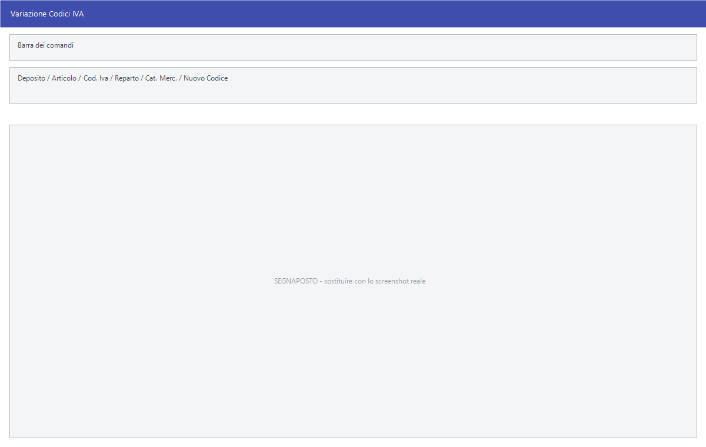

# Assistenza

Il sottomenu **Assistenza** contiene le procedure che intervengono sugli
archivi in modo massivo: cambiano un codice ovunque compaia, rimuovono
movimenti, azzerano campi. Quasi tutte chiedono una **password** che ha
l'assistenza R.S.A., e non a caso.

!!! danger "Queste procedure vanno usate con l'assistenza"

    Non esiste annullamento. Prima di ciascuna, il programma stesso avvisa:
    *«Prima di utilizzare la procedura assicurarsi che nessun altro utente stia
    utilizzando il programma. Per la vostra sicurezza si consiglia di fare una
    copia di dei dati prima di continuare. Prima di procedere è necessario
    effettuare un accesso ai dati di tutti gli anni di gestione presenti negli
    archivi e concludere con successo la funzione Aggiorna Catalogo Dati.»*

!!! info "In sintesi"

    - **Percorso:** Menu ▸ Utility ▸ Assistenza ▸ *(una delle voci)*
    - **Scorciatoia:** ++f2++ conferma, ++esc++ esce
    - **Permessi richiesti:** oltre all'abilitazione della voce di menu da [Archivi ▸ Utenti](../anagrafiche/utenti.md), quasi tutte chiedono la **password dell'assistenza** nella finestra *Richiesta Password*

---

## A cosa serve

### Variazione dei codici

Cambiano un codice **ovunque compaia negli archivi**: anagrafiche, movimenti,
documenti, storico. È l'unico modo corretto di rinumerare qualcosa che è già
stato usato.

| Voce di menu | Cosa varia | Titolo della finestra |
|---|---|---|
| **Variazione Codici Cat. Merceologiche** | Le [categorie merceologiche](../magazzino/categorie-merceologiche.md). | *Variazione Cat. Merceologiche* |
| **Variazione Codici Iva** | Le [aliquote IVA](../contabilita/aliquote-iva.md). | *Variazione Codici IVA* |
| **Variazione Codici Reparti** | I [reparti](../magazzino/reparti.md). | *Variazione Reparti* |
| **Variazione Codici Stagione** | Le [stagioni](../magazzino/stagioni.md). | *Variazione Stagioni* |
| **Variazione Codici Marchi** | I [marchi](../magazzino/marchi.md). | *Variazione Marchi* |
| **Variazione Codici Deposito** | I [depositi](../magazzino/depositi.md). | *Variazione Deposito* |
| **Variazione Codici Articoli** | Il codice di un [articolo](../anagrafiche/anagrafica-articoli.md). | *Variazione Codice Articolo* |
| **Variazione Codici Cat. Economica Clienti** | Le [categorie economiche](../anagrafiche/categorie-economiche.md). | *Varia Categoria Economica Clienti* |
| **Variazione Codici Causali Magazzino** | Le [causali di magazzino](../magazzino/causali-magazzino.md). | *Varia Categoria Economica Clienti* |
| **Variazione Codici Operatori** | Gli [operatori](../altre-tabelle/operatori.md). | *Varia Categoria Economica Clienti* |
| **Variazione Codici Agenti** | Gli [agenti](../anagrafiche/anagrafica-agenti.md). | *Varia Categoria Economica Clienti* |
| **Variazione Codici Commesse** | Le [commesse](../contabilita/commesse.md). | *Varia Categoria Economica Clienti* |
| **Variazione Registro Scontrini** | Il registro degli [scontrini](../vendite/scontrini.md). | *Varia Registro Scontrini* |
| **Variazione Registro Carichi** | Il registro dei [carichi](../magazzino/carico-merci.md). | *Varia Registro Scontrini* |
| **Varia Conto** | Un [conto](../contabilita/conti.md) del piano dei conti. | *Variazione Conto* |
| **Variazione Sottoconti** | I [sottoconti](../contabilita/sottoconti.md). | — |
| **Spostamento Codici Clienti** | Sposta i codici dei [clienti](../anagrafiche/anagrafica-clienti.md). | — |

### Correzioni sugli articoli

| Voce di menu | A cosa serve |
|---|---|
| **Azzera Listino** | Azzera un [listino](../listini-vendita/gestione-listini.md) intero. |
| **Inversione Modalità IVA** | Converte l'archivio da IVA esclusa a IVA inclusa o viceversa. |
| **Articoli IVA Inclusa** / **Articoli IVA Esclusa** | Impostano il modo in cui i prezzi degli articoli sono intesi. |
| **Aggiorna Gruppi da Tabella** / **Aggiorna Sottogruppi da Tabella** | Riallineano gruppi e sottogruppi degli articoli alla tabella. |
| **Associa Settori->Gruppi** | Associa i settori ai gruppi. |
| **Tronca Descrizioni Articoli a 30 Car** | Accorcia le descrizioni a trenta caratteri, per gli apparecchi che non ne accettano di più. |
| **Azzeramento Commissione Articoli** | Azzera la commissione sugli articoli. |
| **Abilita Trasferimento Articoli** | Rimette il segno «da mandare» sugli articoli, per rifare un invio a [casse e bilance](../casse-bilance/casse.md). |
| **Cancellazione Articoli Inesistenti** | La voce di menu c'è ma **non fa nulla**: la funzione è vuota. |

### Rimozioni e riporti

| Voce di menu | A cosa serve |
|---|---|
| **Cancellazione Buoni Sconto Scaduti** | Toglie dall'archivio i buoni sconto scaduti. |
| **Cancellazione Movimenti di Vendita** | Rimuove i movimenti di vendita. |
| **Rimozione Movimento Prima Nota** | Rimuove un intervallo di registrazioni di [prima nota](../contabilita/gestione-prima-nota.md). La finestra si chiama *Rimozione Movimento di Prima Nota*. |
| **Rimozione Movimenti di Magazzino** | Rimuove un intervallo di [movimenti di magazzino](../magazzino/movimenti-magazzino.md). |
| **Riporto Saldi Contabili da Scadenziario** | Ricostruisce i saldi contabili partendo dallo [scadenziario](../scadenze/gestione-scadenze.md). |
| **Abilita NoSync** | Disattiva la sincronizzazione. |

## Prerequisiti

Prima di ogni procedura di questo menu occorre:

- **la password dell'assistenza**;
- **una copia di sicurezza degli archivi**;
- che **nessun altro utente stia usando il programma**;
- aver aperto **tutti gli anni di gestione** presenti negli archivi e aver
  eseguito con successo
  [Aggiorna Catalogo Dati](manutenzione-archivi.md) su ciascuno.

L'ultimo punto è quello che viene dimenticato più spesso, ed è quello che fa
fallire le variazioni di codice a metà strada.

## La maschera

Prima si apre **Richiesta Password**, con un campo **Password** e i pulsanti
**F2 - OK** ed **Esci**. Superata quella, compare l'avviso di cautela e poi la
maschera vera, che nella grande maggioranza dei casi ha due soli campi: il
codice attuale e quello nuovo.

## Campi

### Variazione dei codici degli articoli

| Campo | Obbl. | Descrizione | Valori ammessi |
|---|:---:|---|---|
| **Deposito** | | Restringe a un deposito. | codice |
| **Articolo** | | Restringe a un articolo. | codice |
| **Cod. Iva**, **Reparto**, **Cat. Merc.**, **Fornitore**, **Stagione**, **Gruppo**, **Marchio**, **Sottogruppo** | | I filtri con cui scegliere quali articoli toccare. | codici |
| **Nuovo Codice** | ● | Il codice da attribuire. | codice |

{: .campi }

### Le variazioni a due campi

| Maschera | Campi |
|---|---|
| *Variazione Codice Articolo* | **Articolo**, **Nuovo Codice** |
| *Varia Categoria Economica Clienti* | **Da Cat. Economica**, **A Cat. Economica** |
| *Varia Registro Scontrini* | **Da Registro**, **A Registro** |
| *Variazione Conto* | **Da Conto**, **A Conto** |

### Rimozione Movimento di Prima Nota

| Campo | Obbl. | Descrizione | Valori ammessi |
|---|:---:|---|---|
| **Da Numero**, **A Numero** | ● | L'intervallo di registrazioni. | numeri |
| **Da Data**, **A Data** | ● | Il periodo. | date |

{: .campi }

### Rimozione Movimenti di Magazzino

| Campo | Obbl. | Descrizione | Valori ammessi |
|---|:---:|---|---|
| **Da Num. Movimento**, **A Num. Movimento** | ● | L'intervallo di movimenti. | numeri |
| **Da Data**, **A Data** | ● | Il periodo. | date |
| **Causale Magazzino** | | Restringe a una causale. | codice |
| **Deposito** | | Restringe a un deposito. | codice |

{: .campi }

### Riporto Saldi Contabili da Scadenziario

| Campo | Obbl. | Descrizione | Valori ammessi |
|---|:---:|---|---|
| **Data** | ● | La data delle registrazioni generate. | data |
| **Riporta** | ● | Da quale scadenziario partire. | `CLIENTI`, `FORNITORI` |
| **Causale Cont.** | ● | La [causale contabile](../contabilita/causali-contabili.md) da usare. | codice |
| **Bil. Apertura** | | Il conto di bilancio di apertura. | codice |

{: .campi }

### Azzera Listino

| Campo | Obbl. | Descrizione | Valori ammessi |
|---|:---:|---|---|
| **Listino** | ● | Il listino da azzerare. | codice |

{: .campi }

## Pulsanti e comandi

| Comando | Scorciatoia | Effetto |
|---|---|---|
| **F2 - OK** | ++f2++ | Conferma la password, o avvia la procedura. |
| **Esci** | ++esc++ | Chiude senza fare nulla. |
| Elenco valori | ++f10++ o ++space++ | Sui campi con il codice, apre l'elenco. |

## Come si fa

### Cambiare un codice già usato

1. Chiama l'assistenza e concorda l'intervento.
2. **Fai una copia di sicurezza degli archivi** e fai uscire tutti dal
   programma.
3. Apri ogni anno di gestione con
   [Scegli Esercizio](esercizi-e-chiusure.md) ed esegui su ciascuno
   **Aggiorna Catalogo Dati**.
4. Apri la voce di variazione che serve e inserisci la password.
5. Indica il codice attuale e il **Nuovo Codice**.
6. Alla domanda *Confermi la Variazione?* rispondi **Sì**.
7. A fine lavoro Facile mostra un riepilogo di quello che ha toccato.

### Rimuovere un blocco di movimenti sbagliati

1. Stampa prima l'elenco di quello che stai per togliere — il
   [giornale di magazzino](../magazzino/stampe-movimenti-magazzino.md) o il
   [libro giornale](../contabilita/stampe-contabili.md).
2. Fai la copia di sicurezza.
3. Apri **Rimozione Movimenti di Magazzino** o **Rimozione Movimento Prima
   Nota**, inserisci la password e indica l'intervallo.

## Controlli e messaggi

| Messaggio | Causa | Cosa fare |
|---|---|---|
| *Password non Valida!* | La password inserita non è corretta. | Chiedila all'assistenza: non è una password d'utente. |
| *Attenzione! Prima di utilizzare la procedura assicurarsi che nessun altro utente stia utilizzando il programma. …* | L'avviso di cautela che precede quasi tutte le procedure. | Leggilo: elenca i tre prerequisiti veri. |
| *Confermi la Variazione?* | Conferma prima di cambiare i codici. | **Sì** procede. La risposta preimpostata è **No**. |

<!-- DA VERIFICARE: i messaggi finali di riepilogo delle variazioni di codice. -->

## Note

!!! warning "Tre voci non chiedono la password"

    **Cancellazione Buoni Sconto Scaduti**, **Variazione Sottoconti** e
    **Cancellazione Articoli Inesistenti** partono senza chiedere nulla. Le
    prime due modificano comunque gli archivi: trattale con la stessa cautela
    delle altre.

!!! warning "«Cancellazione Articoli Inesistenti» non fa nulla"

    La voce compare nel menu ma nel programma la funzione è vuota: premendola
    non succede niente. È un difetto noto, non un problema della tua
    installazione.

!!! note "Perché serve aprire tutti gli anni"

    Una variazione di codice deve raggiungere anche gli archivi degli anni
    passati. Se un anno non è stato aperto e catalogato, la procedura non lo
    vede: il codice resta cambiato in un anno e vecchio in un altro, e le
    statistiche pluriennali smettono di quadrare.

!!! note "Molte finestre riusano lo stesso titolo"

    Cinque voci diverse — categorie economiche, causali di magazzino, operatori,
    agenti, commesse — aprono una finestra intitolata *Varia Categoria Economica
    Clienti*, perché è la stessa maschera parametrizzata. Il titolo non è
    aggiornato, ma i campi lavorano sul dato giusto.

<!-- DA VERIFICARE: quali archivi vengono toccati da ciascuna variazione di codice. -->

<!-- DA VERIFICARE: cosa fa "Abilita NoSync" e in quali situazioni l'assistenza lo usa. -->

<!-- DA VERIFICARE: che differenza c'è fra "Inversione Modalità IVA" e la coppia "Articoli IVA Inclusa/Esclusa". -->

## Vedi anche

- [Manutenzione degli archivi](manutenzione-archivi.md)
- [Esercizi, ditte e chiusure contabili](esercizi-e-chiusure.md)
- [Movimenti di magazzino](../magazzino/movimenti-magazzino.md)
- [Gestione prima nota](../contabilita/gestione-prima-nota.md)
