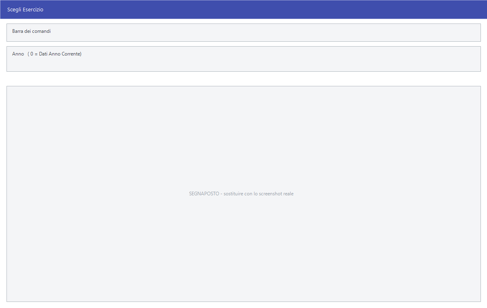

# Esercizi, ditte e chiusure contabili

Facile lavora su **una ditta e un anno per volta**. Queste voci servono a
spostarsi fra gli uni e gli altri, e a compiere il passaggio d'anno vero e
proprio: creare l'esercizio nuovo, chiudere i conti del vecchio, riaprirli.

!!! info "In sintesi"

    - **Percorso:**
        - Menu ▸ Utility ▸ Seleziona Archivio
        - Menu ▸ Utility ▸ Cambio Ditta
        - Menu ▸ Utility ▸ Scegli Esercizio
        - Menu ▸ Utility ▸ Nuovo Esercizio
        - Menu ▸ Utility ▸ Chiusura Conti
        - Menu ▸ Utility ▸ Annullamento Chiusura Conti
        - Menu ▸ Utility ▸ Riapertura Conti
        - Menu ▸ Utility ▸ Annullamento Riapertura Conti
    - **Scorciatoia:** ++f2++ conferma, ++esc++ esce
    - **Permessi richiesti:** nessun profilo predefinito; le singole voci di menu si abilitano per ogni utente da [Archivi ▸ Utenti](../anagrafiche/utenti.md)

---

## A cosa serve

| Voce di menu | A cosa serve |
|---|---|
| **Seleziona Archivio** | Cambia la cartella degli archivi su cui Facile lavora e richiede l'accesso. Serve a chi tiene più installazioni sullo stesso computer. |
| **Cambio Ditta** | Passa a un'altra [ditta](../anagrafiche/ditte.md). |
| **Scegli Esercizio** | Passa a un altro anno di gestione, o torna all'anno corrente. |
| **Nuovo Esercizio** | Crea gli archivi dell'anno nuovo e, se vuoi, riporta le esistenze di magazzino. |
| **Chiusura Conti** | Genera le scritture di chiusura dell'esercizio. |
| **Annullamento Chiusura Conti** | Le toglie. |
| **Riapertura Conti** | Genera le scritture di apertura dell'esercizio nuovo. |
| **Annullamento Riapertura Conti** | Le toglie. |

## Prerequisiti

Prima del passaggio d'anno occorre:

- **una copia di sicurezza degli archivi**;
- avere chiuso e controllato la contabilità dell'anno che si sta lasciando —
  [liquidazione IVA](../contabilita/liquidazione-iva.md), quadratura delle
  [schede contabili](../contabilita/schede-contabili.md);
- aver fatto l'[inventario](../inventario/menu-inventario.md), se le esistenze
  vanno riportate;
- avere in [piano dei conti](../contabilita/conti.md) i conti che la chiusura e
  la riapertura richiedono, e le
  [causali contabili](../contabilita/causali-contabili.md) di chiusura e
  apertura.

## La maschera

**Scegli Esercizio** è una finestrella con un campo. **Cambio Ditta** apre
l'elenco delle ditte. **Chiusura Conti** e **Riapertura Conti** chiedono i conti
e la causale da usare. **Nuovo Esercizio** non ha campi: chiede conferma e
lavora.

## Campi

### Scegli Esercizio

| Campo | Obbl. | Descrizione | Valori ammessi |
|---|:---:|---|---|
| **Anno** | ● | L'anno di gestione su cui lavorare. A fianco l'etichetta ricorda **( 0 = Dati Anno Corrente)**. | anno, `0` per l'anno corrente |

{: .campi }

### Chiusura Conti

| Campo | Obbl. | Descrizione | Valori ammessi |
|---|:---:|---|---|
| **Conto Utile** | ● | Il conto su cui gira l'utile d'esercizio. | codice |
| **Conto Perdite** | ● | Il conto su cui gira la perdita. | codice |
| **Conto Bilancio di Chiusura** | ● | Il conto di chiusura. | codice |
| **Conto Profitti e Perdite** | ● | Il conto economico di raccordo. | codice |
| **Codice Causale Chiusura** | ● | La [causale contabile](../contabilita/causali-contabili.md) con cui registrare le scritture. | codice |
| **Anno Chiusura** | ● | L'anno da chiudere. | anno |
| **Data Registr. Movimenti** | ● | La data con cui vengono registrate le scritture. | data |

{: .campi }

### Riapertura Conti

| Campo | Obbl. | Descrizione | Valori ammessi |
|---|:---:|---|---|
| **Conto Rimanenze Iniziali** | ● | Il conto delle rimanenze iniziali. | codice |
| **Conto Rimanenze Finali** | ● | Il conto delle rimanenze finali. | codice |
| **Conto Bilancio di Apertura** | ● | Il conto di apertura. | codice |
| **Codice Causale Apertura** | ● | La causale con cui registrare le scritture. | codice |
| **Anno Apertura Conti** | ● | L'anno da aprire. | anno |
| **Data Registr. Movimenti** | ● | La data delle scritture. | data |

{: .campi }

## Pulsanti e comandi

| Comando | Scorciatoia | Effetto |
|---|---|---|
| **F2 - OK** | ++f2++ | Conferma e avvia. |
| **Esci** | ++esc++ | Chiude senza fare nulla. |
| Elenco valori | ++f10++ o ++space++ | Sui campi con il codice, apre l'elenco. |

## Come si fa

### Guardare i dati di un anno passato

1. Apri **Menu ▸ Utility ▸ Scegli Esercizio**.
2. Indica l'**Anno**.
3. Per tornare all'anno in corso, riapri la stessa voce e metti `0`.

Molte elaborazioni — [inventario](../inventario/menu-inventario.md) compreso —
si rifiutano di lavorare su un anno che non sia quello corrente, e lo dicono
con un messaggio.

### Aprire l'anno nuovo

1. **Fai una copia di sicurezza degli archivi.**
2. Apri **Menu ▸ Utility ▸ Nuovo Esercizio**.
3. Alla fine Facile dice *Creazione Archivi nuovo anno conclusa regolarmente
   ! Vuoi Riportare le Esistenze di Magazzino?*: rispondi **Sì** se hai già
   fatto l'inventario e vuoi partire dalle esistenze reali; **No** se preferisci
   partire da zero.
4. Se rispondi **No**, Facile avvisa che tutte le esistenze sono azzerate.

### Chiudere e riaprire i conti

1. Controlla la contabilità dell'anno che chiudi.
2. Apri **Chiusura Conti**, compila i conti e la causale, indica l'**Anno
   Chiusura** e la **Data Registr. Movimenti**.
3. Conferma alle due domande.
4. Apri **Riapertura Conti** e fai lo stesso per l'anno nuovo.

Se qualcosa non torna, **Annullamento Chiusura Conti** e **Annullamento
Riapertura Conti** tolgono le scritture e si può rifare.

## Controlli e messaggi

| Messaggio | Causa | Cosa fare |
|---|---|---|
| *Creazione Archivi nuovo anno conclusa regolarmente ! Vuoi Riportare le Esistenze di Magazzino?* | Il nuovo esercizio è stato creato. | **Sì** riporta le esistenze, **No** parte da zero. |
| *Tutte le esistenze degli articoli sono azzerate!* | Hai scelto di non riportare le esistenze. | Nessuna azione. |
| *Non ci sono movimenti contabili per l'anno selezionato!* | Nell'anno indicato non c'è prima nota da chiudere. | Controlla l'anno. |
| *Chiusura Conti eseguita ! E' Necessario Annullare la Chiusura per Continuare.* | I conti dell'anno sono già chiusi. | Usa **Annullamento Chiusura Conti** e ripeti. |
| *Vuoi Veramente Annullare i Movimenti di Chiusura Conti per l' Anno N?* poi *Confermi l'Annullamento dei Movimenti di Chiusura Conti per l' Anno N ?* | Hai avviato l'annullamento. | Rispondi **Sì** a entrambe. La risposta preimpostata è **No**. |
| *L'operazione e' consentita solo con gli archivi dell'  ultimo esercizio gestito !* | Si prova a creare il nuovo esercizio stando su un anno passato. | Torna all'anno corrente con **Scegli Esercizio**. |
| *Attenzione!  La procedure cambiera' in modo irreversibile gli archivi. Prima di continuare fare una copia di backup dei dati e accertarsi che nessun altro utente abbia accesso al programma.  Vuoi Continuare ?* | Conferma richiesta da **Nuovo Esercizio**. | Fai davvero la copia e manda fuori tutti prima di rispondere **Sì**. La risposta preimpostata è **No**. |
| *Causale Mag. Riporto Esistenze non valida o non impostata!* | Nella [ditta](../anagrafiche/ditte.md) manca la causale con cui scrivere i movimenti di apertura. | Impostala e ripeti il riporto. |
| *La Causale deve essere di tipo CARICO!* | La causale indicata non è di carico. | Correggi la [causale di magazzino](../magazzino/causali-magazzino.md). |
| *La Causale deve essere in relazione con Fornitori!* | La causale non è collegata ai fornitori. | Correggi la causale. |

## Note

!!! warning "Il passaggio d'anno si fa una volta sola"

    **Nuovo Esercizio** crea gli archivi dell'anno: rifarlo su un anno già
    creato non è un'operazione neutra. Fai la copia di sicurezza prima, e in
    caso di dubbio chiama l'assistenza invece di riprovare.

!!! note "Chiusura e riapertura si annullano, il nuovo esercizio no"

    Le scritture di chiusura e di riapertura hanno il loro annullamento e si
    possono rifare quante volte serve. La creazione degli archivi dell'anno no.

!!! note "Lavorare su un anno passato è di sola consultazione"

    Con **Scegli Esercizio** si può tornare indietro, ma buona parte delle
    elaborazioni si ferma con *Operazione disponibile solo su archivi anno
    corrente*.

!!! info "Che cosa fa il riporto delle esistenze"

    A fine creazione il programma chiede *Creazione Archivi nuovo anno conclusa
    regolarmente !  Vuoi Riportare le Esistenze di Magazzino?*. Rispondendo
    **No** compare *Tutte le esistenze degli articoli sono azzerate!*: l'anno
    nuovo parte da zero e il riporto non si può più chiedere da qui.

    Rispondendo **Sì** si apre una finestrella con il **Deposito** — vuoto vale
    `TUTTI` — il **Tipo Calcolo Valore** e la casella **Riporta Colli**. Il
    valore si sceglie fra:

    - `Costo Medio Ponderato`
    - `Metodo LIFO`
    - `Metodo FIFO`
    - `Ultimo Prezzo di Acquisto`

    Poi il programma lavora per una quindicina di fasi. In sostanza:

    1. **cancella** gli eventuali movimenti di apertura già presenti nell'anno
       nuovo, anche dallo storico: è il motivo per cui il riporto si può
       rifare senza raddoppiare le giacenze;
    2. per ogni articolo che nell'anno vecchio ha un'esistenza diversa da zero,
       scrive **un movimento di carico datato 1° gennaio**, con la causale di
       riporto della [ditta](../anagrafiche/ditte.md), quantità pari
       all'esistenza e prezzo calcolato con il metodo scelto. Il movimento
       porta il segno di **apertura**;
    3. il riporto è **per deposito, sezione, taglia e colore**: un articolo
       presente su due depositi produce due movimenti;
    4. **azzera** le quantità ordinate da clienti e fornitori e le **ricalcola**
       sugli ordini ancora aperti;
    5. **ricalcola le giacenze** e riporta gli impegni di produzione.

    Vengono riportati anche l'**unità di misura**, l'**aliquota IVA**, le
    **spese** e — solo se la casella è spuntata — i **colli**.

!!! warning "Prima del riporto vanno sistemate causale e conti"

    La causale di riporto è quella impostata nella ditta, e deve essere di tipo
    **CARICO** e in relazione con i **fornitori**. Se manca o non va bene, il
    riporto si ferma subito con uno dei tre messaggi elencati sopra e **non
    scrive niente**.

!!! info "Che cos'è «Seleziona Archivio»"

    Non è una maschera con dei campi: è il modo di ripartire da capo
    sull'archivio di un'altra installazione.

    Il programma **chiude gli archivi aperti**, svuota il titolo della finestra
    e poi, secondo com'è installato:

    - se i dati stanno su un **server**, riapre la finestra di accesso, la
      stessa dell'avvio: si indicano di nuovo server, utente e password;
    - se i dati sono **locali**, apre un selettore di cartella intitolato
      *Percorso Archivi*. In sessione remota non chiede niente e usa la
      cartella dell'utente.

    Poi riapre gli archivi e, se le ditte sono più d'una, chiede quale.

    **Se si annulla, Facile si chiude.** Non si torna all'archivio di prima: a
    quel punto gli archivi sono già stati chiusi e il programma non ha più
    niente su cui lavorare.

    La scelta vale **solo per questa postazione** e resta memorizzata: gli altri
    utenti non se ne accorgono e continuano a lavorare dove stavano.

## Vedi anche

- [Ditte](../anagrafiche/ditte.md)
- [Registrazione di prima nota](../contabilita/registrazione-prima-nota.md)
- [Causali contabili](../contabilita/causali-contabili.md)
- [Manutenzione degli archivi](manutenzione-archivi.md)
- [Inventario](../inventario/menu-inventario.md)
