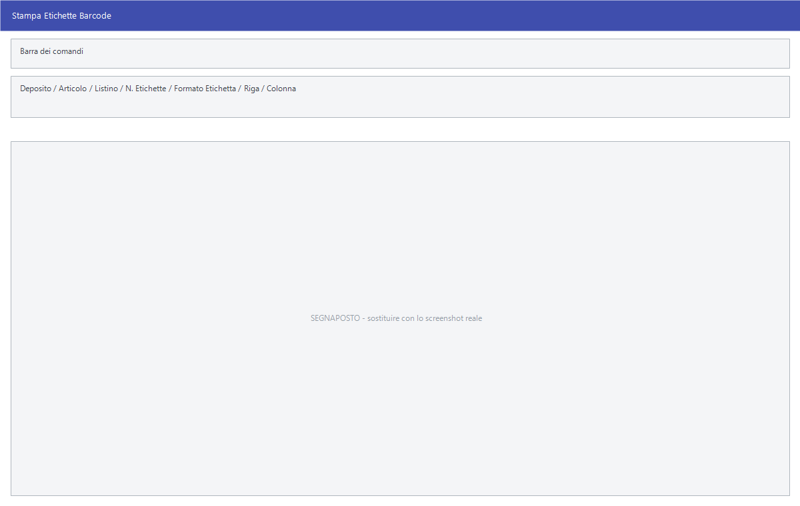

# Etichette codici a barre

L'etichetta con il codice a barre è quello che fa funzionare la cassa: senza,
l'articolo va battuto a mano. Facile la stampa in quattro modi, a seconda di
quanta merce c'è da etichettare e di cosa deve esserci sopra.

!!! info "In sintesi"

    - **Percorso:**
        - Menu ▸ Utility ▸ Stampa Etichette Barcode
        - Menu ▸ Utility ▸ Stampa Etichette Barcode da File
        - Menu ▸ Utility ▸ Ristampa Globale Etichette Barcode
        - Menu ▸ Utility ▸ Stampa Etichette Tracciabilità
    - **Scorciatoia:** ++f2++ stampa, ++esc++ esce
    - **Permessi richiesti:** nessun profilo predefinito; le singole voci di menu si abilitano per ogni utente da [Archivi ▸ Utenti](../anagrafiche/utenti.md)

---

## A cosa serve

| Voce di menu | A cosa serve |
|---|---|
| **Stampa Etichette Barcode** | Stampa le etichette di un articolo per volta, indicando quante ne servono. La finestra si chiama *Stampa Etichette Barcode*. |
| **Stampa Etichette Barcode da File** | La stessa maschera, ma le righe da etichettare arrivano da un file `.csv` prodotto dal [carico merci](../magazzino/carico-merci.md). |
| **Ristampa Globale Etichette Barcode** | Rifà le etichette in blocco partendo dalle esistenze a magazzino. Usa la maschera delle [stampe articoli](../anagrafiche/stampe-articoli.md). |
| **Stampa Etichette Tracciabilità** | Le etichette EAN 128 con lotto, date e peso: quelle che servono sui prodotti soggetti a tracciabilità. La finestra si chiama *Stampa Etichette Eancode*. |

## Prerequisiti

Prima di stampare le etichette occorre:

- avere la **stampante barcode** impostata in
  [Impostazioni Stampanti](impostazioni-postazione.md): senza quella nessuna
  delle quattro stampe parte;
- avere un **formato etichetta** configurato e valido;
- avere sugli [articoli](../anagrafiche/anagrafica-articoli.md) il codice a
  barre e il prezzo;
- per la tracciabilità, avere lotto, date e pesi sui movimenti.

## La maschera



**Stampa Etichette Barcode** ha i campi dell'articolo in alto e, sotto, il
formato dell'etichetta con la riga e la colonna da cui cominciare sul foglio.
**Stampa Etichette Eancode** ha invece i campi della tracciabilità.

## Campi

### Stampa Etichette Barcode

| Campo | Obbl. | Descrizione | Valori ammessi |
|---|:---:|---|---|
| **Deposito** | | Il [deposito](../magazzino/depositi.md) da cui prendere l'esistenza. | codice |
| **Articolo** | ● | L'articolo da etichettare. | codice |
| **Taglia**, **Colore** | | Nelle versioni con taglie e colori. | codici |
| **Esistenza** | | L'esistenza dell'articolo, a titolo di riferimento. | quantità |
| **Listino** | | Il [listino](../listini-vendita/gestione-listini.md) da cui prendere il prezzo da stampare. | codice |
| **Codice su Stampa (se Diverso)** | | Il codice da far comparire sull'etichetta al posto di quello dell'articolo. | codice |
| **Quantità su Barcode** | | La quantità da codificare dentro il codice a barre, per gli articoli a peso. | quantità |
| **N. Etichette** | ● | Quante etichette stampare. | numero |
| **Cod. Fornitore** | | Restringe a un [fornitore](../anagrafiche/anagrafica-fornitori.md). | codice |
| **N. Movimento**, **Data Movimento** | | Il movimento da cui prendere le righe, nella stampa da file. | numero, data |
| **Formato Etichetta** | ● | Quale delle tre disposizioni usare. Arriva già impostato con quello della postazione e, cambiandolo qui, resta cambiato anche per le volte successive. | `0` standard, `1` Griffe, `2` Griffe - I PUPI |
| **Stampa Prezzo** | | Fa comparire il prezzo sull'etichetta. | attivo/non attivo |
| **Riga**, **Colonna**, **N. Colonne** | | Da quale posizione del foglio cominciare e quante colonne ha il foglio, per non sprecare le etichette già usate. | numeri |

### Stampa Etichette Eancode

| Campo | Obbl. | Descrizione | Valori ammessi |
|---|:---:|---|---|
| **N. Serie** | | Il numero di serie progressivo. | numero |
| **SSCC** | | Il codice seriale del collo. | codice |
| **Articolo** | ● | L'articolo. | codice |
| **GTIN** | ● | Il codice GTIN: sono ammessi solo EAN-8, EAN-13 e GTIN-14. | codice |
| **Lotto** | | Il lotto di produzione. | codice |
| **Data Produzione** | | Quando è stato prodotto. | data |
| **Data Scadenza** | | Quando scade. Non può essere anteriore a oggi. | data |
| **Peso** | | Il peso, con l'unità di misura a fianco. | numero |
| *(unità di misura)* | | L'unità del peso. | `Gr.`, `Hg.`, `Kg.`, `Q.` |

## Pulsanti e comandi

| Comando | Scorciatoia | Effetto |
|---|---|---|
| **F2 - OK** | ++f2++ | Stampa le etichette. |
| **Esci** | ++esc++ | Chiude senza stampare. |
| Elenco valori | ++f10++ o ++space++ | Sui campi con il codice, apre l'elenco. |
| Calcolatrice | ++f12++ | Apre la calcolatrice. |

## Come si fa

### Etichettare la merce appena arrivata

1. Registra il [carico merci](../magazzino/carico-merci.md).
2. Apri **Menu ▸ Utility ▸ Stampa Etichette Barcode da File**.
3. Indica **N. Movimento** e **Data Movimento** del carico.
4. Scegli il **Formato Etichetta** e premi **F2 - OK**: esce un'etichetta per
   ogni pezzo caricato.

### Stampare poche etichette senza sprecare il foglio

1. Apri **Stampa Etichette Barcode**.
2. Indica l'**Articolo** e il numero in **N. Etichette**.
3. In **Riga** e **Colonna** indica da dove ripartire sul foglio già usato.
4. Premi **F2 - OK**.

### Rifare tutte le etichette dopo un cambio prezzi

1. Apri **Ristampa Globale Etichette Barcode**.
2. Compila i filtri come nelle altre
   [stampe articoli](../anagrafiche/stampe-articoli.md): esce un'etichetta per
   ogni pezzo in esistenza.

### Etichettare la merce appena arrivata

1. Nel [carico merci](../magazzino/carico-merci.md), sul carico registrato,
   apri il menu delle stampe e scegli **Stampa Etichette su File**.
2. Il programma scrive il file nella cartella `out` dell'installazione, con
   un nome del tipo `eticar00123A.csv` — numero e registro del carico.
3. Apri **Menu ▸ Utility ▸ Stampa Etichette Barcode da File**.
4. Scegli quel file e rispondi alla domanda *Vuoi confermare le etichette ?*:
   con **Sì** ogni riga viene mostrata prima di stampare, con **No** stampa
   tutto di fila.

### Etichettare un prodotto tracciato

1. Apri **Stampa Etichette Tracciabilità**.
2. Indica **Articolo** e **GTIN**, poi **Lotto**, **Data Produzione** e **Data
   Scadenza**.
3. Se l'articolo è a peso, compila **Peso** e la sua unità di misura.
4. Premi **F2 - OK**.

## Controlli e messaggi

| Messaggio | Causa | Cosa fare |
|---|---|---|
| *Stampante Barcode non Impostata.* / *Tipo Stampante Barcode non Valido.* | Manca o è sbagliata la stampante nei parametri. | Impostala da [Impostazioni Stampanti](impostazioni-postazione.md). |
| *Formato Etichetta non Definito!* / *Formato etichetta non valido !* | Il modello di etichetta manca o non è utilizzabile. | Scegli un altro formato, o chiedi all'assistenza di configurarlo. |
| *Articolo non trovato !* | Il codice indicato non esiste. | Controlla il codice. |
| *Impossibile aprire il file !* | Il `.csv` scelto non si legge. | Controlla che non sia aperto in un altro programma. |
| *Formato file non valido !* | Le intestazioni del `.csv` non sono quelle previste. | Il file va rifatto dal carico merci: vedi la nota in fondo. |
| *Vuoi confermare le etichette ?* | Stampa da file: chiede se rivedere riga per riga. | **Sì** mostra ogni riga prima di stamparla, **No** stampa tutto di fila, **Annulla** non fa niente. La risposta preimpostata è **No**. |
| *Sono ammessi solo codici EAN-8 e EAN-13 GTIN-14 !* | Il GTIN indicato non è di un tipo previsto. | Correggi il codice. |
| *Codice Articolo Troppo Lungo!<br>Impossibile Continuare!* | Il codice non entra nell'etichetta EAN 128. | Usa un codice più breve o un altro formato. |
| *La Data di Scadenza non può essere Anteriore alla Data Odierna!<br>Impossibile Continuare!* | La scadenza indicata è già passata. | Correggi la data: quella merce non va etichettata, va tolta. |
| *I Pezzi per Confezione sono Nulli!<br>Impossibile Continuare!* | Manca il numero di pezzi per confezione sull'articolo. | Compilalo in [anagrafica articoli](../anagrafiche/anagrafica-articoli.md). |

## Note

!!! note "«Riga» e «Colonna» servono a non buttare via i fogli"

    Sui fogli fustellati le etichette già staccate lasciano buchi: indicando
    riga e colonna di partenza la stampa comincia dalla prima libera.

!!! warning "La ristampa globale stampa una etichetta per pezzo"

    **Ristampa Globale Etichette Barcode** lavora sulle esistenze: se in
    magazzino ci sono mille pezzi, escono mille etichette. Restringi sempre i
    filtri prima di lanciarla.

!!! info "Il formato dell'etichetta si decide in due posti diversi"

    Sono due cose distinte, e si confondono facilmente.

    **Il disegno dell'etichetta** — che cosa ci va sopra e dove — è un modello
    di stampa, scelto dal **Modulo Stampa Etichette** nella scheda della
    [ditta](../anagrafiche/ditte.md). Quel numero punta al modello
    corrispondente fra quelli installati: il modello `12` è il file
    `Eti00012.rpt` nella cartella dei report. Aggiungerne uno nuovo o
    modificarne uno è lavoro per l'assistenza.

    **La disposizione** — come le etichette vengono disposte e riempite — è il
    campo **Formato Etichetta** della maschera, che vale **per postazione** e
    non per ditta. Ne esistono tre:

    | Valore | Disposizione |
    |---|---|
    | `0` | quella standard |
    | `1` | quella della versione Griffe |
    | `2` | una variante della precedente |

    Il valore si può cambiare qui o dalle
    [impostazioni della postazione](impostazioni-postazione.md): è lo stesso
    numero, e in tutti e due i casi resta memorizzato sul computer.

!!! info "Com'è fatto il file della stampa da file"

    È un **CSV con la riga delle intestazioni**, e le intestazioni devono
    essere **esattamente queste, in quest'ordine**:

    ```
    DEPOSITO,CODICE,DESCRIZIONE,QUANTITA,NUMMOV,CODFOR,DATA
    ```

    Nelle versioni con taglie e colori se ne aggiungono altre tre in coda:
    `IDXTAG`, `CODCOL`, `TAGLIA`.

    **QUANTITA** è il numero di etichette da stampare per quella riga,
    **NUMMOV** il numero del movimento di carico e **CODFOR** il fornitore.

    Se anche una sola intestazione non corrisponde, il programma risponde
    *Formato file non valido !* e non stampa niente. Conviene quindi non
    scrivere il file a mano: lo produce il [carico
    merci](../magazzino/carico-merci.md) con **Stampa Etichette su File**, nella
    cartella `out` e con un nome che comincia per `eticar`.

## Vedi anche

- [Stampe articoli](../anagrafiche/stampe-articoli.md)
- [Stampa lotti in scadenza e spostamenti codici a barre](../anagrafiche/stampe-lotti-e-barcode.md)
- [Frontalini](../casse-bilance/frontalini.md)
- [Impostazioni della postazione](impostazioni-postazione.md)
