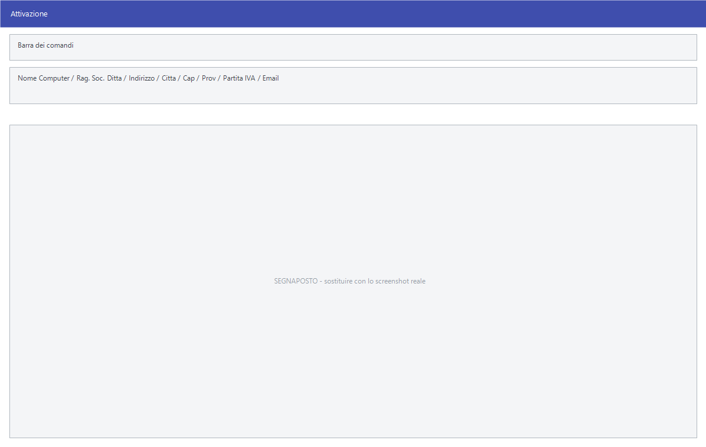

# Gestione della licenza

Facile è legato al computer su cui è installato. Queste tre voci servono ad
attivarlo la prima volta, a liberarlo quando il computer viene dismesso e a
spostare la licenza su una macchina nuova.

!!! info "In sintesi"

    - **Percorso:**
        - Menu ▸ Utility ▸ Gestione Licenza ▸ Attivazione Licenza
        - Menu ▸ Utility ▸ Gestione Licenza ▸ Rimozione Licenza
        - Menu ▸ Utility ▸ Gestione Licenza ▸ Trasferimento Licenza
    - **Scorciatoia:** ++f2++ conferma, ++esc++ esce
    - **Permessi richiesti:** nessun profilo predefinito; le singole voci di menu si abilitano per ogni utente da [Archivi ▸ Utenti](../anagrafiche/utenti.md)

---

## A cosa serve

| Voce di menu | A cosa serve |
|---|---|
| **Attivazione Licenza** | Registra l'installazione presso R.S.A. e attiva il programma su questo computer. La finestra si chiama *Attivazione*. |
| **Rimozione Licenza** | Disattiva la licenza su questo computer, liberandola. |
| **Trasferimento Licenza** | Sposta la licenza su un'altra macchina. |

Il livello di licenza decide **quali voci di menu si vedono**: Lite, Standard,
Professional ed Evolution mostrano menu via via più ampi. Questo manuale
descrive il menu completo, quello Professional; nelle licenze inferiori alcune
voci non compaiono.

## Prerequisiti

Prima di attivare occorre avere i dati della ditta intestataria della licenza —
ragione sociale, indirizzo, partita IVA — e il codice fornito da R.S.A.

Prima di trasferire, il computer di destinazione deve essere pronto: la licenza
viene liberata da questo e va attivata sull'altro.

## La maschera

**Attivazione** è una scheda con i dati dell'intestatario e i pulsanti in
fondo. Le altre due voci non hanno maschera: chiedono conferma e lavorano.

## Campi

### Attivazione

| Campo | Obbl. | Descrizione | Valori ammessi |
|---|:---:|---|---|
| **Nome Computer** | | Il nome della macchina su cui si sta attivando. Lo propone il programma. | testo |
| **Rag. Soc. Ditta** | ● | La ragione sociale dell'intestatario della licenza. | testo |
| **Indirizzo** | ● | L'indirizzo. | testo |
| **Citta** | ● | Il comune. L'etichetta è senza accento. | testo |
| **Cap** | ● | Il codice di avviamento postale. | numero |
| **Prov** | ● | La sigla della provincia. | due lettere |
| **Telefono**, **Fax** | | I recapiti. | testo |
| **Partita IVA** | ● | La partita IVA dell'intestatario. | 11 cifre |
| **Cod. Fiscale** | | Il codice fiscale. | codice |
| **Email** | ● | L'indirizzo di posta a cui R.S.A. manda le comunicazioni sulla licenza. | indirizzo |

{: .campi }

## Pulsanti e comandi

| Comando | Scorciatoia | Effetto |
|---|---|---|
| **F2 - OK** | ++f2++ | Invia i dati e attiva. |
| **Esci** | ++esc++ | Chiude senza attivare. |

## Come si fa

### Attivare Facile su un computer nuovo

1. Apri **Menu ▸ Utility ▸ Gestione Licenza ▸ Attivazione Licenza**.
2. Compila i dati della ditta intestataria: sono quelli che compariranno sulla
   licenza, quindi vanno scritti giusti la prima volta.
3. Premi **F2 - OK**.

### Spostare Facile su un altro computer

1. Sul computer vecchio, apri **Trasferimento Licenza** e conferma.
2. Installa Facile sul computer nuovo.
3. Sul computer nuovo, apri **Attivazione Licenza**.

Non installare prima di aver liberato la licenza sul vecchio: la licenza è una
sola.

### Dismettere un computer

Apri **Rimozione Licenza** e conferma. Da quel momento su quel computer il
programma non è più attivo.

## Controlli e messaggi

| Messaggio | Causa | Cosa fare |
|---|---|---|
| *Licenza non ancora attivata !* | Si prova a rimuovere o trasferire una licenza mai attivata. | Non c'è nulla da rimuovere. |
| *Software non protetto!* | L'installazione non ha protezione attiva. | Nessuna azione: è una versione senza licenza. |
| *Errore interfaccia protezione!* | Il componente di protezione non risponde. | Chiama l'assistenza. |

<!-- DA VERIFICARE: il testo esatto della richiesta di conferma della disattivazione (stringa IDS_DISATTIVAZIONE). -->

## Note

!!! warning "La licenza è una sola"

    Rimozione e trasferimento **liberano** la licenza da questo computer: finché
    non la si attiva altrove, non è attiva da nessuna parte. Fallo solo quando
    la macchina di destinazione è pronta.

!!! note "Il livello di licenza cambia il menu"

    Con Lite e Standard alcune voci descritte in questo manuale non compaiono
    affatto. Non è un malfunzionamento: è il livello di licenza. Vedi
    [Convenzioni del manuale](../../introduzione/convenzioni.md).

<!-- DA VERIFICARE: come si comunica a R.S.A. l'attivazione e se serva un collegamento a internet. -->

## Vedi anche

- [Impostazioni della postazione](impostazioni-postazione.md)
- [Ditte](../anagrafiche/ditte.md)
- [Convenzioni del manuale](../../introduzione/convenzioni.md)
