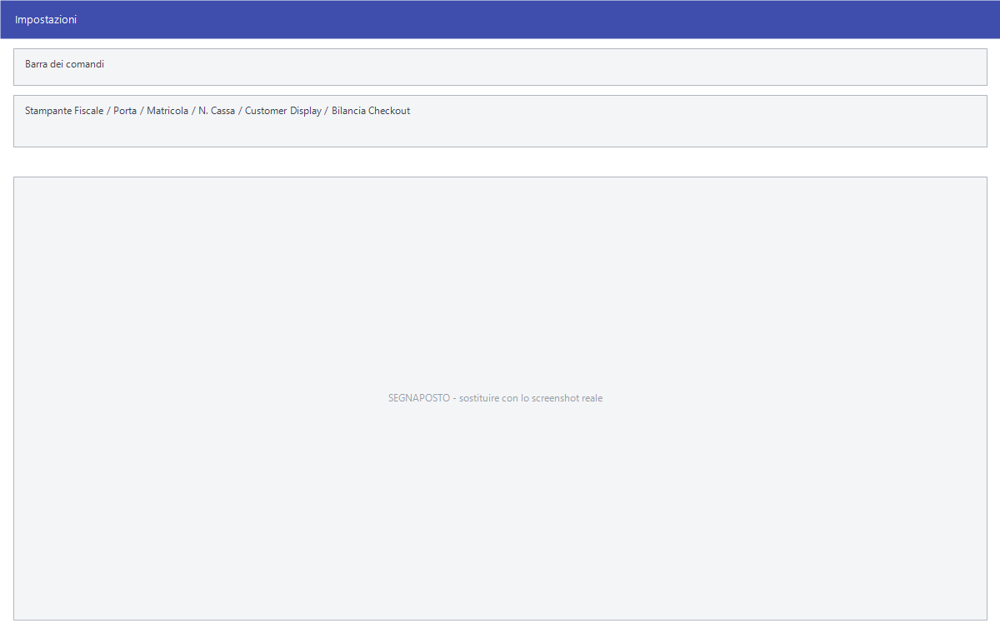

# Impostazioni della postazione

Non tutto in Facile è uguale per tutti: la stampante fiscale collegata, il
display del cliente, la bilancia di cassa e decine di preferenze di lavoro sono
**di quel computer**, non della ditta. Si impostano da qui, e cambiarle su una
postazione non tocca le altre.

!!! info "In sintesi"

    - **Percorso:**
        - Menu ▸ Utility ▸ Impostazioni Postazione
        - Menu ▸ Utility ▸ Impostazioni Stampanti
        - Menu ▸ Utility ▸ Impostazione FacileWebApiService
        - Menu ▸ Utility ▸ Impostazioni Sistemi di Pagamento Elettronico
        - Menu ▸ Utility ▸ Impostazioni EFT Pos
        - Menu ▸ Utility ▸ Impostazioni Messaggi SMS e WhatsApp
        - Menu ▸ Utility ▸ Impostazioni Stampanti Comande
    - **Scorciatoia:** ++f2++ salva, ++esc++ esce
    - **Permessi richiesti:** nessun profilo predefinito; le singole voci di menu si abilitano per ogni utente da [Archivi ▸ Utenti](../anagrafiche/utenti.md)

---

## A cosa serve

| Voce di menu | Cosa imposta | Titolo della finestra |
|---|---|---|
| **Impostazioni Postazione** | Il grosso: stampante fiscale e porta, display cliente, bilancia di checkout, cassa automatica, formato etichette e tutte le preferenze di comportamento della vendita. | *Impostazioni* |
| **Impostazioni Stampanti** | Quale stampante di Windows usare per ciascun tipo di documento. | *Impostazione Stampanti* |
| **Impostazione FacileWebApiService** | Il collegamento al servizio web di Facile. | *Impostazione FacileWebApiService* |
| **Impostazioni Sistemi di Pagamento Elettronico** | I sistemi di pagamento elettronico collegati. Il titolo della finestra contiene un doppio spazio. | *Impostazione Sistemi di  Pagamento Elettronico* |
| **Impostazioni EFT Pos** | Quale POS bancario è collegato alla postazione. | *Selezione EFT POS* |
| **Impostazioni Messaggi SMS e WhatsApp** | Le credenziali per mandare SMS e messaggi WhatsApp. | *Impostazioni per Invio SMS e Messaggi WhatsApp* |
| **Impostazioni Stampanti Comande** | Le stampanti delle comande, per chi lavora con la ristorazione. | — |

## Prerequisiti

Prima di impostare occorre sapere **come è collegato l'apparecchio**: modello,
porta seriale o indirizzo di rete. Sono dati che dà l'installatore, non il
programma.

Per SMS e WhatsApp servono le credenziali del servizio di invio.

## La maschera

**Impostazioni** è la finestra più densa del programma: gli apparecchi
collegati nella parte alta, e sotto una lunga colonna di caselle che decidono
come si comporta la vendita. Le altre sei sono finestrelle a campi singoli.

## Campi

### Apparecchi collegati

| Campo | Obbl. | Descrizione | Valori ammessi |
|---|:---:|---|---|
| **Stampante Fiscale** | | Il modello di registratore di cassa collegato. L'elenco copre una quarantina di modelli, dai vecchi seriali ai driver moderni: `ELSI RETAIL`, `OLIVETTI`, `DITRON`, `CUSTOM PROTOCOL`, `RCH NUCLEO`, `RCH GLOBE`, `RCH ONDA`, `EPSON FP90`, `MICRELEC`, `DATAPROCESS FPCONNECTOR`, `FASY FSEDRIVER` e altri. Ogni voce riporta fra parentesi i parametri della porta. | voce dell'elenco, `NESSUNA` per nessuna |
| **Porta** | | La porta seriale a cui è collegata. | `NESSUNA`, `COM1` … `COM9` |
| **Data Attivazione RT** | | Da quando il registratore telematico è attivo. | data |
| **Matricola** | | La matricola del registratore. | testo |
| **N. Cassa** | | Il numero della cassa. | numero |
| **Num. Negozio** | | Il numero del negozio. | numero |
| **Customer Display - 1** e **Porta** | | Il display rivolto al cliente e la sua porta. | voce dell'elenco |
| **Customer Display - 2** e **Porta** | | Un secondo display. | voce dell'elenco |
| **Bilancia Checkout** e **Porta** | | La bilancia della cassa. | voce dell'elenco |
| **Cassa Automatica** | | Il sistema di cassa automatica collegato. | voce dell'elenco |
| **Ditta Conv. HACCP** | | La ditta convenzionata per la parte HACCP. | codice |
| **Formato Etichette** | | Il formato predefinito delle [etichette](etichette-barcode.md). | voce dell'elenco |

{: .campi }

### Preferenze di lavoro

Sono caselle da attivare o disattivare. Le principali:

| Casella | Cosa fa quando è attiva |
|---|---|
| **Descrizione completa** | Mostra la descrizione estesa dell'articolo. |
| **Disabilita Numerazione Scontrini** | Toglie la numerazione automatica degli [scontrini](../vendite/scontrini.md). |
| **Calcolo Predefinito per Scontrini** | Applica il calcolo predefinito. |
| **Arrotonda ai 5 Centesimi Superiori** | Arrotonda i totali per eccesso ai cinque centesimi. |
| **Abilita Ricerca Articolo su Vendita con Spazio** | La barra spaziatrice apre la ricerca articolo. |
| **Aggiungi Sempre Nuovo Rigo su Vendita** | Ogni lettura crea una riga nuova invece di sommare. |
| **Posizionamento Iniziale su Codice Articolo su Vendita** | Il cursore parte dal codice articolo. |
| **Abilita Scelta Tipo Vendita** | Fa scegliere il tipo di vendita. |
| **Blocca Scarico Senza Doc. su Vendita** | Impedisce di scaricare merce senza documento. |
| **Fatture da Scontrino su Vendita** | Permette di emettere fattura da uno scontrino. |
| **Stampa Scontrino Sintetico** | Scontrino in forma breve. |
| **Abilita Preferenza Stampe Motalità Testo** | Preferisce le stampe in modalità testo. L'etichetta contiene un refuso: *Motalità*. |
| **Stampa Prezzo Scontato su Etichette** | Sulle etichette compare il prezzo già scontato. |
| **Utilizza Server SQL ove Possibile** | Fa passare dal server SQL le operazioni che lo consentono. |
| **Abilita Modalità TouchScreen** | Interfaccia a sfioramento per la [vendita al banco](../vendite/vendita-al-banco.md). |
| **Abilita Tastiera Virtuale** | Mostra la tastiera a video. |
| **Cerca prima codice a barre e poi articolo** | Inverte l'ordine di ricerca. |
| **Blocca Emissione …** | Undici caselle che impediscono di emettere, dalla vendita, un certo tipo di documento: **Fatture**, **Fatture Acc.**, **Fatture Ric. Fiscali**, **D.D.T.**, **Bolle**, **Buoni Consegna**, **Ricevute Fiscali**, **Ordini**, **Preventivi**, **Note Credito**, **Fatture Pro Forma**. |

{: .campi }

<!-- DA VERIFICARE: i campi delle sei finestre minori (stampanti, WebApiService, pagamenti elettronici, EFT Pos, messaggi, stampanti comande). -->

## Pulsanti e comandi

| Comando | Scorciatoia | Effetto |
|---|---|---|
| **F2 - OK** | ++f2++ | Salva le impostazioni della postazione. |
| **Esci** | ++esc++ | Chiude senza salvare. |
| Elenco valori | ++f10++ o ++space++ | Sui campi con il codice, apre l'elenco. |

## Come si fa

### Collegare il registratore di cassa

1. Apri **Menu ▸ Utility ▸ Impostazioni Postazione**.
2. Scegli il modello in **Stampante Fiscale**: l'elenco riporta fra parentesi i
   parametri della porta, che devono corrispondere a come l'apparecchio è
   configurato.
3. Indica la **Porta** seriale.
4. Compila **Matricola**, **N. Cassa** e **Num. Negozio**.
5. Premi **F2 - OK** e prova uno scontrino.

### Impedire a una cassa di emettere fatture

1. Apri **Impostazioni Postazione** sulla postazione della cassa.
2. Attiva **Blocca Emissione Fatture su Vendita** e le altre che servono.
3. Premi **F2 - OK**: da quella postazione quei documenti non si emettono più.

È il modo di tenere la cassa alla sola vendita al banco, lasciando la
fatturazione all'ufficio.

### Passare alla vendita a sfioramento

Attiva **Abilita Modalità TouchScreen** e, se il monitor non ha tastiera,
**Abilita Tastiera Virtuale**.

## Controlli e messaggi

<!-- DA VERIFICARE: i messaggi di queste maschere. -->

| Messaggio | Causa | Cosa fare |
|---|---|---|
| *(nessun messaggio, solo un segnale acustico)* | Un campo non è valido. | Guarda dove si è posizionato il cursore. |

## Note

!!! warning "Queste impostazioni sono del computer, non della ditta"

    Cambiarle su una postazione non le cambia sulle altre. Quando si aggiunge un
    computer, vanno rifatte da capo: è la causa più comune di «sulla cassa di
    là funziona e qui no».

!!! note "Le caselle «Blocca Emissione» non tolgono i permessi"

    Impediscono l'emissione **da quella postazione**, non all'utente: lo stesso
    operatore, su un altro computer, quei documenti li emette. I permessi veri
    si danno da [Archivi ▸ Utenti](../anagrafiche/utenti.md).

<!-- DA VERIFICARE: dove sono memorizzate queste impostazioni e se si possano copiare da una postazione all'altra. -->

<!-- DA VERIFICARE: cosa fa esattamente "Utilizza Server SQL ove Possibile" e quando conviene attivarla. -->

## Vedi anche

- [Vendita e POS touchscreen](../vendite/vendita-al-banco.md)
- [Scontrini](../vendite/scontrini.md)
- [Etichette codici a barre](etichette-barcode.md)
- [Utenti](../anagrafiche/utenti.md)
