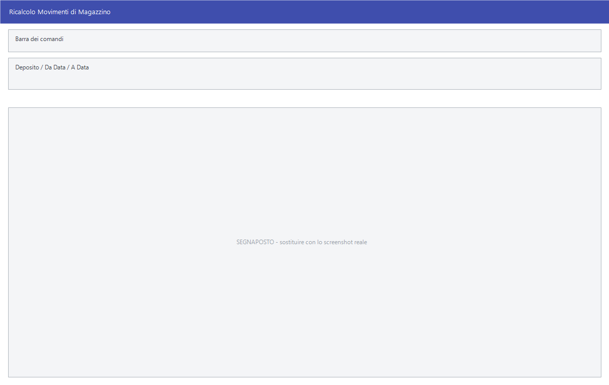

# Manutenzione degli archivi

Quando i saldi contabili non tornano con le schede, o l'esistenza di un articolo
non corrisponde ai suoi movimenti, il rimedio non è correggere il numero: è
**rifare il calcolo**. Queste voci ricostruiscono i totali a partire dai
movimenti, che restano l'unica verità.

!!! info "In sintesi"

    - **Percorso:**
        - Menu ▸ Utility ▸ Ricalcolo Saldi Contabili
        - Menu ▸ Utility ▸ Riporto Esistenze Magazzino Anno Precedente
        - Menu ▸ Utility ▸ Ricalcolo Movimenti di Magazzino
        - Menu ▸ Utility ▸ Valorizzazione Costi Movimenti
        - Menu ▸ Utility ▸ Aggiorna Catalogo Dati
        - Menu ▸ Utility ▸ Aggiungi Movimenti dell' Anno allo Storico
        - Menu ▸ Utility ▸ Rimuovi Movimenti dell' Anno dallo Storico
        - Menu ▸ Utility ▸ Rinumerazione Scontrini
        - Menu ▸ Utility ▸ Importa
        - Menu ▸ Utility ▸ Importa Foto
        - Menu ▸ Utility ▸ Installazione Software su PocketPC
    - **Scorciatoia:** ++f2++ avvia, ++esc++ esce
    - **Permessi richiesti:** nessun profilo predefinito; le singole voci di menu si abilitano per ogni utente da [Archivi ▸ Utenti](../anagrafiche/utenti.md)

---

## A cosa serve

| Voce di menu | A cosa serve |
|---|---|
| **Ricalcolo Saldi Contabili** | Rifà i saldi dei conti a partire dai movimenti di [prima nota](../contabilita/registrazione-prima-nota.md). |
| **Riporto Esistenze Magazzino Anno Precedente** | Porta nell'anno in corso le esistenze finali dell'anno prima. La finestra si chiama *Riporto esistenze magazzino anno precedente*. |
| **Ricalcolo Movimenti di Magazzino** | Ricostruisce esistenze e progressivi a partire dai [movimenti](../magazzino/movimenti-magazzino.md). |
| **Valorizzazione Costi Movimenti** | Attribuisce ai movimenti il costo secondo il metodo scelto. |
| **Aggiorna Catalogo Dati** | Aggiorna la struttura degli archivi. È il passo che alcune procedure di assistenza richiedono prima di poter partire. |
| **Aggiungi Movimenti dell' Anno allo Storico** | Porta i movimenti dell'anno nello storico, da cui pescano le statistiche pluriennali. |
| **Rimuovi Movimenti dell' Anno dallo Storico** | Li toglie. |
| **Rinumerazione Scontrini** | Rinumera un intervallo di [scontrini](../vendite/scontrini.md). |
| **Importa** | Carica le tabelle di base — banche, pagamenti, zone, categorie economiche, vettori, agenti, codici IVA — da un'installazione GESA. Serve nei passaggi da un programma precedente. |
| **Importa Foto** | Carica le fotografie degli articoli. |
| **Installazione Software su PocketPC** | Installa il programma sul palmare collegato. |

## Prerequisiti

Prima di lanciare un ricalcolo occorre:

- **una copia di sicurezza degli archivi**;
- che **nessun altro stia usando il programma**: i ricalcoli riscrivono totali
  su tutto l'archivio;
- del tempo: su archivi grandi durano parecchio e non si interrompono a metà
  senza conseguenze.

Per l'installazione su palmare serve ActiveSync installato sulla postazione.

## La maschera

Sono finestre di selezione piccole, con il periodo e il deposito. Alcune voci
non hanno maschera: chiedono conferma e lavorano mostrando l'avanzamento.

## Campi

### Ricalcolo Movimenti di Magazzino

| Campo | Obbl. | Descrizione | Valori ammessi |
|---|:---:|---|---|
| **Deposito** | | Il [deposito](../magazzino/depositi.md) da ricalcolare. Vuoto significa tutti. | codice |
| **Da Data**, **A Data** | ● | Il periodo dei movimenti da rileggere. | date |

{: .campi }

### Valorizzazione Costi Movimenti

| Campo | Obbl. | Descrizione | Valori ammessi |
|---|:---:|---|---|
| **Data Iniziale**, **Data Finale** | ● | Il periodo. | date |
| **Deposito** | | Restringe a un deposito. | codice |
| **Metodo** | ● | Come attribuire il costo. | `COSTO MEDIO PONDERATO`, `METODO LIFO`, `METODO FIFO`, `ULTIMO PREZZO ACQUISTO` |

{: .campi }

### Riporto esistenze magazzino anno precedente

| Campo | Obbl. | Descrizione | Valori ammessi |
|---|:---:|---|---|
| **Deposito** | | Il deposito su cui riportare le esistenze. | codice |

{: .campi }

### Rinumerazione Scontrini

| Campo | Obbl. | Descrizione | Valori ammessi |
|---|:---:|---|---|
| **Dal Numero**, **Al Numero** | ● | L'intervallo di scontrini da rinumerare. | numeri |
| **Nuovo Numero Iniziale** | ● | Il numero da cui ripartire. | numero |

{: .campi }

## Pulsanti e comandi

| Comando | Scorciatoia | Effetto |
|---|---|---|
| **F2 - OK** | ++f2++ | Avvia l'elaborazione. |
| **Esci** | ++esc++ | Chiude senza fare nulla. |
| Elenco valori | ++f10++ o ++space++ | Sul **Deposito**, apre l'elenco. |

## Come si fa

### Rimettere a posto un'esistenza che non torna

1. Controlla prima **perché** non torna: il
   [giornale di magazzino](../magazzino/stampe-movimenti-magazzino.md)
   dell'articolo dice quali movimenti ci sono. Se manca un movimento, il
   ricalcolo non lo inventa.
2. **Fai una copia di sicurezza degli archivi.**
3. Apri **Menu ▸ Utility ▸ Ricalcolo Movimenti di Magazzino**.
4. Indica il **Deposito** e il periodo, e premi **F2 - OK**.

### Rimettere a posto un saldo contabile

1. Controlla la [scheda contabile](../contabilita/schede-contabili.md) del
   conto.
2. Fai la copia di sicurezza e lancia **Ricalcolo Saldi Contabili**.

### Valorizzare il magazzino con un metodo diverso

1. Apri **Valorizzazione Costi Movimenti**.
2. Indica il periodo e scegli il **Metodo**.
3. Premi **F2 - OK**: i movimenti del periodo prendono il costo secondo quel
   criterio, e con esso cambia il valore del magazzino.

### Alimentare le statistiche pluriennali

1. Apri **Aggiungi Movimenti dell' Anno allo Storico**.
2. Alla domanda rispondi **Sì**: la procedura prima toglie l'anno dallo storico
   e poi lo rimette, quindi si può rilanciare senza creare doppioni.

## Controlli e messaggi

| Messaggio | Causa | Cosa fare |
|---|---|---|
| *La procedura permette l' acquisizione dei dati dell' anno allo storico dei movimenti. Per essere eseguita puo' essere necessario parecchio tempo. Vuoi Continuare ?* | Hai avviato l'aggiornamento dello storico. | **Sì** procede. La risposta preimpostata è **No**. |
| *La procedura permette la rimozioni dei dati dell' anno dallo storico dei movimenti. Per essere eseguita puo' essere necessario parecchio tempo. Vuoi Continuare ?* | Hai avviato la rimozione dallo storico. | **Sì** procede. |
| *Impossibile Caricare RAPI.DLL ! Controllare presenza installazione ActiveSync.* | Manca ActiveSync per parlare con il palmare. | Installalo sulla postazione. |

<!-- DA VERIFICARE: i messaggi propri dei ricalcoli e della valorizzazione. -->

## Note

!!! warning "Un ricalcolo non si interrompe"

    Fermare a metà un ricalcolo lascia gli archivi in uno stato peggiore di
    quello di partenza. Lanciali quando c'è il tempo di aspettare, con gli altri
    utenti fuori dal programma.

!!! note "Il ricalcolo ricostruisce, non corregge"

    Rifà i totali **a partire dai movimenti**. Se il problema è un movimento
    sbagliato o mancante, il ricalcolo lo conferma invece di risolverlo: prima
    si sistema il movimento, poi si ricalcola.

!!! note "«Aggiorna Catalogo Dati» è un prerequisito, non una riparazione"

    Diverse procedure del menu [Assistenza](assistenza.md) chiedono che sia
    stato eseguito su tutti gli anni di gestione prima di poter partire.

<!-- DA VERIFICARE: cosa fa esattamente "Aggiorna Catalogo Dati" sugli archivi. -->

<!-- DA VERIFICARE: da dove vengono lette le fotografie di "Importa Foto" e con quale criterio sono associate agli articoli. -->

<!-- DA VERIFICARE: se "Importa" da GESA sia ancora utilizzabile e in quali passaggi. -->

## Vedi anche

- [Esercizi, ditte e chiusure contabili](esercizi-e-chiusure.md)
- [Assistenza](assistenza.md)
- [Movimenti di magazzino](../magazzino/movimenti-magazzino.md)
- [Schede contabili](../contabilita/schede-contabili.md)
