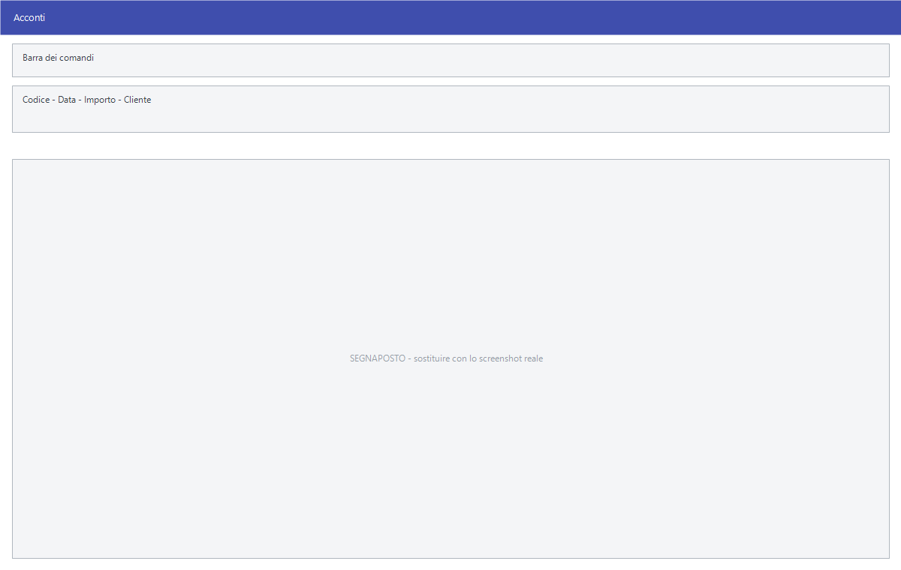

# Acconti

Registra le somme versate dal cliente prima della consegna, così da poterle
scalare quando il documento definitivo viene emesso.

!!! info "In sintesi"

    - **Percorso:** Menu ▸ Vendite ▸ Acconti ▸ Inserimento *(oppure* Modifica *o* Stampa*)*
    - **Scorciatoia:** ++f2++ salva, ++f5++ cerca
    - **Permessi richiesti:** nessun profilo predefinito; le singole voci di menu si abilitano per ogni utente da [Archivi ▸ Utenti](../anagrafiche/utenti.md)

---

## A cosa serve

Il cliente lascia una caparra all'ordine: la si registra qui, e resta legata a
lui finché non viene utilizzata. La stampa serve a controllare quali acconti
sono ancora aperti.

## Prerequisiti

Prima di usare questa maschera occorre avere in archivio i
[clienti](../anagrafiche/anagrafica-clienti.md).

## La maschera

È una maschera a finestra unica con quattro campi. La stampa apre una
finestrella con gli intervalli di selezione.

## Campi

| Campo | Obbl. | Descrizione | Valori ammessi |
|---|:---:|---|---|
| **Codice** | ● | Identificativo dell'acconto. | numero |
| **Data** | ● | Quando l'acconto è stato versato. | data |
| **Importo** | ● | Quanto è stato versato. | importo |
| **Cliente** | ● | Chi ha versato. | codice |

{: .campi }

Nella stampa si indicano **Da Codice** e **A Codice**, **Da Data** e **A
Data**, e il **Cliente**.

## Pulsanti e comandi

| Comando | Scorciatoia | Effetto |
|---|---|---|
| **F2 - Salva** | ++f2++ | Registra l'acconto. |
| **F3 - Prec.**, **F4 - Succ.** | ++f3++, ++f4++ | Passano all'acconto precedente o successivo. |
| **F5 - Cerca** | ++f5++ | Apre l'elenco degli acconti. |
| **F6 - Elimina** | ++f6++ | Cancella l'acconto, previa conferma. |
| **Calcolatrice** | ++f12++ | Apre la calcolatrice. |
| **Consultazione** | ++f11++ | Apre la consultazione. |

## Come si fa

### Registrare una caparra

1. Apri **Menu ▸ Vendite ▸ Acconti ▸ Inserimento**.
2. Compila **Data**, **Importo** e **Cliente**.
3. Premi **F2 - Salva**.

### Controllare gli acconti di un cliente

1. Apri **Menu ▸ Vendite ▸ Acconti ▸ Stampa**.
2. Indica il **Cliente** e il periodo.
3. Avvia la stampa.

## Controlli e messaggi

| Messaggio | Causa | Cosa fare |
|---|---|---|
| *(nessun messaggio, solo un segnale acustico)* | Manca un campo obbligatorio. | Compila il campo su cui si è posizionato il cursore. |

## Note

Non applicabile.

<!-- DA VERIFICARE: come l'acconto registrato qui viene scalato dal documento definitivo: se automaticamente o a mano. -->

<!-- DA VERIFICARE: se l'acconto generi una registrazione contabile o resti solo un promemoria. -->

## Vedi anche

- [Documento di vendita](documento-di-vendita.md)
- [Anagrafica clienti](../anagrafiche/anagrafica-clienti.md)
