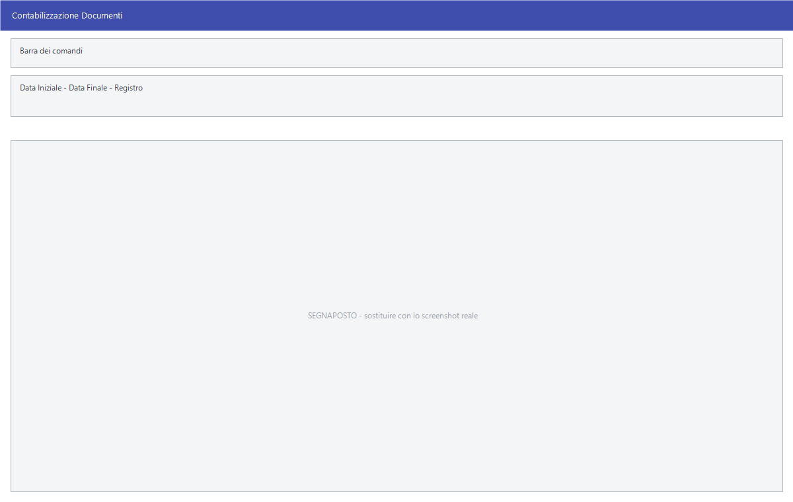

# Contabilizzazione dei documenti

Un documento emesso non è ancora una registrazione contabile. **Contabilizza**
genera le registrazioni di [prima nota](../contabilita/registrazione-prima-nota.md)
dai documenti del periodo; **Controllo Fatture <-> Mov. Contabili** e
**Controllo Fat. Pro Forma <-> Mov. Contabili** verificano che documenti e
registrazioni corrispondano.

!!! info "In sintesi"

    - **Percorso:**
        - Menu ▸ Vendite ▸ Fatture ▸ Contabilizza
        - Menu ▸ Vendite ▸ Fatture Pro Forma ▸ Contabilizza
        - Menu ▸ Vendite ▸ Ricevute Fiscali ▸ Contabilizza
        - Menu ▸ Vendite ▸ Autofatture - Integrazioni ▸ Contabilizza
        - Menu ▸ Vendite ▸ Fatture ▸ Controllo Fatture <-> Mov. Contabili
        - Menu ▸ Vendite ▸ Fatture Pro Forma ▸ Controllo Fat. Pro Forma <-> Mov. Contabili
    - **Scorciatoia:** ++f2++ avvia, ++esc++ esce
    - **Permessi richiesti:** nessun profilo predefinito; le singole voci di menu si abilitano per ogni utente da [Archivi ▸ Utenti](../anagrafiche/utenti.md)

---

## A cosa serve

Chi emette i documenti e chi tiene la contabilità spesso non sono la stessa
persona: il documento nasce in Vendite e diventa una scrittura contabile in un
secondo momento. **Contabilizza** fa quel passaggio in blocco, sui documenti di
un periodo.

I due **Controllo <-> Mov. Contabili** servono dopo: dicono se qualche
documento è rimasto senza registrazione o se qualche registrazione non ha più
il suo documento.

## Prerequisiti

Prima di contabilizzare occorre:

- avere emesso e controllato i [documenti](documento-di-vendita.md) del
  periodo;
- avere sui documenti la **Cau. Contabile** giusta, perché è quella che decide
  registro e conti;
- avere il piano dei conti e le
  [causali contabili](../contabilita/causali-contabili.md) impostati;
- **avere una copia di sicurezza recente**.

## La maschera

Sono finestre di selezione con il periodo e i filtri, e i pulsanti **F2 - OK**
ed **Esci**.

## Campi

| Campo | Obbl. | Descrizione | Valori ammessi |
|---|:---:|---|---|
| **Data Iniziale**, **Data Finale** | ● | Il periodo dei documenti da contabilizzare o controllare. | date |
| **Registro** | | Restringe a un registro. | voce dell'elenco |

{: .campi }

<!-- DA VERIFICARE: i campi esatti delle maschere di contabilizzazione e di controllo. -->

## Pulsanti e comandi

| Comando | Scorciatoia | Effetto |
|---|---|---|
| **F2 - OK** | ++f2++ | Avvia la contabilizzazione o il controllo. |
| **Esci** | ++esc++ | Chiude senza fare nulla. |
| **Interrompi** | | Durante l'elaborazione, ferma il lavoro. |

## Come si fa

### Contabilizzare le fatture del mese

1. Controlla le fatture con il [riepilogo](riepiloghi-e-statistiche.md).
2. Apri **Menu ▸ Vendite ▸ Fatture ▸ Contabilizza**.
3. Indica il periodo e avvia.
4. Apri la [gestione prima nota](../contabilita/gestione-prima-nota.md) e
   verifica le registrazioni generate.

### Verificare che nulla sia rimasto indietro

1. Apri **Menu ▸ Vendite ▸ Fatture ▸ Controllo Fatture <-> Mov. Contabili**.
2. Indica il periodo e avvia.
3. Ogni riga che esce è una discordanza fra documento e registrazione.

## Controlli e messaggi

<!-- DA VERIFICARE: i messaggi delle maschere di contabilizzazione e controllo. -->

| Messaggio | Causa | Cosa fare |
|---|---|---|
| *(nessun messaggio, solo un segnale acustico)* | Manca una delle date. | Compila il campo su cui si è posizionato il cursore. |

## Note

!!! warning "Contabilizzare due volte lo stesso periodo"

    La contabilizzazione crea registrazioni in prima nota. Prima di rilanciarla
    su un periodo già contabilizzato, verifica con il **Controllo Fatture <-> Mov.
    Contabili** cosa esiste già, per non ritrovarti scritture doppie.

<!-- DA VERIFICARE: se la contabilizzazione riconosca i documenti già contabilizzati e li salti. -->

<!-- DA VERIFICARE: cosa mostra esattamente il risultato del controllo: una stampa, una griglia o un messaggio. -->

<!-- DA VERIFICARE: perché DDT, bolle e buoni di consegna non hanno la voce Contabilizza: presumibilmente perché si contabilizzano le fatture che ne derivano. -->

## Vedi anche

- [Documento di vendita](documento-di-vendita.md)
- [Registrazione di prima nota](../contabilita/registrazione-prima-nota.md)
- [Causali contabili](../contabilita/causali-contabili.md)
