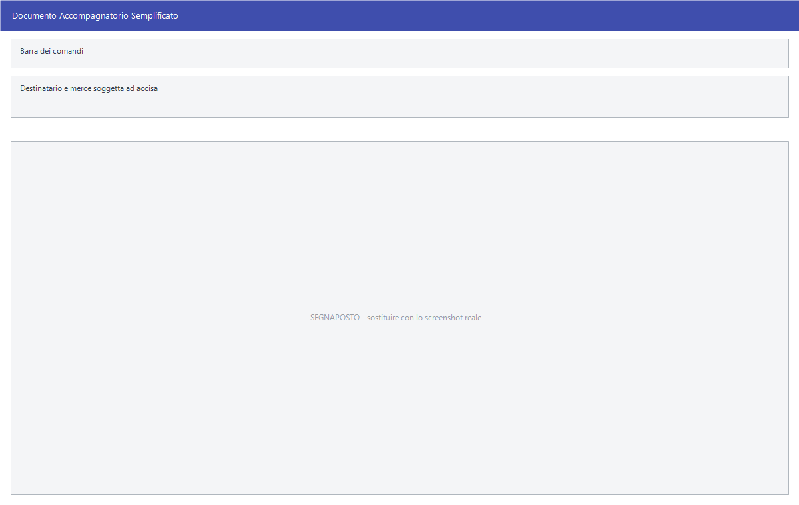

# Documenti accompagnatori semplificati

I DAS accompagnano i prodotti soggetti ad accisa — vino, alcolici, prodotti
energetici — quando viaggiano. Si compilano qui e se ne stampa la distinta.

!!! info "In sintesi"

    **Percorso:** Menu ▸ Vendite ▸ Documenti Accompagnatori Semplificati ▸ Inserimento *(oppure* Modifica*,* Stampa Distinta *o* Duplica*)*
    **Scorciatoia:** ++f2++ salva, ++f5++ cerca
    **Permessi richiesti:** nessun profilo predefinito; le singole voci di menu si abilitano per ogni utente da [Archivi ▸ Utenti](../anagrafiche/utenti.md)

---

## A cosa serve

È un adempimento di chi movimenta prodotti sottoposti ad accisa: il documento
accompagna la merce e la distinta riepiloga quelli emessi.

Serve solo a chi tratta quei prodotti; per tutti gli altri il sottomenu si
lascia stare.

## Prerequisiti

Prima di usare questa maschera occorre avere in archivio i
[clienti](../anagrafiche/anagrafica-clienti.md) e gli
[articoli](../anagrafiche/anagrafica-articoli.md) soggetti ad accisa, con i
dati che il documento richiede.

## La maschera

<!-- DA VERIFICARE: la struttura della maschera e i suoi campi: non ho potuto estrarne le etichette dalle risorse. -->

## Campi

<!-- DA VERIFICARE: i campi del documento accompagnatorio semplificato. -->

Non applicabile.

## Pulsanti e comandi

| Comando | Scorciatoia | Effetto |
|---|---|---|
| **F2 - Salva** | ++f2++ | Registra il documento. |
| **F3 - Prec.**, **F4 - Succ.** | ++f3++, ++f4++ | Passano al documento precedente o successivo. |
| **F5 - Cerca** | ++f5++ | Apre l'elenco dei documenti. |
| **F6 - Elimina** | ++f6++ | Cancella il documento, previa conferma. |
| **F7 - Stampa** | ++f7++ | Stampa il documento. |

<!-- DA VERIFICARE: i comandi effettivi di questa maschera. -->

## Come si fa

### Emettere un DAS

1. Apri **Menu ▸ Vendite ▸ Documenti Accompagnatori Semplificati ▸
   Inserimento**.
2. Compila il documento con il destinatario e la merce.
3. Premi **F2 - Salva** e stampa il documento che accompagnerà la merce.

### Stampare la distinta dei documenti emessi

1. Apri **Menu ▸ Vendite ▸ Documenti Accompagnatori Semplificati ▸ Stampa
   Distinta**.
2. Indica il periodo e stampa.

## Controlli e messaggi

<!-- DA VERIFICARE: i messaggi di questa maschera. -->

Non applicabile.

## Note

!!! note "Riguarda solo i prodotti soggetti ad accisa"

    Se l'azienda non tratta alcolici o prodotti energetici, questo sottomenu
    non serve.

<!-- DA VERIFICARE: quali dati dell'articolo servono per emettere un DAS e dove si impostano. -->

<!-- DA VERIFICARE: il rapporto fra questi documenti e la Stampa Registro Sostanze Zuccherine del menu Magazzino. -->

## Vedi anche

- [Documento di vendita](documento-di-vendita.md)
- [Anagrafica articoli](../anagrafiche/anagrafica-articoli.md)
