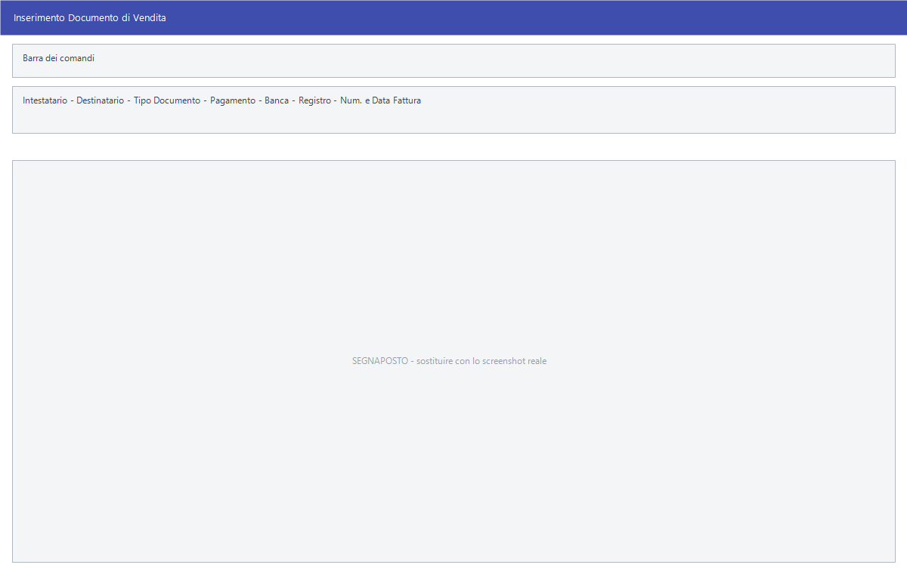

# Documento di vendita

Tutte le voci **Inserimento** e **Modifica** del menu Vendite aprono **la stessa
maschera**: cambia il tipo di documento che si sta compilando, non il modo di
compilarlo. Fattura, documento di trasporto, bolla, buono di consegna, ricevuta
fiscale, autofattura e ordine si scrivono qui.

!!! info "In sintesi"

    **Percorso:** Menu ▸ Vendite ▸ *(un tipo di documento)* ▸ Inserimento *(oppure* Modifica*)*, o **F2 - Nuovo** dalla [gestione documenti](gestione-documenti.md)
    **Scorciatoia:** ++f2++ salva, ++f5++ cerca, ++f7++ stampa, ++f8++ corpo, ++f9++ email
    **Permessi richiesti:** nessun profilo predefinito; le singole voci di menu si abilitano per ogni utente da [Archivi ▸ Utenti](../anagrafiche/utenti.md)

---

## A cosa serve

È il documento di vendita in tutte le sue forme. Si indica a chi va, cosa
contiene e a quali condizioni; il programma calcola gli importi, scarica il
magazzino e — a seconda del tipo — prepara le scadenze e la fattura
elettronica.

## Prerequisiti

Prima di usare questa maschera occorre:

- avere in archivio i [clienti](../anagrafiche/anagrafica-clienti.md) con le
  loro condizioni;
- avere gli [articoli](../anagrafiche/anagrafica-articoli.md) con i
  [listini](../listini-vendita/gestione-listini.md) valorizzati;
- avere le [aliquote IVA](../contabilita/aliquote-iva.md), i
  [tipi di pagamento](../contabilita/tipi-di-pagamento.md) e le
  [causali contabili](../contabilita/causali-contabili.md);
- avere impostato registri e numeratori nella
  [ditta](../anagrafiche/ditte.md).

## La maschera

La finestra è organizzata in tre parti, che si raggiungono dai pulsanti in
basso:

1. la **testata** — chi, che tipo di documento, a quali condizioni;
2. il **corpo** (**F8 - Corpo**) — le righe di merce;
3. il **piede** e i **totali** — spese, sconti finali, riepilogo IVA.

## Campi

### Testata

| Campo | Obbl. | Descrizione | Valori ammessi |
|---|:---:|---|---|
| **Intestatario** | ● | Il [cliente](../anagrafiche/anagrafica-clienti.md) a cui il documento è intestato. Un elenco a fianco sceglie se è un cliente o un fornitore. | codice |
| **Destinatario** | | La destinazione della merce, se diversa dall'intestatario. | codice |
| **Tipo Documento** | ● | Il tipo ai fini della fattura elettronica. | `TD01 - FATTURA`, `TD04 - NOTA CREDITO`, `TD02 - FATTURA ACCONTO`, `TD05 - NOTA DI DEBITO`, `TD06 - PARCELLA`, `TD24 - FATTURA DIFFERITA…` e gli altri codici TD previsti |
| **Operatore** | | Chi sta emettendo il documento. | codice |
| **Gruppo** | | Il gruppo del cliente. | codice |
| **Pagamento** | ● | Il [tipo di pagamento](../contabilita/tipi-di-pagamento.md): da qui nascono le scadenze. Proposto dal cliente. | codice |
| **Data Diversa** | | Una data da cui far decorrere le scadenze, diversa da quella del documento. | data |
| **Banca** | | La [banca](../contabilita/banche.md) di appoggio. | codice |
| **Cau. Contabile** | | La [causale](../contabilita/causali-contabili.md) con cui il documento sarà contabilizzato. | codice |
| **Registro** | ● | Il registro IVA e il numeratore da usare. | voce dell'elenco |
| **Num. Fattura**, **Data Fattura** | | Numero e data del documento. | numero e data |
| **Num. Ordine**, **Data Ordine** | | Il riferimento all'ordine del cliente. | numero e data |
| **Num. Documento**, **Data Fattura** | | Il riferimento al documento da cui questo deriva. | numero e data |
| **% Sconto** | | Lo sconto generale del documento. | percentuale |
| **Sezione** | | La [sezione](../contabilita/sezioni.md) contabile. | codice |
| **Commessa** | | La [commessa](../contabilita/commesse.md) a cui imputare. | codice |
| **Cen. Costo/Ricavo** | | Il [centro di costo o ricavo](../contabilita/centri-di-costo.md). | codice |
| **Addebito Bolli** | | Se addebitare il bollo al cliente. | attivo/non attivo |
| **Ric. Fiscale** | | Lo stato del documento rispetto alla ricevuta fiscale. | — |

{: .campi }

### Corpo

Il corpo si apre con **F8 - Corpo** ed è la griglia delle righe:

| Colonna | Contenuto |
|---|---|
| **Codice** | Il codice dell'articolo. |
| **Col.**, **Tag.** | Colore e taglia, nella versione Taglie e Colori. |
| **Descrizione** | La descrizione, proposta dall'articolo e correggibile. |
| **Mis.** | L'[unità di misura](../magazzino/unita-di-misura.md). |
| **Quantità** | Quanto se ne vende. |
| **Q.tà Evasa** | Quanto è già stato consegnato, sugli ordini. |
| **Esistenza**, **Disponibilità** | Quanto ce n'è e quanto è libero da impegni. |
| **Data Ord. For.**, **Data Consegna** | Le date dell'ordine al fornitore e della consegna. |
| **Colli**, **Prel.** | I colli e la quantità prelevata. |
| **Prezzo Unit.** | Il prezzo, proposto dal listino del cliente. |
| **Sconto**, **Sc.Merce** | Lo sconto in percentuale e lo sconto merce. |
| **Importo** | Il totale della riga. |
| **C.Iva** | L'[aliquota IVA](../contabilita/aliquote-iva.md) della riga. |
| **Ordinare** | Segna la riga da ordinare al fornitore. |
| **Dep** | Il [deposito](../magazzino/depositi.md) da cui scaricare. |

## Pulsanti e comandi

| Comando | Scorciatoia | Effetto |
|---|---|---|
| **F2 - Salva** | ++f2++ | Registra il documento. |
| **F3 - Prec.** | ++f3++ | Passa al documento precedente. |
| **F4 - Succ.** | ++f4++ | Passa al documento successivo. |
| **F5 - Cerca** | ++f5++ | Apre l'elenco dei documenti. |
| **F6 - Elimina** | ++f6++ | Cancella il documento, previa conferma. |
| **F7 - Stampa** | ++f7++ | Stampa il documento. |
| **F8 - Corpo** | ++f8++ | Passa alle righe di merce. |
| **F9 - Email** | ++f9++ | Manda il documento per posta al cliente. |
| **Piede**, **Totali** | | Passano al piede e al riepilogo dei totali. |
| **Lista** | | Torna all'elenco dei documenti. |
| **Anteprima** | | Mostra l'anteprima di stampa. |
| **Etichette** | | Stampa le etichette del documento. |
| **Allegati** | | Allega un file al documento. |
| **Tracc.** | | Apre i dati di tracciabilità. |
| **Fatture Elettroniche** | | Apre la gestione della fattura elettronica del documento. |
| **Ricarica** | | Rilegge il documento, abbandonando le modifiche non salvate. |
| **Annulla**, **Chiudi** | ++esc++ | Abbandonano il documento. |

## Come si fa

### Emettere una fattura

1. Apri **Menu ▸ Vendite ▸ Fatture ▸ Inserimento**.
2. Indica l'**Intestatario**: il programma propone pagamento, banca, listino e
   sconti dalle condizioni del cliente.
3. Controlla **Tipo Documento** — per una fattura ordinaria `TD01 - FATTURA` —
   e il **Registro**.
4. Premi **F8 - Corpo** e scrivi le righe: **Codice** e **Quantità** bastano,
   il **Prezzo Unit.** arriva dal listino.
5. Vai su **Totali** e controlla il riepilogo IVA.
6. Premi **F2 - Salva**, poi **F7 - Stampa** o **F9 - Email**.

### Emettere una nota di credito

1. Apri **Fatture ▸ Inserimento** come sopra.
2. In **Tipo Documento** scegli `TD04 - NOTA CREDITO`.
3. In **Num. Documento** e **Data Fattura** indica gli estremi della fattura
   che stai stornando.
4. Compila il corpo con le righe da stornare.

### Emettere un documento di trasporto

1. Apri **Menu ▸ Vendite ▸ Doc. di Trasporto ▸ Inserimento**.
2. Compila testata e corpo come per la fattura.
3. Il documento resta poi disponibile per l'
   [emissione differita della fattura](emissione-fatture-da-documenti.md).

## Controlli e messaggi

| Messaggio | Causa | Cosa fare |
|---|---|---|
| *(nessun messaggio, solo un segnale acustico)* | Manca un campo obbligatorio. | Guarda dove si è posizionato il cursore: è il campo da compilare. |

<!-- DA VERIFICARE: i messaggi di questa maschera. È la più grande del programma e i controlli sono molti: vanno raccolti in una passata dedicata. -->

## Note

!!! note "Una maschera per tutti i documenti"

    Fatture, DDT, bolle, buoni di consegna, ricevute fiscali, autofatture e
    ordini si compilano tutti qui: cambia il registro e cambiano alcuni campi,
    ma il modo di lavorare è lo stesso. I **preventivi** fanno eccezione e
    hanno la [loro maschera](preventivi.md).

<!-- DA VERIFICARE: quali campi della testata compaiono o spariscono secondo il tipo di documento. -->

<!-- DA VERIFICARE: cosa contengono il Piede e i Totali: non ho potuto estrarne le etichette. -->

<!-- DA VERIFICARE: a cosa serve il pulsante Tracc. e quali dati di tracciabilità raccoglie. -->

<!-- DA VERIFICARE: in quale momento il documento scarica il magazzino: al salvataggio o alla stampa. -->

## Vedi anche

- [Gestione documenti](gestione-documenti.md)
- [Preventivi](preventivi.md)
- [Emissione fatture da documenti](emissione-fatture-da-documenti.md)
- [Contabilizzazione dei documenti](contabilizzazione-documenti.md)
