# Documento di vendita

Tutte le voci **Inserimento** e **Modifica** del menu Vendite aprono **la stessa
maschera**: cambia il tipo di documento che si sta compilando, non il modo di
compilarlo. Fattura, documento di trasporto, bolla, buono di consegna, ricevuta
fiscale, autofattura e ordine si scrivono qui.

!!! info "In sintesi"

    - **Percorso:** Menu ▸ Vendite ▸ *(un tipo di documento)* ▸ Inserimento *(oppure* Modifica*)*, o **F2 - Nuovo** dalla [gestione documenti](gestione-documenti.md)
    - **Scorciatoia:** ++f2++ salva, ++f5++ cerca, ++f7++ stampa, ++f8++ corpo, ++f9++ email
    - **Permessi richiesti:** nessun profilo predefinito; le singole voci di menu si abilitano per ogni utente da [Archivi ▸ Utenti](../anagrafiche/utenti.md)

---

## A cosa serve

È il documento di vendita in tutte le sue forme. Si indica a chi va, cosa
contiene e a quali condizioni; il programma calcola gli importi, scarica il
magazzino e — a seconda del tipo — prepara le scadenze e la fattura
elettronica.

## Prerequisiti

Prima di usare questa maschera occorre:

- avere in archivio i [clienti](../anagrafiche/anagrafica-clienti.md) con le
  loro condizioni;
- avere gli [articoli](../anagrafiche/anagrafica-articoli.md) con i
  [listini](../listini-vendita/gestione-listini.md) valorizzati;
- avere le [aliquote IVA](../contabilita/aliquote-iva.md), i
  [tipi di pagamento](../contabilita/tipi-di-pagamento.md) e le
  [causali contabili](../contabilita/causali-contabili.md);
- avere impostato registri e numeratori nella
  [ditta](../anagrafiche/ditte.md).

## La maschera

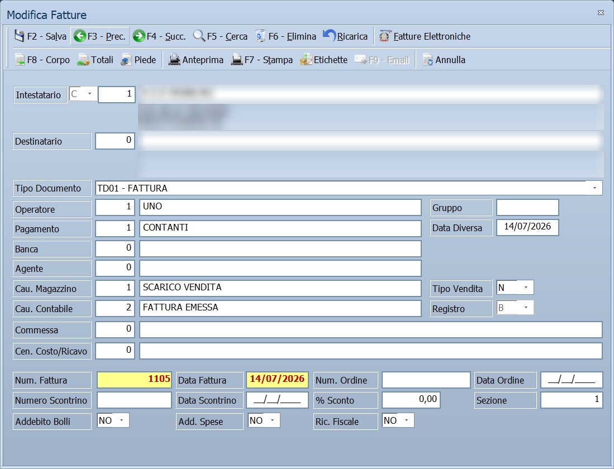

La finestra è organizzata in tre parti, che si raggiungono dai pulsanti in
basso:

1. la **testata** — chi, che tipo di documento, a quali condizioni;
2. il **corpo** (**F8 - Corpo**) — le righe di merce;
3. il **piede** e i **totali** — spese, sconti finali, riepilogo IVA.

Se in fondo al titolo della finestra compare **[SQL]** — per esempio
*Inserimento Ordine Cliente [SQL]* — la maschera sta lavorando sull'archivio
attraverso il motore SQL. Per chi usa la maschera non cambia nulla: è
un'indicazione utile all'assistenza, da riferire insieme al testo di un
eventuale messaggio d'errore.

## Campi

### Testata

| Campo | Obbl. | Descrizione | Valori ammessi |
|---|:---:|---|---|
| **Intestatario** | ● | Il [cliente](../anagrafiche/anagrafica-clienti.md) a cui il documento è intestato. Un elenco a fianco sceglie se è un cliente o un fornitore. | codice |
| **Destinatario** | | La destinazione della merce, se diversa dall'intestatario. | codice |
| **Tipo Documento** | ● | Il tipo ai fini della fattura elettronica. | `TD01 - FATTURA`, `TD04 - NOTA CREDITO`, `TD02 - FATTURA ACCONTO`, `TD05 - NOTA DI DEBITO`, `TD06 - PARCELLA`, `TD24 - FATTURA DIFFERITA…` e gli altri codici TD previsti |
| **Operatore** | | Chi sta emettendo il documento. | codice |
| **Gruppo** | | Il gruppo del cliente. | codice |
| **Pagamento** | ● | Il [tipo di pagamento](../contabilita/tipi-di-pagamento.md): da qui nascono le scadenze. Proposto dal cliente. | codice |
| **Data Diversa** | | Una data da cui far decorrere le scadenze, diversa da quella del documento. | data |
| **Banca** | | La [banca](../contabilita/banche.md) di appoggio. | codice |
| **Agente** | | L'[agente](../anagrafiche/anagrafica-agenti.md) su cui matura la provvigione. Proposto dal cliente. | codice |
| **Cau. Magazzino** | | La [causale di magazzino](../magazzino/causali-magazzino.md) con cui la merce viene movimentata. | codice |
| **Tipo Vendita** | | Il genere di vendita: decide quale delle quattro percentuali di provvigione si applica. | `N` normale, `T` trasferta, `C` e `D` centro servizi |
| **Cau. Contabile** | | La [causale](../contabilita/causali-contabili.md) con cui il documento sarà contabilizzato. | codice |
| **Registro** | ● | Il registro IVA e il numeratore da usare. | voce dell'elenco |
| **Num. Fattura**, **Data Fattura** | | Numero e data del documento. | numero e data |
| **Num. Ordine**, **Data Ordine** | | Il riferimento all'ordine del cliente. | numero e data |
| **Num. Documento**, **Data Fattura** | | Il riferimento al documento da cui questo deriva. | numero e data |
| **% Sconto** | | Lo sconto generale del documento. | percentuale |
| **Sezione** | | La [sezione](../contabilita/sezioni.md) contabile. | codice |
| **Commessa** | | La [commessa](../contabilita/commesse.md) a cui imputare. | codice |
| **Cen. Costo/Ricavo** | | Il [centro di costo o ricavo](../contabilita/centri-di-costo.md). | codice |
| **Addebito Bolli** | | Se addebitare il bollo al cliente. | `NO`, `SI` |
| **Add. Spese** | | Se addebitare le spese al cliente. | `NO`, `SI` |
| **Ric. Fiscale** | | Se il documento va raggruppato nella fatturazione differita. L'etichetta cambia con il tipo di documento: sui DDT, sulle bolle e sui DDT da terzi diventa **Raggruppa**, sui buoni di consegna **Pagato**, e su ricevute fiscali e autofatture sparisce del tutto. | `NO`, `SI` |
| **Consegna** | | La data di consegna. Compare **solo sugli ordini**, clienti e fornitori. | data |
| **Totale Documento** | | Il totale. Lo calcola il programma. | Sola lettura |

### Corpo

Il corpo si apre con **F8 - Corpo** ed è la griglia delle righe. Il titolo
della finestra riporta numero e data del documento, l'intestatario e il listino
in uso.

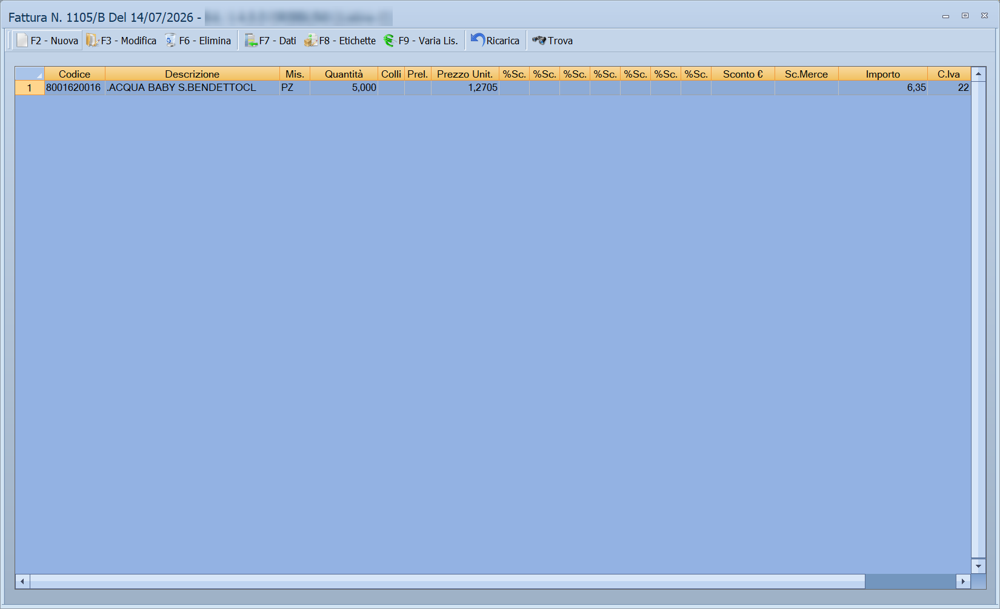

| Colonna | Contenuto |
|---|---|
| **Codice** | Il codice dell'articolo. |
| **Col.**, **Tag.** | Colore e taglia, nella versione Taglie e Colori. |
| **Descrizione** | La descrizione, proposta dall'articolo e correggibile. |
| **Mis.** | L'[unità di misura](../magazzino/unita-di-misura.md). |
| **Quantità** | Quanto se ne vende. |
| **Q.tà Evasa** | Quanto è già stato consegnato, sugli ordini. |
| **Esistenza**, **Disponibilità** | Quanto ce n'è e quanto è libero da impegni. |
| **Data Ord. For.**, **Data Consegna** | Le date dell'ordine al fornitore e della consegna. |
| **Colli**, **Prel.** | I colli e la quantità prelevata. |
| **Prezzo Unit.** | Il prezzo, proposto dal listino del cliente. |
| **Sconto**, **Sc.Merce** | Lo sconto in percentuale e lo sconto merce. |
| **Importo** | Il totale della riga. |
| **C.Iva** | L'[aliquota IVA](../contabilita/aliquote-iva.md) della riga. |
| **Ordinare** | Segna la riga da ordinare al fornitore. |
| **Dep** | Il [deposito](../magazzino/depositi.md) da cui scaricare. |

La barra del corpo:

| Comando | Scorciatoia | Effetto |
|---|---|---|
| **F2 - Nuova** | ++f2++ | Aggiunge una riga: si apre la [finestra della riga](#la-riga-del-documento). |
| **F3 - Modifica** | ++f3++ | Apre la riga selezionata. A documento già stampato il pulsante si chiama **F3 - Vedi** e la riga si guarda soltanto. |
| **F6 - Elimina** | ++f6++ | Toglie la riga selezionata. |
| **F7 - Dati** | ++f7++ | Prende le righe da fuori: da un lettore, da un file, da uno scontrino, dal venduto. Le voci sono [più sotto](#le-voci-di-f7-dati). Spento sui documenti dei tabacchi. |
| **F8 - Etichette** | ++f8++ | Stampa le etichette degli articoli delle righe. Alla domanda *Vuoi confermare le etichette ?* **Sì** apre la finestra di ogni etichetta, da confermare una per una; **No** le stampa direttamente; **Annulla** non stampa niente. |
| **F9 - Varia Lis.** | ++f9++ | Rifà i prezzi di tutte le righe con un altro listino: vedi [Cambiare il listino di un documento](#cambiare-il-listino-di-un-documento). Negli ordini a fornitore il pulsante si chiama **F9 - Listini** e aggiorna invece i listini degli articoli. |
| **Da Ordinare** | | Segna o toglie il segno *da ordinare* sulla riga selezionata. Compare solo sugli ordini clienti non ancora evasi del tutto. |
| **Ricarica** | | Rilegge le righe dall'archivio. |
| **Trova** | | Cerca un testo nella griglia. |

A documento stampato **F2 - Nuova**, **F6 - Elimina**, **F7 - Dati** e **F9**
restano spenti: le righe di un documento emesso non si toccano.

#### Le voci di F7 - Dati

Le voci cambiano con il tipo di documento:

| Voce | Documento | Cosa fa |
|---|---|---|
| **Palmare Android**, **Lettore Formula 734**, **Lettore Meteor Eco 486**, **Lettore Meteor PT10**, **Lettore Unitech PT630D**, **Lettore Zebex 2030**, **Lettore Eia Thunder**, **Lettore BCP8000 - ET8000**, **Lettore DENSO N661** | tutti | Scaricano le letture di un terminale portatile o di un lettore di codici a barre. |
| **Foglio Excel** | tutti | Prende le righe da un foglio Excel: vedi [Le righe che arrivano da fuori](#le-righe-che-arrivano-da-fuori). |
| **Articoli** | tutti | Apre la [ricerca articoli](../anagrafiche/cerca-articoli.md) per scegliere gli articoli da mettere nel documento. |
| **Ordine C.S.R.S.**, **Ordine EspriNet** | ordini a fornitore | Leggono l'ordine dal file del fornitore. |
| **Riassortimento da Vendite** | ordini clienti | Mette nell'ordine il venduto di un periodo: vedi [Prendere le righe dal venduto](#prendere-le-righe-dal-venduto). |
| **Fatturazione Vendite** | fatture | La stessa cosa, per fatturare il venduto di un periodo. |
| **Scontrino SysPC**, **Scontrino Ditron**, **Scontrino Facile** | fatture | Fatturano uno scontrino: vedi [Fatturare uno scontrino](#fatturare-uno-scontrino). |
| **Buoni Pasto** | fatture | Chiede un periodo da cui prendere i buoni pasto. |
| **Fattura XML/P7M** | fatture | Legge le righe da un file di fattura elettronica. |
| **Esistenza Deposito** | documenti di trasporto | Mette nel documento la giacenza di un deposito. |
| **Carico Merci** | autofatture | Prende le righe da un carico: vedi [Autofattura da un carico merci](#autofattura-da-un-carico-merci). |

<!-- DA VERIFICARE: cosa fanno esattamente Buoni Pasto e Fattura XML/P7M dopo la scelta -->

### La riga del documento

Si apre dal corpo con **F2 - Nuova** o **F3 - Modifica**. Il titolo dice cosa
si sta facendo e su quale documento: *Inserimento Righe Fattura*, *Modifica
Righe Ordine Cliente.* e così via.

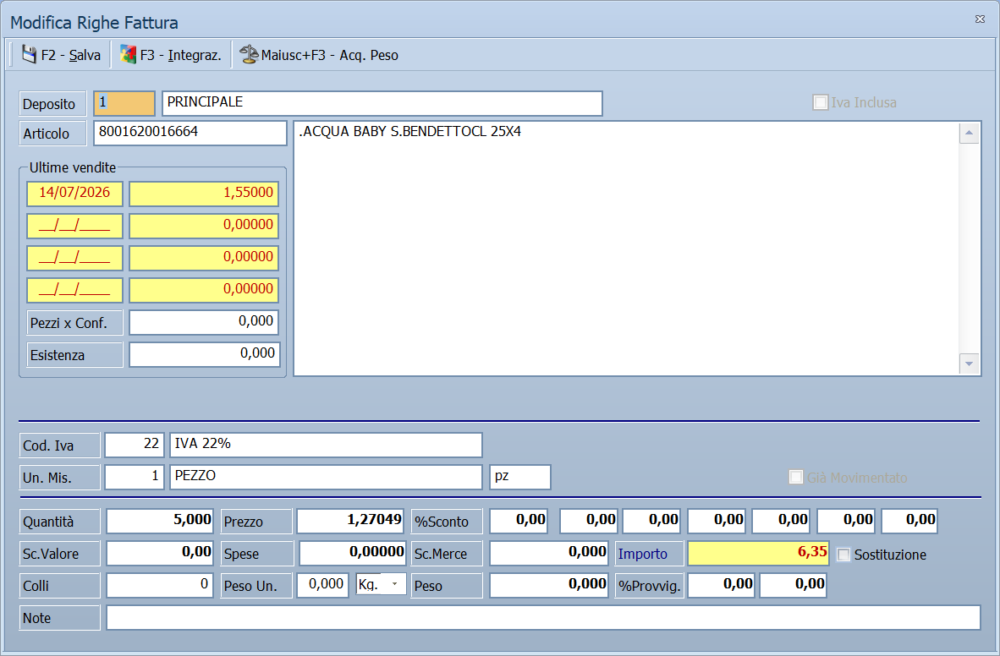

| Campo | Descrizione |
|---|---|
| **Deposito** | Il [deposito](../magazzino/depositi.md) da cui esce la merce. |
| **Articolo** | Il codice dell'[articolo](../anagrafiche/anagrafica-articoli.md). Accanto, la descrizione: proposta dall'articolo, si può correggere e allungare su più righe. |
| **Ultime vendite** | Le ultime quattro vendite dell'articolo, con data e prezzo. Sugli ordini a fornitore il riquadro si chiama **Ultimi Acquisti**. |
| **Pezzi x Conf.**, **Esistenza** | Quanti pezzi ha una confezione e quanti ce ne sono in magazzino. |
| **Commessa**, **Cen. Costo/Ricavo** | La [commessa](../contabilita/commesse.md) e il [centro di costo](../contabilita/centri-di-costo.md) della riga. Compaiono solo se la causale di magazzino del documento li gestisce. |
| **Cod. Iva** | L'[aliquota IVA](../contabilita/aliquote-iva.md) della riga. Obbligatoria. |
| **Un. Mis.** | L'[unità di misura](../magazzino/unita-di-misura.md). |
| **Quantità**, **Prezzo** | Quanto e a che prezzo. Il prezzo arriva dal listino del documento. |
| **%Sconto** | Fino a sette sconti in cascata. |
| **Sc.Valore**, **Spese** | Uno sconto in euro e una spesa da aggiungere alla riga. |
| **Sc.Merce** | La quantità data in sconto merce. |
| **Importo** | Il totale della riga. Lo calcola il programma. |
| **Colli**, **Peso Un.**, **Peso** | I colli, il peso di un pezzo con la sua unità, e il peso totale, calcolato. |
| **%Provvig.** | La provvigione dell'agente e quella del capo area. Non c'è sugli ordini a fornitore e sui documenti intestati a un fornitore. |
| **Note** | Una nota sulla riga. |
| **Iva Inclusa** | Dice se il prezzo è IVA compresa, come stabilito nell'articolo. Si legge soltanto. |
| **Già Movimentato** | La riga non muove il magazzino, perché la merce è già uscita: lo segnano le righe prese da uno scontrino o da un carico merci. |
| **Sostituzione** | Merce data in sostituzione: non matura provvigione. |

Alcuni campi compaiono solo in certi casi:

- **Q.ta Evasa** sugli ordini clienti, **Q.ta Ricev.** sugli ordini a
  fornitore: quanto è già stato consegnato o ricevuto. Si legge soltanto;
- **F8 - Ordini** e **F7 - Carichi**, in rosso in alto, sugli ordini a
  fornitore: ricordano i due tasti che mostrano gli ordini ancora aperti e i
  carichi dell'articolo;
- **Lotto**, **SSCC**, **GTIN** e **Scadenza** con la gestione dei lotti attiva
  nella [ditta](../anagrafiche/ditte.md);
- **Coef. Mol.** con l'impostazione **Usa Coefficenti Moltiplicativi** della
  ditta.

La barra ha **F2 - Salva**, che registra la riga e prepara la successiva, e
due pulsanti:

- **F3 - Integraz.** apre le [integrazioni](#le-integrazioni-della-fattura-elettronica)
  della riga. C'è solo su fatture, fatture accompagnatorie e autofatture, e
  solo su una riga già registrata;
- **Maiusc+F3 - Acq. Peso** (++shift+f3++) legge il peso dalla bilancia
  collegata alla postazione e lo mette nella **Quantità**. C'è solo se la
  bilancia è impostata, e legge le bilance DIBAL, NONIS, BIZERBA e WUNDER.
  Alla BIZERBA il programma manda anche il **Prezzo** della riga.

Sul documento già stampato la riga si apre soltanto in lettura e **F2 - Salva**
resta spento.

Tasti utili mentre si scrive la riga:

| Tasto | Dove | Effetto |
|---|---|---|
| ++f4++ | | Apre i listini dell'articolo. |
| ++f6++ | **Prezzo** | Toglie l'IVA dal prezzo. |
| ++f9++ | **Quantità** | Moltiplica la quantità per i pezzi della confezione. |
| ++f9++ | **Prezzo** | Divide il prezzo per la quantità. |
| ++f10++ | **Quantità** | Arrotonda alla confezione intera successiva. |
| ++f10++ | **Prezzo** | Mette o toglie l'IVA dal prezzo. |
| ++f7++, ++f8++ | ordini a fornitore | Mostrano i carichi dell'articolo e gli ordini ancora aperti, da cui si prendono prezzo e sconti. |
| barra spaziatrice, doppio clic | un codice | Apre l'elenco da cui sceglierlo. |

Alcune versioni e alcuni documenti hanno una finestra della riga diversa: la
versione Taglie e Colori, gli ordini dei tabacchi e alcune installazioni
personalizzate.
<!-- DA VERIFICARE: documentare le finestre della riga delle altre versioni (Taglie e Colori, Tabacchi, CO.M.EDIL) -->

### Piede

Si apre con il pulsante **Piede** e raccoglie i dati del trasporto e le note.
Su ricevute fiscali e autofatture quel pulsante non c'è: al suo posto
compare **Allegati**.

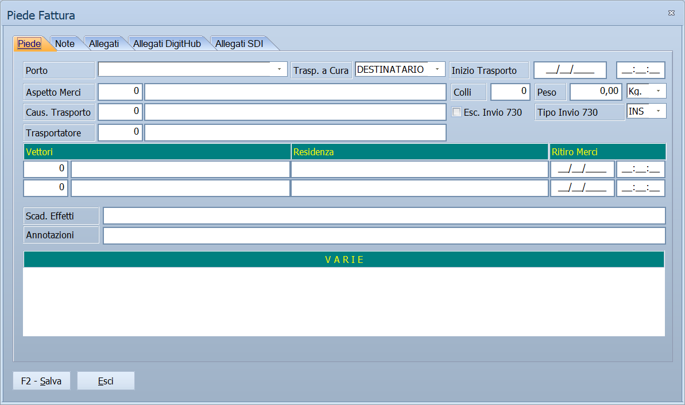

La finestra è divisa in schede:

| Scheda | Contenuto | Compare |
|---|---|---|
| **Piede** | I dati del trasporto e le righe libere, descritti nella tabella qui sotto. Sulle anomalie restano solo le quattro righe **V A R I E**. | sempre |
| **Note** | Un testo libero sul documento, su più righe, sotto l'intestazione **N O T E**. | sempre |
| **Allegati** | I file allegati al documento. | sempre |
| **Allegati DigitHub**, **Allegati SDI** | I file scambiati con l'intermediario e con il Sistema di Interscambio. | su fatture e fatture accompagnatorie |
| **Scheda Trasporto** | **Committente**, **Caricatore**, **Proprietario** della merce e **Luogo di Carico**, ciascuno con il suo indirizzo, e il **Luogo Compilazione** della scheda. | sui documenti di trasporto |

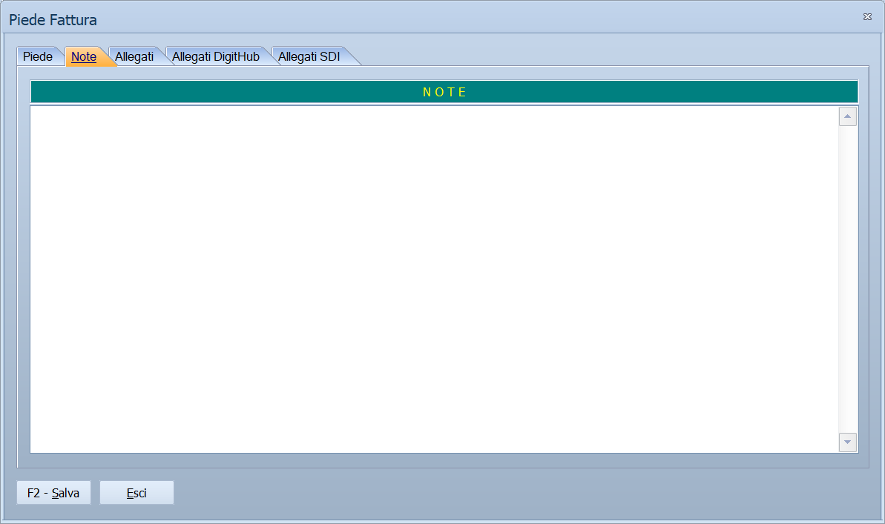

**F2 - Salva** registra quello che si è scritto in tutte le schede; **Esci**
chiude senza salvare.

| Campo | Obbl. | Descrizione | Valori ammessi |
|---|:---:|---|---|
| **Porto** | | A carico di chi è il trasporto. | *(vuoto)*, `FRANCO`, `ASSEGNATO`, `FRANCO DEPOSITO`, `EX WORKS`, `FRANCO CON ADDEBITO IN FATTURA` |
| **Trasp. a Cura** | | Chi cura il trasporto. | `VETTORE`, `MITTENTE`, `DESTINATARIO` |
| **Inizio Trasporto** | | Data e ora di partenza della merce. | data e ora |
| **Aspetto Merci** | | L'[aspetto esteriore dei beni](../altre-tabelle/note-aspetto-trasporto.md). | codice |
| **Colli** | | Quanti colli. | numero |
| **Peso** | | Il peso e la sua unità. | numero, `Gr.` `Hg.` `Kg.` `Q.` `T.` |
| **Caus. Trasporto** | | La causale del trasporto. | codice |
| **Esc. Invio 730** | | Tiene il documento fuori dall'invio al Sistema Tessera Sanitaria. | attivo/non attivo |
| **Tipo Invio 730** | | Che genere di comunicazione mandare. | `INS`, `VAR`, `RIMB`, `CANC` |
| **Trasportatore** | | Il [trasportatore](../anagrafiche/trasportatori.md) incaricato. | codice |
| **Gestione Merce in Transito** | | Segna la merce come in transito. | attivo/non attivo |
| **Vettori**, **Residenza**, **Ritiro Merci** | | Due righe per il primo e il secondo vettore, con la loro residenza e data e ora del ritiro. | codici, testo, data e ora |
| **Scad. Effetti** | | Le date delle scadenze, in chiaro sul documento. | testo |
| **Annotazioni** | | Una riga di note. | testo |
| **VARIE** | | Quattro righe libere che finiscono sul documento stampato. | testo |

### Totali

Si apre con il pulsante **Totali**. È il riepilogo economico del documento:
quasi tutto lo calcola il programma, e si scrivono a mano solo le voci del
piede.

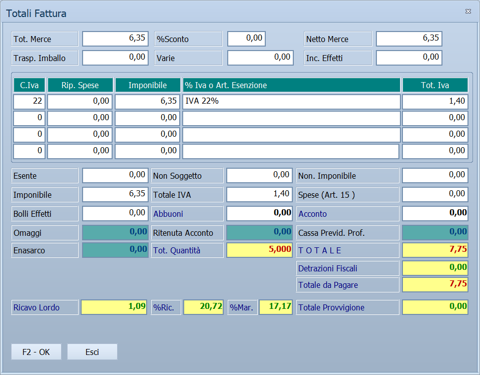

| Campo | Si scrive | Descrizione |
|---|:---:|---|
| **Tot. Merce**, **%Sconto**, **Netto Merce** | | Il totale delle righe, lo sconto generale e quello che resta. |
| **Trasp. Imballo** | ● | Spese di trasporto e imballo da addebitare. |
| **Varie** | ● | Altre spese. |
| **Inc. Effetti** | ● | Spese di incasso degli effetti. |
| **C.Iva**, **Rip. Spese**, **Imponibile**, **% Iva o Art. Esenzione**, **Tot. Iva** | | Il castelletto IVA, fino a quattro aliquote per documento. |
| **Esente**, **Non Soggetto**, **Non. Imponibile** | | I tre totali fuori campo IVA. |
| **Imponibile**, **Totale IVA** | | I due totali generali. |
| **Spese (Art. 15 )** | ● | Le spese escluse dalla base imponibile. |
| **Bolli Effetti** | ● | I bolli sugli effetti. |
| **Abbuoni** | ● | L'abbuono concesso. |
| **Acconto** | ● | L'acconto già versato, da scalare. |
| **Omaggi** | | Il valore degli omaggi. |
| **Ritenuta Acconto** | | La ritenuta d'acconto. |
| **Cassa Previd. Prof.** | | Il contributo alla cassa di previdenza. |
| **Enasarco** | | Il contributo Enasarco. |
| **Tot. Quantità** | | La somma delle quantità. |
| **T O T A L E** | | Il totale del documento. |
| **Totale Cauzioni**, **Totale Resi** | | I due totali delle versioni che li gestiscono. |
| **Detrazioni Fiscali** | ● | L'importo che dà diritto a detrazione. |
| **Totale da Pagare** | | Quello che il cliente deve. |
| **Ricavo Lordo**, **%Ric.**, **%Mar.**, **Totale Provvigione** | | Margine e provvigione del documento. Non compaiono su richieste offerta, autofatture e ordini a fornitore. |
| **N. Pedane**, **Costo Pedane** | ● | Le pedane, dove sono gestite. |

A documento emesso le voci che si scrivono a mano diventano di sola lettura e
il pulsante **F2 - OK** sparisce: resta solo **Esci**.

## Pulsanti e comandi

| Comando | Scorciatoia | Effetto |
|---|---|---|
| **F2 - Salva** | ++f2++ | Registra il documento. |
| **F3 - Prec.** | ++f3++ | Passa al documento precedente. |
| **F4 - Succ.** | ++f4++ | Passa al documento successivo. |
| **F5 - Cerca** | ++f5++ | Apre l'elenco dei documenti. |
| **F6 - Elimina** | ++f6++ | Cancella il documento, previa conferma. |
| **F7 - Stampa** | ++f7++ | Stampa il documento; se è ancora solo salvato, prima lo emette. Se il salvataggio non riesce, compare il messaggio con la causa e la stampa non parte. |
| **F8 - Corpo** | ++f8++ | Passa alle righe di merce. |
| **F9 - Email** | ++f9++ | Manda il documento per posta al cliente. |
| **Piede**, **Totali** | | Passano al piede e al riepilogo dei totali. |
| **Lista** | | Torna all'elenco dei documenti. |
| **Anteprima** | | Mostra l'anteprima di stampa. |
| **Etichette** | | Stampa le etichette dei colli: vedi [Stampare le etichette dei colli](#stampare-le-etichette-dei-colli). |
| **Allegati** | | Allega un file al documento. |
| **Tracc.** | | Apre un menu con **Etichette Logistiche** ed **Etichette Commerciali**. Compare solo con la gestione dei lotti attiva. |
| **Fatture Elettroniche** | | Apre la gestione della fattura elettronica del documento. Compare solo su fatture, fatture accompagnatorie e autofatture. |
| **Ricarica** | | Rilegge il documento, abbandonando le modifiche non salvate. |
| **Annulla**, **Chiudi** | ++esc++ | Abbandonano il documento. |

## Come si fa

### Emettere una fattura

1. Apri **Menu ▸ Vendite ▸ Fatture ▸ Inserimento**.
2. Indica l'**Intestatario**: il programma propone pagamento, banca, listino e
   sconti dalle condizioni del cliente.
3. Controlla **Tipo Documento** — per una fattura ordinaria `TD01 - FATTURA` —
   e il **Registro**.
4. Premi **F8 - Corpo** e scrivi le righe: **Codice** e **Quantità** bastano,
   il **Prezzo Unit.** arriva dal listino.
5. Vai su **Totali** e controlla il riepilogo IVA.
6. Premi **F2 - Salva**, poi **F7 - Stampa** o **F9 - Email**.

### Emettere una nota di credito

1. Apri **Fatture ▸ Inserimento** come sopra.
2. In **Tipo Documento** scegli `TD04 - NOTA CREDITO`.
3. In **Num. Documento** e **Data Fattura** indica gli estremi della fattura
   che stai stornando.
4. Compila il corpo con le righe da stornare.

### Emettere un documento di trasporto

1. Apri **Menu ▸ Vendite ▸ Doc. di Trasporto ▸ Inserimento**.
2. Compila testata e corpo come per la fattura.
3. Il documento resta poi disponibile per l'
   [emissione differita della fattura](emissione-fatture-da-documenti.md).

### Cambiare il listino di un documento

Se il documento è stato compilato con il listino sbagliato, o il cliente è
passato ad altre condizioni, non serve riscrivere le righe: si cambia il
listino e il programma rifà i prezzi di tutte.

1. Apri il documento e premi **F8 - Corpo**.
2. Premi **F9 - Varia Lis.** e rispondi **Sì** a *Vuoi cambiare il listino
   applicato ?*.
3. Nella finestra **Seleziona Listino** scrivi il numero in **Listino**,
   oppure premi ++f10++, la barra spaziatrice o fai doppio clic sul campo per
   sceglierlo dall'[elenco dei listini](../listini-vendita/gestione-listini.md).
   Accanto compare la descrizione.
4. Premi **F2 - OK**: le righe vengono ricalcolate e il nuovo listino diventa
   quello del documento. **Esci** o ++esc++ chiudono senza cambiare nulla.

Il pulsante è attivo solo finché il documento è nello stato *SALVATA* o
*SALVATO*, cioè non ancora stampato.

Per ogni riga che contiene un articolo il programma:

- prende il prezzo dal listino scelto. Se l'articolo in quel listino non c'è,
  usa il **Listino Principale** della [ditta](../anagrafiche/ditte.md) — o il
  **Listino Trasfert**, per i documenti in trasfert;
- riprende dal listino anche la provvigione dell'agente e, se nella ditta è
  attivo **Sconti Articolo**, gli sconti;
- converte il prezzo quando l'articolo ha i prezzi IVA inclusa e la riga no,
  o il contrario.

Le righe senza articolo, come quelle di sola descrizione, restano come sono.

Il listino **0** vuol dire *ULTIMO PREZZO DI ACQUISTO*: le righe prendono
l'ultimo prezzo pagato al fornitore, senza sconti e senza provvigione. Lo può
scegliere solo un amministratore, oppure chiunque se il documento non aveva
ancora un listino.

!!! warning "La variazione si registra subito"

    Le righe vengono salvate una per una appena si preme **F2 - OK**:
    **Ricarica** non le riporta indietro, e i prezzi o gli sconti corretti a
    mano sulle singole righe vengono sovrascritti. Per tornare ai prezzi di
    prima si ripete l'operazione con il listino di prima.

### Cercare un documento

1. Premi **F5 - Cerca**: si apre la finestra **Cerca**, già compilata con i
   dati del documento a video.
2. Scegli come cercare: **Num. Doc.** (numero e registro), **Data** o
   **Intestatario** (cliente o fornitore, con il suo codice; la barra
   spaziatrice o il doppio clic aprono l'elenco).
3. Premi **F2 - OK**: compare il primo documento dello stesso tipo con numero,
   data o intestatario uguale o successivo a quello indicato. Se non ce n'è
   nessuno, compare l'ultimo.

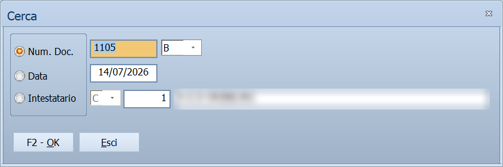

### Prendere le righe dal venduto

Mette in un ordine cliente — o in una fattura — tutto quello che è stato
venduto da un deposito in un periodo.

1. Apri il documento e premi **F8 - Corpo**.
2. Premi **F7 - Dati** e scegli **Riassortimento da Vendite** (sugli ordini) o
   **Fatturazione Vendite** (sulle fatture).
3. Nella finestra **Riassortimento da Vendite** indica **Da Data**, **A Data**
   e il **Deposito**, poi premi **F2 - OK**.

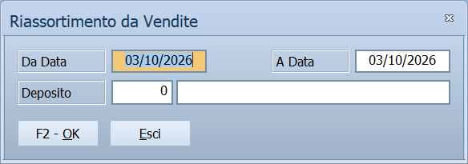

Il programma legge i movimenti di vendita di quel deposito nel periodo e ne fa
righe, sommando quelle uguali. Il prezzo:

- sugli **ordini** è quello del listino del documento; con il listino 0 è
  l'ultimo prezzo di acquisto, senza sconti;
- sulle **fatture** è quello della vendita, e le righe sono segnate **Già
  Movimentato**: la merce è già uscita, non va scaricata di nuovo.

### Fatturare uno scontrino

Una fattura può riprendere le righe di uno scontrino già battuto. Le voci di
**F7 - Dati** sono tre, una per ogni modo in cui gli scontrini arrivano a
Facile:

- **Scontrino Facile**, per gli scontrini battuti con Facile: si indicano
  **Numero** e **Registro** dello scontrino;

    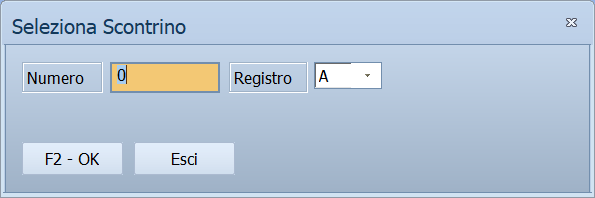

- **Scontrino SysPC** e **Scontrino Ditron**, per quelli dei registratori di
  cassa: si indicano **Data**, **Numero** e
  **Cassa**, e il programma legge lo scontrino dal file che il registratore
  ha prodotto.

    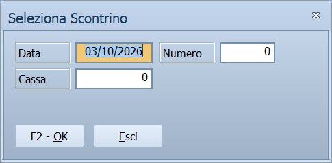

In tutti i casi le righe arrivano segnate **Già Movimentato** — il magazzino
l'ha già scaricato lo scontrino — e la fattura non genera scadenze, perché lo
scontrino è già stato pagato. **Numero Scontrino** e **Data Scontrino** della
testata si compilano da soli.

Se la data dello scontrino è diversa da quella della fattura il programma lo
dice e propone di allinearla.

### Autofattura da un carico merci

1. Apri l'autofattura, intestata al fornitore, e premi **F8 - Corpo**.
2. Premi **F7 - Dati** e scegli **Carico Merci**.
3. Indica il numero del carico e premi **F2 - OK**.

Le righe del carico entrano nell'autofattura segnate **Già Movimentato**. Il
carico deve essere dello stesso fornitore dell'autofattura; se ha già un
documento collegato, o una data diversa, il programma lo chiede prima di
proseguire.

### Stampare le etichette dei colli

Il pulsante **Etichette** della testata stampa un'etichetta per ogni collo,
con intestatario — o destinatario — e indirizzo. C'è su fatture, fatture pro
forma, documenti di trasporto, bolle e buoni di consegna.

1. Controlla i **Colli** nel [piede](#piede): il numero di etichette è quello.
   Il programma li calcola con i **Totali**, sommando i colli delle righe.
2. Premi **Etichette**.

Il tipo di etichetta e la stampante si scelgono nelle impostazioni delle
stampanti. Con le stampanti di etichette la stampa parte subito. Con un foglio
di etichette su stampante normale, se l'installazione non ha un modello di
etichetta proprio, si apre la finestra **Etichette Colli**, per usare un
foglio già cominciato:

| Campo | Descrizione |
|---|---|
| **N. Colonne** | Quante etichette ci sono in una riga del foglio, da 1 a 10. |
| **Riga**, **Colonna** | Da quale etichetta del foglio cominciare. Le precedenti restano bianche. |

### Le integrazioni della fattura elettronica

Le integrazioni sono i dati che la fattura elettronica porta oltre a quelli del
documento: l'ordine di acquisto o il contratto del cliente, i codici CUP e CIG
delle pubbliche amministrazioni, il documento di trasporto, lo stato di
avanzamento dei lavori e così via.

1. Nella testata della fattura premi **Fatture Elettroniche** e scegli
   **Integrazioni**. Su un documento nuovo, non ancora salvato, il pulsante
   serve invece a importare una fattura XML.
2. Si apre **Integrazioni Fatture**, con l'elenco di quelle già inserite.
   **F2 - Aggiungi** ne aggiunge una, **F3 - Modifica** (o il doppio clic)
   apre quella selezionata, **F6 - Elimina** la toglie subito, senza
   chiedere conferma.

    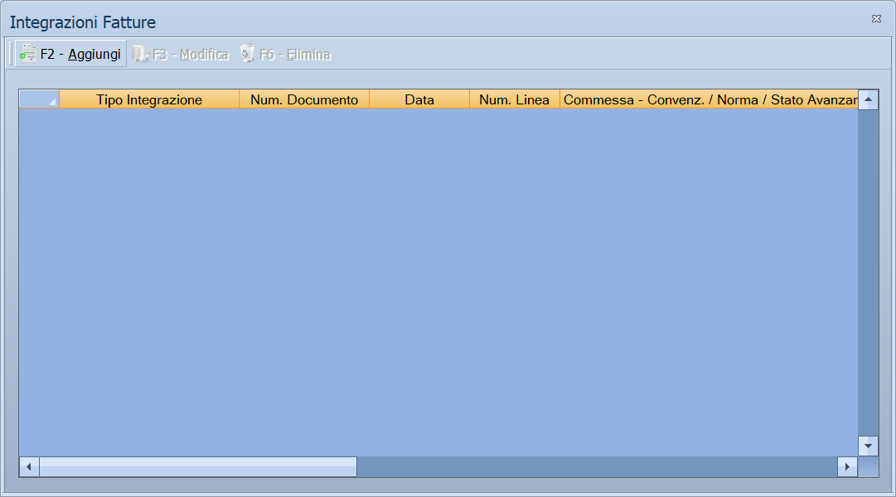

3. Nella finestra **Integrazioni** scegli il **Tipo** e compila i campi, che
   cambiano con il tipo; poi premi **F2 - Salva**.

    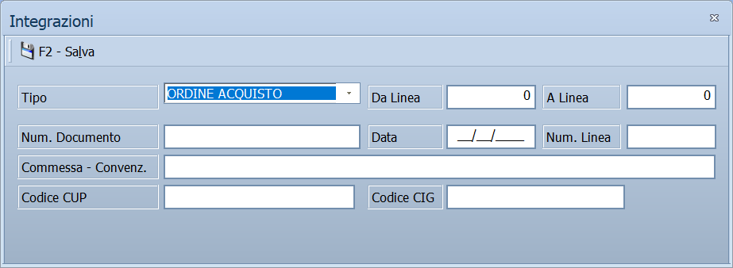

| Tipo | Campi |
|---|---|
| `ORDINE ACQUISTO`, `CONTRATTO`, `CONVENZIONE`, `RICEZIONE`, `FATTURE COLLEGATE` | **Num. Documento** (obbligatorio), **Data**, **Num. Linea**, **Commessa - Convenz.**, **Codice CUP**, **Codice CIG**, e **Da Linea** / **A Linea** per riferire l'integrazione solo ad alcune righe |
| `DOC. DI TRASPORTO` | **Num. Documento** e **Data**, obbligatori; **Da Linea** / **A Linea** |
| `FATTURA PRINCIPALE` | **Num. Documento** e **Data**, obbligatori |
| `STATO AVANZ. LAVORI` | **Stato Avanzamento**, il numero del SAL |
| `NORMA DI RIFERIMENTO` | **Descrizione Norma** |
| `CAUSALE` | **Descrizione** |
| `RIF.TO AMMINISTRAZIONE` | **Descrizione**, al massimo 20 caratteri |
| `DATI VEICOLI` | **Immatricolazione** (obbligatoria) e **Km / Ore** |

Se si indicano **Da Linea** e **A Linea** vanno compilati tutti e due, e il
primo non può superare il secondo.

Le stesse integrazioni si possono dare a una **singola riga**: dalla finestra
della riga, **F3 - Integraz.** apre *Integrazione Righe Fatture*. Lì i tipi
sono quelli dell'ordine, del contratto, della convenzione, della ricezione,
delle fatture collegate e del documento di trasporto, più **ALTRI DATI
GESTIONALI**, che chiede **Tipo Dato** (fino a 10 caratteri) e almeno uno fra
**Rif. Numero**, **Rif. Testo** (fino a 60 caratteri) e **Rif. Data**.

## Controlli e messaggi

È la maschera che parla di più di tutto il programma. I messaggi sono
raccolti qui per **momento in cui si incontrano**, non in ordine alfabetico:
quasi sempre quello che serve è capire *a che punto* il documento si è
fermato.

!!! tip "Le domande importanti hanno «No» già selezionato"

    Quasi tutte le domande di questa maschera — fido superato, cliente
    cessato, righe senza lotto, scadenzario da correggere — arrivano con la
    risposta **No** preimpostata. Premere Invio per abitudine **non**
    prosegue: annulla. È voluto, ed è la ragione per cui conviene leggerle
    invece di scacciarle.

### Quando si indica il cliente

| Messaggio | Causa | Cosa fare |
|---|---|---|
| *Il cliente selezionato risulta cessato ! Vuoi Continuare ?* | Il cliente ha una data di cessazione nella sua [anagrafica](../anagrafiche/anagrafica-clienti.md). | **Sì** intesta lo stesso il documento. Se il cliente è tornato attivo, la strada giusta è togliere la data di cessazione. |
| *Attenzione ! E' stato superato il Fido concesso al Cliente (Euro …) per l' importo di Euro … Vuoi Continuare ?* | Il documento porta l'esposizione del cliente oltre il fido. | **Sì** prosegue lo stesso. La cifra fra parentesi è il fido, l'altra lo sconfinamento. |
| *Attenzione ! E' stato superato il Fido concesso al Cliente (Euro …) per l' importo di Euro … Impossibile Continuare!* | Lo stesso caso, ma l'installazione è configurata per **non** consentire lo sconfinamento. | Non si prosegue: o si incassa qualcosa, o si alza il fido nell'anagrafica del cliente. |
| *Non e' stato inserito il destinatario ! Vuoi inserirlo ?* | Manca la destinazione della merce. | **Sì** apre la scelta del destinatario. |
| *Indicare il tipo di pagamento !* | Manca il [tipo di pagamento](../contabilita/tipi-di-pagamento.md). | Va indicato: da lì nascono le scadenze. |
| *Il tipo di pagamento non e' stato impostato. Sara' richiesto al momento della fatturazione!* | Su un documento che diventerà fattura più avanti. | Non è un errore: il pagamento verrà chiesto all'emissione della fattura. |
| *Scadenza non indicata! Vuoi Continuare ?* | Il pagamento prevede una scadenza che non è stata scritta. | **Sì** salva senza; la scadenza andrà poi messa a mano nello [scadenzario](../scadenze/gestione-scadenze.md). |

### Quando si scrivono le righe

| Messaggio | Causa | Cosa fare |
|---|---|---|
| *Attenzione! Articolo Inesistente Codice … Q.ta …* | Il codice digitato non è in [anagrafica](../anagrafiche/anagrafica-articoli.md). | Controllare il codice o creare l'articolo. |
| *Codice … non corrispondente ad alcun articolo in archivio!* | Lo stesso caso, leggendo da un lettore o da un file. | Come sopra. |
| *Riga N. … Esistenza non sufficiente per effettuare la vendita!* | L'esistenza dei depositi che l'utente può vedere non copre la quantità. | Controllare la giacenza: può anche essere un carico non ancora registrato. |
| *L'articolo selezionato ha superato la Scorta Max impostata!* | La riga porta l'articolo oltre la scorta massima. | È un avviso: si prosegue. |
| *Non sono ammesse quantità con decimali!* | L'articolo si vende a pezzi interi. | Correggere la quantità. |
| *Non sono ammesse quantita' con decimali nella gestione delle Matricole! Articolo …* | L'articolo è gestito a matricola: ogni pezzo è un pezzo. | Come sopra. |
| *Attenzione! Gestione Lotti attiva per l'articolo selezionato. Vuoi Forzare?* | L'articolo vuole il [lotto](../analisi-dati/analisi-lotti.md) e non è stato indicato. | **No** torna sulla riga per indicarlo; **Sì** vende senza lotto, e la tracciabilità si perde. |
| *Lotto Mancante! Vuoi Continuare ?* | Come sopra, in fase di controllo del documento. | Come sopra. |
| *Non c'è giacenza sufficiente per il lotto indicato!* | Il lotto scelto non ha abbastanza merce. | Scegliere un altro lotto o dividere la riga. |
| *GTIN Mancante! Vuoi Continuare ?* | L'articolo non ha il codice a barre, richiesto da questo tipo di documento. | Conviene aggiungerlo in anagrafica. |
| *Attenzione! Listino di vendita non impostato. Saranno utilizzati i prezzi di acquisto.* | Il documento non ha un listino. | I prezzi proposti saranno quelli di acquisto: è quasi sempre da correggere. |
| *Vuoi cambiare il listino applicato ?* | Si è premuto **F9 - Varia Lis.** nel corpo. | **Sì** apre la scelta del listino; vedi [Cambiare il listino di un documento](documento-di-vendita.md#cambiare-il-listino-di-un-documento). |
| *Utente non abilitato all'utilizzo dei prezzi d'acquisto!* | In **Seleziona Listino** è stato scelto il listino **0** (ultimo prezzo di acquisto) da un utente che non è amministratore, su un documento che aveva già un listino. | Scegliere un listino di vendita, oppure far fare l'operazione a un amministratore. |
| *Impostare l'Aliquota Iva Predefinita prima di Continuare!* | Manca l'[aliquota](../contabilita/aliquote-iva.md) predefinita nelle impostazioni della ditta. | Va impostata una volta per tutte. |
| *Il tipo di documento selezionato non puo' contenere articoli fiscali!* | Si sta mettendo un articolo fiscale — tabacchi, valori bollati — in un documento che non li ammette. | Serve il tipo di documento giusto. |
| *Articolo non più ordinabile!  Vuoi inserirlo ugualmente nell'ordine?* | In un ordine a fornitore, l'articolo è segnato come non più ordinabile. | **No** lo lascia fuori; **Sì** lo ordina lo stesso. |
| *L'Articolo è già presente nell'ordine.  Vuoi inserirlo ugualmente?* | L'ordine a fornitore ha già una riga con quell'articolo. | Di solito conviene correggere la quantità della riga che c'è. |
| *Non c'è giacenza sufficiente per il lotto indicato!  Vuoi continuare?* | Il lotto scelto non copre la quantità. | **Sì** prosegue lo stesso. |
| *Vuoi abilitare la gestione del lotto ?* | L'articolo non ha la gestione dei lotti e si sta indicando un lotto. | **Sì** la attiva sull'articolo. |
| *Vuoi azzerare la quantità ?* | Si è chiesto di riprendere la quantità con ++f5++. | **Sì** la azzera prima. |
| *Errore comunicazione con Bilancia Checkout!* / *Impossibile comunicare con la bilancia!* | Con **Maiusc+F3 - Acq. Peso** la bilancia non risponde. | Controllare cavo, accensione e impostazione della bilancia nella postazione. |
| *Peso Instabile!  Far stabilizzare il peso prima dell'acquisizione!* | Il piatto si muove. | Aspettare e ripetere. |
| *Sovrappeso  Peso fuori dal range consentito!* / *Sottopeso  Peso fuori dal range consentito!* | Il peso è fuori dai limiti della bilancia. | Il pezzo non si pesa su quella bilancia. |
| *Bilancia non a livello!* | La bilancia non è in piano. | Va livellata. |
| *La lettura del peso non è disponibile per la bilancia impostata nella postazione.* | Con **Acq. Peso**, la bilancia della postazione è di un tipo da cui la riga del documento non sa leggere il peso (OMEGA CHECKOUT). | Scrivi la quantità a mano. |
| *Posizionare sul piatto della bilancia l'articolo da pesare e ripetere l'operazione!* | Con una bilancia BIZERBA, il peso non si è stabilizzato o il piatto è vuoto. | Appoggia l'articolo, aspetta che si fermi e ripeti. |

### Quando si stampano le etichette

| Messaggio | Causa | Cosa fare |
|---|---|---|
| *Calcolare i totali per stabilire il numero di etichette !* | Si è premuto **Etichette** su un documento non ancora stampato, con i **Colli** a zero. | Apri i **Totali**, che contano i colli, e ripeti. |
| *Non ci sono etichette da stampare !* | Il documento stampato non ha colli. | Non c'è niente da stampare. |
| *Vuoi confermare le etichette ?* | Si è premuto **F8 - Etichette** nel corpo. | **Sì** apre ogni etichetta per confermarla, **No** le stampa direttamente, **Annulla** non stampa. |
| *Tipo Stampante Barcode non Impostato.* | La stampante delle etichette è impostata, ma non il suo tipo. | Si completa nelle impostazioni delle stampanti. |

### Quando si compilano le integrazioni

| Messaggio | Causa | Cosa fare |
|---|---|---|
| *La descrizione inserita sarà troncata a 20 caratteri!* | Nel tipo `RIF.TO AMMINISTRAZIONE` la descrizione è più lunga di 20 caratteri. | La fattura elettronica ne porta solo 20: conviene abbreviarla. |
| *Il Tipo Dato è stato troncato a 10 caratteri!* | Negli altri dati gestionali di una riga, il tipo dato è più lungo di 10 caratteri. | Controlla il testo rimasto. |
| *Il Rif. Testo è stato troncato a 60 caratteri!* | Come sopra, per il riferimento testuale. | Come sopra. |
| *Il numero deve avere 2 decimali. Non ci devono essere separatori di migliaia e il separatore decimale deve essere il . (punto)!* / *Il numero deve avere al massimo 2 decimali. …* | **Rif. Numero** non è scritto come lo vuole la fattura elettronica. | Scrivilo con il punto e al massimo due decimali, per esempio `1250.50`. |
| *E' obbligatorio inserire dati in almeno uno dei tre campi!* | Negli altri dati gestionali mancano **Rif. Numero**, **Rif. Testo** e **Rif. Data**. | Compilane almeno uno. |

### Quando il cliente è una pubblica amministrazione

Questa famiglia di messaggi nasce tutta dallo stesso controllo: la ditta ha
**un registro, una causale e una sezione dedicati** alle fatture e alle note
di credito verso la PA, e il documento deve usare quelli.

| Messaggio | Causa | Cosa fare |
|---|---|---|
| *Il Cliente e' una pubblica amministrazione! Vuoi utilizzare il registro e la causale per le Fatture PA ?* | Il cliente è marcato come PA. | **Sì** cambia registro e causale da sé: è la risposta giusta quasi sempre. |
| *Il Destinatario e' una pubblica amministrazione! Vuoi utilizzare il registro e la causale per le Fatture PA ?* | Come sopra, quando è il destinatario a essere una PA. | Come sopra. |
| *Registro Documento non coincide con Registro Fatture PA impostato sulla Ditta! Vuoi continuare ?* | Il documento usa un registro diverso da quello dedicato. | **No** e si corregge il registro: proseguire porta a una fattura che l'invio rifiuterà. |
| *Causale Contabile Documento non coincide con Causale Contabile Fatture PA impostata sulla Ditta! Vuoi continuare ?* | Come sopra, per la causale. | Come sopra. |
| *Sezione Documento non coincide con Sezione Causale Contabile Fatture PA impostata sulla Ditta! Vuoi continuare ?* | Come sopra, per la sezione. | Come sopra. |
| *Registro Fatture PA non impostato su Ditta!* | Nelle impostazioni della [ditta](../anagrafiche/ditte.md) manca il registro dedicato. | Va impostato prima di emettere fatture alla PA. |
| *Causale Contabile Fatture PA non impostata su Ditta o non valida!* | Manca la causale dedicata. | Come sopra. |
| *Sezione Fatture PA non impostata sulla Causale Contabile Fatture PA o non valida!* | La causale dedicata non ha la sezione. | Come sopra. |
| *Il documento risulta gia' inviato alla PA! Vuoi continuare ?* | Si sta modificando un documento già trasmesso. | **No**. Quello che è stato inviato si corregge con una nota di credito, non riscrivendolo. |
| *Il documento non contiene righe di dettaglio dei beni/servizi!* | La fattura elettronica non ha righe. | Va compilato il corpo. |
| *Codice abilitazione per l' invio e il controllo esiti delle Fatture PA non impostato. Contattare la R.S.A. … per ottenere ed impostare il codice.* | Manca il codice di abilitazione al servizio di invio. | È R.S.A. a fornirlo. |
| *Impostare codice fiscale sulla ditta!* / *Partita iva non impostata sulla ditta!* | Mancano i dati della ditta emittente. | Si completano nella scheda della ditta. |
| *Identificativo Nazione (ISO alpha-2) non impostato su ditta!* / *Il codice nazione impostato sulla ditta deve essere di due caratteri!* | Il codice nazione della ditta manca o è scritto male. | Deve essere di due lettere, per esempio `IT`. |

Le stesse identiche righe esistono per le **note di credito**, con «Note
Credito PA» al posto di «Fatture PA».

### Quando si salva, si stampa o si invia

| Messaggio | Causa | Cosa fare |
|---|---|---|
| *IL documento e' ancora bloccato! Vuoi sbloccarlo ?* | Il documento è bloccato — di solito perché aperto altrove, o lasciato aperto da una sessione caduta. | **Sì** lo sblocca, ma solo per gli utenti che ne hanno il permesso. |
| *Per poter eseguire la stampa il documento deve essere sbloccato!* | Come sopra, al momento della stampa. | Va sbloccato prima. |
| *Per il documento risultano gia' incassi per … Euro. Se continui con l' operazione e non ristampi il documento, devi correggere manualmente lo scadenzario. Vuoi Continuare ?* | Si sta modificando un documento su cui sono già stati registrati incassi (o pagamenti, per l'autofattura). | Leggerlo bene: proseguendo **senza ristampare**, lo scadenzario resta con i vecchi importi e va sistemato a mano. |
| *Confermi la stampa della fattura ?* | Conferma prima di stampare. | È il momento in cui il documento **diventa emesso**: magazzino, scadenze e provvigioni si muovono adesso. |
| *Vuoi Stampare il Documento?* | Proposta di stampa dopo il salvataggio. | **No** lascia il documento salvato ma non emesso. |
| *Vuoi Contabilizzare il documento ?* | Proposta di [contabilizzazione](contabilizzazione-documenti.md). | **Sì** genera la registrazione di prima nota. |
| *Il Record è stato modificato da un altro processo.* | Mentre il documento era aperto a video, qualcuno l'ha cambiato da un'altra postazione o da un'altra maschera. Esce anche quando il programma si accorge che stava per scrivere su un documento diverso da quello a video: in quel caso blocca la scrittura e ne lascia traccia nel registro degli errori. | Il documento viene riletto com'è in archivio e il comando — stampa, corpo, totali, piede — **non prosegue**. Controlla i dati a video e ripeti il comando. |
| *Record cancellato da un altro processo* | Il documento è stato eliminato da un'altra postazione mentre era aperto a video. | Il comando non prosegue: la maschera passa al documento successivo, o si chiude se era aperta su quel solo documento. |
| *Impossibile trovare il documento in archivio!* | Il documento non c'è più: qualcuno l'ha eliminato. | Ricaricare l'elenco. |
| *Il record richiesto non è presente in archivio.* | Un codice richiamato dal documento non esiste più. | Controllare i codici della testata. |
| *Record di un archivio relazionato non trovato!* | Manca una tabella collegata — pagamento, banca, aliquota. | Va ripristinata la voce mancante. |
| *SMTP Server non impostato !* | Si è premuto **F9 - Email** senza il server di posta configurato. | Si imposta nella scheda della [ditta](../anagrafiche/ditte.md). |
| *Mittente Email non impostato !* | Manca l'indirizzo del mittente. | Si imposta sull'[utente](../anagrafiche/utenti.md) o sulla postazione. |
| *Errore CrystalReport …* | Il modello di stampa non si apre o non trova i dati. | Riportare all'assistenza il testo completo: contiene il nome del report e il codice dell'errore. |

!!! warning "Il messaggio sugli incassi già registrati è il più costoso da ignorare"

    *Per il documento risultano gia' incassi per … Euro* significa che il
    documento che si sta cambiando ha già una vita nello scadenzario.
    Rispondendo **Sì** e non ristampando il documento, gli importi in
    scadenza restano quelli di prima: il cliente risulterà debitore della
    cifra sbagliata, e la differenza salterà fuori al primo sollecito.

### Le righe che arrivano da fuori

Quando il corpo del documento non si scrive ma si **importa** — da un foglio
Excel, da un file del fornitore, da un carico merci, da uno scontrino — i
controlli sono altri.

| Messaggio | Causa | Cosa fare |
|---|---|---|
| *Colonna CODICE non trovata nel documento !* | Il foglio Excel non ha la colonna del codice. | È obbligatoria: il foglio va sistemato. |
| *Colonna PREZZO non trovata nel documento ! Continuando nell'importazione saranno inseriti i prezzi del listino associato al documento. Vuoi continuare?* | Manca la colonna del prezzo. | **Sì** prende i prezzi dal listino: va bene se i prezzi sono i propri, non se erano quelli del fornitore. |
| *Nessuna tra le Colonne QUANTITA o COLLI e' stata trovata nel documento !* | Manca la quantità. | Serve almeno una delle due colonne. |
| *Nessun codice articolo presente per la riga n. … La riga sara' scartata e dovra' essere inserita manualmente!* | Una riga del file non ha codice. | La riga **non entra**: va aggiunta a mano. |
| *Non e' possibile accoppiare l'articolo della riga n. … La riga sara' scartata e dovra' essere inserita manualmente!* | Il codice della riga non si aggancia a nessun articolo. | Come sopra. |
| *Impossibile aprire il file excel!* / *Impossibile accedere al foglio!* | Il file è aperto altrove o non è leggibile. | Chiuderlo in Excel e riprovare. |
| *In archivio non e' stato trovato nessun documento col numero e data corrispondenti al carico merci! Impossibile continuare.* | Si sta generando un'autofattura da un carico che non ha documento. | Il carico va completato prima. |
| *In archivio sono stati trovati piu' documenti con stesso numero e data! Impossibile continuare.* | Due documenti hanno lo stesso numero e la stessa data. | Vanno distinti prima di procedere. |
| *Il fornitore del carico non coincide con l' intestatario dell' Autofattura !* | L'autofattura è intestata a un soggetto diverso dal fornitore del carico. | Si corregge l'intestatario. |
| *La data del carico non coincide con la data dell' Autofattura ! Vuoi adeguare la data dell' Autofattura ?* | Le due date non coincidono. | **Sì** allinea la data. |
| *Data Documento non coincide con data scontrino!* / *La data dello scontrino non coincide con la data della Fattura ! Vuoi adeguare la data della Fattura ?* | Si sta emettendo una fattura da uno [scontrino](scontrini.md) di un altro giorno. | **Sì** allinea. |
| *Al carico sono gia' associati documenti fiscali!  Vuoi Continuare ?* | Il carico ha già generato un documento. | **No**, a meno di sapere perché lo si sta rifacendo. |
| *Carico Merci non trovato in archivio !* | Il numero di carico indicato non esiste nell'esercizio. | Il numero viene richiesto di nuovo. |
| *Scontrino non trovato in archivio !* | Con **Scontrino Facile**, il numero indicato non esiste nell'esercizio. | Il numero viene richiesto di nuovo. |
| *Impossibile aprire il file !  SCONTRINO.TXT* / *Impossibile aprire il file!* | Il file che il registratore di cassa doveva produrre non c'è o non si legge. | Controllare il collegamento con la cassa e ripetere. |
| *Tipo record sconosciuto !  Tipo : …   Riga : …  Vuoi continuare ?* | Il file dello scontrino contiene una riga che il programma non riconosce. | **Sì** prosegue con il resto del file; conviene segnalarlo all'assistenza. |
| *PLU … - Reparto … - Q.ta … Totale …  Non trovato in archivio* | Una riga dello scontrino ha un PLU che non corrisponde a nessun articolo. | Controlla la fattura con lo scontrino, e collega quel PLU all'articolo in [anagrafica](../anagrafiche/anagrafica-articoli.md). |

### Quello che il programma non dice

| Messaggio | Causa | Cosa fare |
|---|---|---|
| *(nessun messaggio, solo un segnale acustico)* | Manca un campo obbligatorio. | Guarda dove si è posizionato il cursore: è il campo da compilare. |

!!! note "I messaggi che non trovi qui"

    Restano fuori quelli delle lavorazioni che hanno una pagina propria — la
    [fattura elettronica](fatture-elettroniche-attive.md), gli
    [scontrini](scontrini.md), i [documenti accompagnatori](documenti-accompagnatori-semplificati.md),
    le [casse e bilance](../casse-bilance/casse.md) — e quelli delle
    installazioni con gestioni particolari, come i tabacchi o l'ortofrutta.

## Note

!!! note "Una maschera per tutti i documenti"

    Fatture, DDT, bolle, buoni di consegna, ricevute fiscali, autofatture e
    ordini si compilano tutti qui: cambia il registro e cambiano alcuni campi,
    ma il modo di lavorare è lo stesso. I **preventivi** fanno eccezione e
    hanno la [loro maschera](preventivi.md).

!!! warning "Il magazzino si scarica alla stampa, non al salvataggio"

    **F2 - Salva** registra il documento e basta: la merce non si muove, le
    scadenze non nascono, le provvigioni non maturano. Il documento resta una
    bozza, in stato *salvato*.

    Tutto succede quando il documento viene **emesso**, cioè con **F7 -
    Stampa** (o con l'emissione in blocco). In quel momento, e una volta sola,
    il programma:

    - **scarica il magazzino** delle righe;
    - genera le **scadenze** secondo il tipo di pagamento;
    - calcola e registra le **provvigioni** dell'agente.

    **Annullare** il documento fa il percorso inverso: la merce torna in
    magazzino e scadenze e provvigioni vengono tolte.

    È il motivo per cui una bozza non si vede nelle giacenze e non compare nello
    scadenzario: finché non è stampata, per il resto del programma non esiste.

!!! note "Cosa cambia nella testata secondo il tipo di documento"

    I campi sono sempre gli stessi: quello che cambia sono **le etichette** e,
    in pochi casi, la sparizione di un campo.

    Le due coppie in basso si rinominano così:

    | Documento | Primo numero e data | Numero e data di riferimento |
    |---|---|---|
    | Fattura | Num. Fattura / Data Fattura | Numero Scontrino / Data Scontrino |
    | Fattura pro forma | Numero Doc. / Data Doc. | Doc. Riferimento / Data Doc. Rif. |
    | Documento di trasporto | Num. D.D.T. / Data D.D.T. | Num. Fattura / Data Fattura |
    | Bolla | Num. Bolla / Data Bolla | Num. Fattura / Data Fattura |
    | Buono di consegna | Num. Buono / Data Buono | Num. Fattura / Data Fattura |
    | Ricevuta fiscale | Num. Ricevuta / Data Ricevuta | Num. Doc. Rif. / Data Doc. Rif. |
    | Autofattura | Num. Autofat. / Data Autofat. | Num. Doc. Rif. / Data Doc. Rif. |
    | Ordine cliente e ordine ricorrente | Num. Ordine / Data Ordine | Num. Doc. Rif. / Data Doc. Rif. |
    | Ordine a fornitore | Num. Ordine / Data Ordine | Num. Doc. Rif. / Data Doc. Rif. |
    | Richiesta di offerta | Num. Richiesta / Data Rich. | V/S Offerta / Data Offerta |
    | Reso da cliente | Num. Reso / Data Reso | Numero Nota Cre. / Data Nota Cre. |
    | Anomalia | Num. Anomalia / Data Anomalia | Doc. Riferimento / Data Doc. Rif. |

    E questi campi spariscono:

    - **Consegna** c'è **solo sugli ordini**, clienti e fornitori;
    - **Ric. Fiscale / Raggruppa** non c'è su ricevute fiscali, autofatture,
      richieste di offerta e anomalie;
    - **Registro** sparisce se la [ditta](../anagrafiche/ditte.md) è impostata a
      registro unico;
    - sulle **anomalie** spariscono anche **Tipo Documento**, **Cau.
      Magazzino** e **Add. Spese**, e **Cau. Contabile** diventa *Oggetto*.

!!! note "Che cosa stampa il pulsante Tracc."

    Le **etichette di tracciabilità** delle righe del documento: aperto il
    pulsante si sceglie fra **Etichette Logistiche** ed **Etichette
    Commerciali**, e il programma usa il modello di etichetta impostato nella
    ditta.

    Vengono stampate solo le righe complete: quelle con la **gestione lotti**
    attiva sull'articolo e con **lotto**, **GTIN** e **data di scadenza**
    compilati. Una riga a cui manca uno dei tre non produce etichetta.

    Il pulsante c'è solo se nella ditta è attiva la gestione dei lotti.

## Vedi anche

- [Gestione documenti](gestione-documenti.md)
- [Preventivi](preventivi.md)
- [Emissione fatture da documenti](emissione-fatture-da-documenti.md)
- [Contabilizzazione dei documenti](contabilizzazione-documenti.md)
