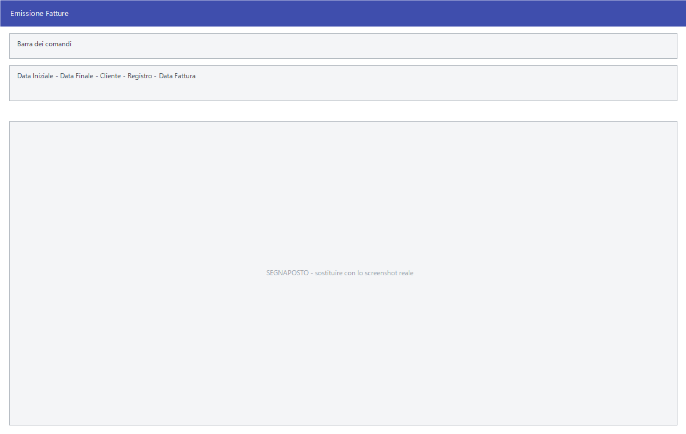

# Emissione fatture da documenti

Chi consegna con documento di trasporto e fattura a fine mese non riscrive le
fatture: le fa generare dai documenti già emessi. Ogni tipo di documento ha la
sua voce **Emissione Fatture**.

!!! info "In sintesi"

    **Percorso:** Menu ▸ Vendite ▸ Doc. di Trasporto ▸ Emissione Fatture
    Menu ▸ Vendite ▸ Bolle di Accompagnamento ▸ Emissione Fatture
    Menu ▸ Vendite ▸ Buoni di Consegna ▸ Emissione Fatture
    Menu ▸ Vendite ▸ Fatture Pro Forma ▸ Emissione Fatture
    Menu ▸ Vendite ▸ Doc. di Trasporto Consegne Terzi ▸ Emissione Fatture
    Menu ▸ Vendite ▸ Ordini Clienti ▸ Fatturazione da Ordini
    **Scorciatoia:** ++f2++ avvia, ++esc++ esce
    **Permessi richiesti:** nessun profilo predefinito; le singole voci di menu si abilitano per ogni utente da [Archivi ▸ Utenti](../anagrafiche/utenti.md)

---

## A cosa serve

| Voce di menu | Da cosa genera la fattura |
|---|---|
| **Doc. di Trasporto ▸ Emissione Fatture** | Dai documenti di trasporto del periodo. |
| **Bolle di Accompagnamento ▸ Emissione Fatture** | Dalle bolle. |
| **Buoni di Consegna ▸ Emissione Fatture** | Dai buoni di consegna. |
| **Fatture Pro Forma ▸ Emissione Fatture** | Dalle pro forma del periodo. |
| **Fatture Pro Forma ▸ Emissiona Fattura da Pro Forma** | Da una singola pro forma. |
| **Fatture Pro Forma ▸ Fatture Pro Forma da Ordini** | Genera pro forma partendo dagli ordini. |
| **Doc. di Trasporto Consegne Terzi ▸ Emissione Fatture** | Dai documenti di consegna a terzi. |
| **Doc. di Trasporto Consegne Terzi ▸ Emissione Note di Credito Concessionari** | Genera le note di credito per i concessionari. |
| **Ordini Clienti ▸ Fatturazione da Ordini** | Dagli ordini clienti. |

Il documento di partenza resta in archivio e risulta fatturato; la fattura ne
riporta gli estremi.

## Prerequisiti

Prima di fatturare occorre:

- avere emesso e **controllato** i documenti da fatturare: dopo, correggerli è
  molto più scomodo;
- avere sui clienti le condizioni giuste — pagamento, banca, sconti — perché la
  fattura le riprende;
- avere impostato registri e numeratori nella
  [ditta](../anagrafiche/ditte.md);
- **avere una copia di sicurezza recente**.

## La maschera

Sono finestre di selezione: il periodo dei documenti da fatturare, i filtri sul
cliente e sul registro, la data da mettere sulle fatture, e i pulsanti
**F2 - OK** ed **Esci**.

## Campi

| Campo | Obbl. | Descrizione | Valori ammessi |
|---|:---:|---|---|
| **Data Iniziale**, **Data Finale** | ● | Il periodo dei documenti da fatturare. | date |
| **Cliente** | | Restringe a un cliente. | codice |
| **Registro** | | Il registro su cui numerare le fatture. | voce dell'elenco |
| **Data Fattura** | | La data da mettere sulle fatture generate. | data |

{: .campi }

<!-- DA VERIFICARE: i campi esatti delle maschere di emissione: sono più d'una e non ho potuto estrarli tutti. -->

## Pulsanti e comandi

| Comando | Scorciatoia | Effetto |
|---|---|---|
| **F2 - OK** | ++f2++ | Genera le fatture. |
| **Esci** | ++esc++ | Chiude senza fare nulla. |
| Elenco di scelta | ++f10++ o ++space++ | Sul campo con il codice, apre l'elenco da cui scegliere. |
| **Interrompi** | | Durante l'elaborazione, ferma il lavoro. |

## Come si fa

### Fatturare i DDT di fine mese

1. Apri la [gestione DDT](gestione-documenti.md) e controlla che i documenti
   del mese siano tutti giusti.
2. Apri **Menu ▸ Vendite ▸ Doc. di Trasporto ▸ Emissione Fatture**.
3. Indica il periodo e la **Data Fattura**.
4. Premi **F2 - OK**.
5. Apri la [gestione fatture](gestione-documenti.md) e controlla i documenti
   generati **prima** di stamparli e trasmetterli.

### Fatturare un ordine evaso

1. Apri **Menu ▸ Vendite ▸ Ordini Clienti ▸ Fatturazione da Ordini**.
2. Indica il periodo e il cliente.
3. Premi **F2 - OK**.
4. Dopo la fatturazione, ripulisci con **Cancellazione Ordini Evasi**, vedi
   [Ordini clienti](ordini-clienti.md).

## Controlli e messaggi

<!-- DA VERIFICARE: i messaggi delle maschere di emissione fatture. -->

| Messaggio | Causa | Cosa fare |
|---|---|---|
| *(nessun messaggio, solo un segnale acustico)* | Manca una delle date. | Compila il campo su cui si è posizionato il cursore. |

## Note

!!! warning "L'emissione crea documenti fiscali"

    Le fatture generate sono numerate sul registro: annullarle vuol dire
    lasciare buchi nella numerazione. Controlla il periodo, il cliente e il
    registro **prima** di premere **F2 - OK**, e rileggi il risultato prima di
    trasmettere.

<!-- DA VERIFICARE: come il programma raggruppa i documenti in fattura: uno per documento o uno per cliente. -->

<!-- DA VERIFICARE: cosa succede rilanciando l'emissione su un periodo già fatturato. -->

<!-- DA VERIFICARE: cosa distingue "Emissione Fatture" da "Emissiona Fattura da Pro Forma" (la seconda etichetta contiene un refuso). -->

## Vedi anche

- [Documento di vendita](documento-di-vendita.md)
- [Gestione documenti](gestione-documenti.md)
- [Ordini clienti](ordini-clienti.md)
- [Contabilizzazione dei documenti](contabilizzazione-documenti.md)
