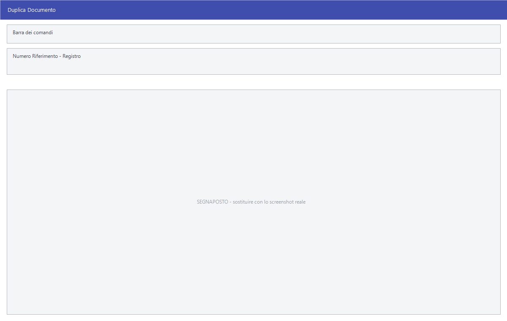

# Esportazione, duplicazione e ricezione dei documenti

Tre gruppi di voci che si ripetono su quasi tutti i tipi di documento:
**Esporta** manda il documento fuori da Facile, **Duplica** ne fa una copia,
**Ricezione** porta dentro i documenti compilati altrove.

!!! info "In sintesi"

    - **Percorso:**
        - Menu ▸ Vendite ▸ *(un tipo di documento)* ▸ Esporta
        - Menu ▸ Vendite ▸ *(un tipo di documento)* ▸ Duplica
        - Menu ▸ Vendite ▸ Fatture ▸ Ricezione Fatture da Palmare *(oppure* dal Server FTP*)*
        - Menu ▸ Vendite ▸ Doc. di Trasporto ▸ Riezione D.D.T. da Palmare *(oppure* Ricezione D.D.T. dal Server FTP*)*
    - **Scorciatoia:** ++f2++ avvia, ++esc++ esce
    - **Permessi richiesti:** nessun profilo predefinito; le singole voci di menu si abilitano per ogni utente da [Archivi ▸ Utenti](../anagrafiche/utenti.md)

---

## A cosa serve

**Duplica** è la scorciatoia più usata: si riparte da un documento già fatto
invece di ricompilarlo. La copia è un documento nuovo, con numero proprio, che
si può poi correggere.

**Esporta** produce il file del documento per chi lo deve ricevere in forma
elettronica.

**Ricezione da Palmare** e **Ricezione dal Server FTP** portano in archivio i
documenti compilati fuori sede — dall'agente in giro o dal furgone — e li
rendono documenti di Facile a tutti gli effetti.

## Prerequisiti

Per la duplicazione serve solo il documento di partenza. Per la ricezione
occorre che i palmari o il server FTP siano configurati.

## La maschera

**Duplica** è una finestrella con il documento di partenza e il registro di
destinazione. **Esporta** e le **Ricezioni** aprono finestre di selezione con
il periodo e il percorso dei file.

## Campi

### Duplica

| Campo | Obbl. | Descrizione | Valori ammessi |
|---|:---:|---|---|
| **Numero Riferimento** | ● | Il documento da copiare. | numero |
| **Registro** | ● | Il registro su cui creare la copia: può essere diverso da quello di partenza. | voce dell'elenco |

{: .campi }

<!-- DA VERIFICARE: i campi delle maschere di esportazione e di ricezione. -->

## Pulsanti e comandi

| Comando | Scorciatoia | Effetto |
|---|---|---|
| **F2 - OK** | ++f2++ | Crea la copia, oppure avvia l'esportazione o la ricezione. |
| **Esci** | ++esc++ | Chiude senza fare nulla. |
| Elenco di scelta | ++f10++ o ++space++ | Sul campo con il codice, apre l'elenco da cui scegliere. |

## Come si fa

### Rifare un documento simile a uno già emesso

1. Apri **Menu ▸ Vendite ▸ Fatture ▸ Duplica**.
2. In **Numero Riferimento** indica la fattura da copiare.
3. Scegli il **Registro** su cui creare la copia.
4. Premi **F2 - OK**, poi apri la copia dalla
   [gestione documenti](gestione-documenti.md) e correggila.

### Trasformare un documento in un altro tipo

1. Apri **Duplica** dal tipo di documento di partenza.
2. Indica come **Registro** quello del tipo di destinazione.

### Ricevere i documenti degli agenti

1. Apri **Menu ▸ Vendite ▸ Fatture ▸ Ricezione Fatture dal Server FTP** —
   oppure **da Palmare** se i dispositivi si collegano direttamente.
2. Avvia la ricezione.
3. Controlla i documenti arrivati dalla
   [gestione documenti](gestione-documenti.md) prima di stamparli.

## Controlli e messaggi

<!-- DA VERIFICARE: i messaggi delle maschere di esportazione, duplicazione e ricezione. -->

| Messaggio | Causa | Cosa fare |
|---|---|---|
| *(nessun messaggio, solo un segnale acustico)* | Manca il **Numero Riferimento** o il **Registro**. | Compila il campo su cui si è posizionato il cursore. |

## Note

!!! note "La copia è un documento nuovo"

    **Duplica** non modifica l'originale: crea un documento con numero proprio
    sul registro scelto. È il modo più rapido per emettere un documento simile
    a uno già fatto, e per passare da un tipo di documento a un altro.

<!-- DA VERIFICARE: in che formato "Esporta" produce il file e in quale cartella. -->

<!-- DA VERIFICARE: se la duplicazione copi anche le righe del corpo o solo la testata. -->

<!-- DA VERIFICARE: come sono configurati i palmari e il server FTP da cui si ricevono i documenti. -->

<!-- DA VERIFICARE: la voce di menu dei DDT è scritta "Riezione D.D.T. da Palmare": verificare se il refuso compare davvero a video. -->

## Vedi anche

- [Gestione documenti](gestione-documenti.md)
- [Documento di vendita](documento-di-vendita.md)
