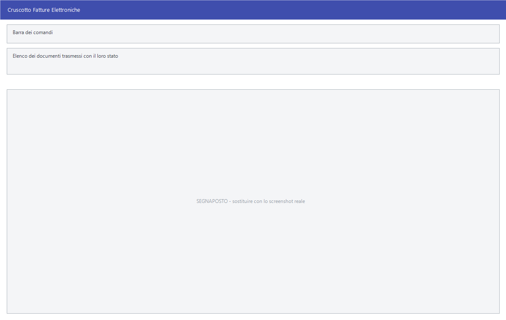

# Fatture elettroniche attive

Le fatture emesse vanno trasmesse per via elettronica e il loro esito va
seguito. **Invio Massivo** le manda in blocco, il **Cruscotto** mostra a che
punto sono.

!!! info "In sintesi"

    **Percorso:** Menu ▸ Vendite ▸ Fatture ▸ Invio Massivo Fatture Elettroniche
    Menu ▸ Vendite ▸ Fatture ▸ Cruscotto Fatture Elettroniche
    **Scorciatoia:** ++f2++ avvia, ++esc++ esce
    **Permessi richiesti:** nessun profilo predefinito; le singole voci di menu si abilitano per ogni utente da [Archivi ▸ Utenti](../anagrafiche/utenti.md); serve anche **Abilita download Stati Fatture Attive** sull'utente

---

## A cosa serve

**Invio Massivo Fatture Elettroniche** prende le fatture emesse e non ancora
trasmesse e le manda tutte insieme, invece di una per volta dal documento.

**Cruscotto Fatture Elettroniche** è il quadro degli esiti: quali sono partite,
quali sono state accettate, quali scartate e vanno rifatte.

## Prerequisiti

Prima di usare queste maschere occorre:

- avere emesso le [fatture](documento-di-vendita.md) con il **Tipo Documento**
  giusto;
- avere i dati fiscali dei clienti completi, compreso il codice destinatario o
  la PEC;
- avere **credito** sul servizio di trasmissione;
- avere l'utente abilitato al download degli stati.

## La maschera

Sono due finestre a griglia: l'elenco dei documenti con il loro stato, e i
comandi per mandarli e per aggiornare gli esiti.

<!-- DA VERIFICARE: la struttura delle due finestre e le colonne delle griglie: non ho potuto estrarle dalle risorse. -->

## Campi

<!-- DA VERIFICARE: i campi di selezione delle due maschere. -->

Non applicabile.

## Pulsanti e comandi

<!-- DA VERIFICARE: i comandi delle due maschere. -->

Non applicabile.

## Come si fa

### Trasmettere le fatture del giorno

1. Emetti e controlla le fatture dalla
   [gestione documenti](gestione-documenti.md).
2. Apri **Menu ▸ Vendite ▸ Fatture ▸ Invio Massivo Fatture Elettroniche**.
3. Avvia l'invio.
4. Il giorno dopo apri il **Cruscotto** e controlla gli esiti.

### Rimediare a una fattura scartata

1. Nel **Cruscotto** individua il documento scartato e leggi il motivo.
2. Correggi il documento o l'anagrafica del cliente.
3. Rimanda il documento, dalla gestione documenti con **F8 - Forza Invio**
   oppure con un nuovo invio massivo.

## Controlli e messaggi

<!-- DA VERIFICARE: i messaggi delle due maschere. -->

Non applicabile.

## Note

!!! note "Lo stato si vede anche nella gestione documenti"

    La colonna **Sync** della [gestione documenti](gestione-documenti.md) dice
    se il documento è stato preso in carico, e **F8 - Forza Invio** lo rimanda.
    Il cruscotto serve quando si vuole il quadro d'insieme.

<!-- DA VERIFICARE: se il cruscotto scarichi gli esiti da solo o vada aggiornato con un comando. -->

<!-- DA VERIFICARE: dove si legge il motivo dello scarto di una fattura. -->

## Vedi anche

- [Gestione documenti](gestione-documenti.md)
- [Documento di vendita](documento-di-vendita.md)
- [Fatture elettroniche passive](../contabilita/fatture-elettroniche-passive.md)
