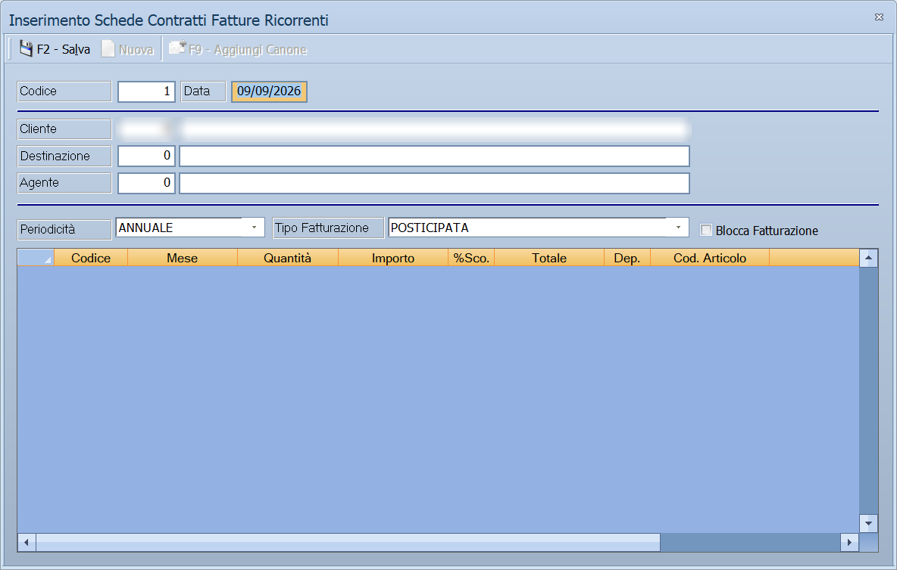

# Fatture ricorrenti

Chi fattura le stesse cose agli stessi clienti a scadenza fissa — canoni,
noleggi, assistenze — registra una scheda contratto e lascia che il programma
emetta le fatture quando è ora.

!!! info "In sintesi"

    - **Percorso:** Menu ▸ Vendite ▸ Fatture ▸ Fatture Ricorrenti ▸ Inserimento Schede Contratti *(oppure* Modifica Schede Contratti*,* Stampa Schede Contratti *o* Emissione Fatture*)*
    - **Scorciatoia:** ++f2++ salva, ++f5++ cerca
    - **Permessi richiesti:** nessun profilo predefinito; le singole voci di menu si abilitano per ogni utente da [Archivi ▸ Utenti](../anagrafiche/utenti.md)

---

## A cosa serve

La scheda contratto dice **a chi**, **cosa** e **ogni quanto** fatturare.
**Emissione Fatture** percorre le schede e genera i documenti delle scadenze
arrivate.

## Prerequisiti

Prima di usare questa maschera occorre avere in archivio i
[clienti](../anagrafiche/anagrafica-clienti.md), gli
[articoli](../anagrafiche/anagrafica-articoli.md) o le voci da fatturare, e gli
[agenti](../anagrafiche/anagrafica-agenti.md) se le provvigioni maturano.

## La maschera

In alto gli estremi della scheda, poi i destinatari, poi la periodicità, e
sotto le righe da fatturare.

## Campi

| Campo | Obbl. | Descrizione | Valori ammessi |
|---|:---:|---|---|
| **Codice** | ● | Identificativo della scheda contratto. | numero |
| **Data** | ● | Data della scheda. | data |
| **Cliente** | ● | Chi va fatturato. | codice |
| **Destinazione** | | La destinazione, se diversa. | codice |
| **Agente** | | L'[agente](../anagrafiche/anagrafica-agenti.md) su cui maturano le provvigioni. | codice |
| **Periodicità** | ● | Ogni quanto emettere la fattura. | `ANNUALE`, `SEMESTRALE`, `QUADRIMESTRALE`, e le altre cadenze dell'elenco |

{: .campi }

## Pulsanti e comandi

| Comando | Scorciatoia | Effetto |
|---|---|---|
| **F2 - Salva** | ++f2++ | Registra la scheda. |
| **F3 - Prec.**, **F4 - Succ.** | ++f3++, ++f4++ | Passano alla scheda precedente o successiva. |
| **F5 - Cerca** | ++f5++ | Apre l'elenco delle schede. |
| **F6 - Elimina** | ++f6++ | Cancella la scheda, previa conferma. |
| **Calcolatrice** | ++f12++ | Apre la calcolatrice. |
| **Consultazione** | ++f11++ | Apre la consultazione. |

## Come si fa

### Registrare un canone annuale

1. Apri **Menu ▸ Vendite ▸ Fatture ▸ Fatture Ricorrenti ▸ Inserimento Schede
   Contratti**.
2. Compila **Cliente** e **Data**.
3. Metti **Periodicità** su `ANNUALE`.
4. Inserisci le righe da fatturare.
5. Premi **F2 - Salva**.

### Emettere le fatture in scadenza

1. Apri **Menu ▸ Vendite ▸ Fatture ▸ Fatture Ricorrenti ▸ Emissione Fatture**.
2. Avvia l'elaborazione.
3. Controlla i documenti generati dalla
   [gestione fatture](gestione-documenti.md) prima di stamparli.

### Controllare i contratti attivi

Apri **Stampa Schede Contratti** e stampa l'elenco.

## Controlli e messaggi

| Messaggio | Causa | Cosa fare |
|---|---|---|
| *(nessun messaggio, solo un segnale acustico)* | Manca un campo obbligatorio. | Compila il campo su cui si è posizionato il cursore. |

## Note

!!! warning "L'emissione genera documenti veri"

    **Emissione Fatture** crea fatture a tutti gli effetti, numerate sul
    registro. Controllale prima di stamparle e mandarle.

<!-- DA VERIFICARE: quali cadenze contiene l'elenco Periodicità oltre ad ANNUALE, SEMESTRALE e QUADRIMESTRALE. -->

<!-- DA VERIFICARE: come il programma sa quali schede sono in scadenza: se da una data di ultima fatturazione sulla scheda. -->

<!-- DA VERIFICARE: se l'emissione chieda una data di riferimento o lavori sempre su oggi. -->

## Vedi anche

- [Documento di vendita](documento-di-vendita.md)
- [Gestione documenti](gestione-documenti.md)
