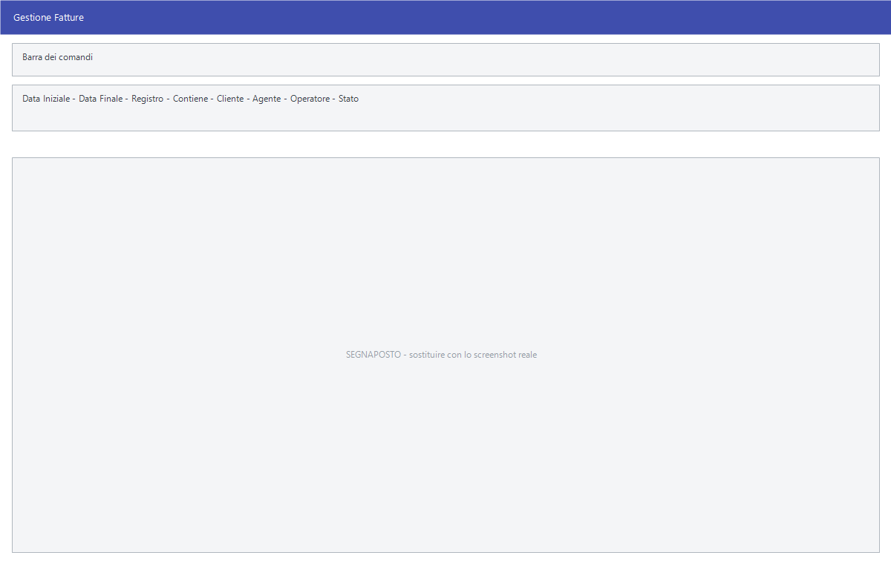

# Gestione documenti

Tutte le voci **Gestione** del menu Vendite aprono **la stessa maschera**:
cambia solo il tipo di documento che elenca, e con esso il titolo della
finestra. È il punto da cui si entra nei documenti tutti i giorni.

!!! info "In sintesi"

    - **Percorso:** Menu ▸ Vendite ▸ *(un tipo di documento)* ▸ Gestione
    - **Scorciatoia:** ++f2++ nuovo, ++f3++ modifica, ++f5++ cerca
    - **Permessi richiesti:** nessun profilo predefinito; le singole voci di menu si abilitano per ogni utente da [Archivi ▸ Utenti](../anagrafiche/utenti.md)

---

## A cosa serve

Serve a ritrovare un documento emesso, a controllare cosa è stato fatto in un
periodo e a crearne uno nuovo. Il titolo della finestra dice su quale archivio
si sta lavorando:

| Voce di menu | Titolo della finestra |
|---|---|
| **Fatture ▸ Gestione** | Gestione Fatture |
| **Doc. di Trasporto ▸ Gestione DDT Clienti** | Documenti di Trasporto - Clienti |
| **Doc. di Trasporto ▸ Gestione DDT Fornitori** | Documenti di Trasporto - Fornitori |
| **Fatture Pro Forma ▸ Gestione** | Fatture Pro Forma |
| **Bolle di Accompagnamento ▸ Gestione Clienti** | Bolle di Accompagnamento - Clienti |
| **Bolle di Accompagnamento ▸ Gestione Fornitori** | Bolle di Accompagnamento - Fornitori |
| **Buoni di Consegna ▸ Gestione** | Buoni di Consegna |
| **Ricevute Fiscali ▸ Gestione** | Ricevute Fiscali |
| **Autofatture - Integrazioni ▸ Gestione - Clienti** | Autofatture / Integrazioni - Clienti |
| **Autofatture - Integrazioni ▸ Gestione - Fornitori** | Autofatture / Integrazioni - Fornitori |
| **Ordini Clienti ▸ Gestione** | Gestione Ordini - Clienti |
| **Preventivi ▸ Gestione** | Gestione Preventivi |

La stessa maschera serve anche fuori dal menu Vendite: **Gestione Ordini -
Fornitori**, **Ordini Ricorrenti**, **Richieste Offerta** e le
**Anomalie Carichi Merce su Punti Vendita** del menu Magazzino.

## Prerequisiti

Prima di usare questa maschera occorre avere in archivio i
[clienti](../anagrafiche/anagrafica-clienti.md), gli
[articoli](../anagrafiche/anagrafica-articoli.md) e le
[aliquote IVA](../contabilita/aliquote-iva.md); i registri e i numeratori si
impostano nella [ditta](../anagrafiche/ditte.md).

## La maschera

In alto la barra dei comandi e i filtri — periodo, registro, cliente, agente,
operatore, stato —, sotto la griglia dei documenti trovati e in fondo il
**Totale**.

La griglia ha queste colonne:

| Colonna | Contenuto |
|---|---|
| **Anno** | L'esercizio del documento. |
| **Codice**, **Numero** | Identificativo e numero del documento. |
| **Data** | Data di emissione. |
| **Stato** | A che punto è il documento. |
| **Importo** | Il totale. |
| **Sync** | Lo stato di sincronizzazione con il servizio delle fatture elettroniche. |
| **Cliente** | L'intestatario. |
| **Agente** | L'[agente](../anagrafiche/anagrafica-agenti.md) del documento. |
| **Operatore** | Chi lo ha emesso. |

## Campi

| Campo | Obbl. | Descrizione | Valori ammessi |
|---|:---:|---|---|
| **Data Iniziale**, **Data Finale** | | Il periodo da mostrare. | date |
| **Registro** | | Restringe a un registro. | voce dell'elenco |
| **Contiene** | | Cerca un testo nei documenti. | testo |
| **Cliente** | | Restringe a un cliente. | codice |
| **Agente** | | Restringe a un agente. | codice |
| **Operatore** | | Restringe a chi ha emesso il documento. | codice |
| **Stato** | | Restringe allo stato del documento. | voce dell'elenco |

{: .campi }

## Pulsanti e comandi

| Comando | Scorciatoia | Effetto |
|---|---|---|
| **F2 - Nuovo** | ++f2++ | Apre un [documento nuovo](documento-di-vendita.md). |
| **F3 - Modifica** | ++f3++ | Apre in modifica il documento selezionato. |
| **F4 - https://fatture.facilecloud.net** | ++f4++ | Apre il portale delle fatture elettroniche. |
| **F5 - Cerca Documenti** | ++f5++ | Applica i filtri e ricarica la griglia. |
| **F8 - Forza Invio** | ++f8++ | Rimanda al servizio la fattura elettronica selezionata. |
| **F9 - Trova** | ++f9++ | Cerca un testo nella griglia. |
| **Calcolatrice** | ++f12++ | Apre la calcolatrice. |
| **Consultazione** | ++f11++ | Apre la consultazione. |

## Come si fa

### Ritrovare una fattura emessa

1. Apri **Menu ▸ Vendite ▸ Fatture ▸ Gestione**.
2. Indica il periodo in **Data Iniziale** e **Data Finale**.
3. Se sai il cliente, indicalo.
4. Premi **F5 - Cerca Documenti**.
5. Trova la riga e premi **F3 - Modifica**.

### Controllare le fatture elettroniche non partite

1. Apri la gestione delle fatture e cerca il periodo.
2. Guarda la colonna **Sync**: dice quali documenti il servizio ha preso in
   carico.
3. Su un documento rimasto indietro, premi **F8 - Forza Invio**.

## Controlli e messaggi

| Messaggio | Causa | Cosa fare |
|---|---|---|
| *(nessun messaggio, solo un segnale acustico)* | Un campo del filtro non è valido. | Guarda dove si è posizionato il cursore: è il campo da correggere. |

## Note

!!! note "Una maschera, molti archivi"

    Poiché la finestra è la stessa per tutti i tipi di documento, l'unico modo
    per accorgersi di aver aperto la gestione sbagliata è leggere il titolo in
    alto.

!!! note "I valori della colonna Stato"

    Lo **Stato** è il dato più importante della griglia: dice cosa si può ancora
    fare con quel documento. I valori possibili, a seconda del tipo:

    | Stato | Significa |
    |---|---|
    | `SALVATA` / `SALVATO` | Il documento è registrato ma non ancora stampato: si modifica liberamente. |
    | `STAMPATA` / `STAMPATO` | È stato stampato. |
    | `CONFERMATO` | L'ordine è confermato: da qui in poi può generare documenti. |
    | `PARZ. CONFER.` | Ordine confermato solo in parte. |
    | `EVASO` | L'ordine è stato consegnato per intero. È lo stato su cui lavora la [cancellazione degli ordini evasi](ordini-clienti.md). |
    | `RICEVUTO` | L'ordine a fornitore è arrivato per intero. È **lo stesso stato** di `EVASO`: cambia solo la parola, secondo il verso del documento. Ci lavora la [cancellazione degli ordini ricevuti](../ordini/ordini-in-lavorazione-e-ricezione.md). |
    | `FATTURATA` / `FATTURATO` | Il documento è già stato fatturato: non viene più ripreso dall'[emissione fatture](emissione-fatture-da-documenti.md). |
    | `CONTABIL.` | Il documento è stato [contabilizzato](contabilizzazione-documenti.md). |
    | `NOTA CREDITO` | È stata emessa la nota di credito. |
    | `ANNULLATA` / `ANNULLATO` | Il documento è annullato. |
    | `ERRORE` | La trasmissione elettronica ha dato errore. |

    La forma maschile o femminile segue il tipo di documento: *SALVATA* per una
    fattura, *SALVATO* per un ordine.

!!! note "La colonna Sync"

    Ha due soli valori: segna se il documento **è già stato sincronizzato** verso
    l'esterno — cioè se porta l'ora di sincronizzazione. Vale `0` finché non è
    partito, `1` quando è stato mandato.

    **F8 - Forza Invio** serve a rimetterlo in coda: si usa quando un documento
    risulta sincronizzato ma dall'altra parte non è arrivato, oppure quando è
    stato corretto dopo l'invio e va rimandato.

<!-- DA VERIFICARE: quali registri compaiono nell'elenco Registro e da dove sono presi. -->

## Vedi anche

- [Documento di vendita](documento-di-vendita.md)
- [Riepiloghi e statistiche](riepiloghi-e-statistiche.md)
- [Fatture elettroniche attive](fatture-elettroniche-attive.md)
