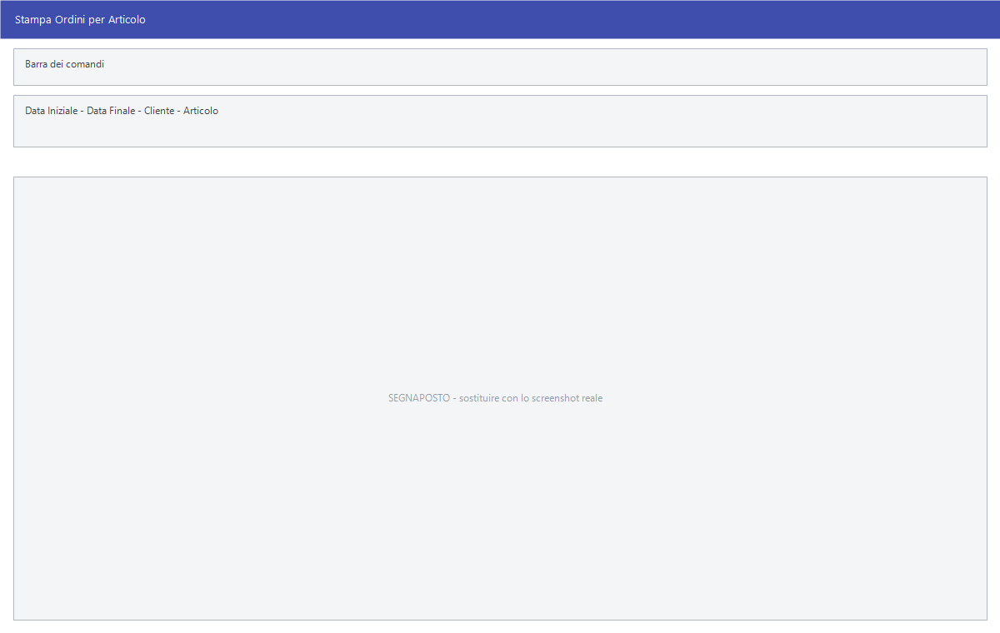

# Ordini clienti

L'ordine del cliente si registra come gli altri
[documenti di vendita](documento-di-vendita.md) e si consulta dalla
[gestione documenti](gestione-documenti.md). Questa pagina copre le voci che
appartengono solo agli ordini: le stampe di riepilogo e la pulizia degli ordini
già evasi.

!!! info "In sintesi"

    - **Percorso:** Menu ▸ Vendite ▸ Ordini Clienti ▸ Stampa Riepilogo *(oppure* Stampa Ordini per Cliente*,* Stampa Ordini per Articolo *o* Cancellazione Ordini Evasi*)*
    - **Scorciatoia:** ++f2++ avvia, ++esc++ esce
    - **Permessi richiesti:** nessun profilo predefinito; le singole voci di menu si abilitano per ogni utente da [Archivi ▸ Utenti](../anagrafiche/utenti.md)

---

## A cosa serve

| Voce di menu | A cosa serve |
|---|---|
| **Stampa Riepilogo** | L'elenco degli ordini di un periodo. |
| **Stampa Ordini per Cliente** | Gli ordini raggruppati per cliente: cosa deve ancora ricevere ciascuno. |
| **Stampa Ordini per Articolo** | Gli ordini raggruppati per articolo: quanto è impegnato di ogni cosa. È la stampa da cui si decide cosa ordinare al fornitore. |
| **Cancellazione Ordini Evasi** | Toglie dall'archivio gli ordini completamente evasi, per non trascinarseli dietro. |

Le altre voci del sottomenu — **Gestione**, **Inserimento**, **Modifica**,
**Duplica** e **Fatturazione da Ordini** — sono descritte in
[Gestione documenti](gestione-documenti.md),
[Documento di vendita](documento-di-vendita.md),
[Esportazione e duplicazione](esporta-duplica-documenti.md) e
[Emissione fatture da documenti](emissione-fatture-da-documenti.md).

## Prerequisiti

Prima di usare queste stampe occorre avere registrato gli ordini.

## La maschera

Sono finestre di selezione con il periodo e i filtri, e i pulsanti **F2 - OK**
ed **Esci**.

## Campi

| Campo | Obbl. | Descrizione | Valori ammessi |
|---|:---:|---|---|
| **Data Iniziale**, **Data Finale** | ● | Il periodo degli ordini. | date |
| **Cliente** | | Restringe a un cliente. | codice |
| **Articolo** | | Nella stampa per articolo, restringe a un articolo. | codice |

{: .campi }

<!-- DA VERIFICARE: i campi esatti delle tre stampe e della cancellazione ordini evasi. -->

## Pulsanti e comandi

| Comando | Scorciatoia | Effetto |
|---|---|---|
| **F2 - OK** | ++f2++ | Avvia la stampa o la cancellazione. |
| **Esci** | ++esc++ | Chiude senza fare nulla. |
| Elenco di scelta | ++f10++ o ++space++ | Sul campo con il codice, apre l'elenco da cui scegliere. |

## Come si fa

### Sapere cosa ordinare al fornitore

1. Apri **Menu ▸ Vendite ▸ Ordini Clienti ▸ Stampa Ordini per Articolo**.
2. Indica il periodo e premi **F2 - OK**.
3. Confronta le quantità impegnate con le esistenze: la differenza è quello che
   manca.

### Vedere cosa deve ancora ricevere un cliente

1. Apri **Menu ▸ Vendite ▸ Ordini Clienti ▸ Stampa Ordini per Cliente**.
2. Indica il **Cliente** e stampa.

### Ripulire gli ordini chiusi

1. **Fai una copia di sicurezza degli archivi.**
2. Stampa prima il **Riepilogo**, per avere traccia di cosa stai per togliere.
3. Apri **Menu ▸ Vendite ▸ Ordini Clienti ▸ Cancellazione Ordini Evasi**.
4. Indica il periodo e avvia.

## Controlli e messaggi

<!-- DA VERIFICARE: i messaggi delle tre stampe e della cancellazione ordini evasi. -->

| Messaggio | Causa | Cosa fare |
|---|---|---|
| *(nessun messaggio, solo un segnale acustico)* | Manca una delle date. | Compila il campo su cui si è posizionato il cursore. |

## Note

!!! warning "La cancellazione degli ordini evasi è definitiva"

    Gli ordini cancellati spariscono dall'archivio con la loro storia. Stampa il
    riepilogo prima, e fallo solo su periodi chiusi.

<!-- DA VERIFICARE: quando un ordine è considerato "evaso": se basta la quantità evasa pari all'ordinata o serva anche la fatturazione. -->

<!-- DA VERIFICARE: se la cancellazione chieda conferma. -->

## Vedi anche

- [Documento di vendita](documento-di-vendita.md)
- [Gestione documenti](gestione-documenti.md)
- [Emissione fatture da documenti](emissione-fatture-da-documenti.md)
