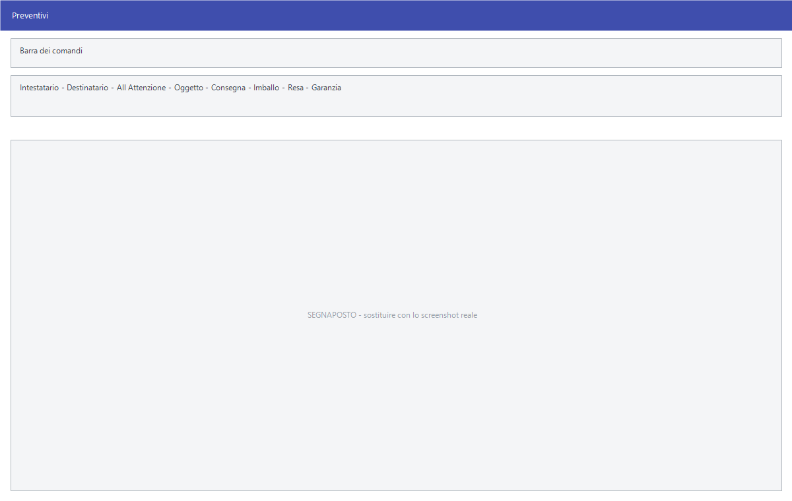

# Preventivi

Il preventivo ha una maschera propria, diversa da quella degli altri
[documenti di vendita](documento-di-vendita.md): oltre alle righe di merce
porta l'oggetto e le condizioni di fornitura che sul preventivo vanno scritte.

!!! info "In sintesi"

    - **Percorso:** Menu ▸ Vendite ▸ Preventivi ▸ Inserimento *(oppure* Modifica*,* Gestione*,* Stampa Riepilogo *o* Duplica*)*
    - **Scorciatoia:** ++f2++ salva, ++f5++ cerca, ++f7++ stampa
    - **Permessi richiesti:** nessun profilo predefinito; le singole voci di menu si abilitano per ogni utente da [Archivi ▸ Utenti](../anagrafiche/utenti.md)

---

## A cosa serve

Un preventivo non è un documento fiscale: non numera sui registri, non scarica
il magazzino, non genera scadenze. Serve a mettere per iscritto un'offerta, con
le condizioni a cui vale.

Le voci **Gestione** e **Duplica** aprono le maschere comuni descritte in
[Gestione documenti](gestione-documenti.md) e
[Esportazione e duplicazione](esporta-duplica-documenti.md).

## Prerequisiti

Prima di usare questa maschera occorre avere in archivio i
[clienti](../anagrafiche/anagrafica-clienti.md) e gli
[articoli](../anagrafiche/anagrafica-articoli.md) da preventivare.

## La maschera

In alto i destinatari, poi il blocco delle condizioni di fornitura, e sotto le
righe della merce.

## Campi

| Campo | Obbl. | Descrizione | Valori ammessi |
|---|:---:|---|---|
| **Intestatario** | ● | Il [cliente](../anagrafiche/anagrafica-clienti.md) a cui il preventivo è intestato. | codice |
| **Destinatario** | | La destinazione, se diversa. | codice |
| **All' Attenzione** | | La persona a cui il preventivo va indirizzato. | testo |
| **Oggetto** | | Di cosa tratta l'offerta. Compare in testa alla stampa. | testo |
| **Consegna** | | I tempi o le modalità di consegna offerti. | testo |
| **Imballo** | | Come la merce viene imballata e a carico di chi. | testo |
| **Resa** | | La resa concordata. | testo |
| **Garanzia** | | La garanzia offerta. | testo |
| **Note** | | Le note libere che compaiono sul preventivo. | testo |
| **Operatore** | | Chi ha preparato il preventivo. | codice |
| **Commessa** | | La [commessa](../contabilita/commesse.md) a cui il preventivo si riferisce. | codice |

{: .campi }

Le righe della merce si compilano come nel
[documento di vendita](documento-di-vendita.md).

## Pulsanti e comandi

| Comando | Scorciatoia | Effetto |
|---|---|---|
| **F2 - Salva** | ++f2++ | Registra il preventivo. |
| **F3 - Prec.**, **F4 - Succ.** | ++f3++, ++f4++ | Passano al preventivo precedente o successivo. |
| **F5 - Cerca** | ++f5++ | Apre l'elenco dei preventivi. |
| **F6 - Elimina** | ++f6++ | Cancella il preventivo, previa conferma. |
| **F7 - Stampa** | ++f7++ | Stampa il preventivo. |
| **Calcolatrice** | ++f12++ | Apre la calcolatrice. |
| **Consultazione** | ++f11++ | Apre la consultazione. |

## Come si fa

### Preparare un preventivo

1. Apri **Menu ▸ Vendite ▸ Preventivi ▸ Inserimento**.
2. Indica l'**Intestatario** e, se serve, **All' Attenzione**.
3. Scrivi l'**Oggetto** e compila **Consegna**, **Imballo**, **Resa** e
   **Garanzia**: sono le condizioni che il cliente leggerà.
4. Inserisci le righe della merce.
5. Premi **F2 - Salva** e poi **F7 - Stampa**.

### Rifare un preventivo cambiando poco

1. Apri **Menu ▸ Vendite ▸ Preventivi ▸ Duplica**.
2. Indica il preventivo da copiare.
3. Apri la copia e correggi quello che cambia.

### Vedere tutti i preventivi aperti

1. Apri **Menu ▸ Vendite ▸ Preventivi ▸ Stampa Riepilogo**.
2. Indica il periodo e stampa.

## Controlli e messaggi

| Messaggio | Causa | Cosa fare |
|---|---|---|
| *(nessun messaggio, solo un segnale acustico)* | Manca l'**Intestatario**. | Compila il campo su cui si è posizionato il cursore. |

## Note

!!! note "Il preventivo non impegna nulla"

    Non numera sui registri IVA, non scarica il magazzino e non genera
    scadenze: resta un documento interno finché non si trasforma in un ordine o
    in una fattura.

<!-- DA VERIFICARE: se esista un comando per trasformare un preventivo accettato in ordine o in fattura. -->

<!-- DA VERIFICARE: se i campi delle condizioni (Consegna, Imballo, Resa, Garanzia) abbiano dei valori proposti o siano sempre da scrivere. -->

## Vedi anche

- [Documento di vendita](documento-di-vendita.md)
- [Gestione documenti](gestione-documenti.md)
- [Ordini clienti](ordini-clienti.md)
