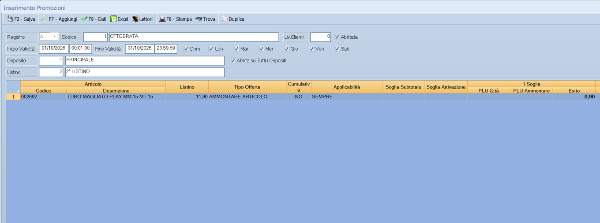

# Promozioni

La promozione è un prezzo che vale per un periodo su un insieme di articoli.
Registrata qui, viene applicata da sola in vendita finché la promozione è
aperta.

!!! info "In sintesi"

    **Percorso:** Menu ▸ Vendite ▸ Promozioni ▸ Inserimento *(oppure* Modifica *o* Stampa*)*
    **Scorciatoia:** ++f7++ aggiunge articoli, ++f8++ stampa, ++f9++ dati
    **Permessi richiesti:** nessun profilo predefinito; le singole voci di menu si abilitano per ogni utente da [Archivi ▸ Utenti](../anagrafiche/utenti.md)

---

## A cosa serve

Serve a preparare i volantini e i cartellini: si dice quali articoli sono in
promozione, a che prezzo e da quando a quando. Il punto cassa applica il prezzo
promozionale senza che nessuno debba ricordarsene, e alla fine del periodo i
prezzi tornano quelli di listino.

I margini della promozione si controllano poi dall'
[analisi listino](../listini-vendita/analisi-listino.md), che ha le colonne
**Margine Promo %** e **Fine Promo**.

## Prerequisiti

Prima di usare questa maschera occorre avere gli
[articoli](../anagrafiche/anagrafica-articoli.md) con i
[listini](../listini-vendita/gestione-listini.md) valorizzati: il prezzo
promozionale si giudica rispetto a quello normale.

## La maschera

In alto la testata della promozione — il **Registro** e il periodo — e sotto
l'elenco degli articoli che vi appartengono, con i prezzi promozionali.

<!-- DA VERIFICARE: i campi della testata della promozione: dalle risorse ho potuto estrarre solo il Registro. -->

## Campi

| Campo | Obbl. | Descrizione | Valori ammessi |
|---|:---:|---|---|
| **Registro** | ● | Il registro su cui la promozione è numerata. | voce dell'elenco |

{: .campi }

<!-- DA VERIFICARE: gli altri campi della testata — periodo di validità, descrizione, depositi o punti vendita interessati. -->

## Pulsanti e comandi

| Comando | Scorciatoia | Effetto |
|---|---|---|
| **F7 - Aggiungi** | ++f7++ | Aggiunge articoli alla promozione. |
| **F8 - Stampa** | ++f8++ | Stampa la promozione. |
| **F9 - Dati** | ++f9++ | Apre i dati di dettaglio della promozione. |
| **Duplica** | | Crea una copia della promozione, per ripartire da una già fatta. |
| **Excel** | | Esporta la promozione su un foglio Excel. |
| **Lettori** | | Manda la promozione ai lettori e ai terminali. |
| **Trova** | | Cerca un articolo nell'elenco. |

## Come si fa

### Preparare la promozione del mese

1. Apri **Menu ▸ Vendite ▸ Promozioni ▸ Inserimento**.
2. Compila la testata con il periodo di validità.
3. Premi **F7 - Aggiungi** e porta dentro gli articoli.
4. Indica per ciascuno il prezzo promozionale.
5. Premi **F8 - Stampa** per i cartellini, e **Lettori** per mandarla ai
   terminali.

### Rifare la promozione dell'anno prima

1. Apri la promozione da riusare.
2. Premi **Duplica** e correggi periodo e prezzi sulla copia.

### Controllare se la promozione conviene

1. Apri l'[analisi listino](../listini-vendita/analisi-listino.md).
2. Guarda **Margine Promo %** accanto a **Margine %**.

## Controlli e messaggi

<!-- DA VERIFICARE: i messaggi di questa maschera. -->

| Messaggio | Causa | Cosa fare |
|---|---|---|
| *(nessun messaggio, solo un segnale acustico)* | Manca un campo obbligatorio. | Compila il campo su cui si è posizionato il cursore. |

## Note

!!! note "Le promozioni sui punti cassa"

    Perché il prezzo promozionale arrivi al punto cassa la promozione va
    trasmessa ai terminali con **Lettori**: registrarla in Facile non basta.

<!-- DA VERIFICARE: dove si indica il periodo di validità della promozione. -->

<!-- DA VERIFICARE: cosa apre esattamente "F9 - Dati". -->

<!-- DA VERIFICARE: cosa succede alla fine del periodo: se il prezzo torni da solo a quello di listino. -->

<!-- DA VERIFICARE: il rapporto con le "Promozioni Sellin" del menu Magazzino. -->

## Vedi anche

- [Analisi listino da vendite ed esistenza](../listini-vendita/analisi-listino.md)
- [Vendita al banco e POS](vendita-al-banco.md)
- [Gestione listini](../listini-vendita/gestione-listini.md)
