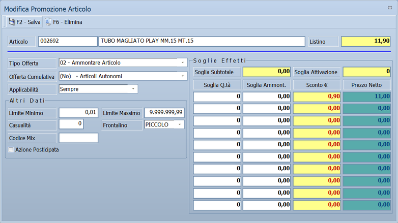
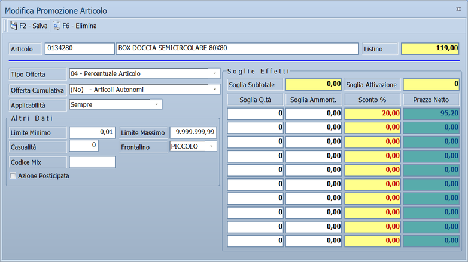
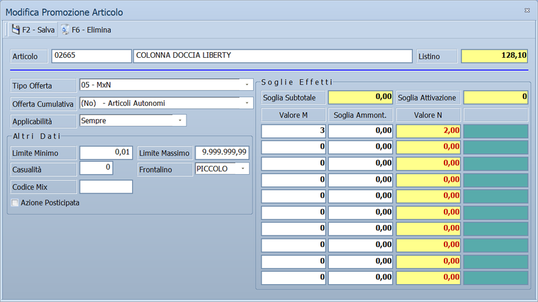
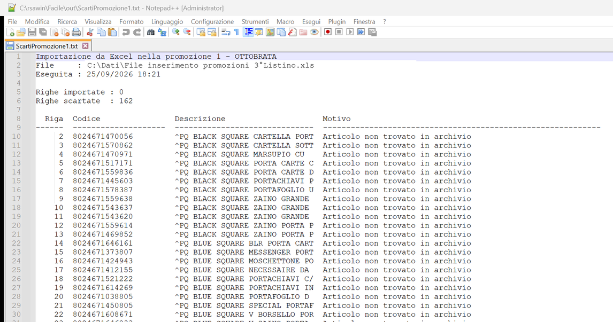

# Promozioni

La promozione è un prezzo che vale per un periodo su un insieme di articoli.
Registrata qui, viene applicata da sola in vendita finché la promozione è
aperta.

!!! info "In sintesi"

    - **Percorso:** Menu ▸ Vendite ▸ Promozioni ▸ Inserimento *(oppure* Modifica *o* Stampa*)*
    - **Scorciatoia:** ++f7++ aggiunge articoli, ++f8++ stampa, ++f9++ dati
    - **Permessi richiesti:** nessun profilo predefinito; le singole voci di menu si abilitano per ogni utente da [Archivi ▸ Utenti](../anagrafiche/utenti.md)

---

## A cosa serve

Serve a preparare i volantini e i cartellini: si dice quali articoli sono in
promozione, a che prezzo e da quando a quando. Il punto cassa applica il prezzo
promozionale senza che nessuno debba ricordarsene, e alla fine del periodo i
prezzi tornano quelli di listino.

I margini della promozione si controllano poi dall'
[analisi listino](../listini-vendita/analisi-listino.md), che ha le colonne
**Margine Promo %** e **Fine Promo**.

## Prerequisiti

Prima di usare questa maschera occorre avere gli
[articoli](../anagrafiche/anagrafica-articoli.md) con i
[listini](../listini-vendita/gestione-listini.md) valorizzati: il prezzo
promozionale si giudica rispetto a quello normale.

## La maschera

In alto la testata della promozione — chi è, quando vale, dove vale — e sotto
l'elenco degli articoli che vi appartengono, con i prezzi promozionali.

La testata sta su tre righe:

- la **prima** dice chi è la promozione: registro, numero, descrizione, a quale
  livello di clienti si rivolge, e la spunta **Abilitata**;
- la **seconda** dice quando vale: data e ora di inizio, data e ora di fine, e i
  sette giorni della settimana;
- la **terza** dice dove vale: il deposito, con la possibilità di estenderla a
  tutti o di sceglierne un elenco, e il listino su cui agisce.

La griglia sotto elenca le righe: una per articolo, con il tipo di offerta, le
soglie e l'esito. Alcune colonne sono di servizio e restano nascoste — il
codice della riga, quello della testata, le date e la descrizione, che sono
quelle della testata.

## Campi

| Campo | Obbl. | Descrizione | Valori ammessi |
|---|:---:|---|---|
| **Registro** | ● | Il registro su cui la promozione è numerata. Cambiandolo, il numero si rifà sul primo libero di quel registro. | `A` … `Z` |
| **Codice** | ● | Il numero della promozione dentro il registro. Proposto dal programma. | numero |
| **Descrizione** | ● | Il nome della promozione. È quello che arriva al punto cassa, dove sono usati i primi **20 caratteri**. | testo |
| **Liv.Clienti** | | Il livello di clientela a cui la promozione è riservata. Con `-1` vale per tutti. | da `-1` a `100` |
| **Abilitata** | | Se togliendo la spunta la promozione resta in archivio ma non viene più applicata. | spunta |
| **Inizio Validità** | ● | Il giorno e l'**ora** da cui la promozione parte. | data e ora |
| **Fine Validità** | ● | Il giorno e l'**ora** in cui finisce. Non può precedere l'inizio. | data e ora |
| **Dom** … **Sab** | | I giorni della settimana in cui la promozione vale. **Spuntato = vale**: togliendo la spunta si esclude quel giorno. Almeno uno deve restare spuntato. | sette spunte |
| **Deposito** | ● | Il deposito o punto vendita a cui la promozione si applica. | codice |
| **Abilita su Tutti i Depositi** | | Estende la promozione a tutti i depositi. Con la spunta messa, il pulsante **Seleziona Depositi** sparisce. | spunta |
| **Seleziona Depositi** | | Apre *Depositi Associati alla Promozione*, dove si scelgono gli altri depositi oltre a quello indicato sopra — fino a cinquanta. | elenco |
| **Listino** | ● | Il listino di vendita su cui la promozione agisce. | codice |

!!! warning "Deposito e listino si scelgono una volta sola"

    Dopo il primo salvataggio **Registro**, **Codice**, **Deposito** e
    **Listino** diventano non modificabili: sono i dati che le righe hanno già
    ereditato. Per cambiarli va rifatta la promozione — conviene partire da
    **Duplica**.

### Le righe della promozione

Ogni riga della promozione si apre in una finestra propria, dove si stabilisce
che cosa viene offerto e a quali condizioni. Il doppio clic su una riga della
griglia la apre in modifica.

In alto l'articolo con il suo prezzo di listino. A sinistra la forma
dell'offerta e, nel riquadro **Altri Dati**, limiti, frontalino e codice mix.
A destra, nel riquadro **Soglie Effetti**, le dieci soglie: per ciascuna la
quantità (**Soglia Q.tà**), l'importo (**Soglia Ammont.**) e l'effetto. Le
intestazioni cambiano con il tipo di offerta:

| Tipo Offerta | Colonna dell'effetto | Colonna accanto |
|---|---|---|
| `02 - Ammontare Articolo` | **Sconto €**: quanto si toglie dal prezzo | **Prezzo Netto**: il prezzo che resta |
| `04 - Percentuale Articolo` | **Sconto %**: la percentuale | **Prezzo Netto**: il prezzo che resta |
| `05 - MxN` | **Valore N**, con **Valore M** al posto di **Soglia Q.tà** | — |
| `07 - Bollino` | **Bollini** | — |
| gli altri | **Esito** | — |

Nell'esempio l'articolo costa 11,90 a listino: con uno sconto di 0,90 il
prezzo netto in promozione è 11,00.

| Campo | Obbl. | Descrizione | Valori ammessi |
|---|:---:|---|---|
| **Articolo** | ● | L'articolo in promozione. | codice |
| **Listino** | | Il prezzo dell'articolo nel listino della promozione. Non si modifica: è il punto di partenza su cui si calcola lo sconto. | importo, solo lettura |
| **Tipo Offerta** | ● | La forma dell'offerta: sconto in valore o in percentuale, sul singolo articolo o sul subtotale, prendi M paghi N, regalo, bollino, coupon, fascia di prezzo, netto reparto, punti di pagamento e le varianti a più soglie. | 17 voci, da `01 - Ammontare Subtotale` a `23 - Regalo Articolo su Subtotale`: la numerazione salta dal 13 al 20 |
| **Offerta Cumulativa** | | Come si comporta l'offerta quando l'articolo compare più volte nello scontrino. | `(Si) - Più Articoli Stessa Offerta`, `(No) - Articoli Autonomi`, `(Set) - Più Articoli Stessa Q.tà`, `(Pan) - Paniere` |
| **Applicabilità** | | Quante volte l'offerta può scattare. | `Contingentata`, `Una Volta nello Scontrino`, `Sempre`, `In Continuo dopo la Soglia`, `n Volte Nello Scontrino` |
| **Volte** | | Quante volte, quando l'applicabilità lo richiede. | numero |
| **Limite Minimo**, **Limite Massimo** | | I limiti entro cui l'offerta vale. | numero |
| **Casualità** | | La quota di casualità nell'applicazione dell'offerta. La usano **solo le casse SysPC**. | da `0` a `32767` |
| **Frontalino** | | Il formato del frontalino da stampare per questa riga. | `PICCOLO`, `MEDIO`, `GRANDE`, `NESSUNO` |
| **Codice Mix** | | Il codice che lega fra loro le righe di un'offerta mista. | codice |
| **Sconto Aggiuntivo** | | Compare solo con `04 - Percentuale Articolo`, e solo se la ditta lavora a prezzi IVA esclusa. Con la spunta, sui documenti la percentuale si aggiunge agli sconti già presenti sulla riga; senza, la riga prende il prezzo promozionale e perde gli altri sconti. | spunta |
| **Azione Posticipata** | | Viene trasmessa solo alle casse SysPC, e solo per le offerte `02`, `04`, `07` e a gruppo di articoli. Facile non la usa. <!-- DA VERIFICARE: che cosa fa la cassa SysPC quando l'azione è posticipata? --> | spunta |

Aprendo una riga nuova, i campi non partono vuoti: **periodo, ora, giorni,
deposito, listino, livello clienti e la spunta Abilitata** sono quelli della
testata, e l'offerta parte già impostata su `02 - Ammontare Articolo`,
`(No) - Articoli Autonomi`, applicabilità **Sempre**, limiti da `0,01` a
`9.999.999,99` e frontalino `PICCOLO`.

!!! warning "Sui documenti di Facile valgono solo tre tipi di offerta su diciassette"

    Le diciassette forme di offerta descrivono quello che sa fare il **punto
    cassa**. Quando invece è Facile a fare il documento — vendita al banco,
    fattura, scontrino dal gestionale — il prezzo promozionale viene applicato
    **solo** se la riga è di uno di questi tre tipi:

    - `02 - Ammontare Articolo`, che toglie un importo fisso dal prezzo;
    - `04 - Percentuale Articolo`, che toglie una percentuale;
    - `07 - Bollino`, che non cambia il prezzo ma assegna punti.

    e in più deve avere **Applicabilità = Sempre** e nessuna soglia di
    quantità superiore a uno né soglia di ammontare.

    Tutte le altre — il 3x2, il paniere, i coupon, le multisoglia — sono
    trasmesse alle casse e applicate lì: sul documento fatto da Facile non
    hanno effetto. Fa eccezione il 3x2, che il **Pos Touchscreen** calcola
    anche da sé: vedi [Prendi 3 paghi 2](#prendi-3-paghi-2).

!!! note "Come si leggono Tipo Offerta, Cumulativa e Applicabilità insieme"

    I tre campi rispondono a tre domande diverse:

    | Campo | Risponde a |
    |---|---|
    | **Tipo Offerta** | che cosa fa l'offerta — sconto, regalo, punti, prezzo a fascia |
    | **Offerta Cumulativa** | come si comporta quando l'articolo, o più articoli della stessa promozione, compaiono insieme nello scontrino |
    | **Applicabilità** | quante volte può scattare nello stesso scontrino |

    Le combinazioni più usate:

    | Caso | Tipo Offerta | Cumulativa | Applicabilità |
    |---|---|---|---|
    | Sconto fisso sull'articolo, sempre | `02 - Ammontare Articolo` | `(No)` | `Sempre` |
    | Sconto percentuale sull'articolo, sempre | `04 - Percentuale Articolo` | `(No)` | `Sempre` |
    | Prendi 3 paghi 2 | `05 - MxN` | `(Si)` | `Sempre` |
    <!-- DA VERIFICARE: il 3x2 di esempio in "Come si fa" usa (No) - Articoli Autonomi; per le casse vale (Si) o (No)? Facile non legge questo campo. -->
    | Sconto solo sul primo pezzo dello scontrino | `02` oppure `04` | `(No)` | `Una Volta nello Scontrino` |
    | Regalo al raggiungimento di una soglia | `06 - Regalo Articolo` | `(Set)` | `In Continuo dopo la Soglia` |
    | Sconto su un insieme di articoli diversi | `10` o `11` — gruppo articoli | `(Pan) - Paniere` | `Sempre` |

    Le soglie del riquadro **Soglie Effetti** sono gli scaglioni: la prima è quella da
    cui l'offerta parte, le altre nove servono alle offerte **multisoglia**
    (tipi `20`, `21`, `22`). Vanno compilate in ordine crescente: una soglia
    non può essere minore o uguale alla precedente.

!!! note "La Casualità serve solo alle casse SysPC"

    È un numero da `0` a `32767` che **Facile non usa**: lo registra e lo
    trasmette insieme all'offerta, e a interpretarlo è la cassa. A farci
    qualcosa sono **solo le casse [SysPC](../casse-bilance/casse.md)**; sulle
    altre famiglie il campo o non parte nemmeno, o arriva e viene ignorato.

    Su un impianto che non ha casse SysPC, quindi, il valore scritto qui non ha
    alcun effetto: tanto vale lasciarlo a zero.

## Pulsanti e comandi

| Comando | Scorciatoia | Effetto |
|---|---|---|
| **F7 - Aggiungi** | ++f7++ | Aggiunge **una** riga. Apre un menu con due voci: *Promozione Standard*, che chiede l'articolo, e *Promozione con Filtro*, che al posto dell'articolo chiede marchio, reparto o categoria merceologica. |
| **F9 - Dati** | ++f9++ | Aggiunge **molte** righe: apre la ricerca articoli, dove se ne selezionano quanti servono. Per il primo si compila la finestra della riga; se l'offerta è a percentuale o a regalo, il programma chiede se applicare la stessa condizione a tutti gli altri. |
| **F8 - Stampa** | ++f8++ | Apre un menu con le stampe: elenco della promozione, frontalini, frontalini di fine promozione *(solo a promozione scaduta)*, promozione d'acquisto, e due formati di andamento. |
| **Excel** | | **Importa** articoli da un foglio Excel, `.xlsx` o `.xls`. Non esporta. Le righe che non si possono importare vengono scartate senza fermare l'importazione: vedi [Il foglio Excel da importare](#il-foglio-excel-da-importare). |
| **Lettori** | | **Importa** le letture fatte con un terminale portatile: EIA Thunder, BCP8000/ET8000, DENSO N661 o palmare Android. Non manda niente alle casse. |
| **Duplica** | | Crea una copia completa della promozione — testata e righe, periodo compreso — con un codice nuovo, e ci si posiziona sopra. |
| **Trova** | | Cerca un testo in **qualunque** colonna della griglia, anche parziale. Ripremendo **F2 - Trova** passa all'occorrenza successiva. |
| **F6 - Elimina** | ++f6++ | Cancella la promozione e tutte le sue righe, previa conferma. |

!!! tip "I comandi si accendono dopo il primo salvataggio"

    Su una promozione nuova la barra è quasi tutta spenta: prima va salvata la
    testata. Subito dopo il salvataggio, se la promozione non ha ancora righe,
    il programma apre da solo la finestra della prima riga.

## Come si fa

### Preparare la promozione del mese

1. Apri **Menu ▸ Vendite ▸ Promozioni ▸ Inserimento**.
2. Compila la testata: descrizione, periodo con le ore, deposito e listino.
3. Salva con **F2**. Il programma apre la finestra della prima riga.
4. Aggiungi gli articoli, uno per volta con **F7 - Aggiungi** o molti insieme
   con **F9 - Dati**, e indica per ciascuno tipo di offerta ed esito.
5. Premi **F8 - Stampa ▸ Stampa Frontalini Promozione** per i cartellini.
6. Manda la promozione alle casse da **Menu ▸ Casse e Bilance**, con
   [Invio Variazioni Articoli](../casse-bilance/casse.md).

### Impostare le tre promozioni più comuni

Il taglio di prezzo, lo sconto in percentuale e il *prendi 3 paghi 2* sono le
offerte che si usano più spesso. I tre esempi sono le righe della promozione
*OTTOBRATA* che si vede in [La maschera](#la-maschera): vale tutto ottobre,
tutti i giorni, sul deposito 1 e sul 2° listino.

Per ciascuno si parte allo stesso modo:

1. Con la promozione aperta, premi **F7 - Aggiungi** e scegli *Promozione
   Standard*.
2. Indica l'articolo. Si apre la finestra della riga, con il prezzo di listino
   già riportato in **Listino**.
3. Compila la riga come spiegato negli esempi che seguono e salvala con
   **F2 - Salva**. La riga compare nella griglia della promozione.

In tutti e tre gli esempi **Soglia Q.tà** (per il 3x2, **Valore M**) e
**Soglia Ammont.** si compilano solo nella prima riga di **Soglie Effetti**;
le altre nove restano a zero.

#### Taglio di prezzo: da 11,90 a 11,00

Il tubo costa 11,90 a listino e in promozione va venduto a 11,00.

1. In **Tipo Offerta** lascia `02 - Ammontare Articolo`, che sulle righe nuove
   è già proposto.
2. Lascia **Offerta Cumulativa** su `(No) - Articoli Autonomi` e
   **Applicabilità** su `Sempre`.
3. Nella prima riga di **Soglie Effetti** lascia **Soglia Q.tà** e
   **Soglia Ammont.** a zero.
4. In **Sconto €** scrivi quanto togliere al prezzo: `0,90`.
5. Premi **F2 - Salva**. Prima del salvataggio **Prezzo Netto** mostra `11,00`;
   in griglia la riga è *AMMONTARE ARTICOLO* con esito `0,90`.

!!! tip "Se conosci il prezzo promozionale e non lo sconto"

    Scrivi in **Sconto €** il prezzo a cui vuoi vendere, `11,00`, e premi
    ++f10++: il programma lo trasforma nello sconto, `0,90`. Funziona solo con
    `02 - Ammontare Articolo` e con un prezzo più basso di quello di listino.

#### Sconto in percentuale: il 20%

Il box doccia costa 119,00 a listino e in promozione ha il 20% di sconto.

1. In **Tipo Offerta** scegli `04 - Percentuale Articolo`. L'intestazione
   dell'effetto diventa **Sconto %**.
2. Lascia **Offerta Cumulativa** su `(No) - Articoli Autonomi` e
   **Applicabilità** su `Sempre`.
3. Nella prima riga di **Soglie Effetti** lascia **Soglia Q.tà** e
   **Soglia Ammont.** a zero.
4. In **Sconto %** scrivi `20`.
5. Premi **F2 - Salva**. Prima del salvataggio **Prezzo Netto** mostra
   `95,20`, cioè 119,00 meno il 20%; in griglia la riga è
   *PERCENTUALE ARTICOLO* con esito `20,00`.

Se la ditta lavora a prezzi IVA esclusa (**Prezzi Ivati** = `NO` nei
[parametri di magazzino della ditta](../anagrafiche/ditte.md#scheda-parametri-magazzino)),
nella finestra compare anche la spunta **Sconto Aggiuntivo**. Con la spunta, sui
documenti il 20% si aggiunge agli sconti che la riga ha già; senza, la riga
prende il prezzo promozionale e gli altri sconti si azzerano.

Sia il taglio di prezzo sia lo sconto in percentuale valgono anche sui
documenti fatti da Facile, perché hanno **Applicabilità** `Sempre` e le soglie
a zero. Con una soglia di quantità superiore a uno, o con una soglia di
ammontare, sui documenti di Facile non valgono più.

#### Prendi 3 paghi 2

La colonna doccia costa 128,10: chi ne prende tre ne paga due.

1. In **Tipo Offerta** scegli `05 - MxN`. Le intestazioni cambiano:
   **Valore M** prende il posto di **Soglia Q.tà**, **Valore N** quello
   dell'effetto, e la colonna del prezzo netto resta vuota.
2. Lascia **Offerta Cumulativa** su `(No) - Articoli Autonomi` e
   **Applicabilità** su `Sempre`.
3. Nella prima riga di **Soglie Effetti** scrivi in **Valore M** quanti pezzi
   si prendono, `3`, e in **Valore N** quanti se ne pagano, `2`. Lascia
   **Soglia Ammont.** a zero.
4. Premi **F2 - Salva**. In griglia la riga è *MxN*, con `3,000` in
   **PLU Q.tà** ed esito `2,00`.

Lo sconto scatta a gruppi interi di tre pezzi dello stesso articolo: con
quattro pezzi se ne pagano tre, con sei se ne pagano quattro. Il 3x2 lo
applicano le casse e il **Pos Touchscreen**; la vendita al banco da
tastiera, le fatture e gli altri documenti non lo applicano.

### Rifare la promozione dell'anno prima

1. Apri la promozione da riusare.
2. Premi **Duplica** e correggi periodo e prezzi sulla copia.

### Controllare se la promozione conviene

1. Apri l'[analisi listino](../listini-vendita/analisi-listino.md).
2. Guarda **Margine Promo %** accanto a **Margine %**.

### Importare gli articoli da un foglio Excel

Quando gli articoli sono tanti, per esempio il listino promozionale mandato da
un fornitore, conviene prepararli in un foglio Excel e caricarli in un colpo
solo.

1. Prepara il foglio come spiegato in
   [Il foglio Excel da importare](#il-foglio-excel-da-importare). Puoi partire
   dal [modello già impostato](../../assets/modelli/promozioni-importazione.xlsx).
2. Chiudi il foglio in Excel: un file ancora aperto non si può leggere.
3. Apri **Menu ▸ Vendite ▸ Promozioni ▸ Inserimento** oppure **Modifica** e
   posizionati sulla promozione. Se è nuova, compila la testata e salvala con
   **F2**: il pulsante **Excel** si accende solo dopo il primo salvataggio.
4. Premi **Excel**. Alla domanda *Vuoi importare gli articoli in promozione da
   un foglio Excel ?* rispondi **Sì**.
5. Scegli il file, `.xlsx` o `.xls`. La ricerca parte dalla cartella `in`.
6. Attendi la fine dell'importazione. La finestra di avanzamento mostra a che
   punto è; **Esci** la interrompe, e le righe già importate restano.
7. Leggi il riepilogo: *Righe importate* e *Righe scartate*. Se ci sono righe
   scartate, si apre da solo il loro elenco, con il motivo di ciascuna.
8. Correggi nel foglio le righe scartate e ripeti l'importazione. Le righe già
   entrate la prima volta vengono scartate come già presenti, quindi entrano
   solo quelle corrette.

Gli articoli importati compaiono nella griglia della promozione, una riga per
articolo, come quelli inseriti a mano.

### Il foglio Excel da importare

Il programma legge il **primo foglio** del file. La **prima riga** contiene
le intestazioni delle colonne, dalla seconda in giù un articolo per riga.

| CODICE | DESCRIZIONE | OFFERTA | SCONTO_PERC |
|---|---|--:|--:|
| 000123 | PASTA DI SEMOLA 500 G | 0,89 | |
| 8001234567890 | OLIO EXTRAVERGINE 1 L | | 20% |
| ART-45 | DETERSIVO PIATTI 750 ML | | 15% |

Le colonne sono riconosciute dal **nome** scritto nell'intestazione, non dalla
posizione: l'ordine non conta, e non conta se il nome è scritto in maiuscolo o
in minuscolo.

| Colonna | Obbl. | Contenuto |
|---|:---:|---|
| `CODICE` | ● | Il codice dell'articolo, uno dei suoi codici a barre o il codice che gli dà il fornitore. |
| `OFFERTA` | ◐ | Il **prezzo promozionale** a cui vendere l'articolo. |
| `SCONTO_PERC` | ◐ | La **percentuale di sconto** sul prezzo di listino. |
| `DESCRIZIONE` | | Non viene registrata: serve a te per riconoscere l'articolo, e compare nell'elenco degli scarti. |

◐ Fra `OFFERTA` e `SCONTO_PERC` deve esserci **almeno una** delle due colonne.
Qualunque altra colonna viene ignorata, compresa un'eventuale `LISTINO`.

**Come viene calcolata l'offerta.** Il punto di partenza è sempre il prezzo
dell'articolo nel **listino della promozione**, quello indicato in testata.
Riga per riga:

- se la cella `OFFERTA` è compilata, la riga diventa di tipo
  `02 - Ammontare Articolo` e lo sconto è la differenza fra prezzo di listino
  e offerta. Per esempio, listino 11,90 e offerta 11,00 danno sconto 0,90:
  nella griglia la colonna **Esito** mostra lo **sconto**, non il prezzo;
- altrimenti, se la cella `SCONTO_PERC` è compilata, la riga diventa di tipo
  `04 - Percentuale Articolo` con quella percentuale;
- se sono vuote tutte e due, la riga viene scartata.

Aprendo una riga importata con **OFFERTA** trovi in **Sconto €** lo sconto
calcolato e in **Prezzo Netto** il prezzo che avevi scritto nel foglio; con
**SCONTO_PERC** trovi la percentuale in **Sconto %**. Vedi
[Le righe della promozione](#le-righe-della-promozione).

Nello stesso foglio puoi mescolare righe a prezzo e righe a percentuale.
Le righe importate hanno offerta cumulativa `(No) - Articoli Autonomi`,
applicabilità **Sempre**, la prima soglia a un pezzo e il frontalino `GRANDE`.
Periodo, giorni, deposito e listino vengono dalla testata, come per le righe
inserite a mano. Per ritoccarne una, aprila dalla griglia.

**Come scrivere i valori.**

- **Codici con zeri iniziali**: la colonna `CODICE` va formattata come
  **Testo** prima di scrivere i codici. Altrimenti Excel trasforma `000123` in
  `123`, e l'articolo non viene trovato. Nel modello la colonna è già
  impostata così.
- **Codici a barre**: vanno bene anche come numeri. Excel li può mostrare
  abbreviati, per esempio `8,00123E+12`, ma il valore resta intero.
- **Percentuali**: una cella con il formato percentuale vale quello che vedi.
  `20%` significa venti per cento, anche se Excel lo registra come `0,2`. In
  una cella senza formato percentuale scrivi semplicemente `20`.
- **Decimali**: sia la virgola sia il punto vanno bene.
- **Righe vuote**: una riga senza codice viene saltata e non conta fra le
  scartate.

!!! warning "Un articolo, una riga"

    Una promozione non può avere due righe sullo stesso articolo. Se il foglio
    ripete un codice, o porta lo stesso articolo con due codici a barre
    diversi, entra **solo la prima riga** e le altre vengono scartate. Lo
    stesso vale per gli articoli che erano già nella promozione prima
    dell'importazione: per cambiarne l'offerta si corregge la riga nella
    griglia, non la si reimporta.

### Leggere l'elenco delle righe scartate

Una riga del foglio che non si può importare non ferma il lavoro: viene
messa da parte e l'importazione passa alla successiva. Alla fine, se ce ne sono
di scartate, il programma salva il loro elenco in un file di testo nella
cartella `out` e lo apre. Il file si chiama `ScartiPromozione` seguito dal
numero della promozione, per esempio `ScartiPromozione1.txt`, e viene
sovrascritto a ogni importazione nella stessa promozione.

In testa trovi la promozione, il file importato, la data e l'ora e i due
totali. Sotto, una riga per ogni scarto, con:

- **Riga**: il numero di riga nel foglio Excel, quello che Excel mostra a
  sinistra. La riga 1 è l'intestazione, quindi il primo articolo è la 2;
- **Codice** e **Descrizione**: come sono scritti nel foglio;
- **Motivo**: perché la riga non è entrata.

| Motivo | Cosa significa | Cosa fare |
|---|---|---|
| *Articolo non trovato in archivio* | Il codice non corrisponde a nessun articolo, codice a barre o codice del fornitore. | Controlla il codice. Se ha perso gli zeri iniziali, formatta la colonna come testo e riscrivilo. Se l'articolo è nuovo, crealo nell'[anagrafica articoli](../anagrafiche/anagrafica-articoli.md) prima di reimportare. |
| *Articolo … già importato dalla riga …* | Lo stesso articolo è già entrato con una riga precedente del foglio, anche con un codice diverso. | Nessuna azione, se è un doppione. Se le due righe avevano offerte diverse, decidi quale vale e correggi la riga nella griglia. |
| *Articolo … già presente nella promozione* | L'articolo era nella promozione prima dell'importazione. | Se l'offerta va cambiata, correggila nella griglia. |
| *Raggiunto il limite massimo di righe nella promozione* | La promozione è arrivata a 2.500 righe. | Metti gli articoli restanti in una seconda promozione. |
| *Manca il valore in OFFERTA o in SCONTO_PERC* | Sulla riga sono vuote sia l'offerta sia lo sconto. | Compila una delle due celle e reimporta. |
| altri messaggi | La riga non ha superato i controlli di salvataggio, gli stessi dell'inserimento a mano. | Il testo del motivo dice che cosa manca o non va. |

Il file è testo semplice: si stampa o si salva dal programma che lo apre, di
solito il Blocco note.

## Controlli e messaggi

| Messaggio | Causa | Cosa fare |
|---|---|---|
| *(nessun messaggio, solo un segnale acustico)* | Manca un campo obbligatorio, o una data è fuori ordine, o il limite massimo non supera il minimo. | Guarda dove si è posizionato il cursore: è il campo da correggere. |
| *Tutti i giorni della settimana sono stati esclusi dalla promozione !* | Nessuno dei sette giorni è spuntato. | Spunta almeno un giorno. |
| *Indicare solo uno tra articolo regalo e paniere articoli!* | Su un'offerta a regalo sono stati indicati sia l'articolo omaggio sia il paniere. | Lascia uno solo dei due. |
| *Primo esito = 0* — *Vuoi Continuare ?* | La riga non ha un valore di offerta, e non è un'offerta a regalo. | **No** torna sul campo. **Sì** salva la riga così: non farà nulla. La risposta preimpostata è **No**. |
| *L'articolo fa parte di un Gruppo Mix!* — *Vuoi inserire tutti gli altri articoli del gruppo ?* | L'articolo appena messo in promozione appartiene a un gruppo mix. | **Sì** aggiunge in blocco gli altri articoli del gruppo, con la stessa offerta. |
| *Raggiunto limite massimo di righe nella promozione!* | La promozione ha raggiunto il numero massimo di righe. | Dividi gli articoli su più promozioni. |
| *Vuoi Cancellare tutte le righe della promozione ?* | Hai premuto **F6 - Elimina**. | **Sì** cancella testata e righe. La risposta preimpostata è **No**. |
| *Confermi la duplicazione della promozione ?* | Hai premuto **Duplica**. | **Sì** crea subito la copia. La risposta preimpostata è **No**. |
| *Vuoi applicare la stessa promozione a tutti gli articoli selezionati?* | Hai selezionato più articoli con **F9 - Dati** e la prima offerta è a percentuale o a regalo. | **Sì** ripete la stessa condizione su tutti senza più chiedere. La risposta preimpostata è **No**. |
| *Vuoi importare gli articoli in promozione da un foglio Excel ?* | Hai premuto **Excel**. | **Sì** fa scegliere il file e avvia l'importazione. Vedi [Importare gli articoli da un foglio Excel](promozioni.md#importare-gli-articoli-da-un-foglio-excel). |
| *Colonna CODICE non trovata nel documento !* | Il foglio Excel da importare non ha l'intestazione `CODICE` sulla prima riga del primo foglio. | Correggi l'intestazione: vedi [Il foglio Excel da importare](promozioni.md#il-foglio-excel-da-importare). |
| *Colonna OFFERTA e/o SCONTO_PERC non trovata nel documento !* | Il foglio non ha né la colonna `OFFERTA` né `SCONTO_PERC`. | Ne serve almeno una delle due. |
| *Impossibile aprire il file excel!* — *Il file potrebbe essere in uso da un'altra applicazione o in un formato non compatibile.* | Il foglio è aperto in Excel, oppure il file scelto non è un foglio Excel. | Chiudi il foglio in Excel e riprova; se il problema resta, salvalo di nuovo da Excel come `.xlsx`. |
| *Impossibile inizializzare il file excel!* | Il programma non riesce a preparare la lettura del foglio. | Riprova; se si ripete, chiama l'assistenza. |
| *Il file excel non contiene fogli di lavoro!* | Il file non ha nessun foglio. | Scegli il file giusto. |
| *Righe importate : …* — *Righe scartate : …* | Fine dell'importazione da Excel. Se ci sono righe scartate, il messaggio aggiunge *L'elenco delle righe scartate, con il motivo, è stato salvato nel file* e il nome del file, che si apre subito dopo. | Leggi l'elenco, correggi il foglio e reimporta: le righe già importate vengono scartate come già presenti, quindi entrano solo quelle corrette. |
| *Importazione interrotta dall'utente alla riga … del foglio.* | Hai premuto **Esci** nella finestra di avanzamento durante l'importazione. | Le righe precedenti restano importate. Rilanciando l'importazione, verranno scartate come già presenti. |
| *Impossibile salvare l'elenco delle righe scartate nel file …* | Il file dell'elenco non si può scrivere nella cartella `out`. | Il messaggio elenca lui stesso le prime venti righe scartate. Controlla che la cartella `out` sia accessibile. |
| *Vuoi controllare gli orari di inizio e fine promozioni?* | Solo in assistenza: compare all'apertura della maschera. | È una manutenzione, non un'operazione di tutti i giorni: rimette dentro le 24 ore gli orari fuori scala. La risposta preimpostata è **No**. |

## Note

!!! note "Le promozioni sui punti cassa"

    Registrare la promozione in Facile non basta perché il prezzo arrivi alla
    cassa: va trasmessa da **Menu ▸ Casse e Bilance**, con
    [Invio Variazioni Articoli o Invio Globale Articoli](../casse-bilance/casse.md).
    Il pulsante **Lettori** di questa maschera fa il contrario — legge gli
    articoli raccolti con un terminale portatile.

!!! note "Alla fine del periodo il prezzo torna da solo"

    Il prezzo promozionale non viene mai scritto sul
    [listino](../listini-vendita/gestione-listini.md): è calcolato al momento,
    ogni volta che si batte l'articolo, partendo dal listino e applicando
    l'offerta. Finito il periodo — o tolta la spunta **Abilitata**, o in un
    giorno della settimana escluso — non c'è niente da rimettere a posto: il
    prezzo che si vede è di nuovo quello di listino.

    Vale anche l'inverso: cambiando il prezzo di listino durante la promozione,
    lo sconto si applica al prezzo nuovo.

!!! note "Quale promozione vince, se più di una copre lo stesso articolo"

    Facile le mette in ordine e prende la prima che passa i controlli. Conta
    per prima cosa **quanto è mirata**:

    1. la riga intestata a quell'articolo;
    2. quella per marchio;
    3. quella per reparto;
    4. quella per categoria merceologica;
    5. quella valida per tutti gli articoli.

    A parità, vince quella che **finisce più tardi**, e a parità di scadenza
    quella con il codice più alto — cioè l'ultima inserita. La riga deve
    comunque essere abilitata, nel periodo e nell'orario, in un giorno non
    escluso, sul deposito giusto e — se il livello non è `-1` — su un cliente
    di quel livello.

!!! note "Promozioni e Promozioni Sellin sono due cose diverse"

    Le **Promozioni** di questo menu sono in **vendita**: il prezzo che il
    cliente paga. Le
    [Promozioni Sellin](../magazzino/anomalie-e-promozioni-sellin.md) del menu
    Magazzino sono in **acquisto**: le condizioni che il fornitore concede a
    noi, con il suo periodo di cessione.

    Sono due archivi separati, e nessuno dei due alimenta l'altro. Le sellin si
    ritrovano nella scheda articolo alla linguetta *Promo Sellin*, nel
    [controllo listini](../listini-vendita/controllo-listini.md), dove
    concorrono al miglior prezzo d'acquisto, nell'analisi fornitore e nella
    proposta di riordino.

## Vedi anche

- [Analisi listino da vendite ed esistenza](../listini-vendita/analisi-listino.md)
- [Vendita al banco e POS](vendita-al-banco.md)
- [Gestione listini](../listini-vendita/gestione-listini.md)
