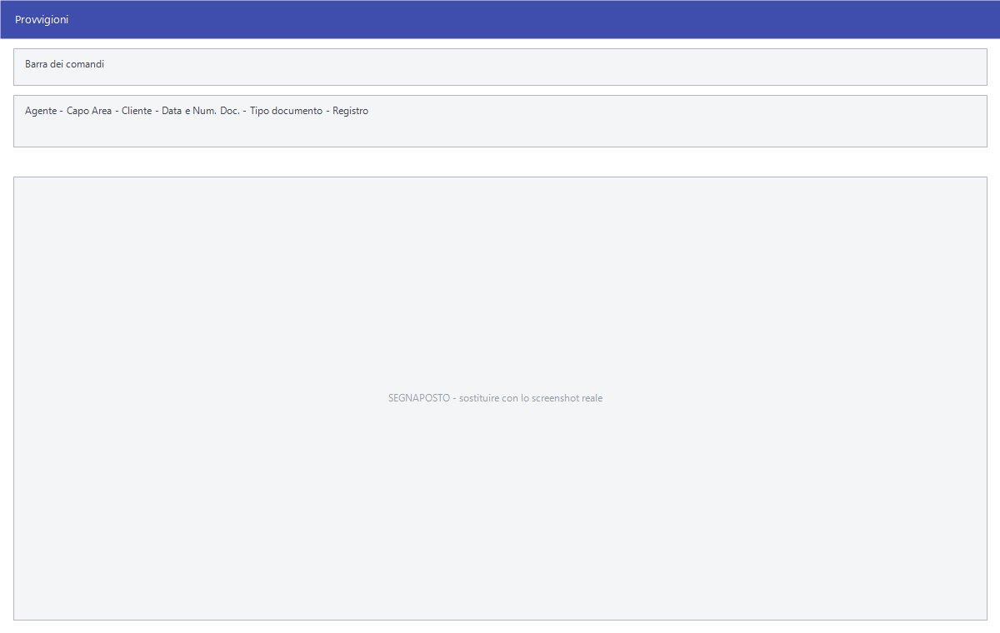

# Provvigioni agenti e capi area

Il sottomenu **Provvigioni Agenti - Capi Area** raccoglie tutto quello che
riguarda il compenso della rete di vendita: la registrazione delle singole
provvigioni, le attribuzioni automatiche, i ricalcoli, i controlli e le stampe.

!!! info "In sintesi"

    **Percorso:** Menu ▸ Vendite ▸ Provvigioni Agenti - Capi Area ▸ *(una delle voci)*
    **Scorciatoia:** ++f2++ salva o avvia, ++esc++ esce
    **Permessi richiesti:** nessun profilo predefinito; le singole voci di menu si abilitano per ogni utente da [Archivi ▸ Utenti](../anagrafiche/utenti.md)

---

## A cosa serve

| Voce di menu | A cosa serve |
|---|---|
| **Inserimento**, **Modifica** | Registrano a mano una provvigione su un documento. |
| **Attribuzione Automatica Provvigioni  Mancanti** | Assegna le provvigioni ai documenti che ne sono rimasti privi. |
| **Attribuzione  Provvigioni per Cliente** | Assegna le provvigioni in base al cliente. |
| **Ricalcolo Provvigioni** | Rifà i conti sui documenti già emessi. |
| **Calcolo Maturato Agenti / Capi Area** | Calcola quanto è maturato a ciascuno. |
| **Stampa Distinta Provvigioni Agenti** | La distinta analitica, documento per documento. |
| **Stampa Totali Provvigioni Agenti** | I soli totali per agente. |
| **Stampa Distinta Provvigioni Capi Area** | La distinta dei [capi area](../anagrafiche/capi-area.md). |
| **Stampa Totali Provvigioni Capi Area** | I totali per capo area. |
| **Stampa Controllo Provvigioni Anomale** | Le provvigioni fuori dall'ordinario, da verificare. |
| **Incentivi Personale** | Gli incentivi al personale. |

## Prerequisiti

Prima di usare queste maschere occorre:

- avere gli [agenti](../anagrafiche/anagrafica-agenti.md) con la loro tabella
  delle provvigioni, e i [capi area](../anagrafiche/capi-area.md);
- avere i clienti collegati al proprio agente, anche con
  [Associazione gruppi e giri](../anagrafiche/associazioni.md);
- avere le percentuali sui listini, impostate in anagrafica articoli o con
  [Varia Provvigioni](../listini-vendita/variazioni-di-massa.md);
- avere emesso i documenti su cui la provvigione matura.

## La maschera

**Inserimento** e **Modifica** aprono la scheda della singola provvigione. Le
stampe aprono finestre di selezione con periodo e filtri.

## Campi

### Inserimento e Modifica

| Campo | Obbl. | Descrizione | Valori ammessi |
|---|:---:|---|---|
| **Agente** | ● | L'[agente](../anagrafiche/anagrafica-agenti.md) a cui la provvigione spetta. | codice |
| **Capo Area** | | Il [capo area](../anagrafiche/capi-area.md) dell'agente. | codice |
| **Cliente** | ● | Il cliente del documento. | codice |
| **Data Doc.**, **Num. Doc.** | ● | Gli estremi del documento su cui la provvigione matura. | data e numero |
| *(elenco del tipo documento)* | ● | Che tipo di documento è. | `FATTURA`, `BOLLA`, `D.D.T.`, `BUONO CON.`, `FATTURA PRO FORMA`, `SCONTRINO` |
| **Registro** | | Il registro del documento. | voce dell'elenco |

{: .campi }

### Stampa Distinta Provvigioni

| Campo | Obbl. | Descrizione | Valori ammessi |
|---|:---:|---|---|
| **Agente** | | Restringe a un agente. | codice |
| **Data Saldo Iniziale**, **Data Saldo Finale** | | Il periodo dei saldi. | date |
| **Saldati** | | Se includere le provvigioni già pagate. | `TUTTI`, `SI`, `NO` |
| **Data Doc. Iniziale**, **Data Doc. Finale** | | Il periodo dei documenti. | date |
| **Registro** | | Restringe a un registro. | `TUTTI`, oppure un registro |

{: .campi }

## Pulsanti e comandi

| Comando | Scorciatoia | Effetto |
|---|---|---|
| **F2 - Salva** o **F2 - OK** | ++f2++ | Registra, oppure avvia la stampa o l'elaborazione. |
| **Esci** | ++esc++ | Chiude senza fare nulla. |
| Elenco di scelta | ++f10++ o ++space++ | Sul campo con il codice, apre l'elenco da cui scegliere. |
| **Calcolatrice** | ++f12++ | Apre la calcolatrice. |
| **Consultazione** | ++f11++ | Apre la consultazione. |

## Come si fa

### Liquidare le provvigioni del trimestre

1. Fai girare **Attribuzione Automatica Provvigioni  Mancanti**, così nessun
   documento resta scoperto.
2. Stampa **Controllo Provvigioni Anomale** e verifica le righe che escono.
3. Apri **Calcolo Maturato Agenti / Capi Area** e calcola il periodo.
4. Stampa la **Distinta Provvigioni Agenti** per il dettaglio e i **Totali
   Provvigioni Agenti** per il riepilogo da liquidare.

### Correggere la provvigione di un documento

1. Apri **Menu ▸ Vendite ▸ Provvigioni Agenti - Capi Area ▸ Modifica**.
2. Ritrova il documento con **Data Doc.** e **Num. Doc.**.
3. Correggi e premi **F2 - Salva**.

### Rifare i conti dopo aver cambiato le percentuali

1. Cambia le percentuali con
   [Varia Provvigioni](../listini-vendita/variazioni-di-massa.md).
2. Fai girare **Ricalcolo Provvigioni** sul periodo interessato.
3. Ristampa la distinta e confrontala con la precedente.

## Controlli e messaggi

| Messaggio | Causa | Cosa fare |
|---|---|---|
| *(nessun messaggio, solo un segnale acustico)* | Manca un campo obbligatorio. | Compila il campo su cui si è posizionato il cursore. |

## Note

!!! warning "Il ricalcolo sovrascrive quello che è stato corretto a mano"

    **Ricalcolo Provvigioni** rifà i conti su tutti i documenti del periodo:
    le provvigioni corrette a mano tornano al valore calcolato. Se ci sono
    accordi particolari, ricalcola su un periodo stretto e ricontrolla.

<!-- DA VERIFICARE: cosa rende una provvigione "anomala" nella stampa di controllo. -->

<!-- DA VERIFICARE: che differenza c'è fra "Attribuzione Automatica Provvigioni  Mancanti" e "Attribuzione  Provvigioni per Cliente". Nota: entrambe le voci di menu contengono un doppio spazio. -->

<!-- DA VERIFICARE: dove si segna una provvigione come saldata, visto che la stampa filtra su "Saldati". -->

<!-- DA VERIFICARE: cosa calcola esattamente "Incentivi Personale" e su quali dati. -->

## Vedi anche

- [Anagrafica agenti](../anagrafiche/anagrafica-agenti.md)
- [Capi area](../anagrafiche/capi-area.md)
- [Variazioni di massa dei listini](../listini-vendita/variazioni-di-massa.md)
