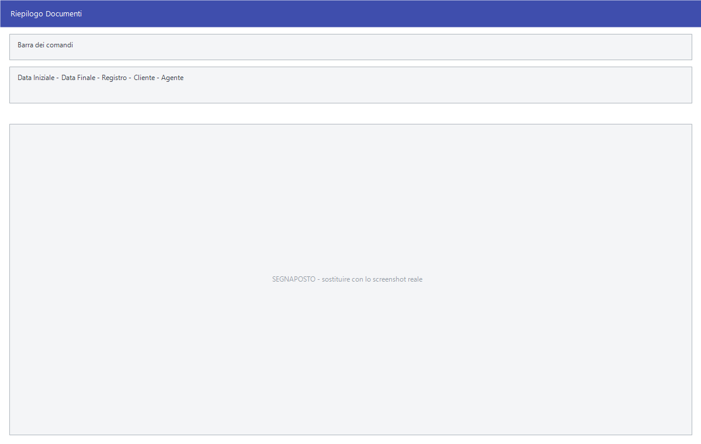

# Riepiloghi e statistiche di vendita

Due famiglie di stampe che leggono i documenti emessi: i **riepiloghi**, che
elencano i documenti di un periodo, e le **statistiche**, che sommano il
fatturato e lo spezzano per una classificazione.

!!! info "In sintesi"

    **Percorso:** Menu ▸ Vendite ▸ *(un tipo di documento)* ▸ Riepilogo
    Menu ▸ Vendite ▸ Fatture ▸ Statistiche *(oppure* Statistiche Mensili *o uno dei* Fatturato Mensile per…*)*
    **Scorciatoia:** ++f2++ avvia la stampa, ++esc++ esce
    **Permessi richiesti:** nessun profilo predefinito; le singole voci di menu si abilitano per ogni utente da [Archivi ▸ Utenti](../anagrafiche/utenti.md)

---

## A cosa serve

**Riepilogo** esiste su quasi tutti i tipi di documento — fatture, DDT, bolle,
buoni di consegna, ricevute fiscali, autofatture, pro forma, consegne terzi — e
apre sempre la stessa maschera: elenca i documenti del periodo con i loro
totali.

Sui documenti di trasporto il riepilogo si declina in tre voci — **Riepilogo
Documenti Emessi a Clienti**, **Riepilogo Documenti Emessi a Fornitori** e
**Riepilogo Documenti Emessi a Clienti e Fornitori** — e sulle autofatture in
due: **Riepilogo Autofatture** e **Riepilogo Integrazioni**.

Le **statistiche** sommano il fatturato. Oltre a **Statistiche** e
**Statistiche Mensili** ci sono sette tagli già pronti:

| Voce di menu | Come spezza il fatturato |
|---|---|
| **Fatturato Mensile per Gruppo** | Per gruppo di articoli. |
| **Fatturato Mensile per Sottogruppo** | Per sottogruppo. |
| **Fatturato Mensile per Reparto** | Per [reparto](../magazzino/reparti.md). |
| **Fatturato Mensile per Cod. Iva** | Per [aliquota IVA](../contabilita/aliquote-iva.md). |
| **Fatturato Mensile per Fornitore** | Per fornitore dell'articolo. |
| **Fatturato Mensile per Marchio** | Per [marchio](../magazzino/marchi.md). |
| **Fatturato Mensile per Cat. Merceologica** | Per [categoria merceologica](../magazzino/categorie-merceologiche.md). |

Le **Fatture Pro Forma** hanno le proprie **Statistiche** e **Statistiche
Mensili**.

## Prerequisiti

Prima di usare queste stampe occorre avere emesso i
[documenti](documento-di-vendita.md) del periodo.

## La maschera

Sono finestre di selezione: il periodo, i filtri e i pulsanti **F2 - OK** ed
**Esci**.

## Campi

| Campo | Obbl. | Descrizione | Valori ammessi |
|---|:---:|---|---|
| **Data Iniziale**, **Data Finale** | ● | Il periodo da riepilogare. | date |
| **Registro** | | Restringe a un registro. | voce dell'elenco |
| **Cliente** | | Restringe a un cliente. | codice |
| **Agente** | | Restringe a un [agente](../anagrafiche/anagrafica-agenti.md). | codice |

{: .campi }

<!-- DA VERIFICARE: i campi esatti di ciascuna maschera: variano fra riepiloghi e statistiche e non ho potuto estrarli tutti. -->

## Pulsanti e comandi

| Comando | Scorciatoia | Effetto |
|---|---|---|
| **F2 - OK** | ++f2++ | Prepara e mostra l'anteprima della stampa. |
| **Esci** | ++esc++ | Chiude senza stampare. |
| Elenco di scelta | ++f10++ o ++space++ | Sul campo con il codice, apre l'elenco da cui scegliere. |
| **Calcolatrice** | ++f12++ | Apre la calcolatrice. |
| **Consultazione** | ++f11++ | Apre la consultazione. |

## Come si fa

### Controllare le fatture emesse nel mese

1. Apri **Menu ▸ Vendite ▸ Fatture ▸ Riepilogo**.
2. Indica il periodo e premi **F2 - OK**.

### Vedere come si è mosso il fatturato per categoria

1. Apri **Menu ▸ Vendite ▸ Fatture ▸ Fatturato Mensile per Cat.
   Merceologica**.
2. Indica il periodo e premi **F2 - OK**: esce il fatturato mese per mese,
   spezzato per categoria.

### Controllare i documenti di trasporto emessi a fornitori

1. Apri **Menu ▸ Vendite ▸ Doc. di Trasporto ▸ Riepilogo Documenti Emessi a
   Fornitori**.
2. Indica il periodo e stampa.

## Controlli e messaggi

| Messaggio | Causa | Cosa fare |
|---|---|---|
| *(nessun messaggio, solo un segnale acustico)* | Manca una delle date. | Compila il campo su cui si è posizionato il cursore. |

## Note

!!! note "I riepiloghi non sono stampe fiscali"

    Servono al controllo interno: non numerano nulla e si rifanno quante volte
    si vuole. Le stampe che fanno fede sono i
    [registri IVA](../contabilita/registri-iva.md).

<!-- DA VERIFICARE: cosa distingue "Statistiche" da "Statistiche Mensili". -->

<!-- DA VERIFICARE: se le sette voci "Fatturato Mensile per…" aprano la stessa maschera con un parametro, come sembra. -->

<!-- DA VERIFICARE: la voce di menu dice "Fatturato Mensile per Marchio" ma l'identificativo interno parla di stagione: verificare cosa raggruppa davvero. -->

## Vedi anche

- [Gestione documenti](gestione-documenti.md)
- [Documento di vendita](documento-di-vendita.md)
- [Stampe di magazzino clienti](../magazzino/stampe-magazzino-clienti.md)
