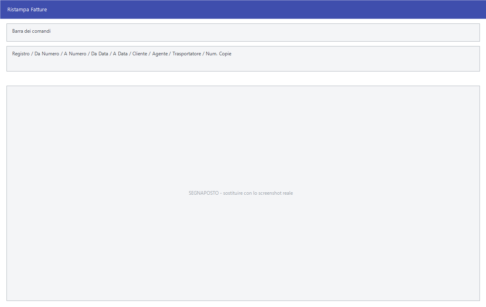

# Ristampa dei documenti

Capita di dover rifare le stampe: la carta si è inceppata, il cliente ha perso
la copia, il commercialista chiede l'intero mese. **Ristampa** rifà in blocco i
documenti già emessi, senza aprirli uno per uno.

!!! info "In sintesi"

    - **Percorso:**
        - Menu ▸ Vendite ▸ Fatture ▸ Ristampa
        - Menu ▸ Ordini ▸ Ordini da Clienti ▸ Ristampa
    - **Scorciatoia:** ++f2++ avvia la stampa, ++esc++ esce
    - **Permessi richiesti:** nessun profilo predefinito; le singole voci di menu si abilitano per ogni utente da [Archivi ▸ Utenti](../anagrafiche/utenti.md)

---

## A cosa serve

La finestra si chiama **Ristampa Fatture**; aperta dagli ordini prende il
titolo **Ristampa Ordini Clienti**. Si indica cosa ristampare — per numero, per
data, per soggetto — quante copie e se comprendere anche i documenti che non
erano mai stati stampati.

Con la ristampa degli ordini la casella **Includi Documenti non Stampati**
arriva già attiva: normalmente serve rifare tutto.

## Prerequisiti

Prima di ristampare occorre avere i documenti in archivio, che si consultano
dalla [gestione documenti](gestione-documenti.md).

L'opzione **Solo Esportazione** compare soltanto se l'esportazione è abilitata
nei [parametri della ditta](../anagrafiche/ditte.md).

## La maschera

Una finestra di selezione: il registro, gli intervalli di numero e di data, i
tre filtri sul soggetto, il numero di copie, le due caselle e i pulsanti **F2 -
OK** ed **Esci**.

## Campi

| Campo | Obbl. | Descrizione | Valori ammessi |
|---|:---:|---|---|
| **Registro** | | Il registro dei documenti da ristampare. Arriva già impostato su quello preferito per il tipo di documento. | voce dell'elenco |
| **Da Numero**, **A Numero** | | L'intervallo dei numeri di documento. | numeri |
| **Da Data**, **A Data** | | Il periodo. | date |
| **Cliente** | | Restringe a un cliente. Vuoto significa `TUTTI`. | codice |
| **Agente** | | Restringe a un [agente](../anagrafiche/anagrafica-agenti.md). Vuoto significa `TUTTI`. | codice |
| **Trasportatore** | | Restringe a un [trasportatore](../anagrafiche/trasportatori.md). Vuoto significa `TUTTI`. | codice |
| **Num. Copie** | | Quante copie stampare di ciascun documento. | numero |
| **Includi Documenti non Stampati** | | Comprende anche i documenti mai stampati prima. Sugli ordini arriva già attiva. | attivo/non attivo |
| **Solo Esportazione** | | Non stampa: produce solo il file di esportazione. Compare solo se l'esportazione è abilitata. | attivo/non attivo |

{: .campi }

## Pulsanti e comandi

| Comando | Scorciatoia | Effetto |
|---|---|---|
| **F2 - OK** | ++f2++ | Avvia la ristampa. |
| **Esci** | ++esc++ | Chiude senza stampare. |
| Elenco di scelta | ++f10++ o ++space++ | Sul campo con il codice, apre l'elenco da cui scegliere. |
| **Calcolatrice** | ++f12++ | Apre la calcolatrice. |

## Come si fa

### Rifare le fatture di un mese

1. Apri **Menu ▸ Vendite ▸ Fatture ▸ Ristampa**.
2. Controlla il **Registro**.
3. Metti in **Da Data** e **A Data** il primo e l'ultimo giorno del mese.
4. Lascia **Includi Documenti non Stampati** spento se vuoi solo rifare quello
   che era già uscito.
5. Premi **F2 - OK**: durante il lavoro la finestra di attesa dice *Ristampa
   Fatture*, e si può fermare con **Esci**.

### Ristampare una sola fattura in più copie

1. Metti lo stesso numero in **Da Numero** e **A Numero**.
2. Indica **Num. Copie**.
3. Premi **F2 - OK**.

### Produrre solo il file di esportazione

1. Attiva **Solo Esportazione**.
2. Premi **F2 - OK**: non esce nulla dalla stampante, viene prodotto il file.

## Controlli e messaggi

| Messaggio | Causa | Cosa fare |
|---|---|---|
| *Vuoi Stampare gli Importi?* | Si stanno ristampando documenti di trasporto, bolle o ordini. | **Sì** stampa anche i valori, **No** li omette. La risposta preimpostata è **No**. |
| *(nessun messaggio, solo un segnale acustico)* | Un campo del filtro non è valido. | Guarda dove si è posizionato il cursore. |

## Note

!!! warning "La ristampa non è una copia di cortesia"

    Facile ristampa il documento come è in archivio, senza alcuna dicitura che
    lo distingua dall'originale. Se serve una copia riconoscibile, va gestita
    fuori dal programma.

<!-- DA VERIFICARE: se la ristampa aggiorni la data o il contatore di stampa del documento. -->

<!-- DA VERIFICARE: dove viene prodotto il file quando è attiva "Solo Esportazione". -->

## Vedi anche

- [Gestione documenti](gestione-documenti.md)
- [Inserimento e Modifica documenti](documento-di-vendita.md)
- [Esportazione, duplicazione e ricezione dei documenti](esporta-duplica-documenti.md)
- [Stampe degli ordini](../ordini/stampe-ordini.md)
