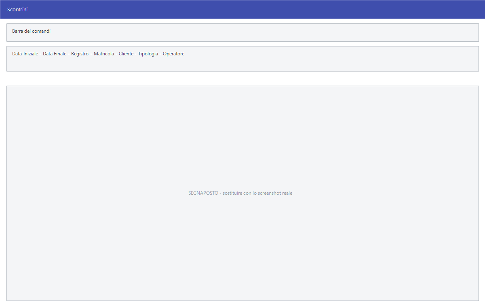

# Scontrini

Il sottomenu **Scontrini** serve a rileggere quello che è stato battuto alla
cassa: l'elenco degli scontrini, il riepilogo IVA, i punti fedeltà maturati e
il controllo del conferimento.

!!! info "In sintesi"

    - **Percorso:** Menu ▸ Vendite ▸ Scontrini ▸ Altri Scarichi - Scontrini *(oppure* Stampa Punti*,* Riepilogo Scontrini*,* Riepilogo IVA Scontrini *o* Controllo Conferimento*)*
    - **Scorciatoia:** ++f2++ avvia, ++esc++ esce
    - **Permessi richiesti:** nessun profilo predefinito; le singole voci di menu si abilitano per ogni utente da [Archivi ▸ Utenti](../anagrafiche/utenti.md)

---

## A cosa serve

| Voce di menu | A cosa serve |
|---|---|
| **Altri Scarichi - Scontrini** | L'elenco degli scontrini battuti, da cui si cerca e si controlla. |
| **Stampa Punti** | I punti fedeltà maturati dai clienti. |
| **Riepilogo Scontrini** | Il riepilogo degli scontrini di un periodo. |
| **Riepilogo IVA Scontrini** | Il riepilogo per aliquota, che alimenta il registro dei corrispettivi. |
| **Controllo Conferimento** | Verifica che quello che è stato battuto sia stato conferito. |

## Prerequisiti

Prima di usare queste maschere occorre avere battuto gli scontrini dalla
[vendita al banco](vendita-al-banco.md) o dal punto cassa.

## La maschera

**Altri Scarichi - Scontrini** apre una griglia con i filtri in alto e il
**Totale** in fondo; le altre voci aprono finestre di selezione con il periodo.

La griglia ha queste colonne:

| Colonna | Contenuto |
|---|---|
| **Anno**, **Codice**, **Numero** | Identificano lo scontrino. |
| **Data**, **Ora** | Quando è stato battuto. |
| **Importo** | Il totale. |
| **Matricola** | La matricola del registratore di cassa. |
| **SF** | Lo stato rispetto alla stampante fiscale. |
| **Azz.** | L'azzeramento a cui lo scontrino appartiene. |
| **Fidelity** | La tessera fedeltà usata. |
| **Tran.** | Il numero di transazione. |
| **Sync.** | Lo stato di sincronizzazione. |
| **Lotteria** | Il codice lotteria degli scontrini. |
| **Cliente** | Il cliente, se identificato. |
| **Operatore** | Chi ha battuto. |

## Campi

| Campo | Obbl. | Descrizione | Valori ammessi |
|---|:---:|---|---|
| **Data Iniziale**, **Data Finale** | | Il periodo da mostrare. | date |
| **Registro** | | Restringe a un registro. | voce dell'elenco |
| **Matricola** | | Restringe a un registratore di cassa. | matricola |
| **Cliente** | | Restringe a un cliente. | codice |
| **Tipologia** | | Restringe a un tipo di scontrino. | voce dell'elenco |
| **Operatore** | | Restringe a chi ha battuto. | codice |

{: .campi }

## Pulsanti e comandi

| Comando | Scorciatoia | Effetto |
|---|---|---|
| **F2 - OK** | ++f2++ | Applica i filtri, oppure avvia la stampa. |
| **Esci** | ++esc++ | Chiude. |
| Elenco di scelta | ++f10++ o ++space++ | Sul campo con il codice, apre l'elenco da cui scegliere. |
| **Calcolatrice** | ++f12++ | Apre la calcolatrice. |
| **Consultazione** | ++f11++ | Apre la consultazione. |

## Come si fa

### Controllare la giornata di cassa

1. Apri **Menu ▸ Vendite ▸ Scontrini ▸ Altri Scarichi - Scontrini**.
2. Metti **Data Iniziale** e **Data Finale** al giorno da controllare.
3. Confronta il **Totale** con il rapporto della cassa.

### Preparare i dati per il registro dei corrispettivi

1. Apri **Menu ▸ Vendite ▸ Scontrini ▸ Riepilogo IVA Scontrini**.
2. Indica il periodo e stampa.
3. Il risultato è quello che finisce nel
   [registro dei corrispettivi](../contabilita/registri-iva.md).

### Vedere i punti fedeltà maturati

1. Apri **Menu ▸ Vendite ▸ Scontrini ▸ Stampa Punti**.
2. Indica il periodo e stampa. I saldi si azzerano poi con
   [Bollini](../anagrafiche/bollini.md).

## Controlli e messaggi

| Messaggio | Causa | Cosa fare |
|---|---|---|
| *(nessun messaggio, solo un segnale acustico)* | Un campo del filtro non è valido. | Guarda dove si è posizionato il cursore. |

## Note

!!! note "Gli scontrini si consultano, non si correggono"

    Da qui gli scontrini si rileggono; sono documenti fiscali già emessi dal
    registratore di cassa. Le rettifiche si fanno con i resi dalla
    [schermata di vendita](vendita-al-banco.md).

<!-- DA VERIFICARE: cosa significa la voce di menu "Altri Scarichi - Scontrini": il titolo del menu e quello della finestra non coincidono. -->

<!-- DA VERIFICARE: cosa verifica esattamente il "Controllo Conferimento" e su quali dati. -->

<!-- DA VERIFICARE: quali valori assumono le colonne SF, Azz., Tran. e Sync. -->

## Vedi anche

- [Vendita al banco e POS](vendita-al-banco.md)
- [Bollini](../anagrafiche/bollini.md)
- [Registri IVA](../contabilita/registri-iva.md)
