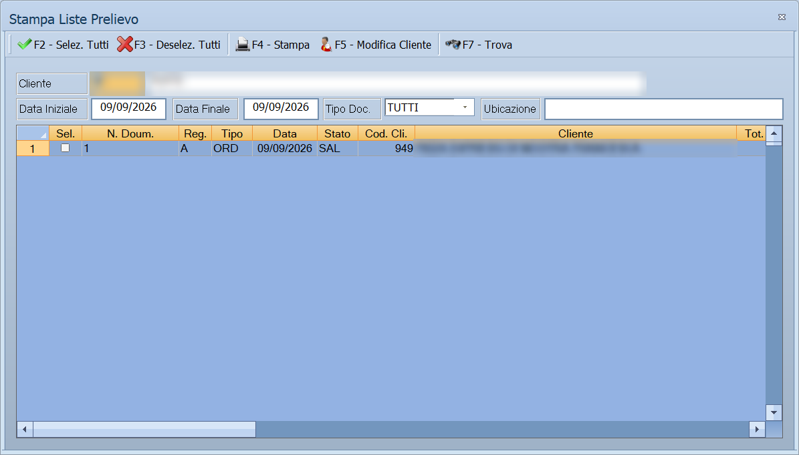

# Stampe e strumenti di vendita

Le voci sciolte in fondo al menu Vendite: quelle che servono a far uscire la
merce dal magazzino, a consegnarla e a controllare com'è andata la giornata.

!!! info "In sintesi"

    - **Percorso:**
        - Menu ▸ Vendite ▸ Liste di Prelievo *(oppure* Stampa Distinta Carico Trasportatori*,* Stampa Distinta Trasportatori*,* Stampa Kg. Venduti*,* Stampa Rapporto Cassa *o* Analisi Commessa*)*
        - Menu ▸ Vendite ▸ Doc. di Trasporto ▸ Valorizza Doc. Trasfert e Concessionario
        - Menu ▸ Vendite ▸ Doc. di Trasporto ▸ Stampa Riepiloghi Competenze Doc. Trasfert e Conc.
    - **Scorciatoia:** ++f2++ avvia, ++esc++ esce
    - **Permessi richiesti:** nessun profilo predefinito; le singole voci di menu si abilitano per ogni utente da [Archivi ▸ Utenti](../anagrafiche/utenti.md)

---

## A cosa serve

| Voce di menu | A cosa serve |
|---|---|
| **Liste di Prelievo** | La lista con cui il magazziniere prepara la merce da consegnare. |
| **Stampa Distinta Carico Trasportatori** | Cosa carica ciascun mezzo. |
| **Stampa Distinta Trasportatori** | Il riepilogo delle consegne per [trasportatore](../anagrafiche/trasportatori.md). |
| **Stampa Kg. Venduti** | I chili venduti, per chi vende a peso. |
| **Stampa Rapporto Cassa** | La situazione di cassa. |
| **Analisi Commessa** | L'andamento di una [commessa](../contabilita/commesse.md). |
| **Valorizza Doc. Trasfert e Concessionario** | Attribuisce i valori ai documenti in trasfert e ai concessionari. |
| **Stampa Riepiloghi Competenze Doc. Trasfert e Conc.** | Le competenze maturate su quei documenti. |

## Prerequisiti

Prima di usare queste stampe occorre avere emesso i
[documenti](documento-di-vendita.md) del periodo; per le distinte, avere i
[trasportatori](../anagrafiche/trasportatori.md) in archivio e assegnati ai
documenti.

## La maschera

Sono finestre di selezione con il periodo e i filtri, e i pulsanti **F2 - OK**
ed **Esci**.

## Campi

| Campo | Obbl. | Descrizione | Valori ammessi |
|---|:---:|---|---|
| **Data Iniziale**, **Data Finale** | ● | Il periodo da esaminare. | date |
| **Trasportatore** | | Nelle distinte, restringe a un vettore. | codice |
| **Commessa** | | In **Analisi Commessa**, quale commessa esaminare. | codice |

{: .campi }

<!-- DA VERIFICARE: i campi esatti di ciascuna di queste maschere: sono sette diverse e non ho potuto estrarli tutti. -->

## Pulsanti e comandi

| Comando | Scorciatoia | Effetto |
|---|---|---|
| **F2 - OK** | ++f2++ | Avvia la stampa o l'elaborazione. |
| **Esci** | ++esc++ | Chiude senza fare nulla. |
| Elenco di scelta | ++f10++ o ++space++ | Sul campo con il codice, apre l'elenco da cui scegliere. |

## Come si fa

### Preparare le consegne della giornata

1. Apri **Menu ▸ Vendite ▸ Liste di Prelievo**.
2. Indica il periodo dei documenti da preparare e stampa: è la lista con cui si
   va a prendere la merce a scaffale.
3. Apri **Stampa Distinta Carico Trasportatori** e stampa cosa va su ciascun
   mezzo.

### Controllare la cassa a fine giornata

1. Apri **Menu ▸ Vendite ▸ Stampa Rapporto Cassa**.
2. Indica la data e stampa.
3. Confronta con il riepilogo degli [scontrini](scontrini.md).

### Valorizzare i documenti in trasfert

1. Apri **Menu ▸ Vendite ▸ Doc. di Trasporto ▸ Valorizza Doc. Trasfert e
   Concessionario**.
2. Indica il periodo e avvia.
3. Stampa poi i **Riepiloghi Competenze** per vedere quanto è maturato.

## Controlli e messaggi

<!-- DA VERIFICARE: i messaggi di queste maschere. -->

| Messaggio | Causa | Cosa fare |
|---|---|---|
| *(nessun messaggio, solo un segnale acustico)* | Manca una delle date. | Compila il campo su cui si è posizionato il cursore. |

## Note

!!! note "Il trasfert e i concessionari"

    Le due voci sui documenti trasfert riguardano chi vende tramite
    concessionari o agenti con merce in carico: la valorizzazione attribuisce i
    valori ai documenti, il riepiloghi competenze dice quanto spetta a
    ciascuno. Se non si lavora così, le due voci non servono.

<!-- DA VERIFICARE: cosa distingue "Stampa Distinta Carico Trasportatori" da "Stampa Distinta Trasportatori". -->

<!-- DA VERIFICARE: da quali documenti nascono le liste di prelievo e se si possa scegliere quali includere. -->

<!-- DA VERIFICARE: cosa mostra "Analisi Commessa" rispetto alla scheda della commessa in Archivi. -->

<!-- DA VERIFICARE: cosa vuol dire "valorizzare" un documento trasfert e quali valori vengono attribuiti. -->

## Vedi anche

- [Documento di vendita](documento-di-vendita.md)
- [Trasportatori](../anagrafiche/trasportatori.md)
- [Commesse di contabilità analitica](../contabilita/commesse.md)
- [Scontrini](scontrini.md)
